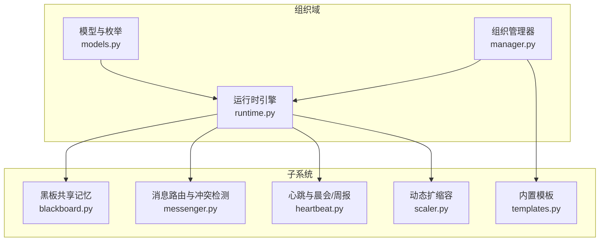
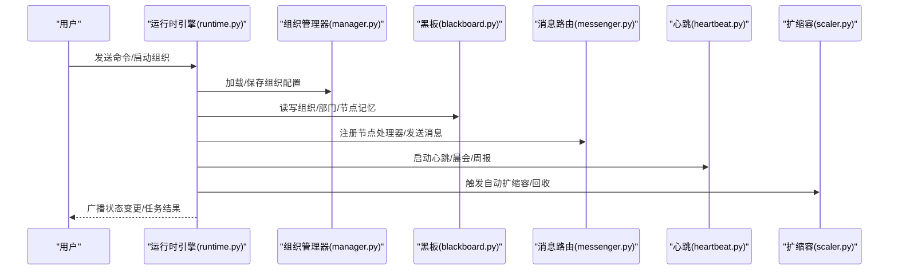
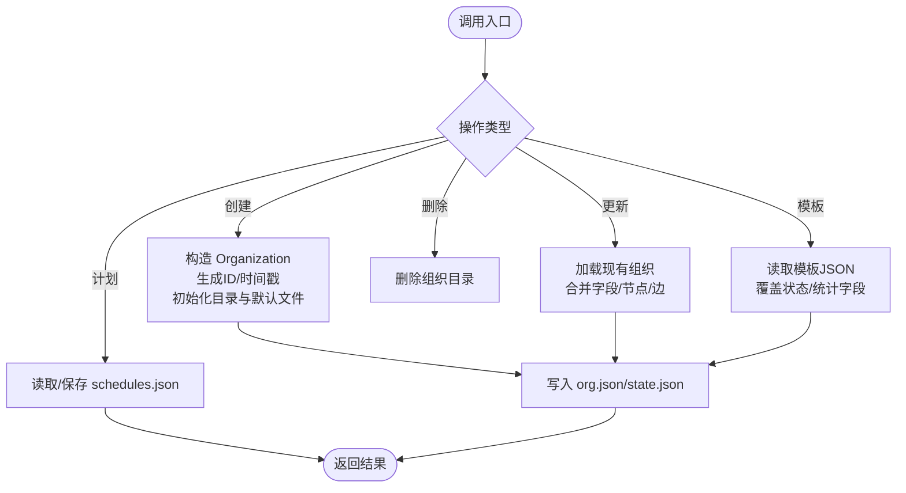
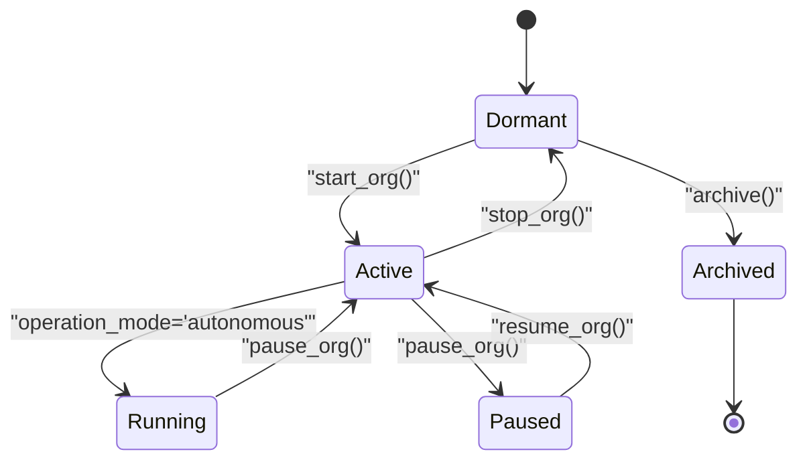
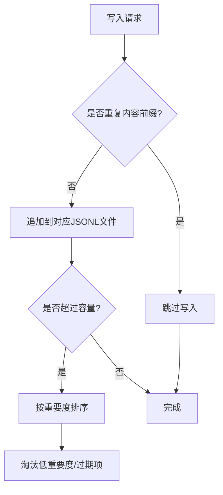
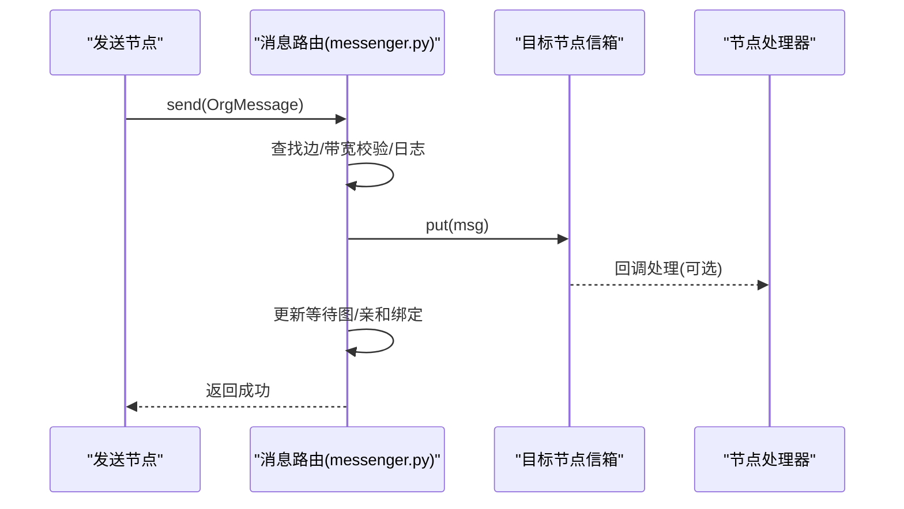
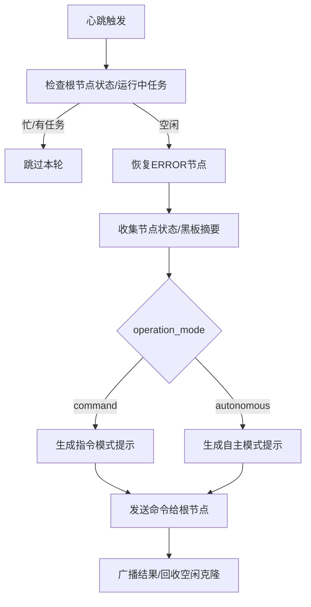
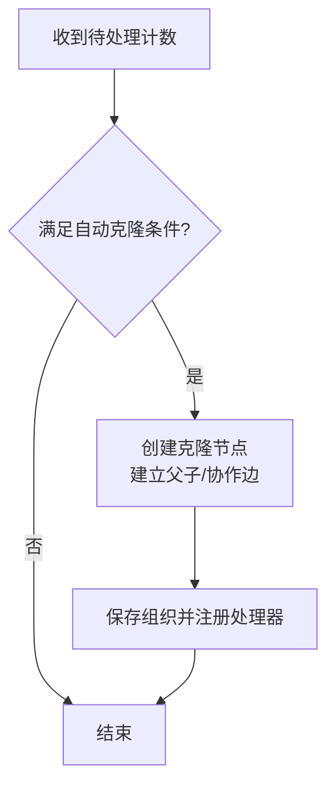
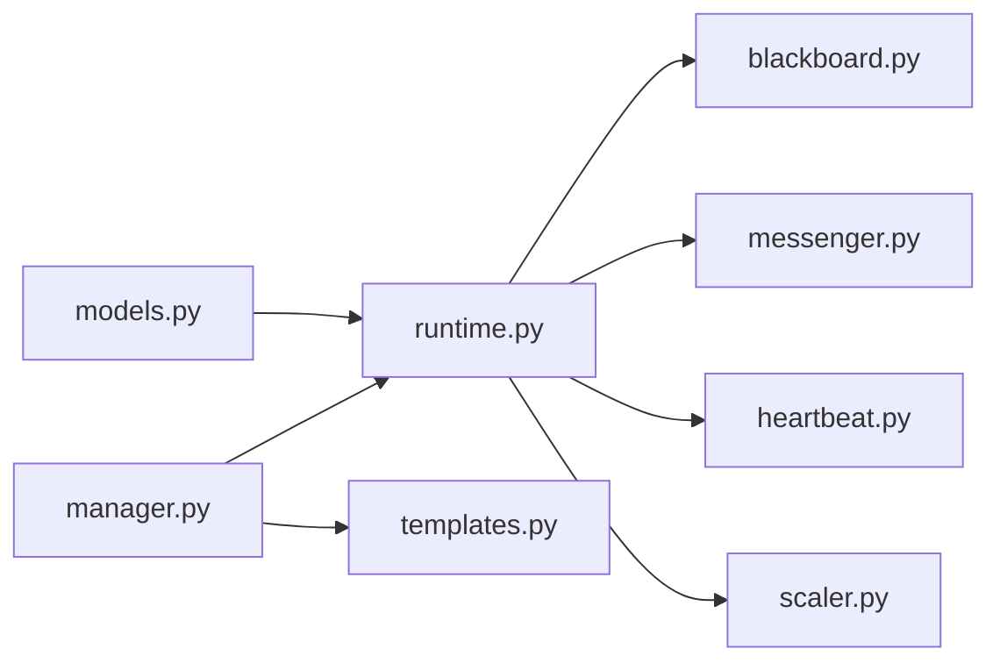

# 组织编排系统

<cite>
**本文引用的文件**
- [src/synapse/orgs/__init__.py](file://src/synapse/orgs/__init__.py)
- [src/synapse/orgs/models.py](file://src/synapse/orgs/models.py)
- [src/synapse/orgs/manager.py](file://src/synapse/orgs/manager.py)
- [src/synapse/orgs/runtime.py](file://src/synapse/orgs/runtime.py)
- [src/synapse/orgs/blackboard.py](file://src/synapse/orgs/blackboard.py)
- [src/synapse/orgs/messenger.py](file://src/synapse/orgs/messenger.py)
- [src/synapse/orgs/heartbeat.py](file://src/synapse/orgs/heartbeat.py)
- [src/synapse/orgs/scaler.py](file://src/synapse/orgs/scaler.py)
- [src/synapse/orgs/templates.py](file://src/synapse/orgs/templates.py)
</cite>

## 目录
1. [简介](#简介)
2. [项目结构](#项目结构)
3. [核心组件](#核心组件)
4. [架构总览](#架构总览)
5. [详细组件分析](#详细组件分析)
6. [依赖分析](#依赖分析)
7. [性能考虑](#性能考虑)
8. [故障排查指南](#故障排查指南)
9. [结论](#结论)
10. [附录](#附录)

## 简介
本文件面向组织编排系统，系统以“组织”为核心运行单元，围绕组织生命周期、节点状态机、消息路由与冲突检测、黑板共享记忆、心跳与自动扩缩容等能力，提供可配置、可扩展、可观测的多智能体协作引擎。本文档从架构设计理念出发，深入解析组织运行时的实现机制、组织管理器的CRUD与模板体系，并覆盖黑板安全机制、消息路由优先级队列、心跳监控与异常检测、可视化组织图、自动扩缩容触发条件、外部工具请求审批流程等主题，辅以配置示例、模板使用方法与最佳实践。

## 项目结构
组织编排系统位于 synapse 子模块的 orgs 包中，采用“领域模型 + 运行时引擎 + 子系统”的分层设计：
- 领域模型：定义组织、节点、边、消息、内存条目、计划等数据结构与枚举
- 运行时引擎：负责组织生命周期、节点激活、任务执行、并发与节流、事件广播
- 子系统：黑板共享记忆、消息路由与冲突检测、心跳与晨会/周报、动态扩缩容、模板与策略

**图表来源**
- [src/synapse/orgs/models.py](file://src/synapse/orgs/models.py)
- [src/synapse/orgs/manager.py](file://src/synapse/orgs/manager.py)
- [src/synapse/orgs/runtime.py](file://src/synapse/orgs/runtime.py)
- [src/synapse/orgs/blackboard.py](file://src/synapse/orgs/blackboard.py)
- [src/synapse/orgs/messenger.py](file://src/synapse/orgs/messenger.py)
- [src/synapse/orgs/heartbeat.py](file://src/synapse/orgs/heartbeat.py)
- [src/synapse/orgs/scaler.py](file://src/synapse/orgs/scaler.py)
- [src/synapse/orgs/templates.py](file://src/synapse/orgs/templates.py)

**章节来源**
- [src/synapse/orgs/__init__.py](file://src/synapse/orgs/__init__.py)
- [src/synapse/orgs/models.py](file://src/synapse/orgs/models.py)

## 核心组件
- 组织模型与枚举：统一描述组织状态、节点状态、消息类型、内存作用域与类型、计划类型、优先级等
- 组织管理器：负责组织的创建/读取/更新/删除、持久化目录结构初始化、模板管理、运行时状态读写
- 运行时引擎：组织生命周期管理、节点按需激活、任务执行与结果回传、并发控制、事件广播、WebSocket 通知
- 黑板共享记忆：组织级/部门级/节点级三层记忆，支持读写、容量管理、自动淘汰与查询
- 消息路由与冲突检测：基于优先级队列的消息信箱、带宽限制、死锁检测与破环、TTL过期
- 心跳与自动扩缩容：周期性健康检查、晨会/周报、自适应心跳间隔、自动克隆与回收
- 内置模板：三类预置组织模板，便于快速落地

**章节来源**
- [src/synapse/orgs/models.py](file://src/synapse/orgs/models.py)
- [src/synapse/orgs/manager.py](file://src/synapse/orgs/manager.py)
- [src/synapse/orgs/runtime.py](file://src/synapse/orgs/runtime.py)
- [src/synapse/orgs/blackboard.py](file://src/synapse/orgs/blackboard.py)
- [src/synapse/orgs/messenger.py](file://src/synapse/orgs/messenger.py)
- [src/synapse/orgs/heartbeat.py](file://src/synapse/orgs/heartbeat.py)
- [src/synapse/orgs/scaler.py](file://src/synapse/orgs/scaler.py)
- [src/synapse/orgs/templates.py](file://src/synapse/orgs/templates.py)

## 架构总览
组织编排系统以“组织”为中心，运行时引擎作为中枢协调各子系统：
- 组织管理器负责磁盘层面的组织与模板持久化
- 运行时引擎负责内存层面的组织状态、节点激活、任务执行
- 黑板提供跨节点的记忆共享与检索
- 消息路由保证节点间通信有序、可控、可追踪
- 心跳与扩缩容保障组织健康与弹性
- 模板体系降低组织搭建门槛

**图表来源**
- [src/synapse/orgs/runtime.py](file://src/synapse/orgs/runtime.py)
- [src/synapse/orgs/manager.py](file://src/synapse/orgs/manager.py)
- [src/synapse/orgs/blackboard.py](file://src/synapse/orgs/blackboard.py)
- [src/synapse/orgs/messenger.py](file://src/synapse/orgs/messenger.py)
- [src/synapse/orgs/heartbeat.py](file://src/synapse/orgs/heartbeat.py)
- [src/synapse/orgs/scaler.py](file://src/synapse/orgs/scaler.py)

## 详细组件分析

### 组织管理器（CRUD与模板）
- 职责
  - 组织列表、详情、创建、更新、删除、归档/解档、复制
  - 节点计划的增删改查与持久化
  - 模板列表、加载、保存为模板、从模板创建组织
  - 运行时状态的读写（供运行时引擎使用）
- 关键点
  - 目录结构：组织根目录下包含 nodes、policies、departments、memory、events、logs、reports、artifacts 等子目录
  - 更新合并：仅对配置字段进行合并，避免覆盖运行时状态
  - 节点目录与 MCP 配置、计划文件的初始化
  - 缓存与写入锁：提升并发安全性与一致性

**图表来源**
- [src/synapse/orgs/manager.py](file://src/synapse/orgs/manager.py)

**章节来源**
- [src/synapse/orgs/manager.py](file://src/synapse/orgs/manager.py)
- [src/synapse/orgs/templates.py](file://src/synapse/orgs/templates.py)

### 组织运行时引擎
- 生命周期
  - 启动：恢复 ACTIVE/RUNNING 组织，激活服务与任务
  - 停止：停止心跳/调度，取消后台任务，重置节点状态
  - 暂停/恢复：切换组织状态，保留/恢复运行上下文
  - 删除/重置：删除磁盘数据或清理内存与存储
- 节点激活与任务执行
  - 组织级并发信号量限制同时激活节点数
  - 节点状态机：IDLE/BUSY/WAITING/ERROR/OFFLINE/FROZEN
  - 任务链 ID 绑定与委派深度控制
  - 任务取消：取消 Agent 内部任务与 asyncio 任务包装
- 事件与广播
  - 事件存储：审计与追踪
  - WebSocket 广播：状态变更、任务完成、取消等

**图表来源**
- [src/synapse/orgs/runtime.py](file://src/synapse/orgs/runtime.py)
- [src/synapse/orgs/models.py](file://src/synapse/orgs/models.py)

**章节来源**
- [src/synapse/orgs/runtime.py](file://src/synapse/orgs/runtime.py)
- [src/synapse/orgs/models.py](file://src/synapse/orgs/models.py)

### 黑板共享记忆（安全机制与容量管理）
- 三层记忆
  - 组织级（黑板）：全局共享，用于组织级知识沉淀
  - 部门级：按部门隔离，适合跨节点共享但受部门边界约束
  - 节点私有：仅该节点可见，适合临时工作记忆
- 写入与去重
  - 内容前缀去重，避免重复写入
  - 写入后按重要度排序并进行容量淘汰
- 查询与淘汰
  - 支持按作用域/类型/标签过滤
  - TTL 过期与低重要度淘汰
- 安全要点
  - 读写均基于 JSONL 文件，按行追加，写入采用临时文件+原子替换
  - 不同作用域文件隔离，减少跨域污染
  - 可配置最大条目数，防止无限增长

**图表来源**
- [src/synapse/orgs/blackboard.py](file://src/synapse/orgs/blackboard.py)

**章节来源**
- [src/synapse/orgs/blackboard.py](file://src/synapse/orgs/blackboard.py)

### 消息路由与优先级队列（冲突检测与带宽控制）
- 节点信箱
  - 异步优先级队列，支持暂停/恢复、处理计数、phantom 记录
  - 处理路径：handler 直接回调 + drain 取出两种
- 路由与广播
  - 单播：根据边查找与带宽限制，加入目标节点信箱
  - 广播：部门广播或全员广播
- 冲突检测与 TTL
  - 等待图（wait-for graph）检测死锁，DFS 找环并移除“闭合边”破环
  - 消息 TTL：区分任务消息与普通消息，默认与任务消息不同
- 任务亲和
  - 任务链绑定特定节点（克隆），后续跟进消息定向到该节点

**图表来源**
- [src/synapse/orgs/messenger.py](file://src/synapse/orgs/messenger.py)

**章节来源**
- [src/synapse/orgs/messenger.py](file://src/synapse/orgs/messenger.py)

### 心跳监控与异常检测
- 心跳
  - 自适应间隔：基于最近活动水平动态缩短/延长
  - 健康检查：扫描节点状态、待处理消息、黑板摘要
  - 错误节点恢复：心跳周期内将 ERROR 节点重置为 IDLE 并清缓存
- 晨会/周报
  - 周报：基于 cron 表达式或里程碑（任务数阈值/全部空闲）触发
  - 晨会：汇总节点事件与工作记录，生成纪要并落盘
- 异常检测
  - 死锁检测：周期性 DFS 检测等待图环路并自动破环
  - Watchdog：检测卡住/静默节点，必要时触发强制清理

**图表来源**
- [src/synapse/orgs/heartbeat.py](file://src/synapse/orgs/heartbeat.py)
- [src/synapse/orgs/runtime.py](file://src/synapse/orgs/runtime.py)

**章节来源**
- [src/synapse/orgs/heartbeat.py](file://src/synapse/orgs/heartbeat.py)

### 自动扩缩容（触发条件与审批流程）
- 自动克隆
  - 条件：节点启用 auto_clone、非克隆节点、待处理消息数达到阈值、未达组织上限、同源克隆数量未达上限
  - 行为：创建克隆节点，建立父子层级与协作边，立即保存组织
- 手动扩编
  - 请求类型：clone/recruit
  - 审批策略：auto/auto+manager/user
  - 执行：批准后注册节点处理器、更新组织并持久化
- 缩编与回收
  - 回收：空闲/离线且无待处理消息的临时克隆节点
  - 裁撤：永久节点不可直接删除，需走裁撤流程并迁移记忆

**图表来源**
- [src/synapse/orgs/scaler.py](file://src/synapse/orgs/scaler.py)

**章节来源**
- [src/synapse/orgs/scaler.py](file://src/synapse/orgs/scaler.py)

### 可视化组织图（模板与布局）
- 内置模板
  - 创业公司：技术/产品/市场/行政四部门
  - 软件工程团队：前后端/测试/DevOps/技术文档
  - 内容运营团队：主编/策划/文案/视觉/数据
- 模板安装
  - 首次运行时自动安装至模板目录，缺失模板即补齐
  - 自动填充头像字段，便于前端渲染
- 使用方式
  - 通过管理器从模板创建组织，再在编辑器中微调节点位置与边权重

**章节来源**
- [src/synapse/orgs/templates.py](file://src/synapse/orgs/templates.py)
- [src/synapse/orgs/manager.py](file://src/synapse/orgs/manager.py)

### 外部工具请求的审批流程
- 请求来源
  - 节点在执行任务时发起外部工具调用请求，进入收件箱
- 审批类型
  - 通用审批：要求人工确认后执行
  - IM 审批：通过即时通讯渠道推送审批卡片
- 流程
  - 收件箱消息生成，标记 requires_approval
  - 审批选项与动作负载可配置
  - 审批通过后执行工具调用，失败则回滚或重试

**章节来源**
- [src/synapse/orgs/models.py](file://src/synapse/orgs/models.py)

## 依赖分析
- 组件耦合
  - 运行时引擎聚合多个子系统（心跳、消息、黑板、扩缩容、收件箱、报告、策略）
  - 组织管理器与运行时引擎通过文件系统与事件存储解耦
- 直接依赖
  - 运行时引擎依赖模型、黑板、消息、心跳、扩缩容
  - 消息路由依赖模型与组织图（边带宽）
  - 心跳依赖运行时接口（发送命令、广播、事件存储）
  - 扩缩容依赖运行时接口（注册处理器、保存组织）

**图表来源**
- [src/synapse/orgs/runtime.py](file://src/synapse/orgs/runtime.py)
- [src/synapse/orgs/manager.py](file://src/synapse/orgs/manager.py)
- [src/synapse/orgs/models.py](file://src/synapse/orgs/models.py)
- [src/synapse/orgs/blackboard.py](file://src/synapse/orgs/blackboard.py)
- [src/synapse/orgs/messenger.py](file://src/synapse/orgs/messenger.py)
- [src/synapse/orgs/heartbeat.py](file://src/synapse/orgs/heartbeat.py)
- [src/synapse/orgs/scaler.py](file://src/synapse/orgs/scaler.py)
- [src/synapse/orgs/templates.py](file://src/synapse/orgs/templates.py)

**章节来源**
- [src/synapse/orgs/runtime.py](file://src/synapse/orgs/runtime.py)
- [src/synapse/orgs/manager.py](file://src/synapse/orgs/manager.py)

## 性能考虑
- 并发与节流
  - 组织级并发信号量限制同时激活节点数，避免资源争用
  - 节点级任务并发与失败次数统计，配合配额抑制
- I/O 与持久化
  - 黑板写入采用临时文件+原子替换，避免部分写入
  - 模板与计划文件按需读写，减少不必要的序列化
- 事件与日志
  - 事件存储与通信日志分离，避免热路径阻塞
- 内存与缓存
  - Agent 实例缓存与 TTL，结合最近使用时间淘汰
  - 运行时状态与缓存分离，避免频繁落盘

## 故障排查指南
- 节点长时间 BUSY
  - 检查任务链 ID 是否绑定、是否被取消、是否触发 watchdog
  - 查看事件存储中的“task_cancelled”“node_activated”等事件
- 死锁与消息堆积
  - 使用死锁检测接口查看等待图环路，系统会自动破环
  - 检查带宽限制与消息 TTL，必要时放宽或清理过期消息
- 心跳未触发或异常
  - 确认组织状态为 ACTIVE/RUNNING，根节点非 BUSY
  - 查看心跳日志与 WS 广播，核对自适应间隔计算
- 扩缩容未生效
  - 检查审批策略与请求状态，确认未达组织节点上限
  - 查看事件存储中的“scaling_requested/approved/rejected”
- 黑板容量告警
  - 检查 TTL 与重要度排序，确认淘汰策略是否按预期执行

**章节来源**
- [src/synapse/orgs/messenger.py](file://src/synapse/orgs/messenger.py)
- [src/synapse/orgs/heartbeat.py](file://src/synapse/orgs/heartbeat.py)
- [src/synapse/orgs/scaler.py](file://src/synapse/orgs/scaler.py)
- [src/synapse/orgs/blackboard.py](file://src/synapse/orgs/blackboard.py)
- [src/synapse/orgs/runtime.py](file://src/synapse/orgs/runtime.py)

## 结论
组织编排系统通过清晰的分层与模块化设计，实现了从组织建模、生命周期管理、消息路由、共享记忆到心跳监控与弹性扩缩容的完整闭环。其以模板化与可配置为核心，兼顾易用性与可扩展性；以事件与日志为支撑，提供可观测与可追溯能力。建议在生产环境中结合审批策略、带宽与 TTL 参数进行精细化调优，并利用内置模板快速落地典型组织形态。

## 附录

### 配置示例（字段说明）
- 组织基础
  - 名称/描述/图标/标签
  - 状态：dormant/active/running/paused/archived
  - 核心业务：驱动自主模式
  - 操作模式：command/autonomous
- 心跳与晨会
  - heartbeat_enabled/heartbeat_interval_s/heartbeat_prompt/heartbeat_max_cascade_depth
  - standup_enabled/standup_cron/standup_agenda
- 扩缩容
  - scaling_enabled/max_nodes/auto_scale_enabled/auto_scale_max_per_heartbeat/scaling_approval
- 通知
  - notify_enabled/notify_channel/notify_webhook_url/notify_im_channel/notify_im_bot_id/notify_push_levels/notify_quiet_hours/notify_im_approval
- Watchdog
  - watchdog_enabled/watchdog_interval_s/watchdog_stuck_threshold_s/watchdog_silence_threshold_s
- 记忆
  - shared_memory_enabled/department_memory_enabled

**章节来源**
- [src/synapse/orgs/models.py](file://src/synapse/orgs/models.py)

### 模板使用方法
- 从模板创建组织
  - 通过管理器列出模板，选择模板ID并调用“从模板创建”
- 安装内置模板
  - 首次运行时自动安装，也可手动调用模板工具函数
- 自定义模板
  - 在模板目录新增 JSON，遵循 Organization 字段规范，设置 policy_template 映射

**章节来源**
- [src/synapse/orgs/templates.py](file://src/synapse/orgs/templates.py)
- [src/synapse/orgs/manager.py](file://src/synapse/orgs/manager.py)

### 最佳实践
- 组织设计
  - 明确根节点职责与委派边界，控制 delegation depth
  - 合理设置 auto_clone_threshold 与 auto_clone_max，避免过度克隆
- 消息与路由
  - 为关键任务设置高优先级与合理 TTL
  - 使用部门广播与全局广播区分场景
- 记忆与安全
  - 为敏感内容设置 TTL 与标签，定期清理
  - 避免在组织级写入过多重复内容，启用去重
- 心跳与监控
  - 开启 watchodg 并设置合理的卡住/静默阈值
  - 使用自适应心跳，避免空闲时过度轮询
- 扩缩容
  - 审批策略与自动扩缩容配合，避免突发流量导致资源耗尽
  - 回收空闲克隆，保持组织规模可控