# 组织运行时

<cite>
**本文引用的文件**
- [runtime.py](file://src/synapse/orgs/runtime.py)
- [scaler.py](file://src/synapse/orgs/scaler.py)
- [manager.py](file://src/synapse/orgs/manager.py)
- [models.py](file://src/synapse/orgs/models.py)
- [node_scheduler.py](file://src/synapse/orgs/node_scheduler.py)
- [heartbeat.py](file://src/synapse/orgs/heartbeat.py)
- [inbox.py](file://src/synapse/orgs/inbox.py)
- [notifier.py](file://src/synapse/orgs/notifier.py)
- [policies.py](file://src/synapse/orgs/policies.py)
- [reporter.py](file://src/synapse/orgs/reporter.py)
- [event_store.py](file://src/synapse/orgs/event_store.py)
- [blackboard.py](file://src/synapse/orgs/blackboard.py)
- [messenger.py](file://src/synapse/orgs/messenger.py)
- [tools.py](file://src/synapse/orgs/tools.py)
- [tool_handler.py](file://src/synapse/orgs/tool_handler.py)
</cite>

## 目录
1. [简介](#简介)
2. [项目结构](#项目结构)
3. [核心组件](#核心组件)
4. [架构总览](#架构总览)
5. [详细组件分析](#详细组件分析)
6. [依赖分析](#依赖分析)
7. [性能考虑](#性能考虑)
8. [故障排查指南](#故障排查指南)
9. [结论](#结论)
10. [附录](#附录)

## 简介
本文件为“组织运行时”系统的技术文档，面向平台开发者与运维工程师，系统阐述组织运行时的生命周期管理、状态转换机制、资源分配策略；深入解释自动扩缩容算法的触发条件、扩缩容阈值设置、节点负载均衡；涵盖运行时监控指标的采集方式、性能瓶颈检测、异常恢复机制；提供运行时配置参数说明、扩缩容策略定制、监控告警设置的具体示例；并解释运行时与外部系统的集成接口、事件通知机制和故障处理流程。

## 项目结构
组织运行时位于 synapse 子系统中，围绕 orgs 包构建，采用“数据模型 + 运行时引擎 + 子系统模块”的分层设计：
- 数据模型层：定义组织、节点、消息、内存、项目任务等核心数据结构与枚举
- 运行时引擎层：组织生命周期、节点激活、消息路由、心跳与定时任务、扩缩容、事件与报告
- 子系统模块：消息收件箱、通知器、制度管理、报告生成、事件存储、共享黑板、工具集

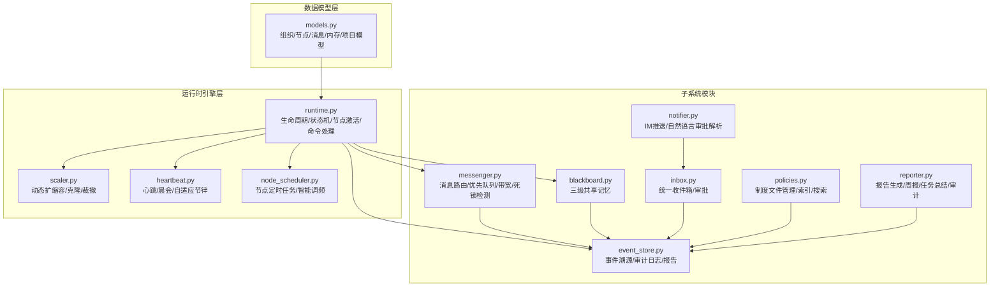

图表来源
- [runtime.py:81-140](file://src/synapse/orgs/runtime.py#L81-L140)
- [scaler.py:50-56](file://src/synapse/orgs/scaler.py#L50-L56)
- [heartbeat.py:24-33](file://src/synapse/orgs/heartbeat.py#L24-L33)
- [node_scheduler.py:35-41](file://src/synapse/orgs/node_scheduler.py#L35-L41)
- [messenger.py:135-160](file://src/synapse/orgs/messenger.py#L135-L160)
- [blackboard.py:32-40](file://src/synapse/orgs/blackboard.py#L32-L40)
- [event_store.py:21-33](file://src/synapse/orgs/event_store.py#L21-L33)
- [inbox.py:23-34](file://src/synapse/orgs/inbox.py#L23-L34)
- [notifier.py:31-36](file://src/synapse/orgs/notifier.py#L31-L36)
- [policies.py:15-23](file://src/synapse/orgs/policies.py#L15-L23)
- [reporter.py:22-27](file://src/synapse/orgs/reporter.py#L22-L27)
- [models.py:131-480](file://src/synapse/orgs/models.py#L131-L480)

章节来源
- [runtime.py:81-140](file://src/synapse/orgs/runtime.py#L81-L140)
- [models.py:131-480](file://src/synapse/orgs/models.py#L131-L480)

## 核心组件
- 组织运行时引擎（OrgRuntime）
  - 生命周期管理：启动/停止/暂停/恢复/重置/删除
  - 状态机：DORMANT → ACTIVE → RUNNING → PAUSED → ARCHIVED
  - 节点激活与并发控制：组织级并发信号量、节点忙碌/空闲跟踪
  - 事件广播与 WebSocket 通知
- 动态扩缩容（OrgScaler）
  - 自动克隆：基于节点邮箱积压阈值触发
  - 申请/审批/执行：克隆/招聘/裁撤
  - 自动回收：回收空闲临时克隆
- 心跳与定时任务（OrgHeartbeat/OrgNodeScheduler）
  - 心跳：自适应节律、健康检查、决策与记录
  - 定时任务：三模式（cron/间隔/一次性）、智能调频、TTL 过期
- 消息系统（OrgMessenger）
  - 优先队列、带宽限制、死锁检测、TTL 过期
  - 任务亲和绑定、广播/升级/回复
- 共享黑板（OrgBlackboard）
  - 三级记忆：组织/部门/节点，容量管理与淘汰
- 事件存储（OrgEventStore）
  - 事件溯源、审计日志、报告生成
- 收件箱与通知（OrgInbox/OrgNotifier）
  - 统一消息聚合、优先级排序、内联审批
  - IM 渠道推送、自然语言审批解析
- 制度与报告（OrgPolicies/OrgReporter）
  - 制度文件管理与索引、关键词搜索
  - 晨会/周报/任务总结/审计日志

章节来源
- [runtime.py:231-307](file://src/synapse/orgs/runtime.py#L231-L307)
- [scaler.py:64-144](file://src/synapse/orgs/scaler.py#L64-L144)
- [heartbeat.py:120-279](file://src/synapse/orgs/heartbeat.py#L120-L279)
- [node_scheduler.py:108-206](file://src/synapse/orgs/node_scheduler.py#L108-L206)
- [messenger.py:204-271](file://src/synapse/orgs/messenger.py#L204-L271)
- [blackboard.py:32-167](file://src/synapse/orgs/blackboard.py#L32-L167)
- [event_store.py:21-165](file://src/synapse/orgs/event_store.py#L21-L165)
- [inbox.py:23-97](file://src/synapse/orgs/inbox.py#L23-L97)
- [notifier.py:31-95](file://src/synapse/orgs/notifier.py#L31-L95)
- [policies.py:15-167](file://src/synapse/orgs/policies.py#L15-L167)
- [reporter.py:22-158](file://src/synapse/orgs/reporter.py#L22-L158)

## 架构总览
组织运行时通过运行时引擎协调各子系统，形成闭环的生命周期管理与自愈能力：
- 生命周期驱动：运行时引擎启动/停止组织，协调心跳、定时任务、消息、扩缩容
- 资源分配：组织级并发信号量限制同时激活节点数；节点邮箱积压触发自动克隆
- 监控与报告：事件存储记录所有状态变更；报告器生成周报/任务总结/审计日志
- 通知与审批：收件箱聚合事件；通知器通过 IM 渠道推送并解析审批回复
- 制度与记忆：制度文件支撑治理；共享黑板承载组织知识

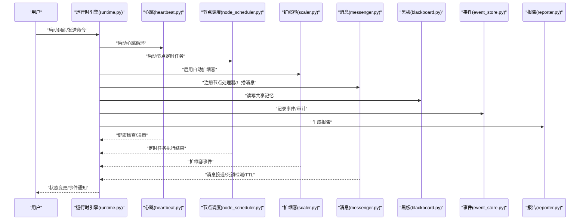

图表来源
- [runtime.py:153-307](file://src/synapse/orgs/runtime.py#L153-L307)
- [heartbeat.py:120-279](file://src/synapse/orgs/heartbeat.py#L120-L279)
- [node_scheduler.py:108-206](file://src/synapse/orgs/node_scheduler.py#L108-L206)
- [scaler.py:64-144](file://src/synapse/orgs/scaler.py#L64-L144)
- [messenger.py:186-271](file://src/synapse/orgs/messenger.py#L186-L271)
- [blackboard.py:32-167](file://src/synapse/orgs/blackboard.py#L32-L167)
- [event_store.py:42-165](file://src/synapse/orgs/event_store.py#L42-L165)
- [reporter.py:28-158](file://src/synapse/orgs/reporter.py#L28-L158)

## 详细组件分析

### 生命周期与状态机
- 状态转换矩阵：DORMANT → ACTIVE → RUNNING → PAUSED → ARCHIVED；RUNNING 可回退至 ACTIVE/PaUSED/DORMANT
- 转换校验：非法转换抛出异常，保证状态一致性
- 启停流程：启动组织时激活服务、恢复任务、安装默认制度；停止组织时清理节点状态、取消后台任务、保存状态
- 自动启动：自主模式组织启动后自动派发“经营任务书”，进入持续运营

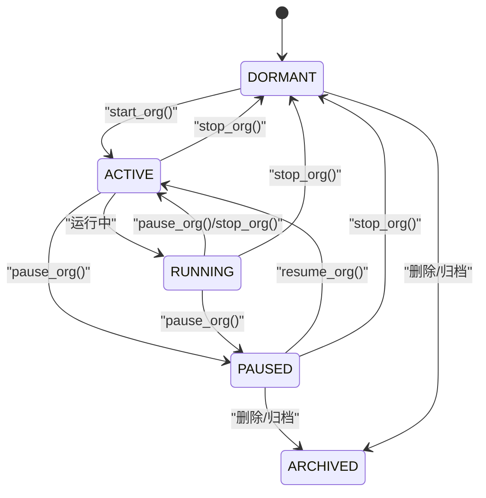

图表来源
- [runtime.py:231-237](file://src/synapse/orgs/runtime.py#L231-L237)
- [runtime.py:251-307](file://src/synapse/orgs/runtime.py#L251-L307)
- [runtime.py:338-374](file://src/synapse/orgs/runtime.py#L338-L374)
- [runtime.py:425-480](file://src/synapse/orgs/runtime.py#L425-L480)

章节来源
- [runtime.py:231-307](file://src/synapse/orgs/runtime.py#L231-L307)
- [runtime.py:338-480](file://src/synapse/orgs/runtime.py#L338-L480)

### 节点激活与并发控制
- 组织级并发信号量：限制同时激活的节点数，避免资源争用
- 节点状态管理：BUSY/IDLE/WAITING/ERROR/OFFLINE/FROZEN
- 激活流程：检查节点状态、缓存 Agent、设置当前任务链、广播状态变化、记录事件
- 取消任务：向 Agent 发送取消信号、取消 asyncio 任务、重置节点状态、广播事件

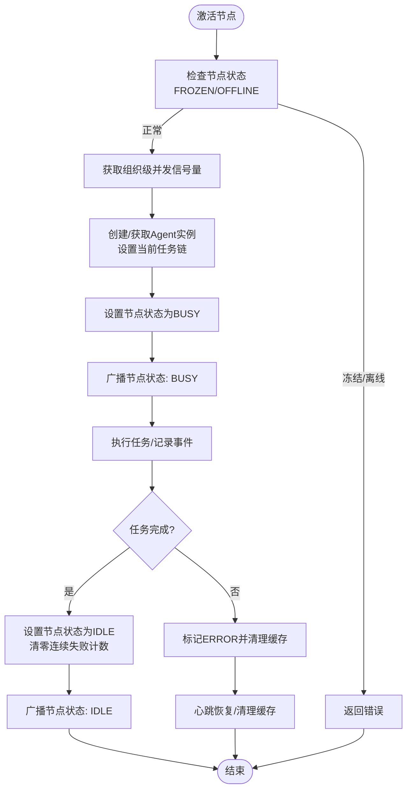

图表来源
- [runtime.py:706-800](file://src/synapse/orgs/runtime.py#L706-L800)
- [runtime.py:580-652](file://src/synapse/orgs/runtime.py#L580-L652)
- [heartbeat.py:39-56](file://src/synapse/orgs/heartbeat.py#L39-L56)

章节来源
- [runtime.py:706-800](file://src/synapse/orgs/runtime.py#L706-L800)
- [runtime.py:580-652](file://src/synapse/orgs/runtime.py#L580-L652)
- [heartbeat.py:39-56](file://src/synapse/orgs/heartbeat.py#L39-L56)

### 自动扩缩容算法与负载均衡
- 自动克隆触发条件：节点邮箱积压数超过阈值、节点允许自动克隆、未达到最大节点数、同源克隆数量未达上限
- 克隆策略：复制源节点配置，沿 X/Y 坐标偏移，建立协作边与层级边
- 申请/审批/执行：支持克隆/招聘/裁撤，自动注册消息处理器
- 负载均衡：通过克隆分散任务压力，回收空闲临时克隆释放资源

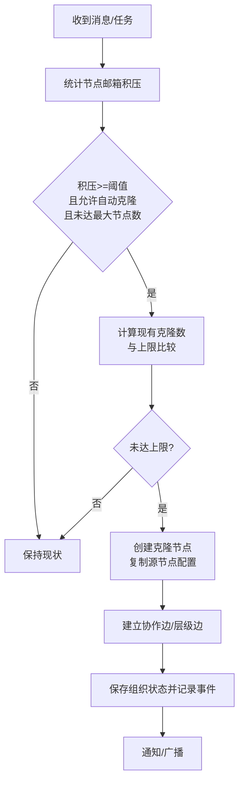

图表来源
- [scaler.py:64-144](file://src/synapse/orgs/scaler.py#L64-L144)
- [scaler.py:149-178](file://src/synapse/orgs/scaler.py#L149-L178)
- [scaler.py:279-297](file://src/synapse/orgs/scaler.py#L279-L297)

章节来源
- [scaler.py:64-144](file://src/synapse/orgs/scaler.py#L64-L144)
- [scaler.py:149-178](file://src/synapse/orgs/scaler.py#L149-L178)
- [scaler.py:279-297](file://src/synapse/orgs/scaler.py#L279-L297)

### 心跳与定时任务
- 心跳：自适应节律（空闲/活跃/长时间无活动）动态调整间隔；健康检查/决策/记录；周期性回收空闲克隆
- 定时任务：支持 cron/间隔/一次性；连续无异常自动降频，出现异常立即恢复；TTL 控制任务消息存活

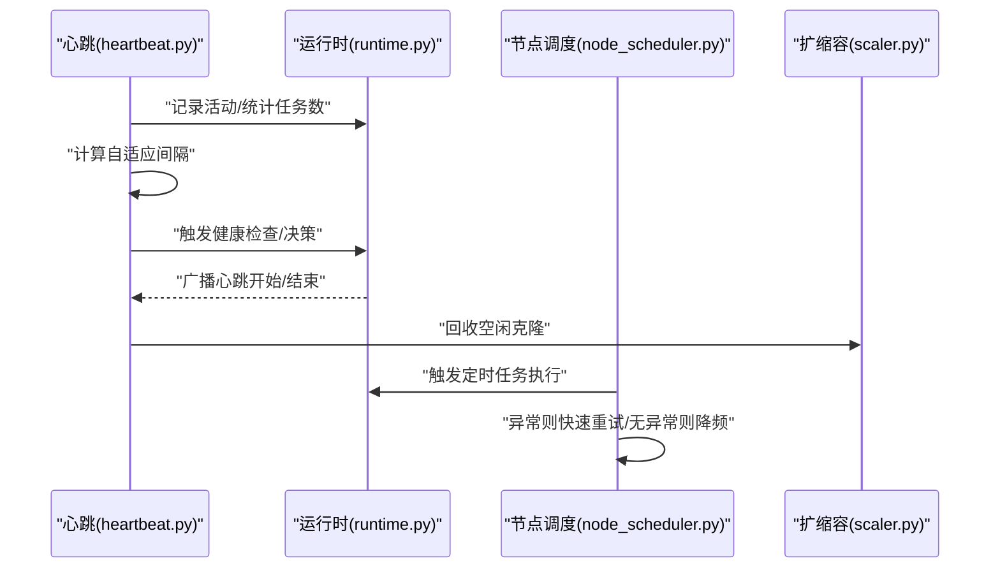

图表来源
- [heartbeat.py:57-73](file://src/synapse/orgs/heartbeat.py#L57-L73)
- [heartbeat.py:144-279](file://src/synapse/orgs/heartbeat.py#L144-L279)
- [node_scheduler.py:108-168](file://src/synapse/orgs/node_scheduler.py#L108-L168)

章节来源
- [heartbeat.py:57-73](file://src/synapse/orgs/heartbeat.py#L57-L73)
- [heartbeat.py:144-279](file://src/synapse/orgs/heartbeat.py#L144-L279)
- [node_scheduler.py:108-168](file://src/synapse/orgs/node_scheduler.py#L108-L168)

### 消息路由与冲突检测
- 优先队列：按优先级+时间戳入队，支持暂停/恢复与处理计数
- 带宽限制：按边维度统计 60 秒窗口消息数，防止拥塞
- 死锁检测：基于等待图 DFS 检测环，自动断开“闭合边”打破死锁
- TTL 过期：默认/任务消息不同 TTL，到期标记为 expired
- 任务亲和：绑定任务链到特定节点，确保后续消息回到同一克隆

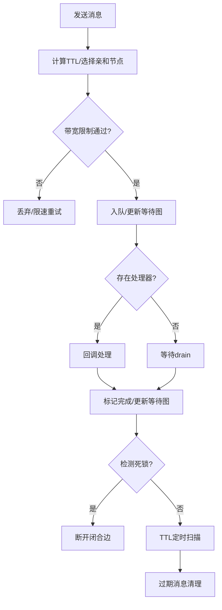

图表来源
- [messenger.py:204-271](file://src/synapse/orgs/messenger.py#L204-L271)
- [messenger.py:518-560](file://src/synapse/orgs/messenger.py#L518-L560)
- [messenger.py:572-591](file://src/synapse/orgs/messenger.py#L572-L591)

章节来源
- [messenger.py:204-271](file://src/synapse/orgs/messenger.py#L204-L271)
- [messenger.py:518-560](file://src/synapse/orgs/messenger.py#L518-L560)
- [messenger.py:572-591](file://src/synapse/orgs/messenger.py#L572-L591)

### 共享黑板与事件存储
- 黑板：组织/部门/节点三层记忆，去重、淘汰、重要度排序、TTL 过期
- 事件存储：事件流按天分文件，支持查询/审计/报告生成

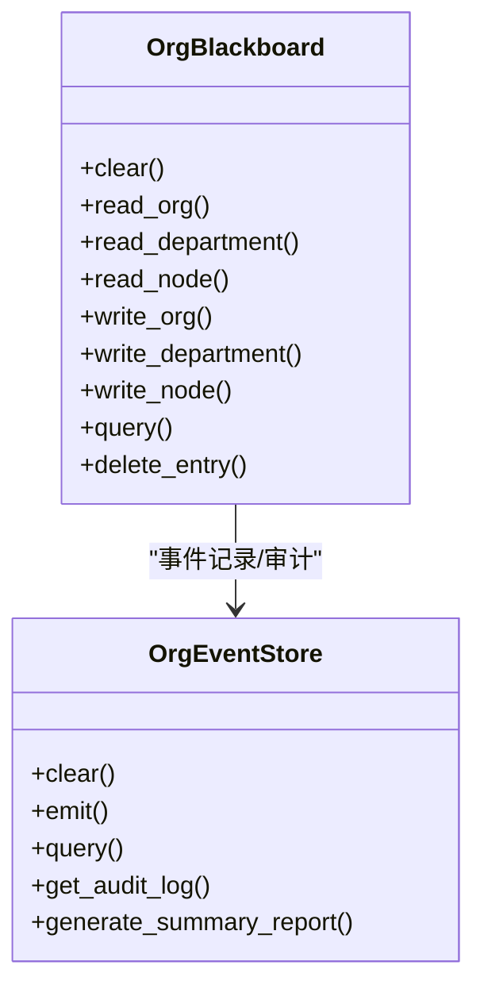

图表来源
- [blackboard.py:32-167](file://src/synapse/orgs/blackboard.py#L32-L167)
- [event_store.py:21-165](file://src/synapse/orgs/event_store.py#L21-L165)

章节来源
- [blackboard.py:32-167](file://src/synapse/orgs/blackboard.py#L32-L167)
- [event_store.py:21-165](file://src/synapse/orgs/event_store.py#L21-L165)

### 收件箱与通知
- 收件箱：聚合消息、优先级排序、内联审批、监听队列
- 通知器：支持飞书/钉钉/企业微信/通用 Webhook，解析自然语言审批回复

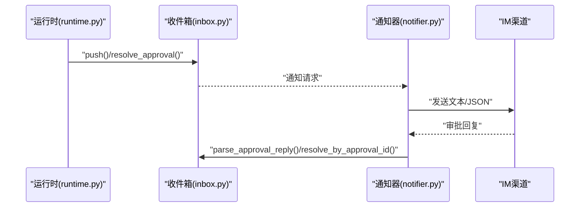

图表来源
- [inbox.py:39-97](file://src/synapse/orgs/inbox.py#L39-L97)
- [inbox.py:226-250](file://src/synapse/orgs/inbox.py#L226-L250)
- [notifier.py:37-70](file://src/synapse/orgs/notifier.py#L37-L70)
- [notifier.py:96-122](file://src/synapse/orgs/notifier.py#L96-L122)

章节来源
- [inbox.py:39-97](file://src/synapse/orgs/inbox.py#L39-L97)
- [inbox.py:226-250](file://src/synapse/orgs/inbox.py#L226-L250)
- [notifier.py:37-70](file://src/synapse/orgs/notifier.py#L37-L70)
- [notifier.py:96-122](file://src/synapse/orgs/notifier.py#L96-L122)

### 制度与报告
- 制度：文件 CRUD、索引自动生成、关键词搜索、模板安装
- 报告：晨会/周报/任务总结/审计日志，Markdown 输出

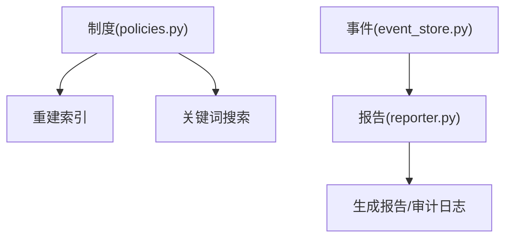

图表来源
- [policies.py:28-167](file://src/synapse/orgs/policies.py#L28-L167)
- [reporter.py:28-158](file://src/synapse/orgs/reporter.py#L28-L158)
- [event_store.py:148-195](file://src/synapse/orgs/event_store.py#L148-L195)

章节来源
- [policies.py:28-167](file://src/synapse/orgs/policies.py#L28-L167)
- [reporter.py:28-158](file://src/synapse/orgs/reporter.py#L28-L158)
- [event_store.py:148-195](file://src/synapse/orgs/event_store.py#L148-L195)

## 依赖分析
- 运行时引擎依赖：消息、心跳、调度、扩缩容、黑板、事件、收件箱、通知、报告、制度
- 子系统之间耦合：事件存储作为审计与报告的数据源；消息系统与事件存储双向交互；通知器依赖收件箱；报告器依赖事件存储
- 外部集成：IM 渠道（飞书/钉钉/企业微信/通用 Webhook）

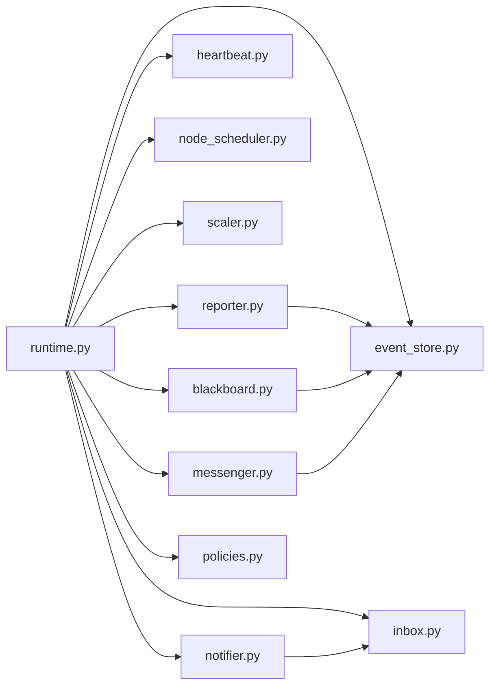

图表来源
- [runtime.py:84-107](file://src/synapse/orgs/runtime.py#L84-L107)
- [messenger.py:135-160](file://src/synapse/orgs/messenger.py#L135-L160)
- [heartbeat.py:24-33](file://src/synapse/orgs/heartbeat.py#L24-L33)
- [node_scheduler.py:35-41](file://src/synapse/orgs/node_scheduler.py#L35-L41)
- [scaler.py:50-56](file://src/synapse/orgs/scaler.py#L50-L56)
- [blackboard.py:32-40](file://src/synapse/orgs/blackboard.py#L32-L40)
- [event_store.py:21-33](file://src/synapse/orgs/event_store.py#L21-L33)
- [inbox.py:23-34](file://src/synapse/orgs/inbox.py#L23-L34)
- [notifier.py:31-36](file://src/synapse/orgs/notifier.py#L31-L36)
- [reporter.py:22-27](file://src/synapse/orgs/reporter.py#L22-L27)
- [policies.py:15-23](file://src/synapse/orgs/policies.py#L15-L23)

章节来源
- [runtime.py:84-107](file://src/synapse/orgs/runtime.py#L84-L107)
- [messenger.py:135-160](file://src/synapse/orgs/messenger.py#L135-L160)
- [heartbeat.py:24-33](file://src/synapse/orgs/heartbeat.py#L24-L33)
- [node_scheduler.py:35-41](file://src/synapse/orgs/node_scheduler.py#L35-L41)
- [scaler.py:50-56](file://src/synapse/orgs/scaler.py#L50-L56)
- [blackboard.py:32-40](file://src/synapse/orgs/blackboard.py#L32-L40)
- [event_store.py:21-33](file://src/synapse/orgs/event_store.py#L21-L33)
- [inbox.py:23-34](file://src/synapse/orgs/inbox.py#L23-L34)
- [notifier.py:31-36](file://src/synapse/orgs/notifier.py#L31-L36)
- [reporter.py:22-27](file://src/synapse/orgs/reporter.py#L22-L27)
- [policies.py:15-23](file://src/synapse/orgs/policies.py#L15-L23)

## 性能考虑
- 并发控制
  - 组织级并发信号量限制同时激活节点数，避免资源争用
  - 节点最大并发任务数限制单节点任务堆积
- 负载均衡
  - 自动克隆分散任务压力，回收空闲克隆释放资源
  - 任务亲和绑定到克隆节点，减少跨节点通信
- 消息与网络
  - 边带宽限制防止拥塞；TTL 控制消息存活，避免僵尸消息
  - 死锁检测与断开闭合边，保障消息通道畅通
- 存储与日志
  - 事件按天分文件，降低单文件过大；审计日志与报告生成按需读取
  - 黑板容量管理与淘汰，避免无限增长

## 故障排查指南
- 常见问题定位
  - 节点长期处于 ERROR：心跳恢复会重置为 IDLE 并清理缓存；检查上游异常与资源配额
  - 任务卡住：检查消息队列积压、死锁检测、TTL 是否过期
  - 扩缩容未生效：确认自动扩缩容开关、阈值、最大节点数、审批策略
- 日志与审计
  - 事件存储提供审计日志与错误摘要；报告器生成周报/任务总结辅助复盘
- 通知与审批
  - IM 渠道不可达时，检查配置与网络；自然语言审批解析失败时，核对编号格式

章节来源
- [heartbeat.py:39-56](file://src/synapse/orgs/heartbeat.py#L39-L56)
- [messenger.py:204-271](file://src/synapse/orgs/messenger.py#L204-L271)
- [scaler.py:64-144](file://src/synapse/orgs/scaler.py#L64-L144)
- [event_store.py:148-195](file://src/synapse/orgs/event_store.py#L148-L195)
- [reporter.py:195-228](file://src/synapse/orgs/reporter.py#L195-L228)
- [notifier.py:37-70](file://src/synapse/orgs/notifier.py#L37-L70)

## 结论
组织运行时通过生命周期管理、状态机、并发控制、自动扩缩容、消息路由与冲突检测、共享记忆与事件存储、收件箱与通知、制度与报告等子系统协同，实现了高可用、可观测、可扩展的组织级智能编排能力。其自适应节律、智能调频与资源弹性分配机制，能够有效应对动态负载与复杂协作场景。

## 附录

### 运行时配置参数说明
- 组织级
  - 心跳：启用/间隔/提示语/最大级联深度
  - 晨会：启用/cron/议程
  - 制度：跨级/最大委派深度/冲突解决策略
  - 扩编：启用/最大节点数/自动扩编开关/每心跳最大扩编数/审批策略
  - 通知：启用/渠道/Webhook/IM 渠道/静默时段/推送级别
  - 记忆：共享/部门记忆启用
  - 令牌预算：预留字段
  - 运行模式：命令/自主
  - 工作空间：文件型工具输出目录
  - 看门狗：启用/间隔/卡顿/静默阈值
- 节点级
  - 最大并发任务数、超时、委派/升级/请求扩编权限、自动克隆开关/阈值/上限、克隆源/是否临时、外部工具、冻结状态
- 调度
  - 类型（cron/间隔/一次性）、cron 表达式、间隔秒数、执行时间、提示、汇报对象/条件、最大令牌数、最近运行/结果、连续干净计数

章节来源
- [models.py:323-456](file://src/synapse/orgs/models.py#L323-L456)
- [models.py:131-211](file://src/synapse/orgs/models.py#L131-L211)
- [models.py:213-257](file://src/synapse/orgs/models.py#L213-L257)
- [node_scheduler.py:19-25](file://src/synapse/orgs/node_scheduler.py#L19-L25)

### 扩缩容策略定制示例
- 自动克隆
  - 触发条件：节点邮箱积压数 ≥ 阈值 且 节点允许自动克隆 且 未达最大节点数 且 同源克隆数 < 上限
  - 参数：阈值、最大克隆数、位置偏移、是否临时
- 申请/审批
  - 克隆：来源节点、原因、是否临时
  - 招募：角色/目标/部门/父节点/原因
  - 裁撤：仅限临时节点，记忆归档到部门
- 回收
  - 空闲临时克隆且无待处理消息时自动回收

章节来源
- [scaler.py:64-144](file://src/synapse/orgs/scaler.py#L64-L144)
- [scaler.py:149-274](file://src/synapse/orgs/scaler.py#L149-L274)
- [scaler.py:279-333](file://src/synapse/orgs/scaler.py#L279-L333)

### 监控告警设置示例
- 指标采集
  - 事件类型分布、节点活跃度、每日事件数、近期错误
  - 节点邮箱积压、心跳间隔、定时任务异常率
- 告警规则
  - 节点 ERROR 持续时间超阈值
  - 心跳间隔异常增大
  - 定时任务连续异常
  - 消息积压超阈值
  - 扩缩容请求长时间未审批

章节来源
- [event_store.py:201-244](file://src/synapse/orgs/event_store.py#L201-L244)
- [heartbeat.py:57-73](file://src/synapse/orgs/heartbeat.py#L57-L73)
- [node_scheduler.py:141-162](file://src/synapse/orgs/node_scheduler.py#L141-L162)
- [messenger.py:243-271](file://src/synapse/orgs/messenger.py#L243-L271)
- [inbox.py:226-250](file://src/synapse/orgs/inbox.py#L226-L250)

### 运行时与外部系统集成
- IM 渠道
  - 飞书/钉钉/企业微信/通用 Webhook
  - 自然语言审批解析：编号匹配与决策判定
- 事件通知
  - WebSocket 广播：状态变更/任务完成/消息/广播/升级/心跳开始/结束
- 故障处理
  - 事件存储审计日志；通知器失败重试；消息 TTL 与死锁检测；心跳恢复 ERROR 节点

章节来源
- [notifier.py:37-70](file://src/synapse/orgs/notifier.py#L37-L70)
- [notifier.py:96-122](file://src/synapse/orgs/notifier.py#L96-L122)
- [runtime.py:580-652](file://src/synapse/orgs/runtime.py#L580-L652)
- [event_store.py:148-195](file://src/synapse/orgs/event_store.py#L148-L195)
- [messenger.py:204-271](file://src/synapse/orgs/messenger.py#L204-L271)