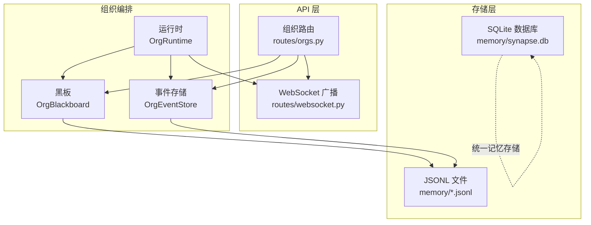
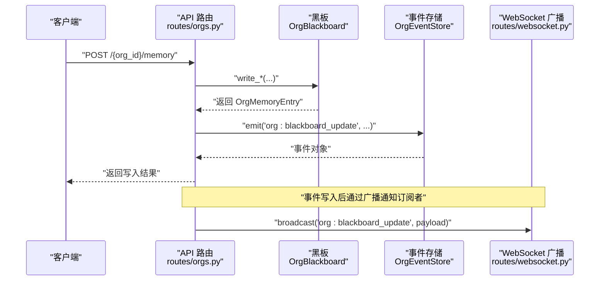
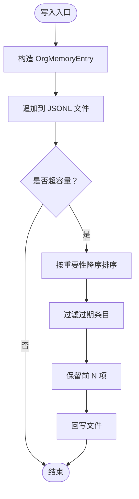
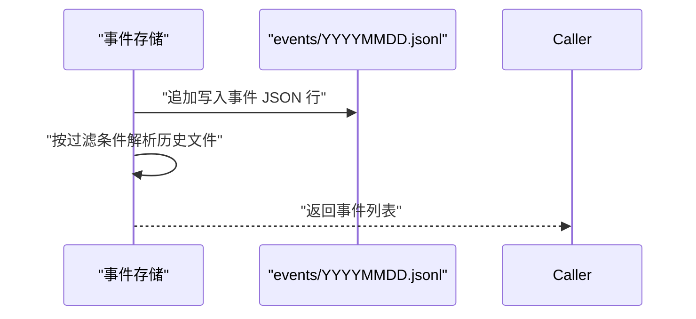
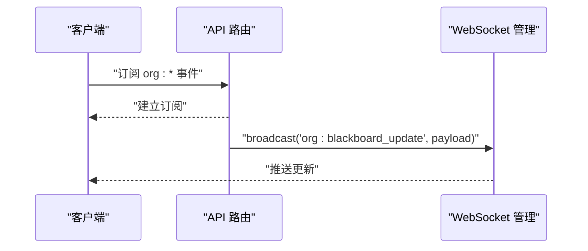
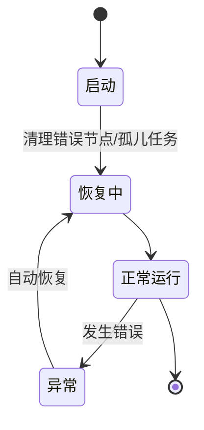
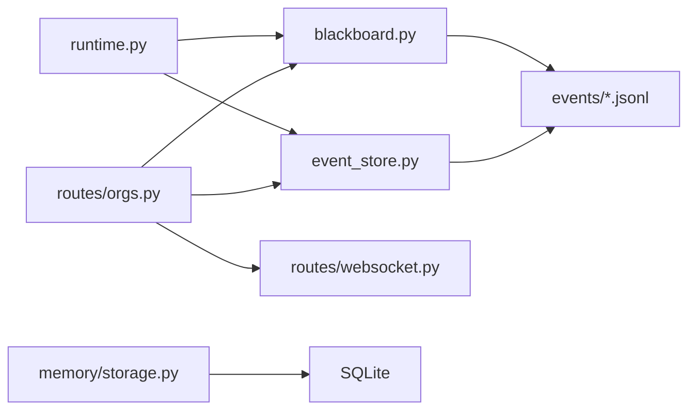

# 黑板共享内存

<cite>
**本文档引用的文件**
- [blackboard.py](file://src/synapse/orgs/blackboard.py)
- [models.py](file://src/synapse/orgs/models.py)
- [event_store.py](file://src/synapse/orgs/event_store.py)
- [orgs.py](file://src/synapse/api/routes/orgs.py)
- [websocket.py](file://src/synapse/api/routes/websocket.py)
- [runtime.py](file://src/synapse/orgs/runtime.py)
- [storage.py](file://src/synapse/memory/storage.py)
- [test_blackboard.py](file://tests/orgs/test_blackboard.py)
- [test_transparency_autonomy.py](file://tests/orgs/test_transparency_autonomy.py)
- [test_plan_features.py](file://tests/orgs/test_plan_features.py)
- [test_storage_extra.py](file://tests/unit/test_storage_extra.py)
</cite>

## 目录
1. [简介](#简介)
2. [项目结构](#项目结构)
3. [核心组件](#核心组件)
4. [架构总览](#架构总览)
5. [详细组件分析](#详细组件分析)
6. [依赖分析](#依赖分析)
7. [性能考虑](#性能考虑)
8. [故障排查指南](#故障排查指南)
9. [结论](#结论)
10. [附录](#附录)

## 简介
本文件面向“黑板共享内存”系统，围绕组织级（黑板）、部门级与节点级三层共享记忆，系统性阐述其数据结构设计、并发访问控制、数据一致性保障机制，并深入解析事件存储的写入流程、查询优化与历史数据管理。同时给出数据序列化方案、压缩与存储空间优化策略建议、API 使用示例、事件订阅机制与数据同步方法，以及内存管理、垃圾回收、性能监控与故障恢复流程。

## 项目结构
黑板共享内存位于组织编排子系统中，核心文件包括：
- 黑板实现：src/synapse/orgs/blackboard.py
- 数据模型：src/synapse/orgs/models.py
- 事件存储：src/synapse/orgs/event_store.py
- API 路由：src/synapse/api/routes/orgs.py
- WebSocket 广播：src/synapse/api/routes/websocket.py
- 运行时集成：src/synapse/orgs/runtime.py
- 统一记忆存储（SQLite）：src/synapse/memory/storage.py
- 单元测试与行为测试：tests/... 下多文件



图示来源
- [blackboard.py:32-379](file://src/synapse/orgs/blackboard.py#L32-L379)
- [event_store.py:21-288](file://src/synapse/orgs/event_store.py#L21-L288)
- [orgs.py:1019-1081](file://src/synapse/api/routes/orgs.py#L1019-L1081)
- [websocket.py:180-196](file://src/synapse/api/routes/websocket.py#L180-L196)
- [runtime.py:1579-1585](file://src/synapse/orgs/runtime.py#L1579-L1585)
- [storage.py:55-200](file://src/synapse/memory/storage.py#L55-L200)

章节来源
- [blackboard.py:1-379](file://src/synapse/orgs/blackboard.py#L1-L379)
- [models.py:58-644](file://src/synapse/orgs/models.py#L58-L644)
- [event_store.py:1-288](file://src/synapse/orgs/event_store.py#L1-L288)
- [orgs.py:1019-1081](file://src/synapse/api/routes/orgs.py#L1019-L1081)
- [websocket.py:180-196](file://src/synapse/api/routes/websocket.py#L180-L196)
- [runtime.py:1579-1585](file://src/synapse/orgs/runtime.py#L1579-L1585)
- [storage.py:1-200](file://src/synapse/memory/storage.py#L1-L200)

## 核心组件
- 黑板（OrgBlackboard）
  - 三层共享记忆：组织级（黑板）、部门级、节点级
  - 写入去重、容量淘汰、TTL 过滤、重要性排序
  - JSONL 文件持久化，按目录分层组织
- 事件存储（OrgEventStore）
  - 不可变事件流，按日期分片
  - 支持审计日志与报告生成
- 数据模型（OrgMemoryEntry 等）
  - 统一的记忆条目结构，含作用域、类型、标签、重要性、TTL 等
- API 路由与广播
  - 提供写入/删除/查询接口；事件写入后通过 WebSocket 广播
- 运行时集成
  - 在组织激活时初始化黑板与事件存储实例
- 统一记忆存储（SQLite）
  - 结构化主存储，支持全文检索与向量嵌入缓存等扩展

章节来源
- [blackboard.py:32-379](file://src/synapse/orgs/blackboard.py#L32-L379)
- [models.py:578-644](file://src/synapse/orgs/models.py#L578-L644)
- [event_store.py:21-288](file://src/synapse/orgs/event_store.py#L21-L288)
- [orgs.py:1019-1081](file://src/synapse/api/routes/orgs.py#L1019-L1081)
- [websocket.py:180-196](file://src/synapse/api/routes/websocket.py#L180-L196)
- [runtime.py:1579-1585](file://src/synapse/orgs/runtime.py#L1579-L1585)
- [storage.py:55-200](file://src/synapse/memory/storage.py#L55-L200)

## 架构总览
黑板与事件存储共同构成组织级“记忆与审计”基础设施。API 层负责对外暴露写入、查询与消息通信接口；运行时在组织生命周期内维护黑板与事件存储实例；WebSocket 负责跨组件广播；底层存储既可采用 JSONL（黑板）也可采用 SQLite（统一记忆存储）。



图示来源
- [orgs.py:1019-1043](file://src/synapse/api/routes/orgs.py#L1019-L1043)
- [blackboard.py:76-166](file://src/synapse/orgs/blackboard.py#L76-L166)
- [event_store.py:42-68](file://src/synapse/orgs/event_store.py#L42-L68)
- [websocket.py:180-196](file://src/synapse/api/routes/websocket.py#L180-L196)

章节来源
- [orgs.py:1019-1081](file://src/synapse/api/routes/orgs.py#L1019-L1081)
- [blackboard.py:32-379](file://src/synapse/orgs/blackboard.py#L32-L379)
- [event_store.py:21-288](file://src/synapse/orgs/event_store.py#L21-L288)
- [websocket.py:180-196](file://src/synapse/api/routes/websocket.py#L180-L196)

## 详细组件分析

### 黑板（OrgBlackboard）数据结构与并发控制
- 数据结构
  - 每个作用域对应一个 JSONL 文件：组织级 blackboard.jsonl、部门级 departments/<dept>.jsonl、节点级 nodes/<node>.jsonl
  - 条目字段包含：id、org_id、scope、scope_owner、memory_type、content、source_node、tags、attachments、importance、ttl_hours、created_at、last_accessed_at、access_count
- 并发与一致性
  - 写入采用追加模式，单文件原子性写入
  - 去重检查基于内容前缀，避免重复写入
  - 容量淘汰按重要性降序保留，过期条目在读取阶段过滤
- 读写流程
  - 写入：构造 OrgMemoryEntry，追加至目标文件，触发容量淘汰
  - 读取：按文件逐行解析，过滤过期与标签，按重要性排序并限制数量
- TTL 与淘汰
  - 读取阶段判断过期并过滤
  - 写入后若超过容量，按重要性降序保留，其余淘汰



图示来源
- [blackboard.py:333-379](file://src/synapse/orgs/blackboard.py#L333-L379)
- [models.py:578-644](file://src/synapse/orgs/models.py#L578-L644)

章节来源
- [blackboard.py:32-379](file://src/synapse/orgs/blackboard.py#L32-L379)
- [models.py:578-644](file://src/synapse/orgs/models.py#L578-L644)

### 事件存储（OrgEventStore）写入与查询
- 写入
  - 事件包含 event_id、event_type、org_id、actor、timestamp、data、metadata
  - 按 UTC 当日分文件存储于 events/YYYYMMDD.jsonl
- 查询
  - 支持按 event_type、actor、since/until、chain_id/task_id 过滤
  - 返回最新事件优先，支持 limit 控制
- 审计与报告
  - 审计日志：筛选重要事件类型并生成 Markdown 报告
  - 统计摘要：任务完成/失败、消息发送、节点活跃度、每日活动



图示来源
- [event_store.py:42-124](file://src/synapse/orgs/event_store.py#L42-L124)
- [event_store.py:148-287](file://src/synapse/orgs/event_store.py#L148-L287)

章节来源
- [event_store.py:21-288](file://src/synapse/orgs/event_store.py#L21-L288)

### API 与事件订阅机制
- 写入接口
  - POST /{org_id}/memory：根据 scope 写入组织/部门/节点级记忆
  - DELETE /{org_id}/memory/{memory_id}：按 ID 删除任意作用域条目
- 查询接口
  - GET /{org_id}/events：事件查询，支持多维过滤
  - GET /{org_id}/messages：通信日志查询
- 事件订阅
  - 写入成功后通过 WebSocket 广播 org:blackboard_update
  - 广播跨循环安全调度，确保在 API 循环中执行



图示来源
- [orgs.py:1019-1081](file://src/synapse/api/routes/orgs.py#L1019-L1081)
- [websocket.py:180-196](file://src/synapse/api/routes/websocket.py#L180-L196)

章节来源
- [orgs.py:1019-1218](file://src/synapse/api/routes/orgs.py#L1019-L1218)
- [websocket.py:180-196](file://src/synapse/api/routes/websocket.py#L180-L196)

### 数据序列化、压缩与存储优化
- 序列化
  - 黑板：JSONL 文本行，每行一条记录
  - 事件：JSON 对象，包含时间戳与结构化数据
  - 统一记忆存储：SQLite 表结构，支持 JSON 字段与 FTS5 全文索引
- 压缩与优化
  - JSONL 适合顺序写入与增量处理
  - SQLite WAL 模式提升并发读写性能
  - 建议对大文本内容进行外部化存储或分块索引（当前未见内置压缩实现）
- 存储空间管理
  - 黑板：容量上限与重要性淘汰，过期条目过滤
  - 事件：按日期分片，便于归档与清理
  - 统一记忆存储：支持过期清理与模式迁移

章节来源
- [blackboard.py:333-379](file://src/synapse/orgs/blackboard.py#L333-L379)
- [event_store.py:61-124](file://src/synapse/orgs/event_store.py#L61-L124)
- [storage.py:83-118](file://src/synapse/memory/storage.py#L83-L118)

### 数据一致性与故障恢复
- 一致性
  - 写入为追加，读取时过滤过期与去重，避免并发冲突
  - 事件存储按日期分片，减少热点竞争
- 故障恢复
  - 运行时在启动后清理错误/挂起节点状态，重置孤儿任务
  - 事件存储提供审计日志与报告，辅助问题定位
  - 统一记忆存储具备模式迁移与过期清理能力



图示来源
- [runtime.py:1677-1750](file://src/synapse/orgs/runtime.py#L1677-L1750)
- [event_store.py:148-195](file://src/synapse/orgs/event_store.py#L148-L195)

章节来源
- [runtime.py:1677-1750](file://src/synapse/orgs/runtime.py#L1677-L1750)
- [event_store.py:148-195](file://src/synapse/orgs/event_store.py#L148-L195)

## 依赖分析
- 组件耦合
  - API 路由依赖黑板与事件存储
  - 运行时在组织激活时创建黑板与事件存储实例
  - WebSocket 广播依赖 API 循环上下文
- 外部依赖
  - 文件系统（JSONL）
  - SQLite（统一记忆存储）
  - 异步事件循环（WebSocket）



图示来源
- [orgs.py:1019-1081](file://src/synapse/api/routes/orgs.py#L1019-L1081)
- [blackboard.py:32-379](file://src/synapse/orgs/blackboard.py#L32-L379)
- [event_store.py:21-288](file://src/synapse/orgs/event_store.py#L21-L288)
- [runtime.py:1579-1585](file://src/synapse/orgs/runtime.py#L1579-L1585)
- [websocket.py:180-196](file://src/synapse/api/routes/websocket.py#L180-L196)
- [storage.py:55-200](file://src/synapse/memory/storage.py#L55-L200)

章节来源
- [orgs.py:1019-1081](file://src/synapse/api/routes/orgs.py#L1019-L1081)
- [blackboard.py:32-379](file://src/synapse/orgs/blackboard.py#L32-L379)
- [event_store.py:21-288](file://src/synapse/orgs/event_store.py#L21-L288)
- [runtime.py:1579-1585](file://src/synapse/orgs/runtime.py#L1579-L1585)
- [websocket.py:180-196](file://src/synapse/api/routes/websocket.py#L180-L196)
- [storage.py:55-200](file://src/synapse/memory/storage.py#L55-L200)

## 性能考虑
- 写入路径
  - JSONL 追加写入，避免随机 IO；建议批量写入合并
  - SQLite WAL 模式提升并发读写吞吐
- 查询路径
  - 黑板读取按重要性排序，建议在高频查询场景引入索引或预聚合
  - 事件按日期分片，查询时从最新文件向前扫描，建议增加索引或缓存热点
- 存储优化
  - 大文本内容可外部化或分块，减少 JSONL 行长度
  - 定期归档旧事件文件，控制单文件大小
- 并发与锁
  - 黑板写入为单文件追加，天然低冲突
  - 统一记忆存储使用 RLock 与进程级实例注册，避免重复连接

## 故障排查指南
- 写入重复
  - 现象：相同内容被多次写入
  - 排查：检查去重逻辑与内容前缀长度
  - 参考测试：重复写入不广播
- TTL 生效
  - 现象：过期条目仍出现在读取结果
  - 排查：确认 created_at 与 ttl_hours 字段，读取阶段会过滤过期条目
- 删除失败
  - 现象：按 ID 删除返回未找到
  - 排查：确认 memory_id 是否正确，文件是否存在
- 广播异常
  - 现象：订阅端未收到 org:blackboard_update
  - 排查：确认 WebSocket 广播跨循环调度逻辑

章节来源
- [test_transparency_autonomy.py:141-156](file://tests/orgs/test_transparency_autonomy.py#L141-L156)
- [test_plan_features.py:580-616](file://tests/orgs/test_plan_features.py#L580-L616)
- [blackboard.py:240-262](file://src/synapse/orgs/blackboard.py#L240-L262)
- [websocket.py:180-196](file://src/synapse/api/routes/websocket.py#L180-L196)

## 结论
黑板共享内存通过三层结构与 JSONL 持久化实现了简洁高效的组织级记忆管理；配合事件存储与 WebSocket 广播，构建了可观测、可审计、可订阅的组织运行基座。在高并发与大数据量场景下，建议结合 SQLite 索引、事件分片归档与内容外部化策略进一步优化性能与存储效率。

## 附录

### API 使用示例（路径指引）
- 写入组织级记忆
  - 路径：[orgs.py:1019-1043](file://src/synapse/api/routes/orgs.py#L1019-L1043)
- 写入部门级记忆
  - 路径：[orgs.py:1020-1031](file://src/synapse/api/routes/orgs.py#L1020-L1031)
- 写入节点级记忆
  - 路径：[orgs.py:1032-1042](file://src/synapse/api/routes/orgs.py#L1032-L1042)
- 删除记忆条目
  - 路径：[orgs.py:1046-1055](file://src/synapse/api/routes/orgs.py#L1046-L1055)
- 查询事件
  - 路径：[orgs.py:1061-1081](file://src/synapse/api/routes/orgs.py#L1061-L1081)
- 查询通信日志
  - 路径：[orgs.py:1087-1118](file://src/synapse/api/routes/orgs.py#L1087-L1118)

### 关键流程图（代码级）
- 黑板写入与淘汰
  ```mermaid
flowchart TD
S["写入入口"] --> A["构造条目"]
A --> W["追加到 JSONL"]
W --> C{"是否超容量？"}
C --> |是| E["过滤过期"]
E --> O["按重要性排序"]
O --> K["保留前 N"]
K --> R["回写文件"]
C --> |否| X["结束"]
```
  图示来源
  - [blackboard.py:333-379](file://src/synapse/orgs/blackboard.py#L333-L379)

- 事件写入与查询
  ```mermaid
sequenceDiagram
participant API as "API"
participant ES as "事件存储"
participant F as "events/*.jsonl"
API->>ES : "emit(...)"
ES->>F : "写入当日文件"
API->>ES : "query(...)"
ES->>F : "解析文件"
ES-->>API : "返回事件列表"
```
  图示来源
  - [event_store.py:42-124](file://src/synapse/orgs/event_store.py#L42-L124)