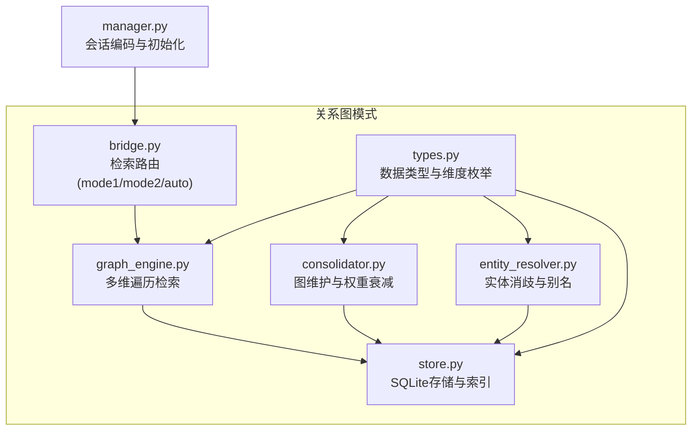
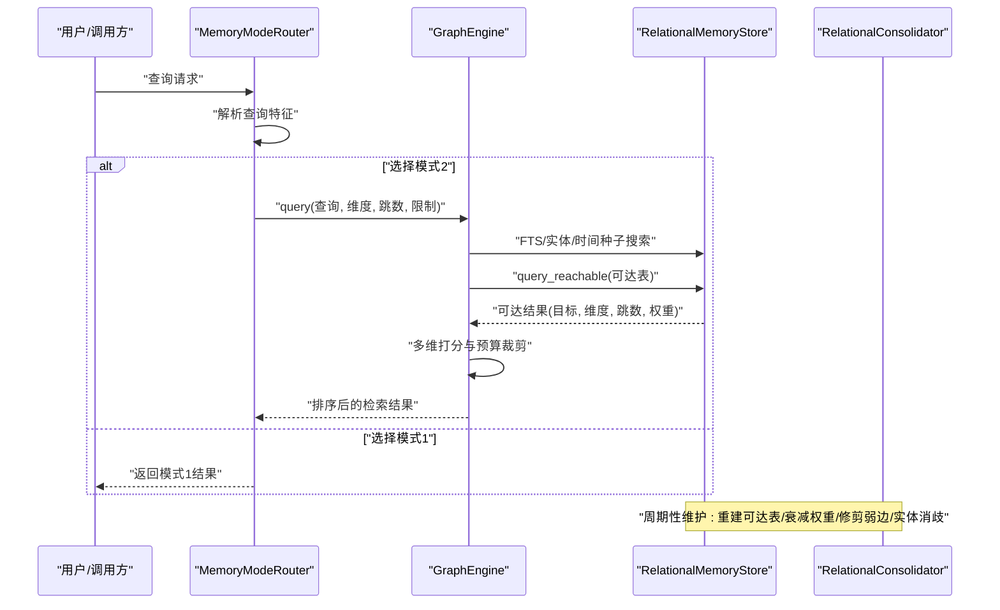
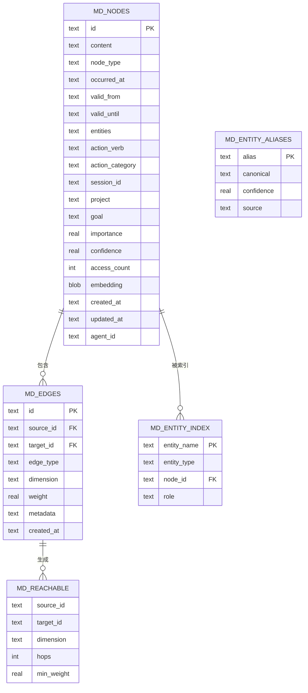
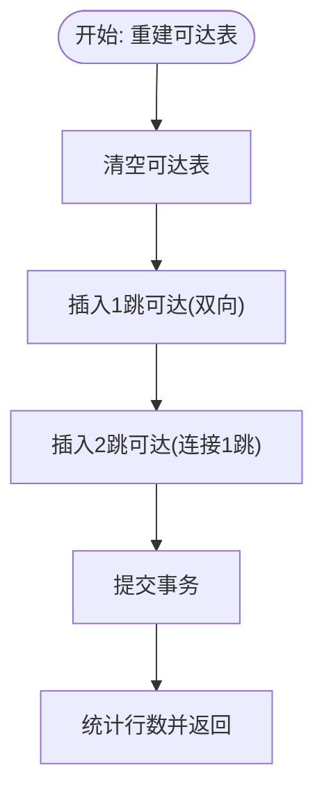
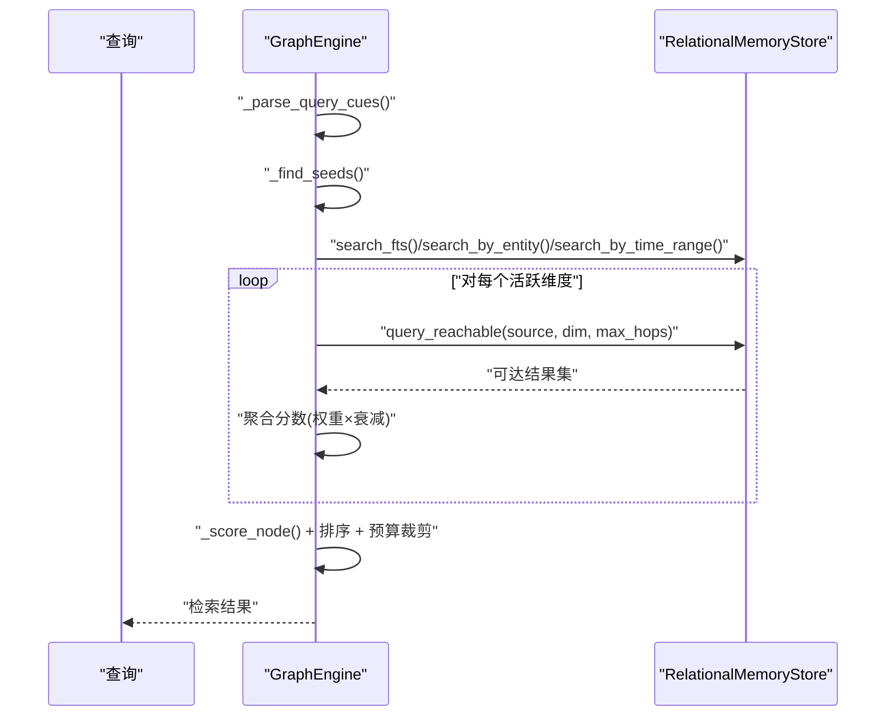
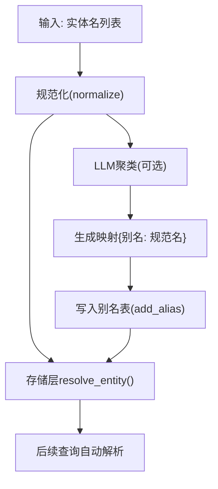
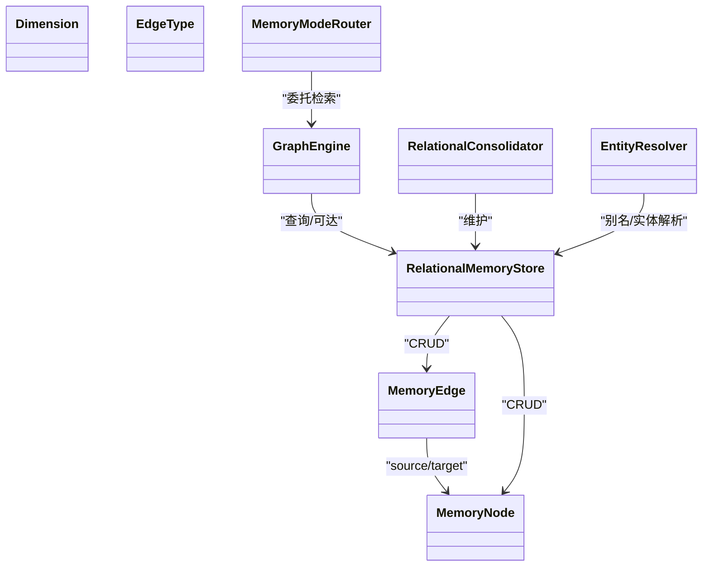

# MDRM关系图模式

<cite>
**本文档引用的文件**
- [types.py](file://src/synapse/memory/relational/types.py)
- [store.py](file://src/synapse/memory/relational/store.py)
- [graph_engine.py](file://src/synapse/memory/relational/graph_engine.py)
- [consolidator.py](file://src/synapse/memory/relational/consolidator.py)
- [entity_resolver.py](file://src/synapse/memory/relational/entity_resolver.py)
- [bridge.py](file://src/synapse/memory/relational/bridge.py)
- [manager.py](file://src/synapse/memory/manager.py)
</cite>

## 目录
1. [简介](#简介)
2. [项目结构](#项目结构)
3. [核心组件](#核心组件)
4. [架构总览](#架构总览)
5. [详细组件分析](#详细组件分析)
6. [依赖关系分析](#依赖关系分析)
7. [性能考量](#性能考量)
8. [故障排查指南](#故障排查指南)
9. [结论](#结论)
10. [附录](#附录)

## 简介
本文件面向MDRM（多维关系记忆）关系图模式，系统化阐述其数据模型设计、实体解析机制与图引擎算法。内容覆盖三元组存储结构、邻接表实现、可达性表（materialized path）、路径查询算法、子图提取策略、关系推理规则、一致性保证与并发控制、性能优化与索引策略、缓存机制，以及实际查询案例、调试方法与性能调优建议。

## 项目结构
MDRM关系图模式位于内存子系统的relational目录下，采用“类型定义 + 存储层 + 图引擎 + 维护器 + 实体解析 + 路由器”的分层组织方式，配合内存管理器在会话末期批量编码与落盘。

**图表来源**
- [types.py:1-155](file://src/synapse/memory/relational/types.py#L1-L155)
- [store.py:1-782](file://src/synapse/memory/relational/store.py#L1-L782)
- [graph_engine.py:1-302](file://src/synapse/memory/relational/graph_engine.py#L1-L302)
- [consolidator.py:1-108](file://src/synapse/memory/relational/consolidator.py#L1-L108)
- [entity_resolver.py:1-146](file://src/synapse/memory/relational/entity_resolver.py#L1-L146)
- [bridge.py:1-120](file://src/synapse/memory/relational/bridge.py#L1-L120)
- [manager.py:620-819](file://src/synapse/memory/manager.py#L620-L819)

**章节来源**
- [types.py:1-155](file://src/synapse/memory/relational/types.py#L1-L155)
- [store.py:1-782](file://src/synapse/memory/relational/store.py#L1-L782)
- [graph_engine.py:1-302](file://src/synapse/memory/relational/graph_engine.py#L1-L302)
- [consolidator.py:1-108](file://src/synapse/memory/relational/consolidator.py#L1-L108)
- [entity_resolver.py:1-146](file://src/synapse/memory/relational/entity_resolver.py#L1-L146)
- [bridge.py:1-120](file://src/synapse/memory/relational/bridge.py#L1-L120)
- [manager.py:620-819](file://src/synapse/memory/manager.py#L620-L819)

## 核心组件
- 数据类型与维度：定义节点类型、边类型、维度枚举及映射，统一三元组语义。
- 存储层：基于SQLite的关系表（节点、边、实体索引、可达表、别名词典），内置FTS5全文索引与多类索引。
- 图引擎：多维遍历检索，结合可达表与种子节点扩展，按维度加权打分。
- 维护器：周期性重建可达表、衰减边权重、修剪弱边、实体消歧。
- 实体解析：规则规范化 + 别名表 + LLM批处理消歧。
- 路由器：根据查询特征选择使用模式1（片段记忆）或模式2（关系图）。

**章节来源**
- [types.py:11-155](file://src/synapse/memory/relational/types.py#L11-L155)
- [store.py:24-122](file://src/synapse/memory/relational/store.py#L24-L122)
- [graph_engine.py:32-112](file://src/synapse/memory/relational/graph_engine.py#L32-L112)
- [consolidator.py:16-82](file://src/synapse/memory/relational/consolidator.py#L16-L82)
- [entity_resolver.py:42-146](file://src/synapse/memory/relational/entity_resolver.py#L42-L146)
- [bridge.py:34-87](file://src/synapse/memory/relational/bridge.py#L34-L87)

## 架构总览
MDRM模式通过“编码-落盘-检索-维护”闭环实现关系图谱的构建与演进。编码阶段在会话结束时批量生成节点与边；检索阶段通过图引擎结合可达表进行多维扩展与打分；维护阶段定期更新可达表与边权重，保持图的时效性与稳定性。

**图表来源**
- [bridge.py:51-87](file://src/synapse/memory/relational/bridge.py#L51-L87)
- [graph_engine.py:38-112](file://src/synapse/memory/relational/graph_engine.py#L38-L112)
- [store.py:580-633](file://src/synapse/memory/relational/store.py#L580-L633)
- [consolidator.py:35-82](file://src/synapse/memory/relational/consolidator.py#L35-L82)

## 详细组件分析

### 数据模型与三元组存储
- 节点（MemoryNode）：包含内容、类型、时间窗口、实体集合、动作信息、会话/项目/目标标识、重要性/置信度/访问计数等。
- 边（MemoryEdge）：有向边，包含类型、维度、权重、元数据与创建时间；维度由边类型推断或显式指定。
- 关系表：
  - mdrm_nodes：节点主表，含FTS字段与多索引。
  - mdrm_edges：边表，外键约束节点，支持多索引。
  - mdrm_entity_index：实体名到节点的多对多索引，去重主键。
  - mdrm_reachable：材料化可达表，记录1-2跳可达、维度、最小权重。
  - mdrm_entity_aliases：实体别名表，持久化消歧结果。
- FTS5：独立虚拟表，预分词CJK二元组，提升中文检索质量。

**图表来源**
- [store.py:35-93](file://src/synapse/memory/relational/store.py#L35-L93)
- [types.py:84-131](file://src/synapse/memory/relational/types.py#L84-L131)

**章节来源**
- [types.py:11-131](file://src/synapse/memory/relational/types.py#L11-L131)
- [store.py:35-122](file://src/synapse/memory/relational/store.py#L35-L122)

### 邻接表与可达表实现
- 邻接表：mdrm_edges以(source_id, target_id)表示边，维度与权重存储于边记录，支持按维度过滤。
- 可达表（Materialized Paths）：mdrm_reachable通过SQL重建1跳与2跳可达，记录最小权重（路径权重随跳数取最小值），并以(source_id, dimension)复合索引加速查询。
- 查询流程：先按维度过滤可达表，再按min_weight降序返回，结合跳数衰减计算最终得分。

**图表来源**
- [store.py:580-609](file://src/synapse/memory/relational/store.py#L580-L609)

**章节来源**
- [store.py:576-633](file://src/synapse/memory/relational/store.py#L576-L633)

### 图引擎算法与路径查询
- 查询步骤：
  1) 解析查询特征，识别时间/因果/实体线索，确定活跃维度。
  2) 种子节点：FTS匹配、实体索引、关键词LIKE、时间范围检索，去重合并。
  3) 多维扩展：对每个活跃维度，从种子节点查询可达表，按min_weight与跳数衰减累加分数。
  4) 打分：综合基础可达分、节点重要性、时间新鲜度、访问频次、关键词命中。
  5) 预算裁剪：按token预算估算与限制返回数量。
- 关键接口：query_reachable、search_fts、search_by_entity、search_by_time_range。

**图表来源**
- [graph_engine.py:38-112](file://src/synapse/memory/relational/graph_engine.py#L38-L112)
- [store.py:479-555](file://src/synapse/memory/relational/store.py#L479-L555)

**章节来源**
- [graph_engine.py:38-112](file://src/synapse/memory/relational/graph_engine.py#L38-L112)
- [store.py:479-555](file://src/synapse/memory/relational/store.py#L479-L555)

### 实体解析与一致性
- 规则规范化：小写、去空白、中文-英文术语映射。
- 别名表：alias→canonical，持久化消歧结果。
- LLM批处理：抽取唯一实体名，LLM聚类同义别名，写回别名表。
- 一致性保证：FTS与实体索引同步更新；删除节点时级联清理可达表与FTS条目；边权重更新与可达表重建原子化。

**图表来源**
- [entity_resolver.py:55-141](file://src/synapse/memory/relational/entity_resolver.py#L55-L141)
- [store.py:639-660](file://src/synapse/memory/relational/store.py#L639-L660)

**章节来源**
- [entity_resolver.py:42-146](file://src/synapse/memory/relational/entity_resolver.py#L42-L146)
- [store.py:391-402](file://src/synapse/memory/relational/store.py#L391-L402)

### 关系推理规则与维度映射
- 维度枚举：时间、实体、因果、动作、上下文。
- 边类型到维度映射：如因果边→因果维度，实体相关边→实体维度，动作相关边→动作维度。
- 推理依据：查询特征（时间/因果/实体）决定活跃维度；节点属性（实体/动作类别/会话/项目）决定匹配维度。

**章节来源**
- [types.py:44-70](file://src/synapse/memory/relational/types.py#L44-L70)
- [graph_engine.py:289-301](file://src/synapse/memory/relational/graph_engine.py#L289-L301)

### 并发控制与一致性
- SQLite事务：批量保存节点/边、重建可达表、更新权重均在事务内执行，确保原子性。
- 级联删除：删除节点时级联删除边、实体索引、可达表条目与FTS条目。
- 读写分离：查询主要依赖索引与可达表；写入集中在会话结束批量编码阶段。

**章节来源**
- [store.py:391-402](file://src/synapse/memory/relational/store.py#L391-L402)
- [store.py:580-609](file://src/synapse/memory/relational/store.py#L580-L609)

### 编码与会话集成
- 会话结束时，内存管理器触发编码器生成节点与边，批量写入存储层，并重建可达表。
- 支持Agent隔离（agent_id列预留）与跨会话检索。

**章节来源**
- [manager.py:770-802](file://src/synapse/memory/manager.py#L770-L802)
- [store.py:96-99](file://src/synapse/memory/relational/store.py#L96-L99)

## 依赖关系分析

**图表来源**
- [types.py:84-131](file://src/synapse/memory/relational/types.py#L84-L131)
- [store.py:24-30](file://src/synapse/memory/relational/store.py#L24-L30)
- [graph_engine.py:32-36](file://src/synapse/memory/relational/graph_engine.py#L32-L36)
- [consolidator.py:27-33](file://src/synapse/memory/relational/consolidator.py#L27-L33)
- [entity_resolver.py:42-53](file://src/synapse/memory/relational/entity_resolver.py#L42-L53)
- [bridge.py:34-49](file://src/synapse/memory/relational/bridge.py#L34-L49)

**章节来源**
- [types.py:11-155](file://src/synapse/memory/relational/types.py#L11-L155)
- [store.py:24-30](file://src/synapse/memory/relational/store.py#L24-L30)
- [graph_engine.py:32-36](file://src/synapse/memory/relational/graph_engine.py#L32-L36)
- [consolidator.py:27-33](file://src/synapse/memory/relational/consolidator.py#L27-L33)
- [entity_resolver.py:42-53](file://src/synapse/memory/relational/entity_resolver.py#L42-L53)
- [bridge.py:34-49](file://src/synapse/memory/relational/bridge.py#L34-L49)

## 性能考量
- 索引策略
  - 节点：按occurred_at、node_type、project、session_id、agent_id建立索引，支撑时间/类型/项目/会话检索。
  - 边：按source_id、target_id、dimension、edge_type建立索引，支撑邻接查询与维度过滤。
  - 可达表：按(source_id, dimension)复合索引，加速维度定向可达查询。
- 全文检索
  - FTS5独立表，预分词CJK二元组，unicode61处理英文单词，BM25风格rank。
- 材料化可达表
  - 1-2跳可达预先计算并持久化，避免运行时复杂JOIN，显著降低查询延迟。
- 权重衰减与修剪
  - 定期衰减边权重，修剪弱边，减少可达表膨胀与查询开销。
- 预算裁剪
  - 基于token预算估算与限制返回数量，避免大模型输出超限。

**章节来源**
- [store.py:101-122](file://src/synapse/memory/relational/store.py#L101-L122)
- [store.py:124-275](file://src/synapse/memory/relational/store.py#L124-L275)
- [store.py:580-633](file://src/synapse/memory/relational/store.py#L580-L633)
- [graph_engine.py:97-112](file://src/synapse/memory/relational/graph_engine.py#L97-L112)
- [consolidator.py:35-82](file://src/synapse/memory/relational/consolidator.py#L35-L82)

## 故障排查指南
- 可达表为空或不准确
  - 检查是否执行了rebuild_reachable；确认边表存在有效边；核对维度过滤条件。
  - 参考：[rebuild_reachable:580-609](file://src/synapse/memory/relational/store.py#L580-L609)
- 查询结果为空
  - 检查种子节点生成：FTS/实体/时间范围是否命中；关键词长度与停用词处理。
  - 参考：[_find_seeds:226-259](file://src/synapse/memory/relational/graph_engine.py#L226-L259)
- 实体别名未生效
  - 确认add_alias写入成功；resolve_entity查询别名表；检查normalize逻辑。
  - 参考：[add_alias/resolve_entity:645-660](file://src/synapse/memory/relational/store.py#L645-L660)
- 写入失败或数据不一致
  - 确认事务提交；检查外键约束；核对级联删除逻辑。
  - 参考：[delete_node:391-402](file://src/synapse/memory/relational/store.py#L391-L402)
- 模式切换异常
  - 检查MemoryModeRouter的查询特征匹配；必要时强制指定模式。
  - 参考：[select_mode/search:68-87](file://src/synapse/memory/relational/bridge.py#L68-L87)

**章节来源**
- [store.py:391-402](file://src/synapse/memory/relational/store.py#L391-L402)
- [store.py:580-609](file://src/synapse/memory/relational/store.py#L580-L609)
- [graph_engine.py:226-259](file://src/synapse/memory/relational/graph_engine.py#L226-L259)
- [bridge.py:68-87](file://src/synapse/memory/relational/bridge.py#L68-L87)

## 结论
MDRM关系图模式通过清晰的数据模型、高效的可达表与多维检索、完善的实体解析与维护机制，实现了低延迟、高可解释性的关系图谱。其批处理编码与材料化路径设计兼顾了吞吐与响应速度，适合在对话与任务场景中提供上下文增强与跨会话知识复用。

## 附录

### 实际查询案例
- 时间线查询：包含“昨天/上周/最近/历史/时间线”等关键词，自动激活时间维度，结合时间范围检索与可达表扩展。
- 因果查询：包含“为什么/原因/导致/根因/因为/造成”等关键词，自动激活因果维度，优先挖掘因果链路。
- 实体追踪：包含“关于...的所有/...的完整记录/...的历史”等表达，自动激活实体维度，结合实体索引与关键词LIKE检索。
- 动作/上下文：根据节点动作类别与会话/项目信息，匹配动作与上下文维度，辅助任务规划与经验复用。

**章节来源**
- [graph_engine.py:18-30](file://src/synapse/memory/relational/graph_engine.py#L18-L30)
- [graph_engine.py:289-301](file://src/synapse/memory/relational/graph_engine.py#L289-L301)

### 调试方法
- 启用日志：关注Consolidator与GraphEngine的日志输出，定位可达表重建、权重衰减与查询扩展问题。
- SQL审计：直接查询mdrm_nodes、mdrm_edges、mdrm_reachable、mdrm_entity_aliases验证数据状态。
- FTS校验：重建FTS索引并核对token化效果，确保CJK与英文检索质量。

**章节来源**
- [consolidator.py:44-51](file://src/synapse/memory/relational/consolidator.py#L44-L51)
- [graph_engine.py:97-112](file://src/synapse/memory/relational/graph_engine.py#L97-L112)
- [store.py:255-275](file://src/synapse/memory/relational/store.py#L255-L275)

### 性能调优建议
- 定期重建可达表：在大规模边更新后执行，确保查询效率。
- 控制max_hops与limit：平衡召回与延迟；对长上下文场景适当放宽但设置合理上限。
- 优化token预算：根据下游LLM输入限制调整，避免超限。
- 索引维护：监控索引选择性，必要时增加复合索引或分区策略（按agent_id/会话）。
- 批量写入：利用save_nodes_batch/save_edges_batch减少事务开销。

**章节来源**
- [consolidator.py:35-82](file://src/synapse/memory/relational/consolidator.py#L35-L82)
- [graph_engine.py:42-44](file://src/synapse/memory/relational/graph_engine.py#L42-L44)
- [graph_engine.py:97-112](file://src/synapse/memory/relational/graph_engine.py#L97-L112)
- [store.py:333-382](file://src/synapse/memory/relational/store.py#L333-L382)