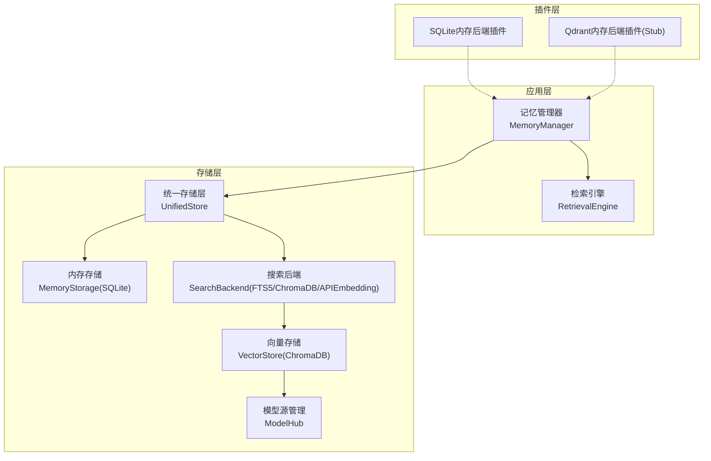
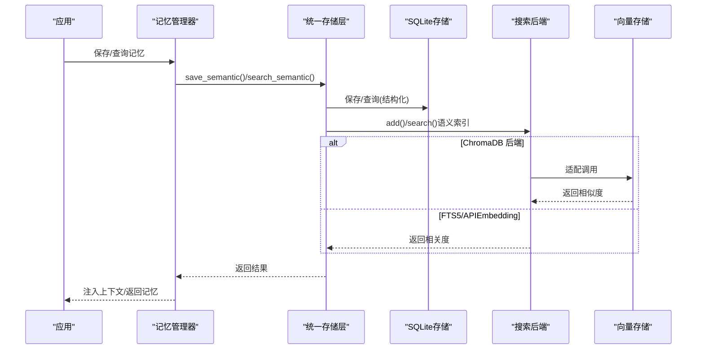
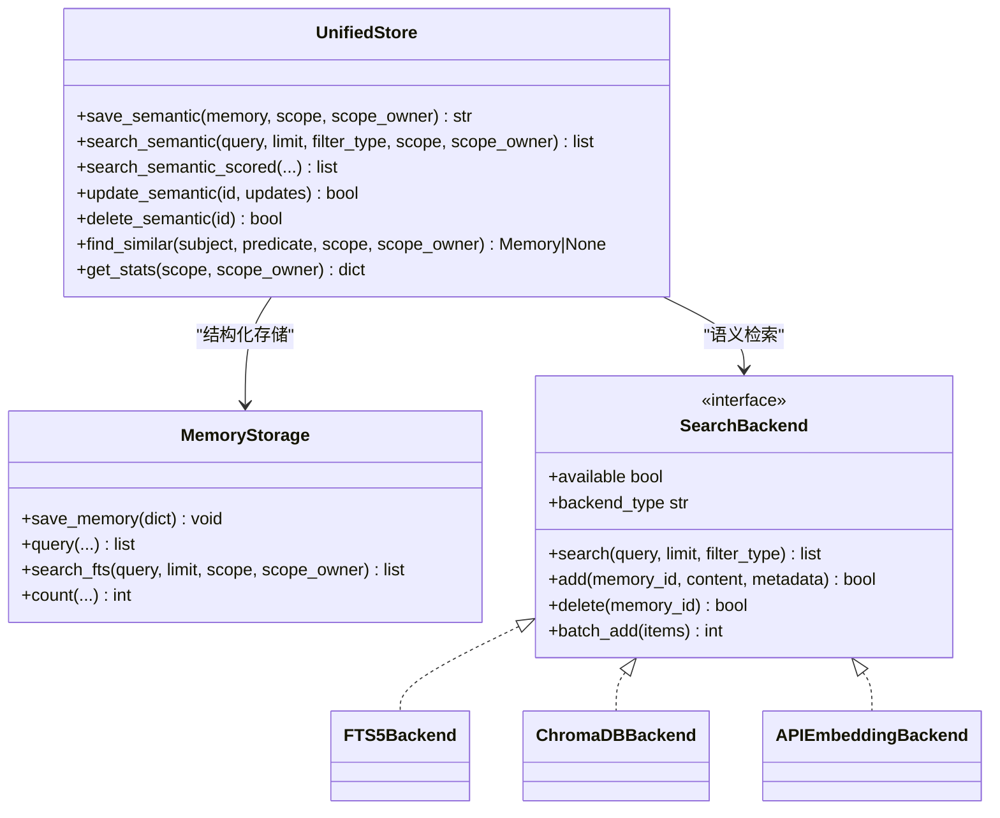
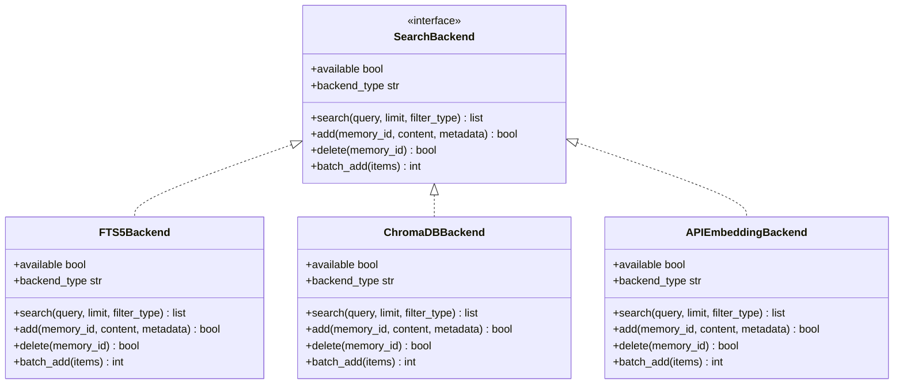
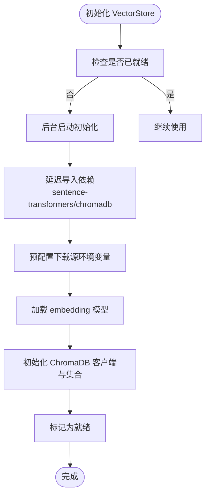
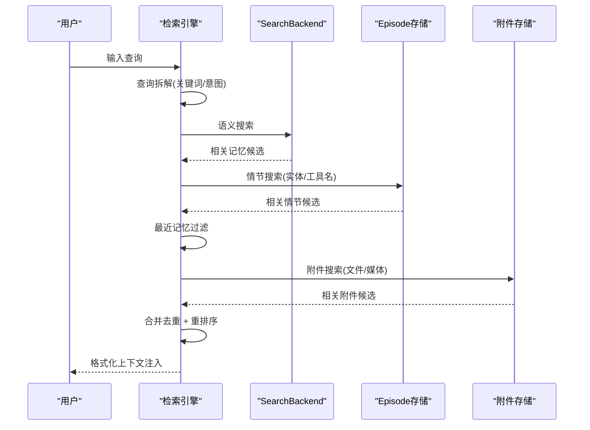
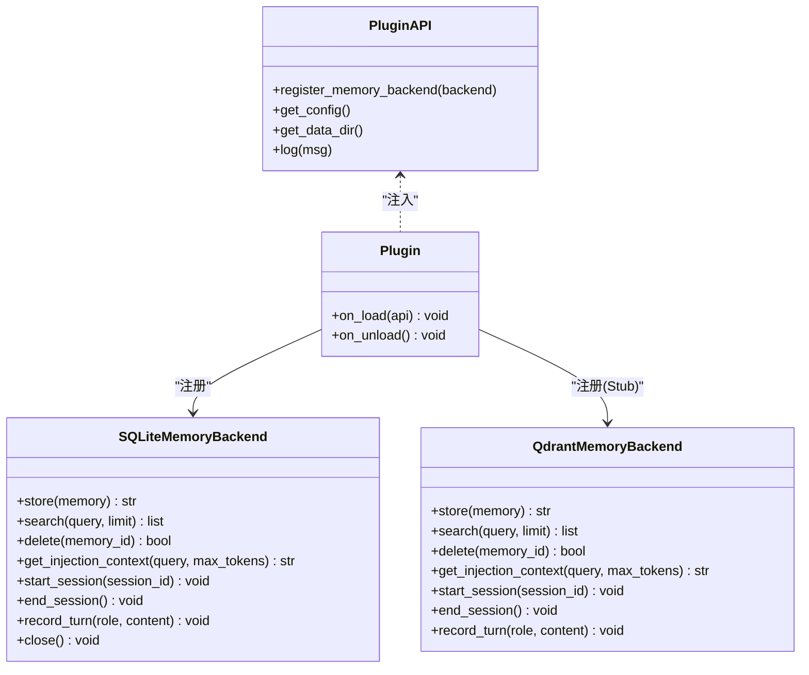
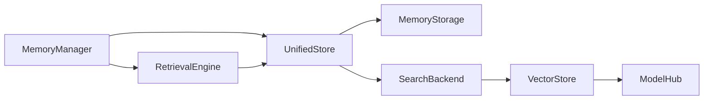

# 存储后端扩展机制

<cite>
**本文档引用的文件**
- [search_backends.py](file://src/synapse/memory/search_backends.py)
- [vector_store.py](file://src/synapse/memory/vector_store.py)
- [storage.py](file://src/synapse/memory/storage.py)
- [unified_store.py](file://src/synapse/memory/unified_store.py)
- [types.py](file://src/synapse/memory/types.py)
- [model_hub.py](file://src/synapse/memory/model_hub.py)
- [manager.py](file://src/synapse/memory/manager.py)
- [retrieval.py](file://src/synapse/memory/retrieval.py)
- [sqlite-memory/plugin.py](file://examples/plugins/sqlite-memory/plugin.py)
- [qdrant-memory/plugin.py](file://examples/plugins/qdrant-memory/plugin.py)
</cite>

## 目录
1. [简介](#简介)
2. [项目结构](#项目结构)
3. [核心组件](#核心组件)
4. [架构总览](#架构总览)
5. [详细组件分析](#详细组件分析)
6. [依赖关系分析](#依赖关系分析)
7. [性能考虑](#性能考虑)
8. [故障排查指南](#故障排查指南)
9. [结论](#结论)
10. [附录](#附录)

## 简介
本文件系统性阐述存储后端扩展机制，重点覆盖：
- 搜索后端的插件化架构与向量存储集成
- 数据一致性保障策略（SQLite 为主、FTS5 同步、向量索引封装）
- FTS5、ChromaDB（本地向量）、APIEmbedding（在线嵌入）等后端适配与性能特征
- 存储后端选择策略、负载均衡与故障转移机制
- 新后端开发指南、接口规范与测试方法
- 存储性能优化、容量规划与成本控制最佳实践

## 项目结构
存储子系统围绕“统一存储层 + 搜索后端 + 向量存储”的分层设计组织，核心文件如下：
- 统一存储层：协调 SQLite 主存储与搜索后端
- 搜索后端：抽象协议 + FTS5/ChromaDB/APIEmbedding 三类实现
- 向量存储：基于 ChromaDB 的本地向量检索
- 模型下载源：多镜像源自动切换与缓存
- 记忆管理器：编排提取、检索、持久化与去重
- 插件示例：SQLite 本地内存后端、Qdrant stub 后端

**图表来源**
- [manager.py:76-130](file://src/synapse/memory/manager.py#L76-L130)
- [unified_store.py:29-60](file://src/synapse/memory/unified_store.py#L29-L60)
- [search_backends.py:29-53](file://src/synapse/memory/search_backends.py#L29-L53)
- [vector_store.py:81-134](file://src/synapse/memory/vector_store.py#L81-L134)
- [model_hub.py:39-148](file://src/synapse/memory/model_hub.py#L39-L148)
- [sqlite-memory/plugin.py:17-147](file://examples/plugins/sqlite-memory/plugin.py#L17-L147)
- [qdrant-memory/plugin.py:13-75](file://examples/plugins/qdrant-memory/plugin.py#L13-L75)

**章节来源**
- [manager.py:76-130](file://src/synapse/memory/manager.py#L76-L130)
- [unified_store.py:29-60](file://src/synapse/memory/unified_store.py#L29-L60)
- [search_backends.py:29-53](file://src/synapse/memory/search_backends.py#L29-L53)
- [vector_store.py:81-134](file://src/synapse/memory/vector_store.py#L81-L134)
- [model_hub.py:39-148](file://src/synapse/memory/model_hub.py#L39-L148)
- [sqlite-memory/plugin.py:17-147](file://examples/plugins/sqlite-memory/plugin.py#L17-L147)
- [qdrant-memory/plugin.py:13-75](file://examples/plugins/qdrant-memory/plugin.py#L13-L75)

## 核心组件
- 统一存储层（UnifiedStore）：以 SQLite 为主存储，协调 SearchBackend（FTS5/ChromaDB/APIEmbedding）作为搜索引擎；提供去重、评分、范围过滤与统计接口。
- 搜索后端（SearchBackend）：抽象协议 + 三种实现
  - FTS5Backend：SQLite FTS5 全文搜索，默认零依赖、零初始化延迟
  - ChromaDBBackend：封装 VectorStore，适配 SearchBackend 接口
  - APIEmbeddingBackend：在线嵌入（DashScope/OpenAI），结果缓存至 SQLite
- 向量存储（VectorStore）：基于 ChromaDB 的本地向量检索，支持多源模型下载、后台初始化、冷却重试与降级
- 模型源管理（ModelHub）：多镜像源自动切换（HF/Mirror/ModelScope），网络探测与缓存检测
- 记忆管理器（MemoryManager）：编排提取、检索、会话记录、去重与模式化存储（v2）
- 检索引擎（RetrievalEngine）：多路召回 + 重排序（语义/情节/最近/附件），LLM 查询拆解与格式化注入

**章节来源**
- [unified_store.py:29-60](file://src/synapse/memory/unified_store.py#L29-L60)
- [search_backends.py:29-53](file://src/synapse/memory/search_backends.py#L29-L53)
- [vector_store.py:81-134](file://src/synapse/memory/vector_store.py#L81-L134)
- [model_hub.py:39-148](file://src/synapse/memory/model_hub.py#L39-L148)
- [manager.py:76-130](file://src/synapse/memory/manager.py#L76-L130)
- [retrieval.py:49-80](file://src/synapse/memory/retrieval.py#L49-L80)

## 架构总览
统一存储层将“结构化写入（SQLite）+ 语义检索（SearchBackend）”解耦，SearchBackend 可在运行时动态选择或回退，确保可用性与性能平衡。

**图表来源**
- [unified_store.py:65-105](file://src/synapse/memory/unified_store.py#L65-L105)
- [search_backends.py:148-181](file://src/synapse/memory/search_backends.py#L148-L181)
- [vector_store.py:305-413](file://src/synapse/memory/vector_store.py#L305-L413)

**章节来源**
- [unified_store.py:65-105](file://src/synapse/memory/unified_store.py#L65-L105)
- [search_backends.py:148-181](file://src/synapse/memory/search_backends.py#L148-L181)
- [vector_store.py:305-413](file://src/synapse/memory/vector_store.py#L305-L413)

## 详细组件分析

### 统一存储层（UnifiedStore）
- 写入：先写 SQLite，再同步到 SearchBackend（FTS5/ChromaDB/APIEmbedding）
- 查询：结构化查询走 SQLite，语义搜索走 SearchBackend；若 SearchBackend 不可用，回退到 FTS5
- 去重：基于内容相似度与 subject+predicate 的双层去重，必要时异步 LLM 确认
- 统计：返回记忆总数、搜索后端类型与可用性

**图表来源**
- [unified_store.py:29-60](file://src/synapse/memory/unified_store.py#L29-L60)
- [storage.py:484-581](file://src/synapse/memory/storage.py#L484-L581)
- [search_backends.py:29-53](file://src/synapse/memory/search_backends.py#L29-L53)

**章节来源**
- [unified_store.py:65-220](file://src/synapse/memory/unified_store.py#L65-L220)
- [storage.py:484-581](file://src/synapse/memory/storage.py#L484-L581)
- [search_backends.py:29-53](file://src/synapse/memory/search_backends.py#L29-L53)

### 搜索后端抽象与实现
- 抽象协议：统一的 search/add/delete/batch_add/available/backend_type 接口
- FTS5Backend：SQLite FTS5 全文索引，中文分词 + BM25 排序，零依赖、零初始化延迟
- ChromaDBBackend：封装 VectorStore，将向量相似度转换为相关度
- APIEmbeddingBackend：DashScope/OpenAI 在线嵌入，结果缓存至 SQLite embedding_cache

**图表来源**
- [search_backends.py:29-53](file://src/synapse/memory/search_backends.py#L29-L53)
- [search_backends.py:60-125](file://src/synapse/memory/search_backends.py#L60-L125)
- [search_backends.py:132-181](file://src/synapse/memory/search_backends.py#L132-L181)
- [search_backends.py:188-395](file://src/synapse/memory/search_backends.py#L188-L395)

**章节来源**
- [search_backends.py:29-53](file://src/synapse/memory/search_backends.py#L29-L53)
- [search_backends.py:60-125](file://src/synapse/memory/search_backends.py#L60-L125)
- [search_backends.py:132-181](file://src/synapse/memory/search_backends.py#L132-L181)
- [search_backends.py:188-395](file://src/synapse/memory/search_backends.py#L188-L395)

### 向量存储（VectorStore）与模型源管理
- VectorStore：本地 embedding 模型 + ChromaDB 持久化，后台初始化、冷却重试、优雅降级
- ModelHub：自动探测最佳下载源（HF/Mirror/ModelScope），缓存检测与整体重试

**图表来源**
- [vector_store.py:135-232](file://src/synapse/memory/vector_store.py#L135-L232)
- [model_hub.py:289-386](file://src/synapse/memory/model_hub.py#L289-L386)

**章节来源**
- [vector_store.py:135-232](file://src/synapse/memory/vector_store.py#L135-L232)
- [model_hub.py:289-386](file://src/synapse/memory/model_hub.py#L289-L386)

### 检索引擎（RetrievalEngine）
- 多路召回：语义（SearchBackend）、情节（Episode）、最近（Recent）、附件（Attachment）
- 查询拆解：LLM（compiler model）或规则提取关键词，意图识别（搜索记忆/搜索文件）
- 重排序：相关度×时效×重要性×访问频次加权，阈值过滤
- 外部插件源：通过插件钩子接入外部检索源

**图表来源**
- [retrieval.py:81-122](file://src/synapse/memory/retrieval.py#L81-L122)
- [retrieval.py:230-277](file://src/synapse/memory/retrieval.py#L230-L277)
- [retrieval.py:278-315](file://src/synapse/memory/retrieval.py#L278-L315)
- [retrieval.py:344-402](file://src/synapse/memory/retrieval.py#L344-L402)

**章节来源**
- [retrieval.py:81-122](file://src/synapse/memory/retrieval.py#L81-L122)
- [retrieval.py:230-277](file://src/synapse/memory/retrieval.py#L230-L277)
- [retrieval.py:278-315](file://src/synapse/memory/retrieval.py#L278-L315)
- [retrieval.py:344-402](file://src/synapse/memory/retrieval.py#L344-L402)

### 插件化存储后端示例
- SQLite 内存后端插件：实现 MemoryBackendProtocol，提供存储/检索/会话记录能力
- Qdrant 内存后端插件（Stub）：演示插件注册与日志输出，便于未来对接真实 Qdrant

**图表来源**
- [sqlite-memory/plugin.py:17-147](file://examples/plugins/sqlite-memory/plugin.py#L17-L147)
- [qdrant-memory/plugin.py:13-75](file://examples/plugins/qdrant-memory/plugin.py#L13-L75)

**章节来源**
- [sqlite-memory/plugin.py:17-147](file://examples/plugins/sqlite-memory/plugin.py#L17-L147)
- [qdrant-memory/plugin.py:13-75](file://examples/plugins/qdrant-memory/plugin.py#L13-L75)

## 依赖关系分析
- 组件内聚与耦合
  - UnifiedStore 与 MemoryStorage 强耦合（结构化数据权威源）
  - SearchBackend 与具体实现弱耦合（通过工厂与协议）
  - VectorStore 与 ModelHub 解耦（下载源可配置/自动切换）
- 外部依赖
  - SQLite（内置）、FTS5（内置）
  - ChromaDB + sentence-transformers（可选，延迟导入）
  - httpx（可选，APIEmbeddingBackend）
- 循环依赖
  - 未发现循环导入；各模块职责清晰

**图表来源**
- [unified_store.py:43-55](file://src/synapse/memory/unified_store.py#L43-L55)
- [manager.py:119-129](file://src/synapse/memory/manager.py#L119-L129)
- [retrieval.py:74-76](file://src/synapse/memory/retrieval.py#L74-L76)

**章节来源**
- [unified_store.py:43-55](file://src/synapse/memory/unified_store.py#L43-L55)
- [manager.py:119-129](file://src/synapse/memory/manager.py#L119-L129)
- [retrieval.py:74-76](file://src/synapse/memory/retrieval.py#L74-L76)

## 性能考虑
- SQLite 与 FTS5
  - WAL 模式 + NORMAL 同步 + 外键开启 + BUSY_TIMEOUT，提升并发与稳定性
  - FTS5 触发器自动同步，BM25 排序，中文分词 + 空格拼接
- 向量检索
  - 后台初始化避免阻塞启动；冷却重试与降级策略保证可用性
  - cosine 距离 + 元数据过滤（类型/重要性）提升召回质量
- API 嵌入
  - 结果缓存至 SQLite，减少重复调用；支持 DashScope/OpenAI
- 检索排序
  - 多路召回 + 加权重排序，结合时效、重要性、访问频次与相关度
- 成本控制
  - 本地向量与 FTS5 降低对外部 API 依赖
  - 模型源自动切换与缓存检测减少下载开销

**章节来源**
- [storage.py:83-100](file://src/synapse/memory/storage.py#L83-L100)
- [vector_store.py:135-232](file://src/synapse/memory/vector_store.py#L135-L232)
- [search_backends.py:188-395](file://src/synapse/memory/search_backends.py#L188-L395)
- [retrieval.py:778-799](file://src/synapse/memory/retrieval.py#L778-L799)

## 故障排查指南
- 搜索后端不可用
  - Fallback：当非 FTS5 后端不可用时自动回退到 FTS5
  - 日志：工厂创建过程会记录警告与回退信息
- 向量存储初始化失败
  - 依赖缺失（sentence-transformers/chromadb）：延迟导入捕获 ImportError，记录提示并降级
  - 冷却重试：失败后冷却 5 分钟，指数退避（依赖缺失可达 1 小时上限）
- API 嵌入调用失败
  - httpx 异常捕获与错误日志；缓存命中优先
- SQLite 连接异常
  - 连接关闭后操作返回空结果或空列表；建议检查数据库生命周期

**章节来源**
- [search_backends.py:359-395](file://src/synapse/memory/search_backends.py#L359-L395)
- [vector_store.py:254-298](file://src/synapse/memory/vector_store.py#L254-L298)
- [search_backends.py:278-295](file://src/synapse/memory/search_backends.py#L278-L295)
- [storage.py:1-100](file://src/synapse/memory/storage.py#L1-L100)

## 结论
该存储后端扩展机制通过“统一存储层 + 搜索后端 + 向量存储”的分层设计，在保证数据一致性的同时提供了灵活的可插拔能力。FTS5 提供零依赖的全文检索，ChromaDB 支持本地语义检索，APIEmbedding 提供云端嵌入能力；通过工厂与协议抽象实现后端切换与回退，配合模型源管理与冷却重试，确保系统在复杂环境下稳定运行。插件化接口进一步降低了新后端接入门槛，便于生态扩展。

## 附录

### 存储后端选择策略
- 本地优先：FTS5（默认，零依赖、零初始化延迟）
- 语义优先：ChromaDB（本地向量，无需 API 调用）
- 云上优先：APIEmbedding（DashScope/OpenAI），配合 SQLite 缓存

**章节来源**
- [search_backends.py:359-395](file://src/synapse/memory/search_backends.py#L359-L395)
- [vector_store.py:81-134](file://src/synapse/memory/vector_store.py#L81-L134)

### 负载均衡与故障转移
- 搜索后端：工厂自动回退到 FTS5
- 向量存储：后台初始化 + 冷却重试 + 降级
- 检索引擎：多路召回 + 重排序 + 外部插件源隔离

**章节来源**
- [search_backends.py:359-395](file://src/synapse/memory/search_backends.py#L359-L395)
- [vector_store.py:254-298](file://src/synapse/memory/vector_store.py#L254-L298)
- [retrieval.py:155-196](file://src/synapse/memory/retrieval.py#L155-L196)

### 新后端开发指南
- 接口规范
  - 实现 SearchBackend 协议：search/add/delete/batch_add/available/backend_type
  - 提供工厂函数 create_search_backend，支持自动回退
- 集成步骤
  - 在 MemoryManager 中通过参数选择后端类型
  - 若使用向量存储，封装为 ChromaDBBackend 适配
- 测试方法
  - 单元测试：覆盖可用性、回退、异常场景
  - E2E 测试：端到端检索与注入流程验证
  - 插件测试：注册后端并验证存储/检索/会话记录

**章节来源**
- [search_backends.py:29-53](file://src/synapse/memory/search_backends.py#L29-L53)
- [search_backends.py:359-395](file://src/synapse/memory/search_backends.py#L359-L395)
- [sqlite-memory/plugin.py:129-147](file://examples/plugins/sqlite-memory/plugin.py#L129-L147)
- [qdrant-memory/plugin.py:68-75](file://examples/plugins/qdrant-memory/plugin.py#L68-L75)

### 存储性能优化与容量规划
- 性能优化
  - SQLite：WAL + NORMAL 同步 + 外键 + BUSY_TIMEOUT
  - FTS5：BM25 排序 + 中文分词 + 触发器同步
  - 向量：cosine 距离 + 元数据过滤 + 后台初始化
  - 检索：多路召回 + 重排序 + LLM 查询拆解
- 容量规划
  - SQLite：按记忆条目与索引规模评估磁盘占用
  - ChromaDB：向量维度 × 向量数量 × 4 字节浮点 + 元数据
  - API 嵌入：按调用次数与维度计算成本
- 成本控制
  - 优先本地向量与 FTS5，减少 API 调用
  - 模型源自动切换与缓存检测降低下载成本

**章节来源**
- [storage.py:83-100](file://src/synapse/memory/storage.py#L83-L100)
- [vector_store.py:305-413](file://src/synapse/memory/vector_store.py#L305-L413)
- [search_backends.py:188-395](file://src/synapse/memory/search_backends.py#L188-L395)
- [retrieval.py:778-799](file://src/synapse/memory/retrieval.py#L778-L799)