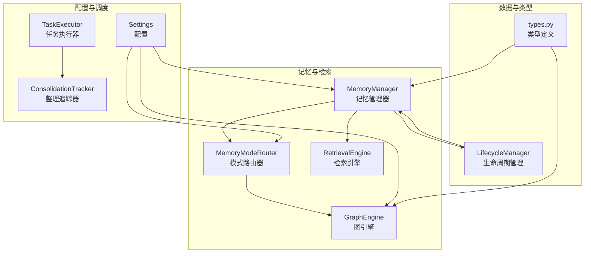
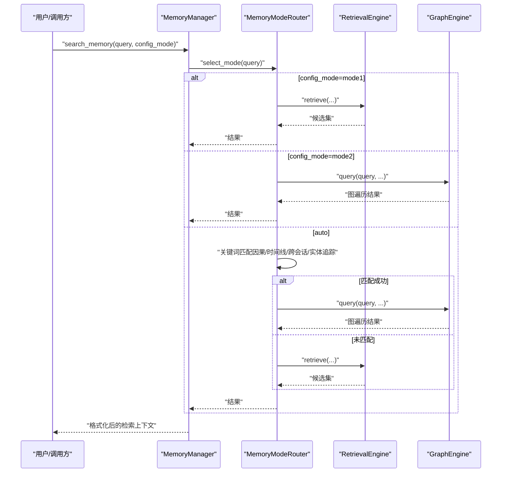
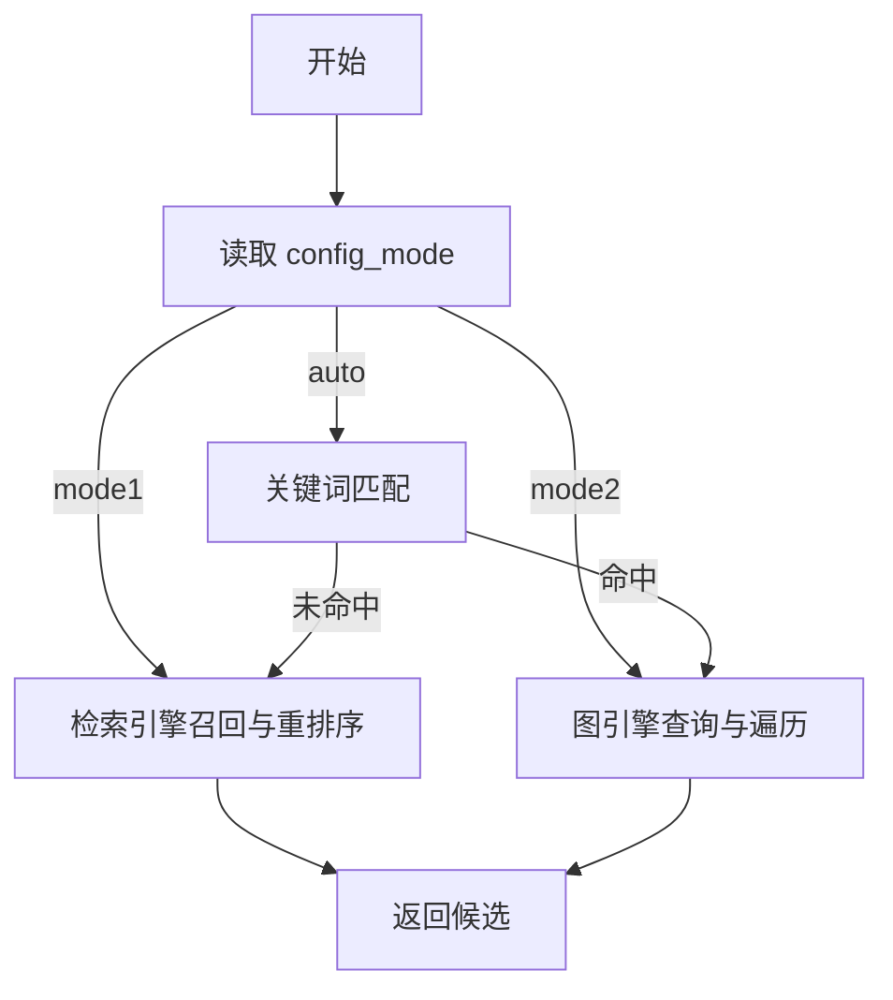
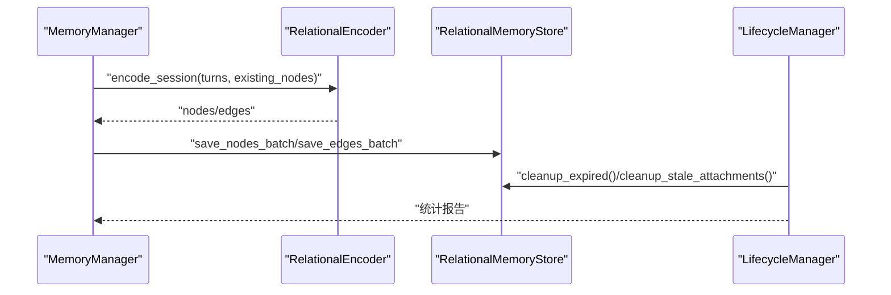
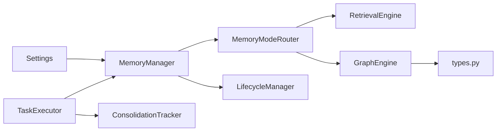

# 智能模式切换机制

<cite>
**本文引用的文件**
- [bridge.py](file://src/synapse/memory/relational/bridge.py)
- [graph_engine.py](file://src/synapse/memory/relational/graph_engine.py)
- [manager.py](file://src/synapse/memory/manager.py)
- [types.py](file://src/synapse/memory/types.py)
- [config.py](file://src/synapse/config.py)
- [lifecycle.py](file://src/synapse/memory/lifecycle.py)
- [consolidation_tracker.py](file://src/synapse/scheduler/consolidation_tracker.py)
- [executor.py](file://src/synapse/scheduler/executor.py)
</cite>

## 目录
1. [引言](#引言)
2. [项目结构](#项目结构)
3. [核心组件](#核心组件)
4. [架构总览](#架构总览)
5. [详细组件分析](#详细组件分析)
6. [依赖分析](#依赖分析)
7. [性能考量](#性能考量)
8. [故障排查指南](#故障排查指南)
9. [结论](#结论)
10. [附录](#附录)

## 引言
本文件围绕“智能模式切换机制”展开，系统性阐述两种记忆模式（模式1：碎片化语义记忆；模式2：关系型图谱记忆）的触发条件、切换算法、状态管理策略、决策逻辑、性能指标与资源消耗、数据迁移与一致性保障、回滚机制、配置选项与阈值、监控指标，以及调试与性能测试方法。目标是帮助开发者与运维人员在理解代码实现的基础上，安全、可控地使用与扩展该机制。

## 项目结构
与智能模式切换直接相关的代码主要分布在以下模块：
- 模式路由与检索：relational/bridge.py、memory/relational/graph_engine.py
- 记忆管理与模式状态：memory/manager.py、memory/types.py
- 配置与阈值：config.py
- 生命周期与一致性：memory/lifecycle.py、scheduler/consolidation_tracker.py、scheduler/executor.py

图表来源
- [bridge.py:34-120](file://src/synapse/memory/relational/bridge.py#L34-L120)
- [graph_engine.py:32-302](file://src/synapse/memory/relational/graph_engine.py#L32-L302)
- [manager.py:76-800](file://src/synapse/memory/manager.py#L76-L800)
- [config.py:268-291](file://src/synapse/config.py#L268-L291)
- [lifecycle.py:125-175](file://src/synapse/memory/lifecycle.py#L125-L175)
- [consolidation_tracker.py:20-45](file://src/synapse/scheduler/consolidation_tracker.py#L20-L45)
- [executor.py:634-682](file://src/synapse/scheduler/executor.py#L634-L682)

章节来源
- [bridge.py:1-120](file://src/synapse/memory/relational/bridge.py#L1-L120)
- [graph_engine.py:1-302](file://src/synapse/memory/relational/graph_engine.py#L1-L302)
- [manager.py:1-800](file://src/synapse/memory/manager.py#L1-L800)
- [config.py:268-291](file://src/synapse/config.py#L268-L291)
- [lifecycle.py:1-800](file://src/synapse/memory/lifecycle.py#L1-L800)
- [consolidation_tracker.py:1-45](file://src/synapse/scheduler/consolidation_tracker.py#L1-L45)
- [executor.py:622-682](file://src/synapse/scheduler/executor.py#L622-L682)

## 核心组件
- 模式路由器 MemoryModeRouter：根据查询特征在模式1与模式2之间进行路由，支持显式模式（mode1/mode2/auto）。
- 图引擎 GraphEngine：面向模式2的关系型检索与多维遍历，支持时间、因果、实体、动作、上下文等维度。
- 记忆管理器 MemoryManager：统一协调 v1/v2 存储、检索、提取、会话与模式状态；负责模式初始化与切换。
- 配置 Settings：提供 memory_mode、mdrm_* 等关键配置项。
- 生命周期管理 LifecycleManager：负责去重、衰减、LLM审查、经验合成等，确保一致性与质量。
- 调度与追踪：ConsolidationTracker 与 TaskExecutor 负责整理时间窗口与执行周期性任务。

章节来源
- [bridge.py:34-120](file://src/synapse/memory/relational/bridge.py#L34-L120)
- [graph_engine.py:32-302](file://src/synapse/memory/relational/graph_engine.py#L32-L302)
- [manager.py:76-800](file://src/synapse/memory/manager.py#L76-L800)
- [config.py:268-291](file://src/synapse/config.py#L268-L291)
- [lifecycle.py:125-175](file://src/synapse/memory/lifecycle.py#L125-L175)
- [consolidation_tracker.py:20-45](file://src/synapse/scheduler/consolidation_tracker.py#L20-L45)
- [executor.py:634-682](file://src/synapse/scheduler/executor.py#L634-L682)

## 架构总览
智能模式切换以“查询驱动 + 配置驱动”为核心，结合检索引擎与图引擎，实现按需路由与状态化管理。

图表来源
- [bridge.py:51-87](file://src/synapse/memory/relational/bridge.py#L51-L87)
- [graph_engine.py:38-112](file://src/synapse/memory/relational/graph_engine.py#L38-L112)
- [manager.py:665-672](file://src/synapse/memory/manager.py#L665-L672)

## 详细组件分析

### 模式路由器与切换算法
- 触发条件
  - 显式模式：config_mode=mode1/mode2/auto
  - 自动模式：基于查询关键词的启发式规则，匹配“因果/时间线/跨会话/实体追踪”等模式2触发词
- 切换算法
  - 模式1：通过检索引擎进行多路召回与重排序
  - 模式2：通过图引擎解析查询线索，种子节点发现，多维遍历，打分与裁剪
  - auto：先判定是否命中模式2触发词，命中则走模式2，否则走模式1
- 性能与资源
  - 模式1：零额外开销（仅检索），适合简单偏好/事实
  - 模式2：图遍历与多维打分，适合复杂推理与跨会话追踪

图表来源
- [bridge.py:51-87](file://src/synapse/memory/relational/bridge.py#L51-L87)
- [graph_engine.py:38-112](file://src/synapse/memory/relational/graph_engine.py#L38-L112)

章节来源
- [bridge.py:34-120](file://src/synapse/memory/relational/bridge.py#L34-L120)
- [graph_engine.py:32-302](file://src/synapse/memory/relational/graph_engine.py#L32-L302)

### 模式选择的决策逻辑
- 关键词规则
  - 因果类：为什么、原因、导致、根因、because、cause、reason、root cause
  - 时间线类：过程、经过、时间线、之前发生、上次、历史、timeline、previously、last time、history
  - 跨会话类：类似问题、以前怎么、之前也、上回、以前遇到、similar issue、done before
  - 实体追踪类：关于X的所有、X的完整记录、everything about、all records of
- 默认策略
  - 未命中任何触发词时，退回模式1（快速、零开销）

章节来源
- [bridge.py:16-31](file://src/synapse/memory/relational/bridge.py#L16-L31)
- [bridge.py:68-87](file://src/synapse/memory/relational/bridge.py#L68-L87)

### 模式切换过程中的状态管理
- 模式状态来源
  - 配置项 memory_mode（auto/mode1/mode2）
  - 会话结束时的模式选择（end_session 中读取）
- 模式初始化
  - 模式2（Relational Memory）采用惰性初始化，首次使用时才建立存储、编码器、图引擎与整合器
- 会话内状态
  - 记忆管理器维护当前会话、最近消息、引用记忆缓冲等，为检索与评分提供上下文

章节来源
- [config.py:268-291](file://src/synapse/config.py#L268-L291)
- [manager.py:665-672](file://src/synapse/memory/manager.py#L665-L672)
- [manager.py:625-663](file://src/synapse/memory/manager.py#L625-L663)

### 数据迁移、一致性与回滚
- 数据迁移
  - 会话结束时，模式2编码器将对话轮次编码为节点/边，批量写入关系型存储
  - 惰性初始化失败时，系统回退至模式1，确保功能可用
- 一致性保障
  - 生命周期管理器负责去重、衰减、LLM审查、经验合成，确保记忆质量与一致性
  - 向量索引同步：从SQLite重建，删除不在当前集合中的向量
- 回滚机制
  - 惰性初始化失败：记录日志并继续使用模式1
  - LLM审查批处理：出现连续高破坏性批时，系统跳过并记录警告，避免大规模误删
  - 附件清理：过期且无内容的附件定期清理，失败时记录错误并继续

图表来源
- [manager.py:770-800](file://src/synapse/memory/manager.py#L770-L800)
- [lifecycle.py:432-464](file://src/synapse/memory/lifecycle.py#L432-L464)

章节来源
- [manager.py:625-800](file://src/synapse/memory/manager.py#L625-L800)
- [lifecycle.py:125-195](file://src/synapse/memory/lifecycle.py#L125-L195)
- [lifecycle.py:432-500](file://src/synapse/memory/lifecycle.py#L432-L500)

### 性能指标评估与资源消耗
- 模式1
  - 检索成本：语义搜索 + 情节搜索 + 最近记忆 + 附件搜索 + LLM查询拆解
  - 排序权重：相关性×0.4 + 时效×0.2 + 重要性×0.2 + 访问频次×0.2
  - Token预算：可配置，避免超长输出
- 模式2
  - 查询解析：时间/因果/实体线索提取
  - 种子节点：FTS/实体/关键词/LIKE/时间范围
  - 多维遍历：按维度权重与跳数衰减打分
  - Token裁剪：按估计token数与limit控制输出规模
- 资源消耗
  - 模式1：CPU为主，内存占用低
  - 模式2：CPU+内存，图遍历与多维打分较重；向量索引重建与同步带来额外IO

章节来源
- [graph_engine.py:38-112](file://src/synapse/memory/relational/graph_engine.py#L38-L112)
- [retrieval.py:52-58](file://src/synapse/memory/retrieval.py#L52-L58)
- [retrieval.py:778-798](file://src/synapse/memory/retrieval.py#L778-L798)

### 切换策略的配置选项与阈值
- 关键配置
  - memory_mode：auto/mode1/mode2
  - mdrm_max_hops：图遍历最大跳数
  - mdrm_consolidation_enabled：是否启用关系型记忆整合
  - mdrm_backfill_on_first_enable：首次启用时回填历史数据
- 会话与整理
  - memory_consolidation_onboarding_days：新用户适应期天数
  - memory_consolidation_onboarding_interval_hours：适应期内整理间隔

章节来源
- [config.py:268-291](file://src/synapse/config.py#L268-L291)
- [config.py:258-267](file://src/synapse/config.py#L258-L267)

### 监控指标
- 整理追踪
  - ConsolidationTracker 记录整理时间窗口，确保“上次整理到当前时间”的增量处理
- 执行器
  - TaskExecutor 在每日任务中调用 MemoryManager 的 consolidate_daily，并记录结果
- 生命周期报告
  - LifecycleManager 返回处理统计：未归纳提取、去重、衰减、附件清理、LLM审查、经验合成等

章节来源
- [consolidation_tracker.py:20-45](file://src/synapse/scheduler/consolidation_tracker.py#L20-L45)
- [executor.py:634-682](file://src/synapse/scheduler/executor.py#L634-L682)
- [lifecycle.py:142-174](file://src/synapse/memory/lifecycle.py#L142-L174)

## 依赖分析
- 组件耦合
  - MemoryModeRouter 依赖检索引擎（模式1）与图引擎（模式2）
  - MemoryManager 统一协调 v1/v2 存储与检索，依赖配置与Brain
  - GraphEngine 依赖关系型存储与类型定义
- 外部依赖
  - 配置来源于 Settings，影响模式选择与图遍历参数
  - 调度器通过 TaskExecutor 驱动周期性整理

图表来源
- [config.py:268-291](file://src/synapse/config.py#L268-L291)
- [manager.py:76-130](file://src/synapse/memory/manager.py#L76-L130)
- [bridge.py:34-49](file://src/synapse/memory/relational/bridge.py#L34-L49)
- [graph_engine.py:32-36](file://src/synapse/memory/relational/graph_engine.py#L32-L36)
- [types.py:42-62](file://src/synapse/memory/types.py#L42-L62)
- [executor.py:634-682](file://src/synapse/scheduler/executor.py#L634-L682)
- [consolidation_tracker.py:20-31](file://src/synapse/scheduler/consolidation_tracker.py#L20-L31)

## 性能考量
- 模式1
  - 适合高频、低复杂度查询，延迟低、资源占用少
  - 可通过 token_budget 与排序权重控制输出规模
- 模式2
  - 适合复杂推理、跨会话追踪与因果分析
  - mdrm_max_hops 控制遍历深度，避免过度计算
  - 建议在高负载场景下谨慎启用 auto 模式，或通过关键词规则引导到模式1
- 生命周期与索引
  - 定期去重与衰减降低存储压力
  - 向量索引重建与同步需注意IO与锁竞争

## 故障排查指南
- 模式2初始化失败
  - 现象：日志显示初始化跳过，继续使用模式1
  - 排查：检查数据库连接、Brain可用性、语言设置
- LLM审查异常
  - 现象：连续破坏性批被跳过，剩余记忆保持不变
  - 排查：检查LLM端点可用性、输出格式、错误计数
- 附件清理失败
  - 现象：清理失败并记录错误
  - 排查：检查数据库锁、权限与过期策略
- 整理任务未执行
  - 现象：ConsolidationTracker 未记录时间窗口
  - 排查：检查调度器配置、TaskExecutor 调用链

章节来源
- [manager.py:661-663](file://src/synapse/memory/manager.py#L661-L663)
- [lifecycle.py:743-750](file://src/synapse/memory/lifecycle.py#L743-L750)
- [lifecycle.py:496-500](file://src/synapse/memory/lifecycle.py#L496-L500)
- [consolidation_tracker.py:33-45](file://src/synapse/scheduler/consolidation_tracker.py#L33-L45)
- [executor.py:634-682](file://src/synapse/scheduler/executor.py#L634-L682)

## 结论
智能模式切换机制通过“查询驱动 + 配置驱动”，在模式1（快速检索）与模式2（多维图谱）之间实现高效路由。其设计强调：
- 明确的触发条件与可解释的关键词规则
- 状态化管理与惰性初始化，兼顾可用性与性能
- 生命周期与一致性保障，确保长期可用
- 可配置的阈值与监控指标，便于运维与调优

## 附录
- 调试技巧
  - 启用详细日志，观察模式选择与初始化路径
  - 使用小样本查询验证关键词规则是否命中
  - 检查 ConsolidationTracker 的时间窗口与 TaskExecutor 的执行结果
- 性能测试方法
  - 对比模式1/2在相同查询下的延迟与输出规模
  - 调整 mdrm_max_hops 与 token_budget，评估吞吐与准确性权衡
  - 压测生命周期任务，关注去重、衰减与索引重建的资源占用