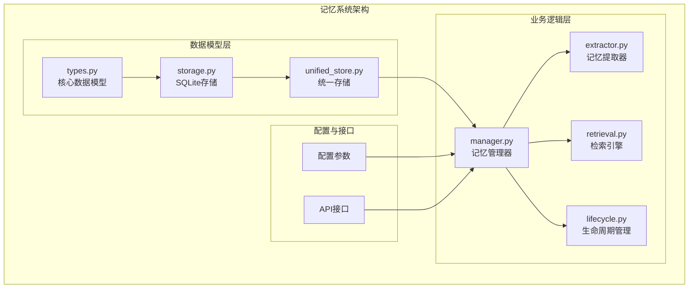
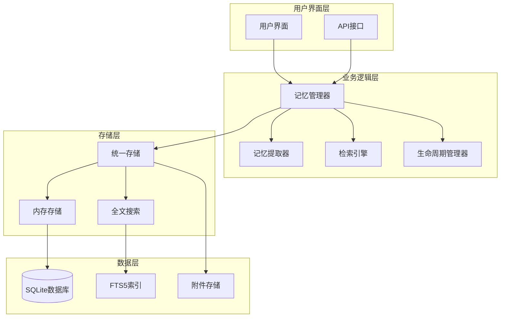
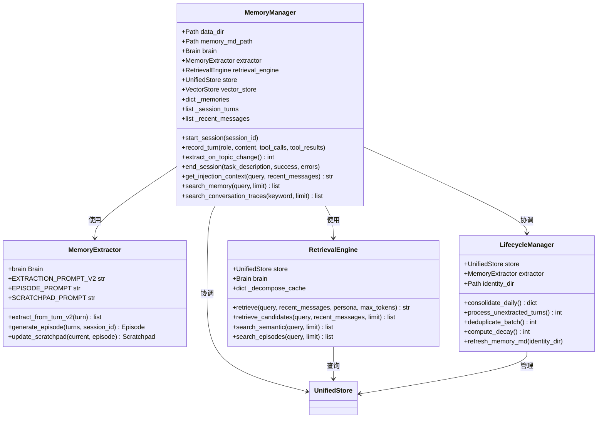
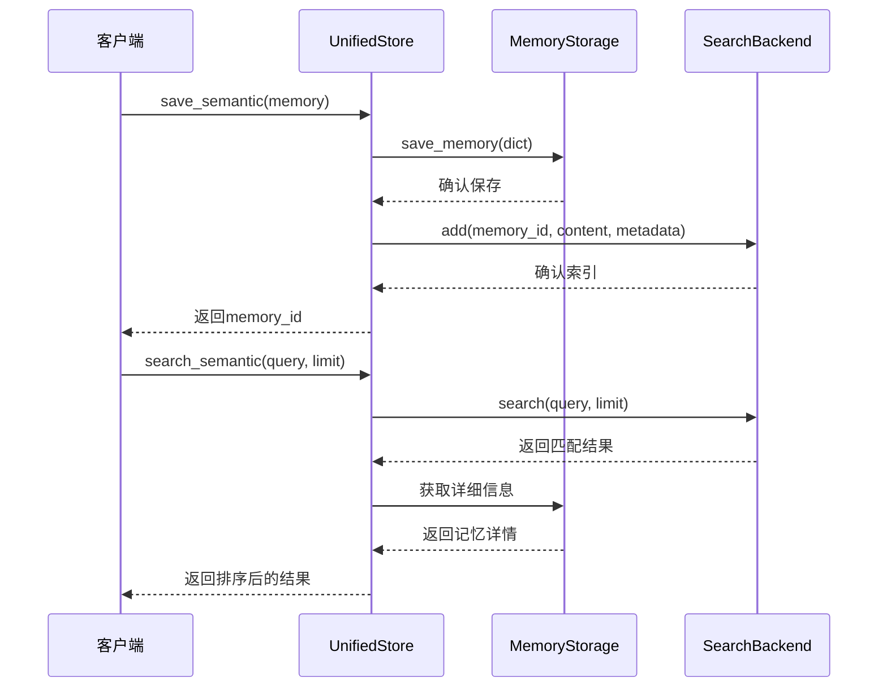
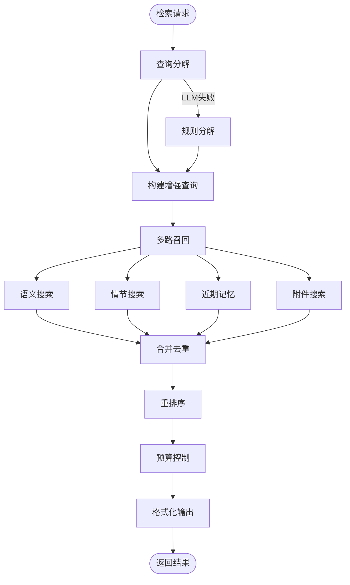
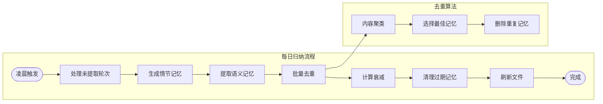
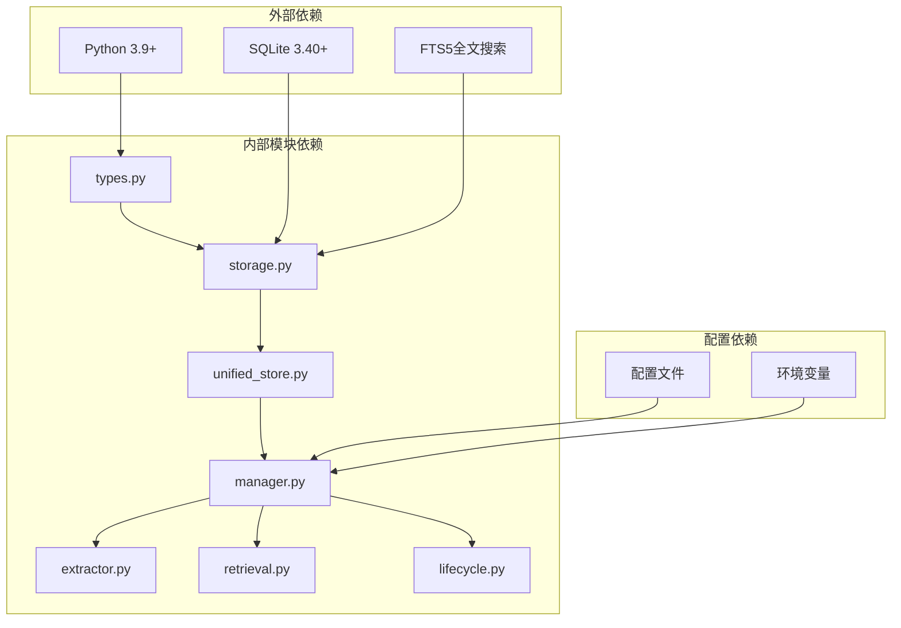

# 片段化记忆模式

<cite>
**本文档引用的文件**
- [memory_architecture.md](file://docs/memory_architecture.md)
- [memory-redesign.md](file://docs/architecture/memory-redesign.md)
- [types.py](file://src/synapse/memory/types.py)
- [manager.py](file://src/synapse/memory/manager.py)
- [storage.py](file://src/synapse/memory/storage.py)
- [unified_store.py](file://src/synapse/memory/unified_store.py)
- [lifecycle.py](file://src/synapse/memory/lifecycle.py)
- [extractor.py](file://src/synapse/memory/extractor.py)
- [retrieval.py](file://src/synapse/memory/retrieval.py)
</cite>

## 目录
1. [简介](#简介)
2. [项目结构](#项目结构)
3. [核心组件](#核心组件)
4. [架构概览](#架构概览)
5. [详细组件分析](#详细组件分析)
6. [依赖分析](#依赖分析)
7. [性能考虑](#性能考虑)
8. [故障排除指南](#故障排除指南)
9. [结论](#结论)
10. [附录](#附录)

## 简介

片段化记忆模式是 Synapse 记忆系统的重构设计方案，采用三层结构设计：短期记忆、长期记忆和全局记忆。该模式通过语义记忆（SemanticMemory）、情节记忆（Episode）和工作记忆草稿本（Scratchpad）三个核心数据模型，实现了从感觉记忆到长期记忆的认知科学映射。

该系统的核心创新包括：
- **三层记忆架构**：短期记忆（TRANSIENT/SHORT_TERM）、长期记忆（LONG_TERM/PERMANENT）和全局记忆（GLOBAL）
- **实体-属性结构**：语义记忆采用 subject/predicate/content 的三元组结构
- **智能去重机制**：基于内容相似度和实体匹配的双重去重
- **生命周期管理**：自动衰减、归档和清理机制
- **多路召回检索**：语义搜索、情节搜索、时间搜索和附件搜索的综合检索引擎

## 项目结构

记忆系统采用模块化设计，主要包含以下核心模块：



**图表来源**
- [types.py:148-436](file://src/synapse/memory/types.py#L148-L436)
- [storage.py:55-100](file://src/synapse/memory/storage.py#L55-L100)
- [unified_store.py:29-60](file://src/synapse/memory/unified_store.py#L29-L60)
- [manager.py:76-130](file://src/synapse/memory/manager.py#L76-L130)

**章节来源**
- [memory_architecture.md:1-310](file://docs/memory_architecture.md#L1-L310)
- [memory-redesign.md:133-220](file://docs/architecture/memory-redesign.md#L133-L220)

## 核心组件

### 数据模型定义

记忆系统的核心数据模型包括三个主要类：

#### 语义记忆（SemanticMemory）
语义记忆是记忆系统的核心，采用实体-属性结构，支持更新和演化：

| 字段名 | 类型 | 描述 | 默认值 |
|--------|------|------|--------|
| id | str | 唯一标识符 | 自动生成 |
| type | MemoryType | 记忆类型 | FACT |
| priority | MemoryPriority | 优先级 | SHORT_TERM |
| content | str | 记忆内容 | 空字符串 |
| subject | str | 实体主语 | 空字符串 |
| predicate | str | 属性关系 | 空字符串 |
| importance_score | float | 重要性分数 | 0.5 |
| confidence | float | 置信度 | 0.5 |
| access_count | int | 访问次数 | 0 |
| decay_rate | float | 衰减速率 | 0.1 |
| expires_at | datetime | 过期时间 | None |
| scope | str | 作用域 | "global" |
| scope_owner | str | 作用域所有者 | 空字符串 |
| agent_id | str | Agent标识 | 空字符串 |

#### 情节记忆（Episode）
情节记忆记录完整的交互故事，包含目标、结果和工具使用：

| 字段名 | 类型 | 描述 | 默认值 |
|--------|------|------|--------|
| id | str | 唯一标识符 | UUID |
| session_id | str | 会话标识 | 空字符串 |
| summary | str | 摘要 | 空字符串 |
| goal | str | 目标 | 空字符串 |
| outcome | str | 结果 | "completed" |
| started_at | datetime | 开始时间 | 当前时间 |
| ended_at | datetime | 结束时间 | 当前时间 |
| action_nodes | list[ActionNode] | 动作节点列表 | 空列表 |
| entities | list[str] | 涉及实体 | 空列表 |
| tools_used | list[str] | 使用工具 | 空列表 |
| linked_memory_ids | list[str] | 关联记忆ID | 空列表 |
| tags | list[str] | 标签 | 空列表 |
| importance_score | float | 重要性分数 | 0.5 |
| access_count | int | 访问次数 | 0 |
| source | str | 来源 | "session_end" |

#### 工作记忆草稿本（Scratchpad）
跨会话持久化的工作记忆空间：

| 字段名 | 类型 | 描述 | 默认值 |
|--------|------|------|--------|
| user_id | str | 用户标识 | "default" |
| content | str | 内容 | 空字符串 |
| active_projects | list[str] | 活跃项目 | 空列表 |
| current_focus | str | 当前关注点 | 空字符串 |
| open_questions | list[str] | 未解决问题 | 空列表 |
| next_steps | list[str] | 下一步计划 | 空列表 |
| updated_at | datetime | 更新时间 | 当前时间 |

**章节来源**
- [types.py:148-436](file://src/synapse/memory/types.py#L148-L436)

### 记忆类型枚举

系统定义了多种记忆类型和优先级：

#### 记忆类型（MemoryType）
- FACT：事实信息
- PREFERENCE：用户偏好
- SKILL：成功模式
- RULE：规则约束
- ERROR：错误教训
- PERSONA_TRAIT：人格特质
- EXPERIENCE：任务经验

#### 记忆优先级（MemoryPriority）
- TRANSIENT：瞬时记忆（1天）
- SHORT_TERM：短期记忆（3天）
- LONG_TERM：长期记忆（30天）
- PERMANENT：永久记忆（永不过期）

#### 记忆作用域（MemoryScope）
- GLOBAL：全局共享
- AGENT：Agent私有
- SESSION：会话私有

**章节来源**
- [types.py:42-70](file://src/synapse/memory/types.py#L42-L70)

## 架构概览

记忆系统采用分层架构设计，实现了从数据存储到业务逻辑的清晰分离：



**图表来源**
- [memory_architecture.md:181-224](file://docs/memory_architecture.md#L181-L224)
- [unified_store.py:29-60](file://src/synapse/memory/unified_store.py#L29-L60)

系统的核心特点是采用 SQLite 作为唯一真相源，所有数据首先写入 SQLite，然后通过触发器自动同步到 FTS5 全文索引中。这种设计确保了数据的一致性和可靠性。

**章节来源**
- [memory_architecture.md:1-310](file://docs/memory_architecture.md#L1-L310)
- [storage.py:55-100](file://src/synapse/memory/storage.py#L55-L100)

## 详细组件分析

### 记忆管理器（MemoryManager）

MemoryManager 是记忆系统的核心协调器，负责协调各个子组件的工作：



**图表来源**
- [manager.py:76-130](file://src/synapse/memory/manager.py#L76-L130)
- [extractor.py:35-80](file://src/synapse/memory/extractor.py#L35-L80)
- [retrieval.py:49-80](file://src/synapse/memory/retrieval.py#L49-L80)
- [lifecycle.py:125-140](file://src/synapse/memory/lifecycle.py#L125-L140)

MemoryManager 的主要职责包括：
1. **会话管理**：跟踪当前会话状态和对话轮次
2. **实时提取**：在对话过程中异步提取记忆
3. **主题切换处理**：在话题切换时提取相关记忆
4. **会话结束处理**：生成情节记忆和草稿本更新
5. **检索协调**：协调各种检索请求的处理

**章节来源**
- [manager.py:76-800](file://src/synapse/memory/manager.py#L76-L800)

### 统一存储层（UnifiedStore）

UnifiedStore 作为存储层的统一接口，协调 SQLite 主存储和各种搜索后端：



**图表来源**
- [unified_store.py:65-105](file://src/synapse/memory/unified_store.py#L65-L105)
- [storage.py:484-530](file://src/synapse/memory/storage.py#L484-L530)

统一存储层的设计特点：
1. **双写一致性**：先写 SQLite 再写搜索后端
2. **自动同步**：通过触发器自动维护 FTS5 索引
3. **降级机制**：搜索后端不可用时自动回退到 FTS5
4. **作用域隔离**：支持全局、Agent 和会话级别的记忆隔离

**章节来源**
- [unified_store.py:29-389](file://src/synapse/memory/unified_store.py#L29-L389)
- [storage.py:162-478](file://src/synapse/memory/storage.py#L162-L478)

### 检索引擎（RetrievalEngine）

检索引擎实现了多路召回和重排序的复杂逻辑：



**图表来源**
- [retrieval.py:81-122](file://src/synapse/memory/retrieval.py#L81-L122)
- [retrieval.py:230-251](file://src/synapse/memory/retrieval.py#L230-L251)

检索引擎的核心算法包括：
1. **查询分解**：使用 LLM 将自然语言查询转换为关键词
2. **多路召回**：同时从语义、情节、近期和附件四个维度搜索
3. **合并去重**：消除重复的结果
4. **重排序**：基于相关性、时效性、重要性和访问频率进行综合排序
5. **预算控制**：根据 token 预算限制返回结果数量

**章节来源**
- [retrieval.py:49-846](file://src/synapse/memory/retrieval.py#L49-L846)

### 生命周期管理（LifecycleManager）

生命周期管理器负责记忆的长期维护和优化：



**图表来源**
- [memory_architecture.md:255-273](file://docs/memory_architecture.md#L255-L273)
- [lifecycle.py:142-174](file://src/synapse/memory/lifecycle.py#L142-L174)

生命周期管理器的主要功能：
1. **批量处理**：处理未提取的对话轮次
2. **去重优化**：使用 O(n log n) 聚类算法进行批量去重
3. **衰减管理**：根据访问频率和时间计算记忆衰减
4. **文件刷新**：更新 MEMORY.md 和 USER.md 文件
5. **附件清理**：清理过期的附件文件

**章节来源**
- [lifecycle.py:125-800](file://src/synapse/memory/lifecycle.py#L125-L800)

## 依赖分析

记忆系统的依赖关系呈现清晰的分层结构：



**图表来源**
- [memory_architecture.md:297-310](file://docs/memory_architecture.md#L297-L310)
- [storage.py:32-50](file://src/synapse/memory/storage.py#L32-L50)

系统的关键依赖特点：
1. **最小外部依赖**：仅依赖 SQLite 和 FTS5，无第三方包依赖
2. **模块化设计**：各模块间依赖关系清晰，耦合度低
3. **向后兼容**：支持从旧版本数据格式的迁移
4. **可插拔架构**：搜索后端可替换，支持多种实现

**章节来源**
- [memory_architecture.md:296-310](file://docs/memory_architecture.md#L296-L310)

## 性能考虑

### 存储性能优化

1. **SQLite WAL 模式**：启用预写日志模式提高并发性能
2. **批量操作**：支持批量插入和更新减少数据库往返
3. **索引优化**：为常用查询字段建立复合索引
4. **内存缓存**：使用进程级单例模式缓存存储实例

### 搜索性能优化

1. **FTS5 全文搜索**：使用 SQLite 内置全文搜索，零外部依赖
2. **查询缓存**：缓存查询分解结果减少 LLM 调用
3. **分页查询**：限制查询结果数量避免内存溢出
4. **降级机制**：搜索后端失败时自动回退到 FTS5

### 内存管理

1. **连接池**：使用线程安全的连接池管理数据库连接
2. **锁机制**：使用读写锁分离提高并发性能
3. **垃圾回收**：及时清理不再使用的对象引用
4. **资源监控**：监控内存使用情况避免泄漏

## 故障排除指南

### 常见问题及解决方案

#### 数据库锁定错误
**症状**：出现 OperationalError: database is locked
**原因**：多个进程同时访问数据库
**解决方案**：
1. 检查是否存在多个进程同时访问数据库
2. 增加 busy_timeout 设置
3. 使用连接池管理数据库连接

#### 搜索后端不可用
**症状**：检索功能异常或返回空结果
**原因**：ChromaDB 或 API 搜索服务不可用
**解决方案**：
1. 检查搜索后端配置
2. 自动降级到 FTS5 后端
3. 验证网络连接和 API 密钥

#### 记忆提取失败
**症状**：对话轮次无法提取为记忆
**原因**：LLM 服务不可用或响应格式错误
**解决方案**：
1. 检查 LLM 服务状态
2. 查看提取器日志
3. 使用重试队列机制

#### 内存泄漏
**症状**：内存使用持续增长
**原因**：对象引用未正确释放
**解决方案**：
1. 检查循环引用
2. 使用弱引用避免循环
3. 及时清理缓存数据

**章节来源**
- [storage.py:51-53](file://src/synapse/memory/storage.py#L51-L53)
- [manager.py:436-476](file://src/synapse/memory/manager.py#L436-L476)
- [lifecycle.py:99-123](file://src/synapse/memory/lifecycle.py#L99-L123)

## 结论

片段化记忆模式通过三层结构设计和智能去重机制，实现了高效、可靠的记忆管理系统。该系统的核心优势包括：

1. **认知科学映射**：从感觉记忆到长期记忆的完整映射
2. **智能去重**：基于内容相似度和实体匹配的双重去重
3. **生命周期管理**：自动衰减、归档和清理机制
4. **性能优化**：SQLite 作为唯一真相源，FTS5 全文搜索
5. **可扩展性**：模块化设计支持功能扩展和后端替换

该系统为多模态 AI 应用提供了坚实的记忆基础设施，支持复杂的对话理解和长期知识管理需求。

## 附录

### 配置参数说明

| 参数名 | 类型 | 默认值 | 描述 |
|--------|------|--------|------|
| search_backend | str | "fts5" | 搜索后端类型（fts5/chromadb/api_embedding） |
| embedding_model | str | None | 向量嵌入模型名称 |
| embedding_device | str | "cpu" | 嵌入模型运行设备 |
| model_download_source | str | "auto" | 模型下载源 |
| agent_id | str | "" | Agent 标识符 |
| memory_md_path | Path | None | MEMORY.md 文件路径 |

### 使用示例

#### 基本记忆提取
```python
# 创建记忆管理器
mm = MemoryManager(
    data_dir="data/memory",
    memory_md_path="identity/MEMORY.md"
)

# 记录对话轮次
mm.record_turn(
    role="user",
    content="请帮我设置通知偏好",
    tool_calls=[],
    tool_results=[]
)

# 检索相关记忆
context = mm.get_injection_context(
    query="用户通知偏好设置",
    recent_messages=[]
)
```

#### 情节记忆生成
```python
# 会话结束时生成情节
mm.end_session(
    task_description="设置用户通知偏好",
    success=True
)
```

#### 自定义检索
```python
# 自定义检索参数
results = mm.search_memory(
    query="用户通知偏好",
    limit=10,
    filter_type="preference"
)
```

### 查询优化技巧

1. **使用作用域过滤**：通过 scope 和 scope_owner 参数限制搜索范围
2. **合理设置 limit**：根据应用场景调整返回结果数量
3. **利用标签过滤**：使用 tags 字段进行细粒度过滤
4. **缓存查询结果**：对频繁查询的结果进行缓存

### 数据迁移方案

系统支持从旧版本数据格式的平滑迁移：

1. **自动迁移**：启动时自动检测并迁移旧版本数据
2. **双写兼容**：新旧数据格式同时写入确保数据安全
3. **回滚机制**：迁移失败时自动回滚到旧版本
4. **完整性检查**：迁移完成后验证数据完整性

**章节来源**
- [manager.py:170-296](file://src/synapse/memory/manager.py#L170-L296)
- [storage.py:120-161](file://src/synapse/memory/storage.py#L120-L161)