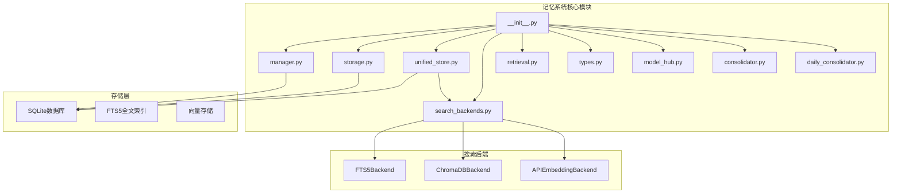
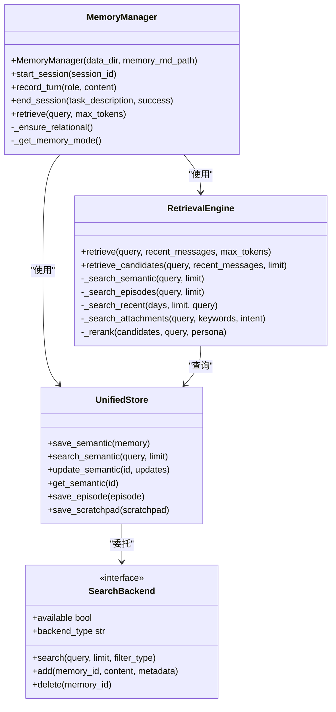
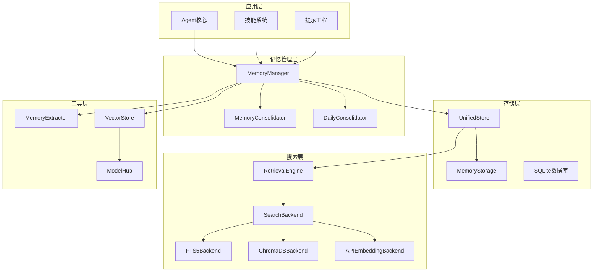
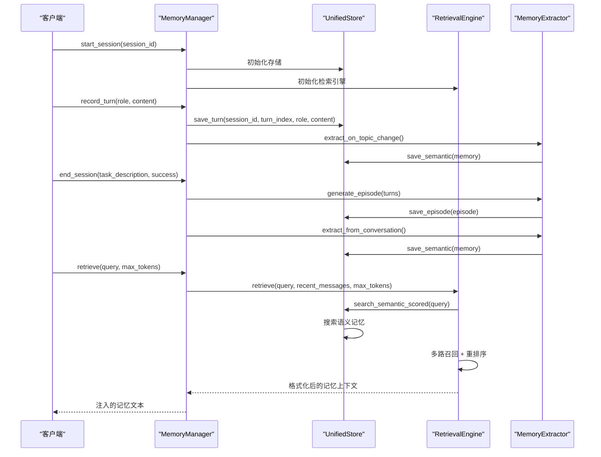
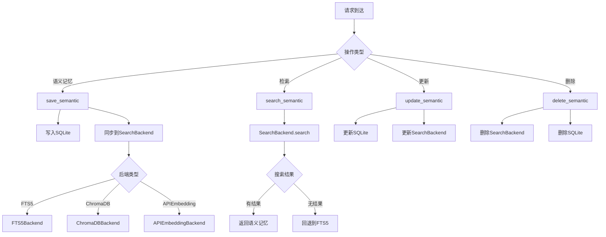
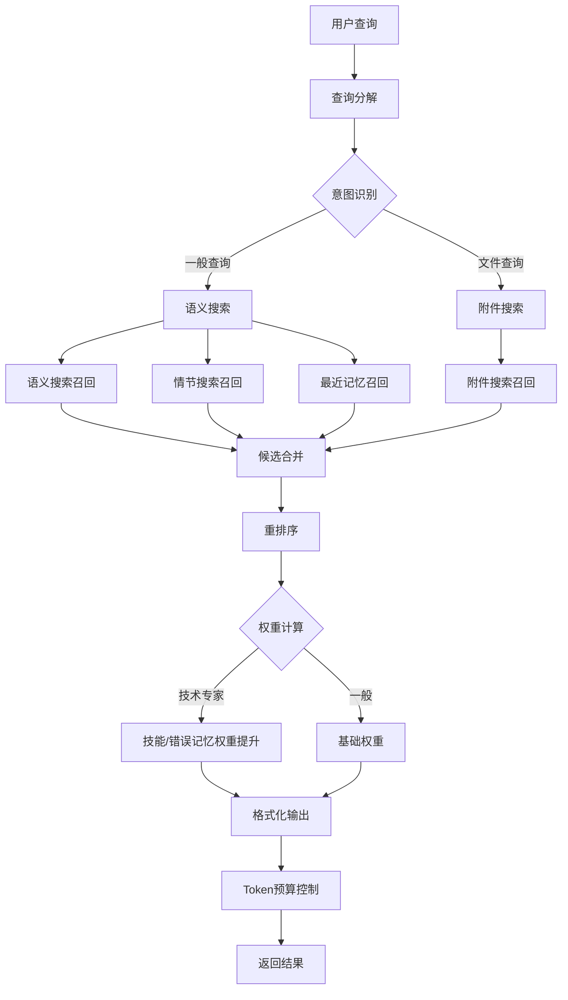
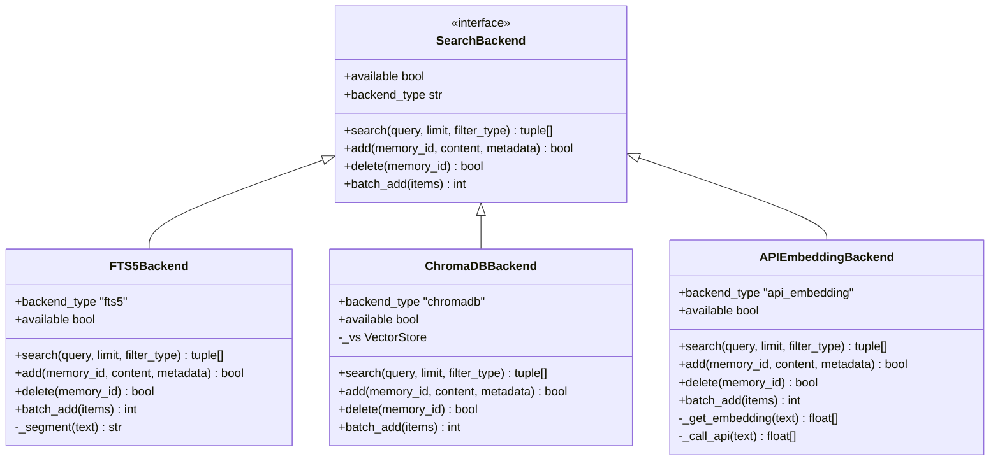
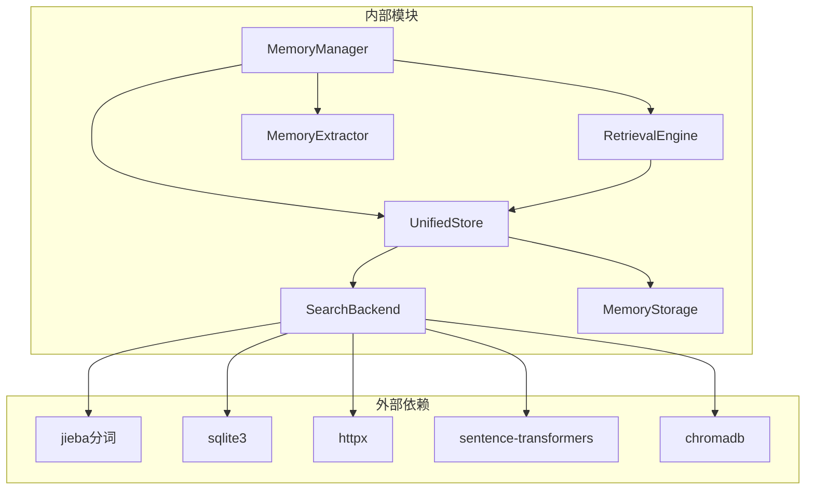

# 记忆管理系统

<cite>
**本文档引用的文件**
- [memory/__init__.py](file://src/synapse/memory/__init__.py)
- [memory/manager.py](file://src/synapse/memory/manager.py)
- [memory/storage.py](file://src/synapse/memory/storage.py)
- [memory/unified_store.py](file://src/synapse/memory/unified_store.py)
- [memory/search_backends.py](file://src/synapse/memory/search_backends.py)
- [memory/retrieval.py](file://src/synapse/memory/retrieval.py)
- [memory/types.py](file://src/synapse/memory/types.py)
- [memory/model_hub.py](file://src/synapse/memory/model_hub.py)
- [memory/consolidator.py](file://src/synapse/memory/consolidator.py)
- [memory/daily_consolidator.py](file://src/synapse/memory/daily_consolidator.py)
</cite>

## 目录
1. [简介](#简介)
2. [项目结构](#项目结构)
3. [核心组件](#核心组件)
4. [架构概览](#架构概览)
5. [详细组件分析](#详细组件分析)
6. [依赖关系分析](#依赖关系分析)
7. [性能考虑](#性能考虑)
8. [故障排除指南](#故障排除指南)
9. [结论](#结论)
10. [附录](#附录)

## 简介

记忆管理系统是 Synapse 平台的核心基础设施，负责管理智能体的长期记忆、短期记忆和工作记忆。该系统采用双模式记忆架构设计，支持传统模式和关系型图谱模式两种记忆处理方式。

系统的核心设计理念包括：
- **双模式架构**：支持传统语义记忆和关系型图谱记忆两种模式
- **三层存储结构**：语义记忆、情节记忆、工作记忆草稿本的层次化组织
- **智能检索引擎**：多路召回 + 重排序的混合检索策略
- **可扩展搜索后端**：支持 FTS5、ChromaDB、API Embedding 等多种搜索方式
- **生命周期管理**：完整的记忆创建、更新、衰减、删除生命周期

## 项目结构

记忆管理系统位于 `src/synapse/memory/` 目录下，采用模块化设计，每个核心功能都有独立的模块：



**图表来源**
- [memory/__init__.py:1-67](file://src/synapse/memory/__init__.py#L1-L67)
- [memory/manager.py:76-160](file://src/synapse/memory/manager.py#L76-L160)
- [memory/storage.py:55-100](file://src/synapse/memory/storage.py#L55-L100)

**章节来源**
- [memory/__init__.py:1-67](file://src/synapse/memory/__init__.py#L1-L67)

## 核心组件

### 双模式记忆架构

系统支持两种记忆处理模式：

1. **传统模式（Mode 1）**：基于语义记忆的线性存储
2. **关系型图谱模式（Mode 2）**：基于实体-关系-属性的图谱存储



**图表来源**
- [memory/manager.py:76-160](file://src/synapse/memory/manager.py#L76-L160)
- [memory/unified_store.py:29-60](file://src/synapse/memory/unified_store.py#L29-L60)
- [memory/retrieval.py:49-80](file://src/synapse/memory/retrieval.py#L49-L80)

### 三层存储结构

系统采用三层存储架构：

1. **语义记忆层**：实体-属性结构的记忆存储
2. **情节记忆层**：完整的交互故事记录
3. **工作记忆层**：跨会话持久化的工作草稿本

**章节来源**
- [memory/types.py:147-256](file://src/synapse/memory/types.py#L147-L256)
- [memory/types.py:302-370](file://src/synapse/memory/types.py#L302-L370)
- [memory/types.py:391-426](file://src/synapse/memory/types.py#L391-L426)

## 架构概览

记忆系统的整体架构采用分层设计，确保高内聚低耦合：



**图表来源**
- [memory/manager.py:76-135](file://src/synapse/memory/manager.py#L76-L135)
- [memory/unified_store.py:29-60](file://src/synapse/memory/unified_store.py#L29-L60)
- [memory/retrieval.py:49-80](file://src/synapse/memory/retrieval.py#L49-L80)

## 详细组件分析

### MemoryManager - 记忆管理器

MemoryManager 是记忆系统的核心协调器，负责管理整个记忆生命周期：



**图表来源**
- [memory/manager.py:318-475](file://src/synapse/memory/manager.py#L318-L475)
- [memory/manager.py:674-800](file://src/synapse/memory/manager.py#L674-L800)
- [memory/retrieval.py:81-122](file://src/synapse/memory/retrieval.py#L81-L122)

MemoryManager 的主要职责包括：

1. **会话管理**：跟踪对话状态，管理 turn 缓冲区
2. **记忆提取**：异步提取对话中的重要信息
3. **检索协调**：协调多种检索方式的使用
4. **模式切换**：根据配置在不同记忆模式间切换

**章节来源**
- [memory/manager.py:76-160](file://src/synapse/memory/manager.py#L76-L160)
- [memory/manager.py:318-475](file://src/synapse/memory/manager.py#L318-L475)

### UnifiedStore - 统一存储层

UnifiedStore 作为存储层的统一入口，协调 SQLite 主存储和各种搜索后端：



**图表来源**
- [memory/unified_store.py:65-152](file://src/synapse/memory/unified_store.py#L65-L152)
- [memory/unified_store.py:180-225](file://src/synapse/memory/unified_store.py#L180-L225)

UnifiedStore 的关键特性：

1. **主存储一致性**：SQLite 作为唯一真相源，确保数据一致性
2. **搜索后端抽象**：统一的搜索接口，支持多种后端实现
3. **自动降级**：当首选后端不可用时自动回退到 FTS5
4. **批量操作**：支持批量写入和查询优化

**章节来源**
- [memory/unified_store.py:29-60](file://src/synapse/memory/unified_store.py#L29-L60)
- [memory/unified_store.py:65-152](file://src/synapse/memory/unified_store.py#L65-L152)

### RetrievalEngine - 检索引擎

检索引擎实现了多路召回和重排序的混合检索策略：



**图表来源**
- [memory/retrieval.py:81-150](file://src/synapse/memory/retrieval.py#L81-L150)
- [memory/retrieval.py:155-196](file://src/synapse/memory/retrieval.py#L155-L196)
- [memory/retrieval.py:230-276](file://src/synapse/memory/retrieval.py#L230-L276)

检索引擎的核心算法：

1. **查询分解**：使用 LLM 将自然语言转换为搜索关键词
2. **多路召回**：同时执行语义搜索、情节搜索、最近记忆搜索、附件搜索
3. **重排序**：基于相关性、时效性、重要性、访问频率进行综合评分
4. **格式化**：将结果格式化为适合注入系统提示的文本

**章节来源**
- [memory/retrieval.py:49-80](file://src/synapse/memory/retrieval.py#L49-L80)
- [memory/retrieval.py:230-276](file://src/synapse/memory/retrieval.py#L230-L276)

### SearchBackend - 搜索后端抽象

系统提供了三种可插拔的搜索后端实现：



**图表来源**
- [memory/search_backends.py:29-53](file://src/synapse/memory/search_backends.py#L29-L53)
- [memory/search_backends.py:60-125](file://src/synapse/memory/search_backends.py#L60-L125)
- [memory/search_backends.py:132-181](file://src/synapse/memory/search_backends.py#L132-L181)
- [memory/search_backends.py:188-352](file://src/synapse/memory/search_backends.py#L188-L352)

各后端的特点：

1. **FTS5Backend**：SQLite 内置全文搜索，零外部依赖，适合中小规模数据
2. **ChromaDBBackend**：本地向量搜索，支持大规模向量存储和相似度搜索
3. **APIEmbeddingBackend**：在线嵌入 API，支持云端向量服务，需要网络连接

**章节来源**
- [memory/search_backends.py:29-53](file://src/synapse/memory/search_backends.py#L29-L53)
- [memory/search_backends.py:60-125](file://src/synapse/memory/search_backends.py#L60-L125)

### MemoryTypes - 记忆类型定义

系统定义了多种记忆类型，支持不同的记忆处理策略：

| 记忆类型 | 描述 | 用途 |
|---------|------|-----|
| FACT | 事实记忆 | 基础知识和事实信息 |
| PREFERENCE | 偏好记忆 | 用户偏好和倾向 |
| SKILL | 技能记忆 | 可复用的操作技能 |
| RULE | 规则记忆 | 行为准则和约束条件 |
| ERROR | 错误记忆 | 失败经验和教训 |
| PERSONA_TRAIT | 人格特征 | 个性化的沟通特征 |
| EXPERIENCE | 经验记忆 | 任务执行的经验总结 |

**章节来源**
- [memory/types.py:42-53](file://src/synapse/memory/types.py#L42-L53)
- [memory/types.py:147-256](file://src/synapse/memory/types.py#L147-L256)

## 依赖关系分析

记忆系统的依赖关系清晰，遵循单一职责原则：



**图表来源**
- [memory/search_backends.py:109-124](file://src/synapse/memory/search_backends.py#L109-L124)
- [memory/storage.py:84-100](file://src/synapse/memory/storage.py#L84-L100)

**章节来源**
- [memory/manager.py:32-45](file://src/synapse/memory/manager.py#L32-L45)
- [memory/unified_store.py:17-24](file://src/synapse/memory/unified_store.py#L17-L24)

## 性能考虑

### 存储性能优化

1. **SQLite 配置优化**
   - WAL 日志模式提高并发性能
   - NORMAL 同步模式平衡性能和安全性
   - 外键约束启用确保数据完整性

2. **索引策略**
   - 多列复合索引支持复杂查询
   - FTS5 全文索引提供高效的文本搜索
   - 向量索引支持相似度搜索

3. **内存管理**
   - 进程级存储实例注册减少内存占用
   - 线程安全锁机制避免并发冲突
   - 批量操作减少数据库往返

### 搜索性能优化

1. **查询缓存**
   - 查询分解结果缓存避免重复计算
   - 模型加载源探测缓存
   - 搜索结果临时缓存

2. **降级策略**
   - 搜索后端不可用时自动回退到 FTS5
   - 向量搜索失败时使用字符串匹配
   - API 调用失败时使用本地缓存

3. **资源限制**
   - Token 预算控制防止输出过长
   - 搜索结果数量限制避免性能问题
   - 超时机制防止长时间阻塞

**章节来源**
- [memory/storage.py:84-100](file://src/synapse/memory/storage.py#L84-L100)
- [memory/retrieval.py:74-80](file://src/synapse/memory/retrieval.py#L74-L80)
- [memory/model_hub.py:82-148](file://src/synapse/memory/model_hub.py#L82-L148)

## 故障排除指南

### 常见问题及解决方案

1. **数据库锁定错误**
   - 症状：`OperationalError: database is locked`
   - 解决方案：增加 `busy_timeout` 参数，使用进程级存储实例

2. **向量搜索失败**
   - 症状：ChromaDB 连接超时
   - 解决方案：检查向量存储配置，回退到 FTS5 后端

3. **模型下载失败**
   - 症状：HuggingFace 模型下载超时
   - 解决方案：使用 ModelHub 的多源下载，配置合适的超时参数

4. **搜索结果为空**
   - 症状：检索引擎返回空结果
   - 解决方案：检查查询分解是否正确，验证搜索后端可用性

### 调试技巧

1. **启用详细日志**
   ```python
   import logging
   logging.getLogger("synapse.memory").setLevel(logging.DEBUG)
   ```

2. **监控存储状态**
   ```python
   stats = memory_manager.store.get_stats()
   print(f"Memory count: {stats['memory_count']}")
   print(f"Search backend: {stats['search_backend']}")
   print(f"Available: {stats['search_available']}")
   ```

3. **检查会话状态**
   ```python
   # 查看当前会话的 turn 数量
   session_turns = memory_manager._session_turns
   print(f"Current session has {len(session_turns)} turns")
   ```

**章节来源**
- [memory/storage.py:51-53](file://src/synapse/memory/storage.py#L51-L53)
- [memory/unified_store.py:380-386](file://src/synapse/memory/unified_store.py#L380-L386)

## 结论

记忆管理系统通过双模式架构设计，为智能体提供了强大而灵活的记忆能力。系统的核心优势包括：

1. **架构灵活性**：支持传统和关系型两种记忆模式，可根据需求动态切换
2. **性能优化**：多层缓存、批量操作、降级策略确保系统高效运行
3. **可扩展性**：插件化的搜索后端设计支持未来功能扩展
4. **可靠性**：完善的错误处理、超时机制、数据一致性保证

该系统为 Synapse 平台的智能体提供了坚实的记忆基础设施，支持复杂的对话管理和知识积累需求。

## 附录

### 配置选项

| 配置项 | 类型 | 默认值 | 描述 |
|--------|------|--------|------|
| memory_mode | str | "auto" | 记忆模式："mode1"、"mode2"、"auto" |
| search_backend | str | "fts5" | 搜索后端："fts5"、"chromadb"、"api_embedding" |
| embedding_model | str | None | 向量模型名称 |
| embedding_device | str | "cpu" | 模型运行设备 |
| model_download_source | str | "auto" | 模型下载源："auto"、"huggingface"、"hf-mirror"、"modelscope" |

### 使用示例

1. **基本记忆管理**
```python
from synapse.memory import MemoryManager

mm = MemoryManager(
    data_dir="./data",
    memory_md_path="./data/MEMORY.md",
    search_backend="fts5"
)

mm.start_session("session_001")
mm.record_turn("user", "你好，我想了解Python编程")
mm.record_turn("assistant", "当然，我可以帮助您了解Python编程的基础知识")
mm.end_session("用户询问Python编程", True)
```

2. **检索记忆**
```python
context = mm.retrieve(
    "Python编程基础知识",
    recent_messages=[{"role": "user", "content": "你好"}],
    max_tokens=1000
)
print(context)
```

3. **自定义搜索后端**
```python
from synapse.memory.search_backends import ChromaDBBackend
from synapse.memory.vector_store import VectorStore

vector_store = VectorStore(
    data_dir="./data",
    model_name="all-MiniLM-L6-v2",
    device="cpu"
)

backend = ChromaDBBackend(vector_store)
mm = MemoryManager(
    data_dir="./data",
    memory_md_path="./data/MEMORY.md",
    search_backend="chromadb"
)
```