# IM平台适配器

<cite>
**本文档引用的文件**
- [适配器总览](file://src/synapse/channels/adapters/__init__.py)
- [通道基类](file://src/synapse/channels/base.py)
- [统一消息类型](file://src/synapse/channels/types.py)
- [飞书扫码配置](file://src/synapse/setup/feishu_onboard.py)
- [企业微信扫码配置](file://src/synapse/setup/wecom_onboard.py)
- [Telegram适配器文档](file://docs/TELEGRAM_IM_NOTES.md)
- [钉钉适配器文档](file://docs/DINGTALK_IM_NOTES.md)
- [OneBot适配器文档](file://docs/ONEBOT_IM_NOTES.md)
- [微信个人号适配器文档](file://docs/WECHAT_IM_NOTES.md)
- [企业微信WS适配器文档](file://docs/WEWORK_WS_IM_NOTES.md)
</cite>

## 目录
1. [简介](#简介)
2. [项目结构](#项目结构)
3. [核心组件](#核心组件)
4. [架构概览](#架构概览)
5. [详细组件分析](#详细组件分析)
6. [依赖分析](#依赖分析)
7. [性能考虑](#性能考虑)
8. [故障排除指南](#故障排除指南)
9. [结论](#结论)

## 简介

本文档为IM平台适配器提供全面的技术文档，涵盖6种主要IM平台的适配器实现：飞书(Feishu)、Telegram、钉钉(DingTalk)、企业微信(WeWork)、OneBot、QQ官方机器人、微信(WeChat)。

IM平台适配器是OpenAkita项目的核心组件，负责将不同IM平台的消息统一转换为内部统一消息格式，实现跨平台的消息收发、媒体处理和事件回调。每个适配器都遵循统一的ChannelAdapter基类接口，确保了平台间的兼容性和一致性。

## 项目结构

IM适配器系统采用模块化设计，主要包含以下核心组件：

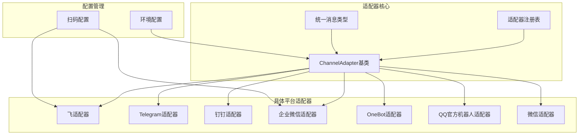

**图表来源**
- [适配器总览:1-34](file://src/synapse/channels/adapters/__init__.py#L1-L34)
- [通道基类:38-100](file://src/synapse/channels/base.py#L38-L100)

**章节来源**
- [适配器总览:1-34](file://src/synapse/channels/adapters/__init__.py#L1-L34)
- [通道基类:1-50](file://src/synapse/channels/base.py#L1-L50)

## 核心组件

### ChannelAdapter基类

ChannelAdapter是所有IM适配器的抽象基类，定义了统一的接口规范：

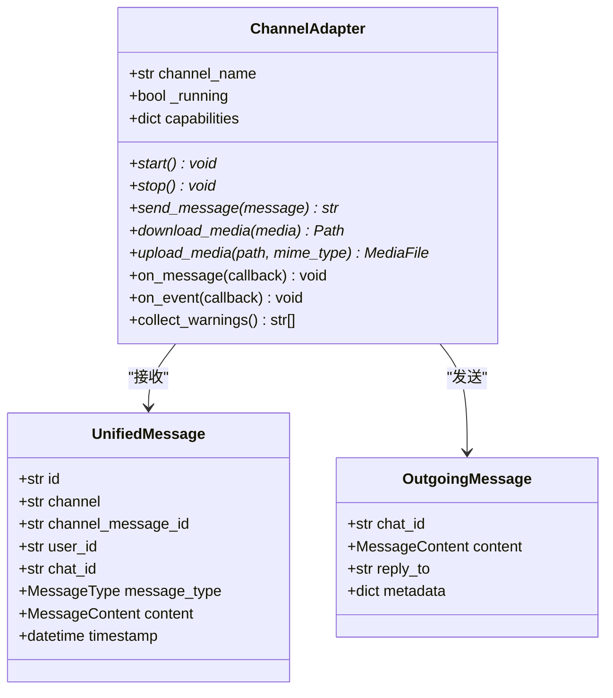

**图表来源**
- [通道基类:38-100](file://src/synapse/channels/base.py#L38-L100)
- [统一消息类型:341-465](file://src/synapse/channels/types.py#L341-L465)

### 统一消息格式

系统采用统一的消息格式来处理不同平台的消息差异：

| 组件 | 描述 | 支持类型 |
|------|------|----------|
| UnifiedMessage | 接收消息的统一格式 | 文本、图片、语音、文件、视频、位置、表情包 |
| OutgoingMessage | 发送消息的统一格式 | 文本、图片、文件、语音、视频 |
| MessageContent | 消息内容容器 | 文本、媒体文件列表 |
| MediaFile | 媒体文件信息 | ID、文件名、MIME类型、状态 |

**章节来源**
- [统一消息类型:18-615](file://src/synapse/channels/types.py#L18-L615)

## 架构概览

IM适配器系统采用事件驱动架构，通过回调机制实现消息的异步处理：

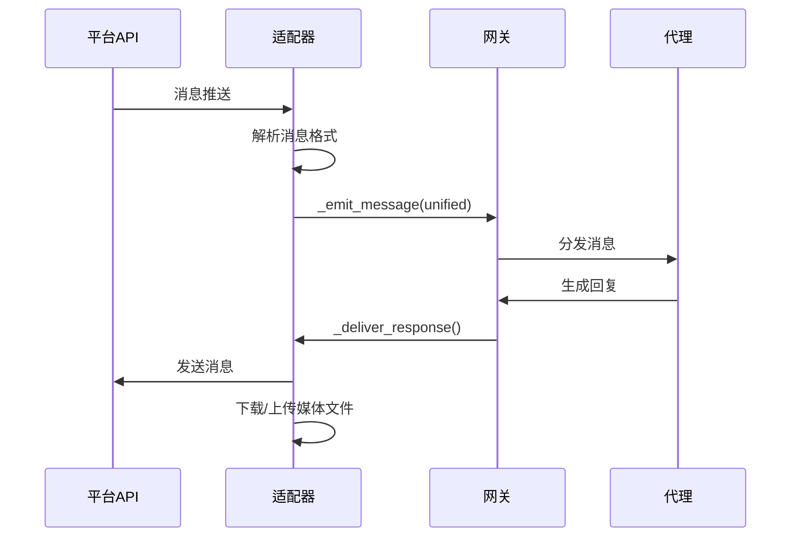

**图表来源**
- [通道基类:269-286](file://src/synapse/channels/base.py#L269-L286)

## 详细组件分析

### 飞书(Feishu)适配器

飞书适配器采用Device Flow进行扫码建应用和凭证校验：

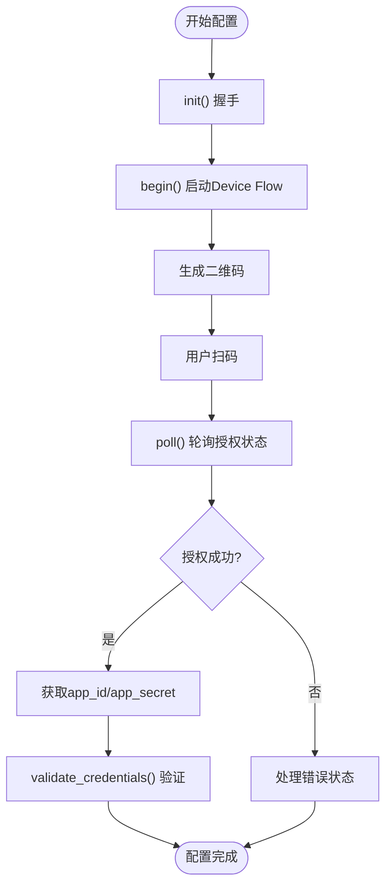

**图表来源**
- [飞书扫码配置:66-120](file://src/synapse/setup/feishu_onboard.py#L66-L120)

**配置参数**
- `FEISHU_APP_ID`: 飞书应用ID
- `FEISHU_APP_SECRET`: 飞书应用密钥
- `FEISHU_DOMAIN`: 域名选择(feishu/lark)

**认证机制**
- Device Flow三步验证
- 支持多租户域名
- 自动令牌刷新

**章节来源**
- [飞书扫码配置:1-220](file://src/synapse/setup/feishu_onboard.py#L1-L220)

### Telegram适配器

Telegram适配器支持Long Polling和Webhook两种模式：

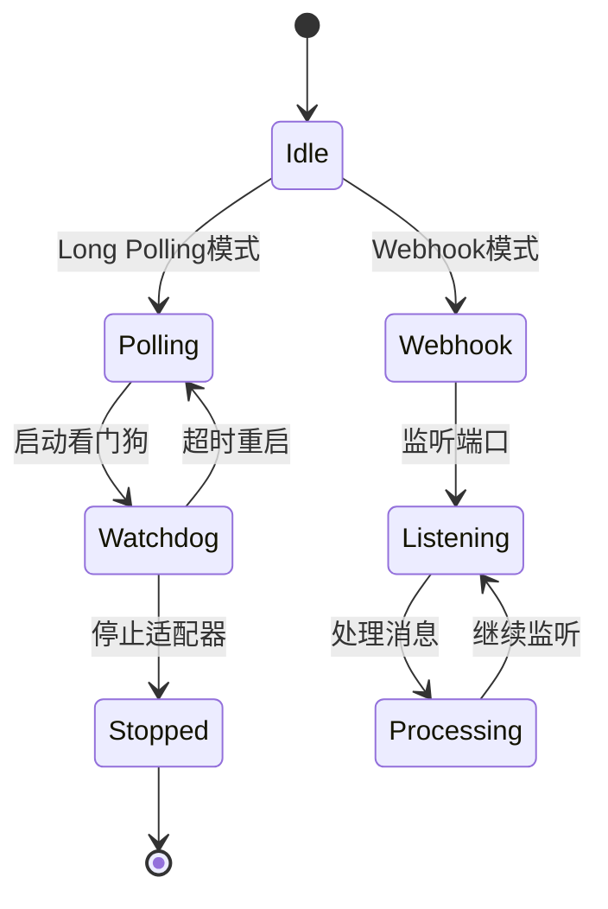

**图表来源**
- [Telegram适配器文档:640-666](file://docs/TELEGRAM_IM_NOTES.md#L640-L666)

**消息处理流程**
- Long Polling模式：`drop_pending_updates=True`避免历史消息
- Webhook模式：需要公网URL，当前实现不完整
- 支持Markdown和HTML解析模式

**媒体处理**
- 图片：支持URL和本地路径
- 文件：仅支持本地路径
- 语音：仅支持本地路径
- 20MB文件下载限制

**章节来源**
- [Telegram适配器文档:1-800](file://docs/TELEGRAM_IM_NOTES.md#L1-L800)

### 钉钉(DingTalk)适配器

钉钉适配器使用dingtalk-stream SDK建立WebSocket长连接：

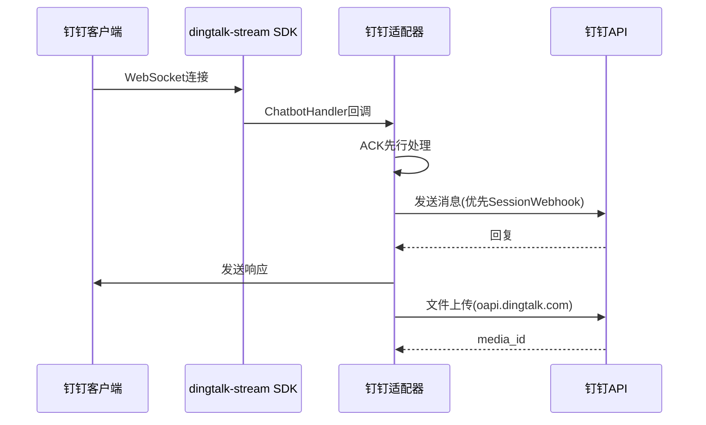

**图表来源**
- [钉钉适配器文档:115-126](file://docs/DINGTALK_IM_NOTES.md#L115-L126)

**发送策略**
- SessionWebhook优先：支持text/markdown/actionCard/feedCard
- OpenAPI回退：群聊/单聊消息发送
- 互动卡片：AI Card(382e4302) + StandardCard降级

**Token管理**
- 新版OAuth2 Token：api.dingtalk.com域
- 旧版Token：oapi.dingtalk.com域
- 双Token体系，独立刷新

**章节来源**
- [钉钉适配器文档:1-807](file://docs/DINGTALK_IM_NOTES.md#L1-L807)

### 企业微信(WeWork)适配器

企业微信提供两种连接模式：HTTP回调和WebSocket长连接

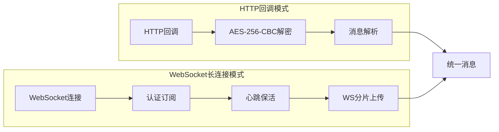

**图表来源**
- [企业微信WS适配器文档:278-344](file://docs/WEWORK_WS_IM_NOTES.md#L278-L344)

**WebSocket特性**
- 30秒心跳保活
- 指数退避重连(1s-30s)
- 原生流式回复支持
- 媒体文件WS分片上传

**HTTP回调特性**
- 响应URL回退机制
- AES-256-CBC全局解密
- 5分钟响应URL有效期

**章节来源**
- [企业微信WS适配器文档:1-521](file://docs/WEWORK_WS_IM_NOTES.md#L1-L521)

### OneBot适配器

OneBot适配器支持正向和反向WebSocket两种连接模式：

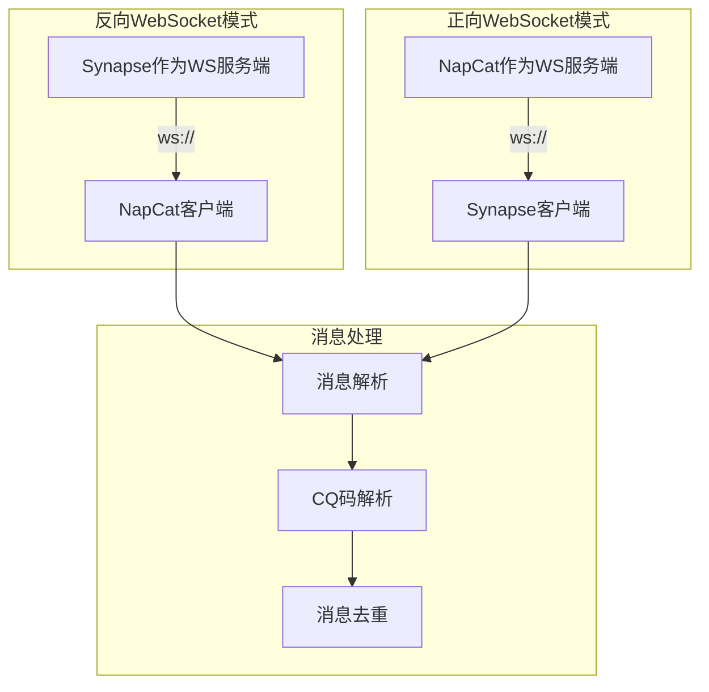

**图表来源**
- [OneBot适配器文档:14-44](file://docs/ONEBOT_IM_NOTES.md#L14-L44)

**连接模式对比**

| 特性 | 反向WebSocket | 正向WebSocket |
|------|---------------|---------------|
| 默认模式 | ✅ | ❌ |
| Synapse角色 | WS服务端 | WS客户端 |
| NapCat配置 | 客户端URL | 服务器端口 |
| 认证方式 | Bearer Token | Bearer Token |
| 连接管理 | 单连接替换 | 自动重连(1s-60s) |
| 适用场景 | 同机/内网 | 外网访问 |

**章节来源**
- [OneBot适配器文档:1-158](file://docs/ONEBOT_IM_NOTES.md#L1-L158)

### 微信(WeChat)适配器

微信个人号适配器基于iLink Bot API协议，使用HTTP长轮询：

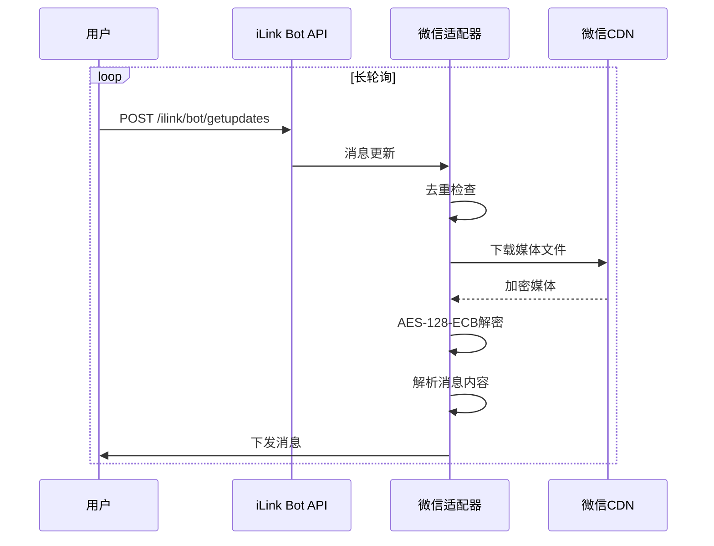

**图表来源**
- [微信个人号适配器文档:16-60](file://docs/WECHAT_IM_NOTES.md#L16-L60)

**协议特性**
- HTTP长轮询：动态超时3-30秒
- AES-128-ECB加密：媒体文件加解密
- 4000字符消息长度限制
- 2.5秒最小发送间隔

**章节来源**
- [微信个人号适配器文档:1-261](file://docs/WECHAT_IM_NOTES.md#L1-L261)

## 依赖分析

IM适配器系统的依赖关系呈现星型拓扑结构，所有适配器都依赖于ChannelAdapter基类：

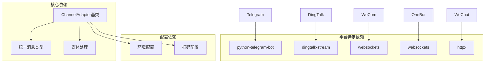

**图表来源**
- [通道基类:11-20](file://src/synapse/channels/base.py#L11-L20)

**章节来源**
- [通道基类:1-50](file://src/synapse/channels/base.py#L1-L50)

## 性能考虑

### 媒体处理优化

| 平台 | 优化策略 | 性能收益 |
|------|----------|----------|
| Telegram | 20MB下载限制检查 | 避免超时异常 |
| 钉钉 | SessionWebhook优先 | 减少API调用次数 |
| 企业微信WS | WS分片上传 | 提高大文件传输效率 |
| 微信 | AES-128-ECB批量解密 | 减少CPU消耗 |
| OneBot | 消息ID去重(LRU) | 防止重复处理 |

### 连接管理优化

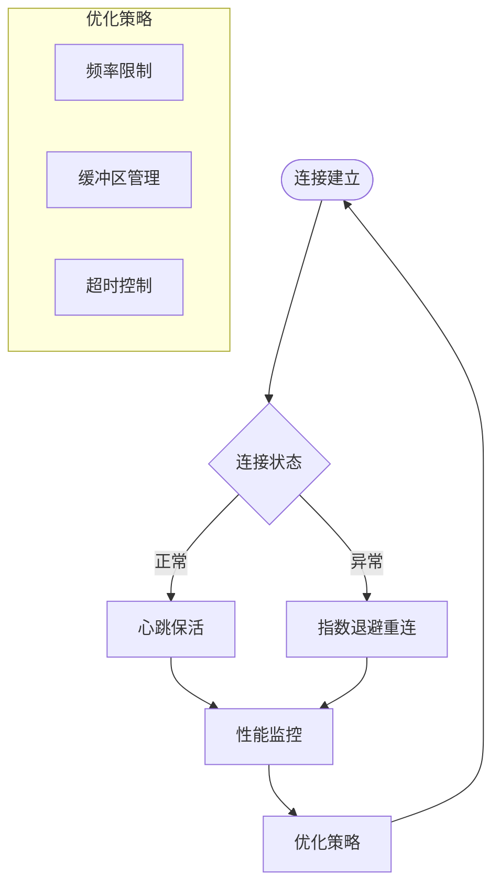

### 错误处理策略

| 错误类型 | 处理策略 | 重试机制 |
|----------|----------|----------|
| 网络异常 | 指数退避(1s-30s) | 最多重试5次 |
| API限流 | 退避重试 | 指数增长 |
| 媒体下载失败 | 降级处理 | 本地缓存回退 |
| 认证过期 | 自动刷新 | 令牌管理 |

## 故障排除指南

### 常见问题诊断

**连接问题**
- 检查网络连通性和防火墙设置
- 验证API凭证的有效性
- 确认平台权限配置

**消息处理问题**
- 检查消息去重机制
- 验证媒体文件完整性
- 确认解析器兼容性

**性能问题**
- 监控连接状态和重连次数
- 检查缓冲区使用情况
- 优化超时参数配置

### 调试工具

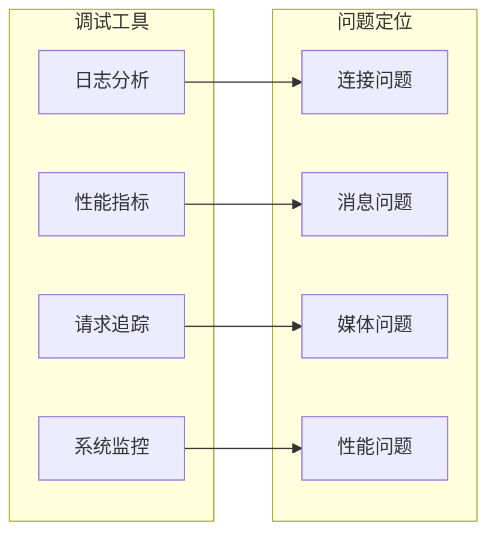

## 结论

IM平台适配器系统通过统一的架构设计和标准化的接口规范，实现了对6种主流IM平台的无缝集成。每个适配器都针对平台特性进行了专门优化，同时保持了跨平台的一致性体验。

**主要优势**
- 统一的消息格式和处理流程
- 完善的错误处理和重试机制
- 灵活的配置管理和扫码配置
- 丰富的媒体处理能力和优化策略

**未来发展**
- 扩展更多IM平台支持
- 优化流式回复体验
- 增强安全性保障
- 提升系统监控能力

该适配器系统为构建跨平台的智能聊天应用提供了坚实的技术基础，能够满足不同场景下的消息通信需求。