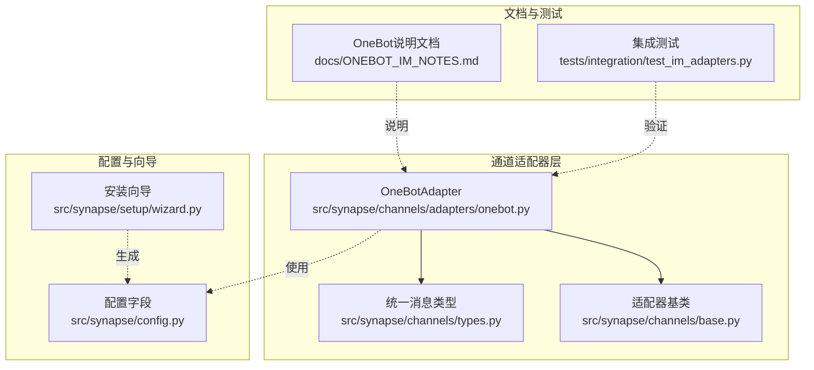
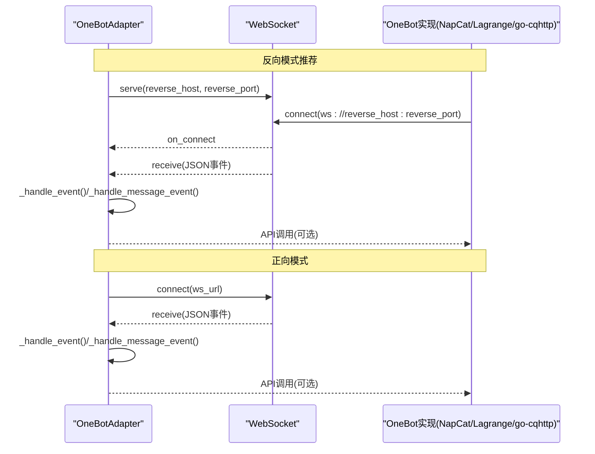
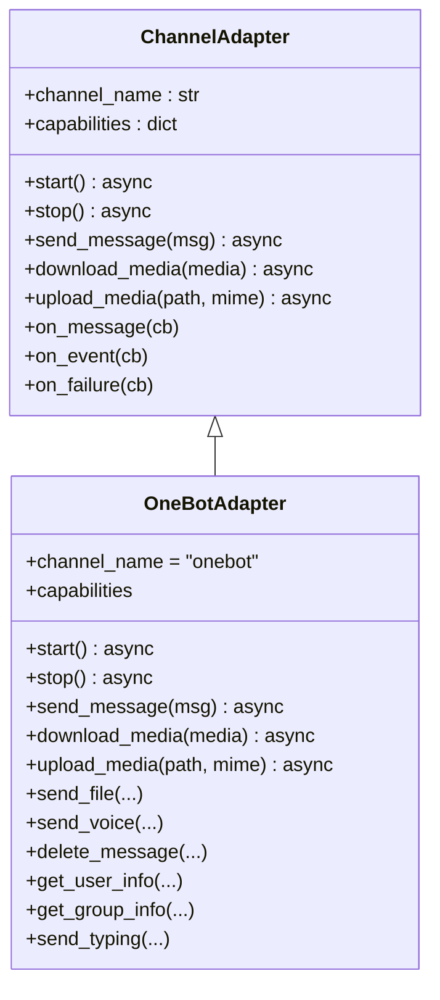
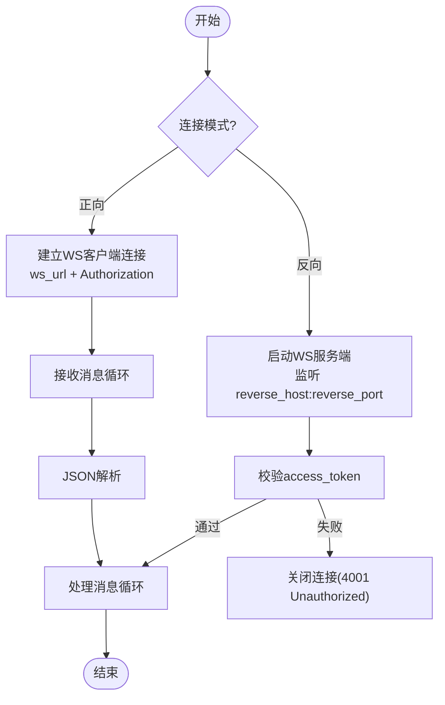
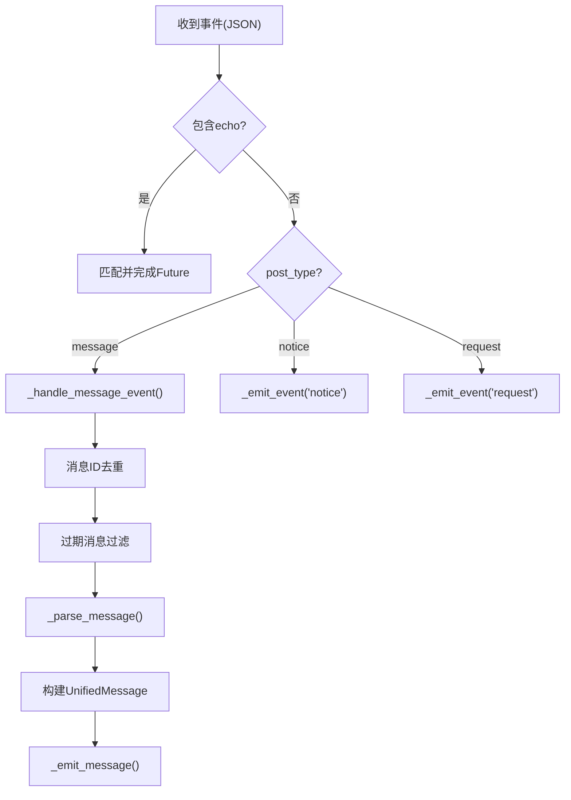
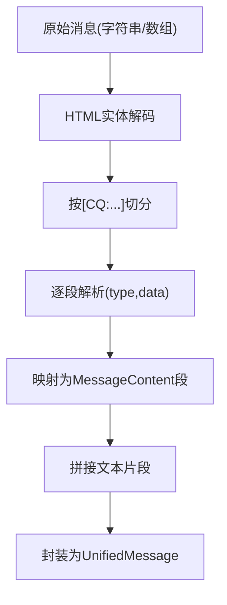
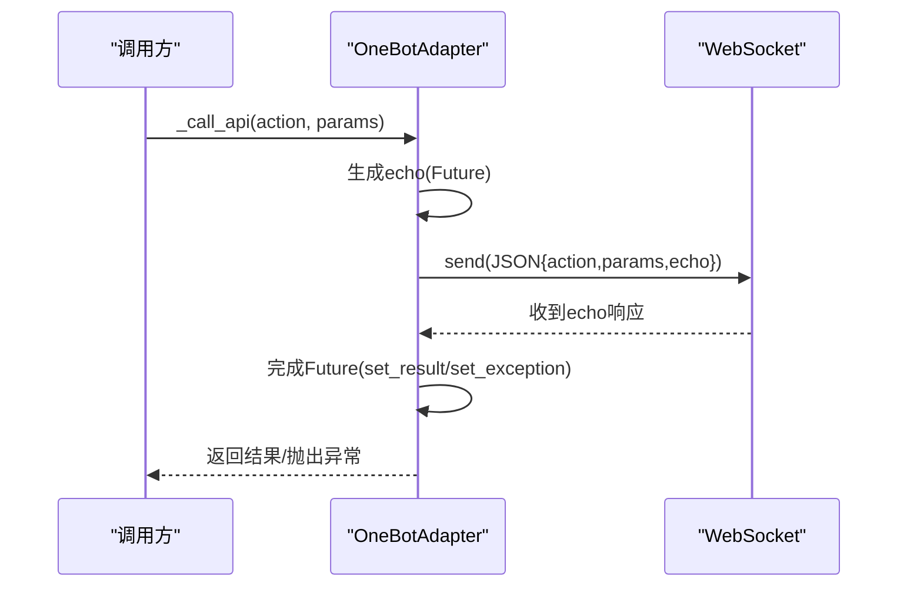
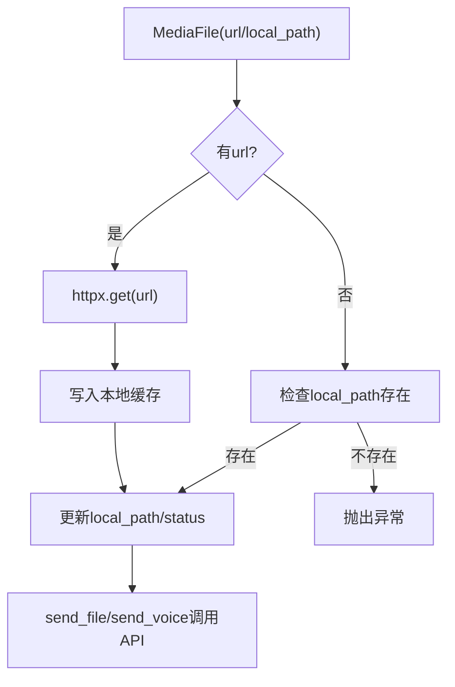
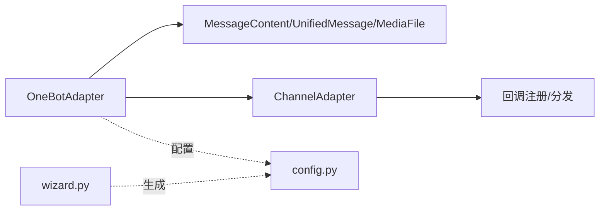

# OneBot适配器

<cite>
**本文引用的文件**
- [onebot.py](file://src/synapse/channels/adapters/onebot.py)
- [ONEBOT_IM_NOTES.md](file://docs/ONEBOT_IM_NOTES.md)
- [types.py](file://src/synapse/channels/types.py)
- [base.py](file://src/synapse/channels/base.py)
- [config.py](file://src/synapse/config.py)
- [wizard.py](file://src/synapse/setup/wizard.py)
- [test_im_adapters.py](file://tests/integration/test_im_adapters.py)
</cite>

## 目录
1. [简介](#简介)
2. [项目结构](#项目结构)
3. [核心组件](#核心组件)
4. [架构总览](#架构总览)
5. [详细组件分析](#详细组件分析)
6. [依赖关系分析](#依赖关系分析)
7. [性能考量](#性能考量)
8. [故障排查指南](#故障排查指南)
9. [结论](#结论)
10. [附录](#附录)

## 简介
本文件面向OneBot v11协议的通用适配器实现，系统性梳理其消息处理、WebSocket连接管理、事件分发、消息格式转换、配置参数、连接建立流程、序列化/反序列化、事件过滤、错误处理策略、兼容性与性能优化、调试方法，并给出与多种OneBot实现（如Mirai、GoCQHTTP、NapCat、Lagrange等）的配置与兼容性说明。

## 项目结构
- 适配器核心位于通道适配器目录，负责统一消息模型与平台协议对接。
- 与之配套的文档、配置、向导与测试共同构成完整的实现与运维闭环。

图表来源
- [onebot.py:66-135](file://src/synapse/channels/adapters/onebot.py#L66-L135)
- [types.py:197-490](file://src/synapse/channels/types.py#L197-L490)
- [base.py:38-105](file://src/synapse/channels/base.py#L38-L105)
- [config.py:347-357](file://src/synapse/config.py#L347-L357)
- [wizard.py:1086-1120](file://src/synapse/setup/wizard.py#L1086-L1120)
- [ONEBOT_IM_NOTES.md:1-158](file://docs/ONEBOT_IM_NOTES.md#L1-L158)
- [test_im_adapters.py:76-112](file://tests/integration/test_im_adapters.py#L76-L112)

章节来源
- [onebot.py:1-120](file://src/synapse/channels/adapters/onebot.py#L1-L120)
- [types.py:1-120](file://src/synapse/channels/types.py#L1-L120)
- [base.py:1-100](file://src/synapse/channels/base.py#L1-L100)
- [config.py:347-357](file://src/synapse/config.py#L347-L357)
- [wizard.py:1086-1120](file://src/synapse/setup/wizard.py#L1086-L1120)
- [ONEBOT_IM_NOTES.md:1-158](file://docs/ONEBOT_IM_NOTES.md#L1-L158)
- [test_im_adapters.py:76-112](file://tests/integration/test_im_adapters.py#L76-L112)

## 核心组件
- OneBotAdapter：实现OneBot v11协议，支持反向（reverse）与正向（forward）WebSocket模式，负责事件接收、消息解析、API调用、媒体下载与上传、用户/群信息查询等。
- 统一消息类型：定义跨平台统一的消息结构（UnifiedMessage、OutgoingMessage、MessageContent、MediaFile），保证上层Agent与网关对消息的稳定处理。
- 适配器基类：提供生命周期、回调注册、能力声明、媒体下载/上传等抽象接口，OneBotAdapter在此基础上实现具体能力。
- 配置与向导：集中管理OneBot相关环境变量与UI配置，支持CLI向导生成配置。
- 文档与测试：提供协议约束、功能清单、配置项、数据流与测试用例，保障实现一致性与回归质量。

章节来源
- [onebot.py:66-135](file://src/synapse/channels/adapters/onebot.py#L66-L135)
- [types.py:197-490](file://src/synapse/channels/types.py#L197-L490)
- [base.py:38-105](file://src/synapse/channels/base.py#L38-L105)
- [config.py:347-357](file://src/synapse/config.py#L347-L357)
- [wizard.py:1086-1120](file://src/synapse/setup/wizard.py#L1086-L1120)
- [ONEBOT_IM_NOTES.md:1-158](file://docs/ONEBOT_IM_NOTES.md#L1-L158)
- [test_im_adapters.py:76-112](file://tests/integration/test_im_adapters.py#L76-L112)

## 架构总览
OneBot适配器通过WebSocket与OneBot实现（如NapCat、Lagrange、go-cqhttp等）进行双向通信：
- 反向模式：Synapse作为WS服务端，OneBot实现作为客户端主动连入，适合同机或内网场景。
- 正向模式：Synapse作为WS客户端主动连接OneBot实现的WS服务器，适合跨网络场景。

图表来源
- [onebot.py:138-187](file://src/synapse/channels/adapters/onebot.py#L138-L187)
- [onebot.py:191-249](file://src/synapse/channels/adapters/onebot.py#L191-L249)
- [onebot.py:275-331](file://src/synapse/channels/adapters/onebot.py#L275-L331)
- [ONEBOT_IM_NOTES.md:10-60](file://docs/ONEBOT_IM_NOTES.md#L10-L60)

章节来源
- [onebot.py:138-331](file://src/synapse/channels/adapters/onebot.py#L138-L331)
- [ONEBOT_IM_NOTES.md:10-60](file://docs/ONEBOT_IM_NOTES.md#L10-L60)

## 详细组件分析

### OneBotAdapter类与生命周期
- 初始化：构造OneBotConfig，准备媒体目录，初始化连接状态、回调字典、消息去重与群名缓存等。
- 启动：根据模式选择反向或正向连接，反向模式启动WS服务端，正向模式启动连接循环。
- 停止：取消接收任务、关闭服务端、拒绝待处理回调、关闭WS连接。

图表来源
- [base.py:38-105](file://src/synapse/channels/base.py#L38-L105)
- [onebot.py:66-135](file://src/synapse/channels/adapters/onebot.py#L66-L135)

章节来源
- [onebot.py:91-187](file://src/synapse/channels/adapters/onebot.py#L91-L187)
- [base.py:140-185](file://src/synapse/channels/base.py#L140-L185)

### WebSocket连接管理（反向/正向）
- 反向模式：启动服务端，校验access_token（请求头或查询参数），替换旧连接，处理消息循环。
- 正向模式：建立客户端连接，带Authorization头，指数退避重连，处理连接关闭与异常。

图表来源
- [onebot.py:142-166](file://src/synapse/channels/adapters/onebot.py#L142-L166)
- [onebot.py:191-249](file://src/synapse/channels/adapters/onebot.py#L191-L249)
- [onebot.py:275-331](file://src/synapse/channels/adapters/onebot.py#L275-L331)

章节来源
- [onebot.py:142-331](file://src/synapse/channels/adapters/onebot.py#L142-L331)
- [ONEBOT_IM_NOTES.md:33-60](file://docs/ONEBOT_IM_NOTES.md#L33-L60)

### 事件处理与消息分发
- 事件入口：统一进入_handle_event，按post_type分发至消息/通知/请求。
- 消息事件：去重、时间阈值过滤、@检测（显式/隐式）、群名缓存、构建UnifiedMessage并上报。
- 回调机制：API调用通过echo匹配Future，超时与异常处理，断连时拒绝所有待处理回调。

图表来源
- [onebot.py:334-458](file://src/synapse/channels/adapters/onebot.py#L334-L458)
- [onebot.py:491-568](file://src/synapse/channels/adapters/onebot.py#L491-L568)
- [base.py:269-286](file://src/synapse/channels/base.py#L269-L286)

章节来源
- [onebot.py:334-458](file://src/synapse/channels/adapters/onebot.py#L334-L458)
- [onebot.py:491-568](file://src/synapse/channels/adapters/onebot.py#L491-L568)
- [base.py:269-286](file://src/synapse/channels/base.py#L269-L286)

### 消息格式转换与CQ码解析
- CQ码解析：支持text、image、record、video、file、at、face、reply、forward、share、json、xml、location等段类型，HTML实体解码。
- 统一消息：将OneBot消息段映射为MessageContent，再包装为UnifiedMessage，保留原始数据与元数据。

图表来源
- [onebot.py:463-487](file://src/synapse/channels/adapters/onebot.py#L463-L487)
- [onebot.py:491-568](file://src/synapse/channels/adapters/onebot.py#L491-L568)
- [types.py:197-490](file://src/synapse/channels/types.py#L197-L490)

章节来源
- [onebot.py:463-568](file://src/synapse/channels/adapters/onebot.py#L463-L568)
- [types.py:197-490](file://src/synapse/channels/types.py#L197-L490)

### API调用与回调机制
- API调用：_call_api生成唯一echo，发送action/params，等待Future结果，超时或异常处理。
- 回调管理：_reject_pending_callbacks在断连时拒绝所有未完成Future，避免悬挂。

图表来源
- [onebot.py:572-596](file://src/synapse/channels/adapters/onebot.py#L572-L596)
- [onebot.py:597-607](file://src/synapse/channels/adapters/onebot.py#L597-L607)

章节来源
- [onebot.py:572-607](file://src/synapse/channels/adapters/onebot.py#L572-L607)

### 媒体处理与文件发送
- 下载：download_media使用httpx拉取URL，保存到本地缓存目录，更新MediaFile状态。
- 上传：upload_media返回本地路径引用（便于统一处理）。
- 文件/语音发送：send_file/send_voice分别调用OneBot API，支持caption与群/私聊判断。

图表来源
- [onebot.py:718-744](file://src/synapse/channels/adapters/onebot.py#L718-L744)
- [onebot.py:776-844](file://src/synapse/channels/adapters/onebot.py#L776-L844)

章节来源
- [onebot.py:718-844](file://src/synapse/channels/adapters/onebot.py#L718-L844)

### 配置参数与启动流程
- 配置项（环境变量/字段）：ONEBOT_ENABLED、ONEBOT_MODE、ONEBOT_REVERSE_HOST、ONEBOT_REVERSE_PORT、ONEBOT_WS_URL、ONEBOT_ACCESS_TOKEN。
- 启动条件：根据配置决定是否启用OneBot通道，反向模式无需ws_url。
- 向导：CLI向导引导用户选择模式、填写端口或WS地址、可选Access Token。

章节来源
- [config.py:347-357](file://src/synapse/config.py#L347-L357)
- [ONEBOT_IM_NOTES.md:71-107](file://docs/ONEBOT_IM_NOTES.md#L71-L107)
- [wizard.py:1086-1120](file://src/synapse/setup/wizard.py#L1086-L1120)

### 插件兼容性与OneBot实现
- 兼容性：适配器明确支持NapCat、Lagrange、go-cqhttp等兼容OneBot v11的实现。
- 已知限制：不支持v12协议；部分OneBot实现对文件上传API支持不一致；反向模式端口冲突需检查日志；Access Token传递支持请求头与查询参数两种方式。

章节来源
- [onebot.py:1-10](file://src/synapse/channels/adapters/onebot.py#L1-L10)
- [ONEBOT_IM_NOTES.md:131-137](file://docs/ONEBOT_IM_NOTES.md#L131-L137)

## 依赖关系分析
- OneBotAdapter依赖统一消息类型（types.py）与适配器基类（base.py），并通过配置（config.py）与向导（wizard.py）参与系统初始化。
- 事件分发依赖回调注册机制（on_message/on_event/on_failure），并在停止时清理资源与回调。

图表来源
- [onebot.py:66-135](file://src/synapse/channels/adapters/onebot.py#L66-L135)
- [types.py:197-490](file://src/synapse/channels/types.py#L197-L490)
- [base.py:239-286](file://src/synapse/channels/base.py#L239-L286)
- [config.py:347-357](file://src/synapse/config.py#L347-L357)
- [wizard.py:1086-1120](file://src/synapse/setup/wizard.py#L1086-L1120)

章节来源
- [onebot.py:66-135](file://src/synapse/channels/adapters/onebot.py#L66-L135)
- [types.py:197-490](file://src/synapse/channels/types.py#L197-L490)
- [base.py:239-286](file://src/synapse/channels/base.py#L239-L286)
- [config.py:347-357](file://src/synapse/config.py#L347-L357)
- [wizard.py:1086-1120](file://src/synapse/setup/wizard.py#L1086-L1120)

## 性能考量
- 消息去重：使用有序字典LRU缓存message_id，容量上限500，避免重复处理。
- 群名缓存：缓存group_id→name，减少重复API调用。
- 连接管理：正向模式指数退避重连（1s~60s），反向模式单连接替换，降低资源占用。
- 媒体下载：异步httpx下载，超时控制，本地缓存目录避免重复下载。
- typing状态：仅在支持的实现上生效（如NapCat扩展API），其他实现静默失败不影响主流程。

章节来源
- [onebot.py:122-135](file://src/synapse/channels/adapters/onebot.py#L122-L135)
- [onebot.py:422-434](file://src/synapse/channels/adapters/onebot.py#L422-L434)
- [onebot.py:294-331](file://src/synapse/channels/adapters/onebot.py#L294-L331)
- [onebot.py:718-744](file://src/synapse/channels/adapters/onebot.py#L718-L744)
- [onebot.py:687-715](file://src/synapse/channels/adapters/onebot.py#L687-L715)

## 故障排查指南
- 连接失败
  - 反向模式端口占用：检查端口是否被占用，修改ONEBOT_REVERSE_PORT或释放端口。
  - 正向模式连接超时：检查ws_url可达性、网络策略、防火墙，必要时增大open_timeout。
  - Access Token不匹配：确认Authorization头或查询参数access_token与配置一致。
- 消息重复/延迟
  - 检查消息去重缓存是否命中，确认STALE_MESSAGE_THRESHOLD_S设置合理。
- 媒体下载失败
  - URL临时失效或网络不稳定，重试下载；确认httpx可用。
- API调用超时/异常
  - 检查echo回调是否被拒绝（断连时会拒绝所有待处理回调），确认OneBot实现支持对应API。
- OneBot v12不兼容
  - 适配器仅支持v11协议，避免使用v12实现。

章节来源
- [onebot.py:153-160](file://src/synapse/channels/adapters/onebot.py#L153-L160)
- [onebot.py:275-292](file://src/synapse/channels/adapters/onebot.py#L275-L292)
- [onebot.py:250-271](file://src/synapse/channels/adapters/onebot.py#L250-L271)
- [onebot.py:572-596](file://src/synapse/channels/adapters/onebot.py#L572-L596)
- [ONEBOT_IM_NOTES.md:131-137](file://docs/ONEBOT_IM_NOTES.md#L131-L137)

## 结论
OneBot适配器以统一消息模型为核心，结合灵活的反向/正向WebSocket连接模式与完善的事件处理、API调用与媒体处理机制，实现了对主流OneBot v11实现的广泛兼容。通过严格的配置管理、回调机制与性能优化策略，能够在复杂网络环境下稳定运行。建议优先采用反向模式以简化部署与运维，并在生产环境中配合监控与日志体系进行持续观测与优化。

## 附录

### 配置参数一览
- ONEBOT_ENABLED：是否启用OneBot通道
- ONEBOT_MODE：连接模式（reverse/forward）
- ONEBOT_REVERSE_HOST：反向模式监听地址
- ONEBOT_REVERSE_PORT：反向模式监听端口
- ONEBOT_WS_URL：正向模式WS地址
- ONEBOT_ACCESS_TOKEN：访问令牌（两种模式通用）

章节来源
- [config.py:347-357](file://src/synapse/config.py#L347-L357)
- [ONEBOT_IM_NOTES.md:71-83](file://docs/ONEBOT_IM_NOTES.md#L71-L83)

### OneBot实现配置要点
- NapCat（推荐）：反向模式配置Websocket客户端，URL为ws://<本机IP>:<reverse_port>，可选Access Token。
- Lagrange/go-cqhttp：正向模式配置WS服务器端口或URL，确保Authorization头或查询参数access_token一致。

章节来源
- [ONEBOT_IM_NOTES.md:45-51](file://docs/ONEBOT_IM_NOTES.md#L45-L51)
- [wizard.py:1086-1120](file://src/synapse/setup/wizard.py#L1086-L1120)

### 测试与验证
- 初始化与模式验证：测试默认模式、forward/reverse参数、CQ码实体解码、消息去重。
- 基类接口：验证抽象方法定义与便利方法存在性。

章节来源
- [test_im_adapters.py:76-112](file://tests/integration/test_im_adapters.py#L76-L112)
- [test_im_adapters.py:11-31](file://tests/integration/test_im_adapters.py#L11-L31)