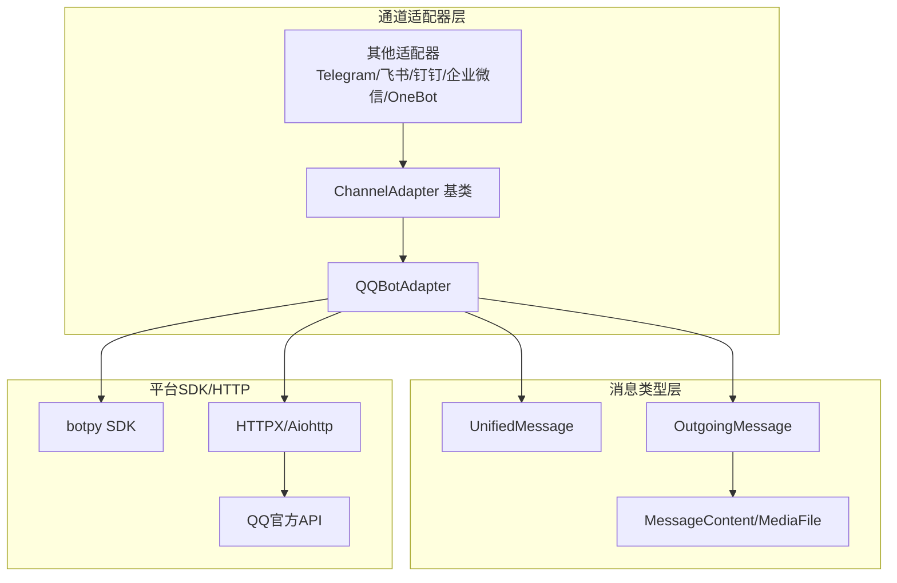
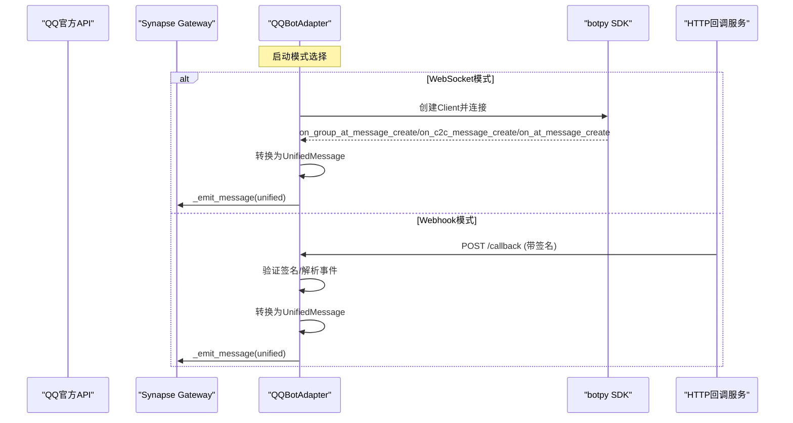
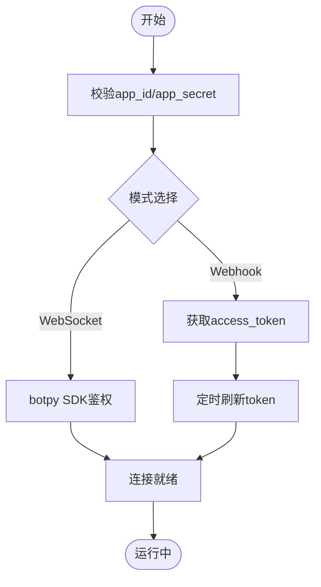
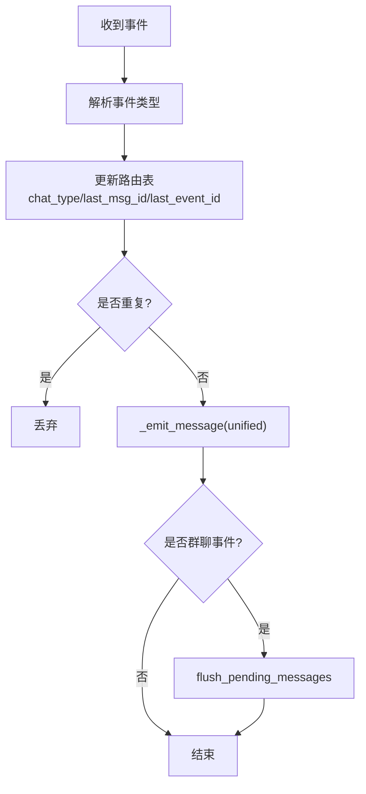
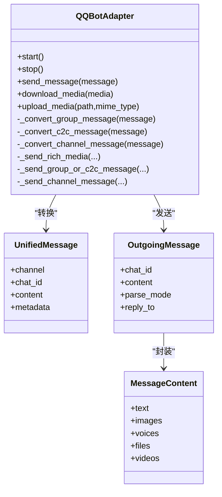
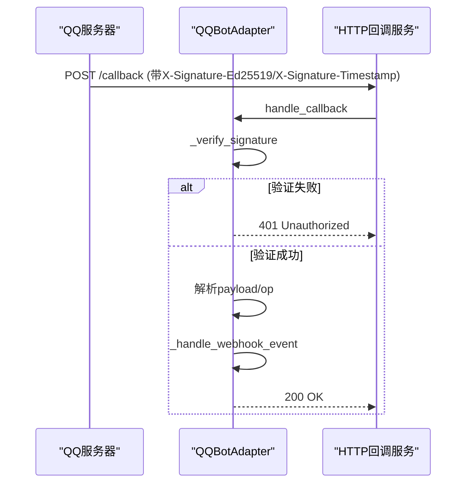
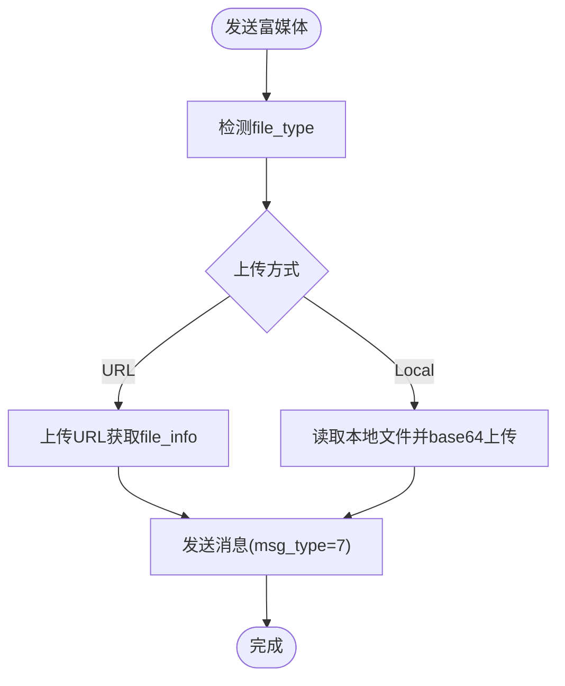
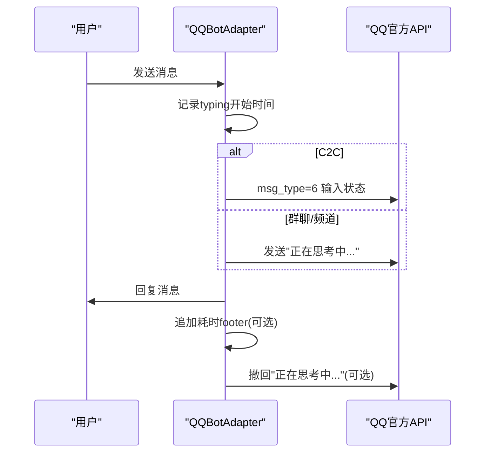
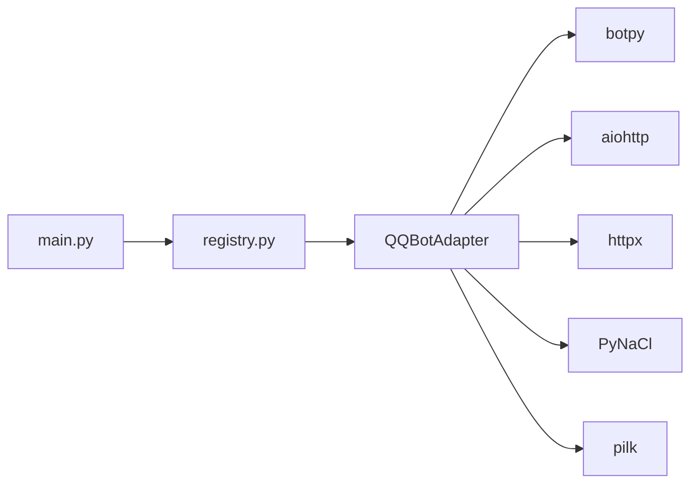

# QQ官方机器人适配器

<cite>
**本文档引用的文件**
- [qq_official.py](file://src/synapse/channels/adapters/qq_official.py)
- [base.py](file://src/synapse/channels/base.py)
- [types.py](file://src/synapse/channels/types.py)
- [registry.py](file://src/synapse/channels/registry.py)
- [__init__.py](file://src/synapse/channels/adapters/__init__.py)
- [main.py](file://src/synapse/main.py)
- [qqbot_onboard.py](file://src/synapse/setup/qqbot_onboard.py)
- [retry.py](file://src/synapse/channels/retry.py)
- [im-channel-setup-tutorial.md](file://docs/im-channel-setup-tutorial.md)
</cite>

## 目录
1. [简介](#简介)
2. [项目结构](#项目结构)
3. [核心组件](#核心组件)
4. [架构总览](#架构总览)
5. [详细组件分析](#详细组件分析)
6. [依赖关系分析](#依赖关系分析)
7. [性能考虑](#性能考虑)
8. [故障排除指南](#故障排除指南)
9. [结论](#结论)
10. [附录](#附录)

## 简介
本技术文档面向QQ官方机器人适配器，系统性阐述其设计与实现细节，涵盖消息处理、频道与群聊支持、消息格式转换、权限管理、配置参数、认证流程、消息路由机制、事件处理、错误处理策略、并发与性能优化、部署注意事项，以及QQ机器人平台的创建指南与开发文档链接。读者可据此快速理解并部署基于QQ官方API的机器人集成。

## 项目结构
QQ官方机器人适配器位于通道适配器子系统中，采用“适配器模式”对接统一消息通道接口，支持WebSocket与Webhook两种事件接收模式，覆盖群聊@机器人、单聊、频道@消息等场景，并提供富媒体发送能力（图片/语音/文件）与输入状态提示。

**图表来源**
- [base.py:38-105](file://src/synapse/channels/base.py#L38-L105)
- [qq_official.py:62-90](file://src/synapse/channels/adapters/qq_official.py#L62-L90)
- [types.py:341-466](file://src/synapse/channels/types.py#L341-L466)

**章节来源**
- [base.py:38-105](file://src/synapse/channels/base.py#L38-L105)
- [__init__.py:15-33](file://src/synapse/channels/adapters/__init__.py#L15-L33)
- [registry.py:185-199](file://src/synapse/channels/registry.py#L185-L199)

## 核心组件
- 适配器主体：QQBotAdapter，负责认证、事件接收、消息路由、富媒体上传与发送、输入状态提示、错误处理与重试。
- 统一消息模型：UnifiedMessage/OutgoingMessage/MessageContent/MediaFile，保证跨平台一致性。
- 基类接口：ChannelAdapter，定义生命周期、消息收发、媒体处理、回调注册等抽象。
- 事件转换：将botpy事件或Webhook事件转换为统一消息格式。
- 并发与重试：基于asyncio的任务调度与指数退避重试工具。

**章节来源**
- [qq_official.py:62-175](file://src/synapse/channels/adapters/qq_official.py#L62-L175)
- [types.py:197-340](file://src/synapse/channels/types.py#L197-L340)
- [base.py:142-174](file://src/synapse/channels/base.py#L142-L174)

## 架构总览
QQ官方机器人适配器通过两种模式接入：
- WebSocket模式：使用botpy SDK建立长连接，自动重连，事件驱动转换为统一消息。
- Webhook模式：启动HTTP回调服务，验证签名后解析事件，转换为统一消息。

**图表来源**
- [qq_official.py:326-352](file://src/synapse/channels/adapters/qq_official.py#L326-L352)
- [qq_official.py:502-576](file://src/synapse/channels/adapters/qq_official.py#L502-L576)
- [qq_official.py:2100-2133](file://src/synapse/channels/adapters/qq_official.py#L2100-L2133)

## 详细组件分析

### 配置参数与认证
- 关键参数
  - app_id/app_secret：QQ机器人凭证
  - sandbox：沙箱环境开关
  - mode：websocket/webhook
  - webhook_port/webhook_path：Webhook回调端口与路径
  - public_api_url：本地图片转公网URL的入口（群/C2C富媒体）
  - footer_elapsed：回复末尾追加耗时统计
- 认证流程
  - WebSocket：botpy Client启动时携带app_id与app_secret进行鉴权
  - Webhook：通过getAppAccessToken接口获取access_token，自动续期
- 凭证校验
  - 提供validate_credentials方法，通过官方接口验证有效性

**图表来源**
- [qq_official.py:326-352](file://src/synapse/channels/adapters/qq_official.py#L326-L352)
- [qq_official.py:426-460](file://src/synapse/channels/adapters/qq_official.py#L426-L460)
- [qqbot_onboard.py:294-325](file://src/synapse/setup/qqbot_onboard.py#L294-L325)

**章节来源**
- [qq_official.py:92-175](file://src/synapse/channels/adapters/qq_official.py#L92-L175)
- [qqbot_onboard.py:294-325](file://src/synapse/setup/qqbot_onboard.py#L294-L325)

### 消息路由与事件处理
- 事件类型
  - GROUP_AT_MESSAGE_CREATE（群聊@机器人）
  - C2C_MESSAGE_CREATE（单聊）
  - AT_MESSAGE_CREATE（频道@机器人）
- 路由表
  - chat_id → chat_type（group/c2c/channel）
  - chat_id → 最近msg_id/event_id（被动回复）
  - msg_id → msg_seq（去重）
- 去重机制
  - 基于LRU缓存记录seen_message_ids，避免重复处理
- 待发消息队列
  - 群聊主动消息限制：缓存后等待用户下一条消息时批量补发

**图表来源**
- [qq_official.py:589-628](file://src/synapse/channels/adapters/qq_official.py#L589-L628)
- [qq_official.py:182-190](file://src/synapse/channels/adapters/qq_official.py#L182-L190)
- [qq_official.py:291-325](file://src/synapse/channels/adapters/qq_official.py#L291-L325)

**章节来源**
- [qq_official.py:589-628](file://src/synapse/channels/adapters/qq_official.py#L589-L628)
- [qq_official.py:182-190](file://src/synapse/channels/adapters/qq_official.py#L182-L190)

### 消息格式转换
- 接收消息
  - Webhook：解析webhook payload，填充UnifiedMessage
  - botpy事件：将GroupMessage/C2CMessage/Message转换为UnifiedMessage
- 发送消息
  - 文本/Markdown：msg_type=0/2
  - 富媒体：两步上传（群/C2C需公网URL或本地base64上传）
  - 文件：file_type=4（频道不支持）
  - 语音：SILK格式上传（自动转码）

**图表来源**
- [qq_official.py:873-999](file://src/synapse/channels/adapters/qq_official.py#L873-L999)
- [types.py:341-466](file://src/synapse/channels/types.py#L341-L466)
- [types.py:468-615](file://src/synapse/channels/types.py#L468-L615)

**章节来源**
- [qq_official.py:873-999](file://src/synapse/channels/adapters/qq_official.py#L873-L999)
- [types.py:341-466](file://src/synapse/channels/types.py#L341-L466)

### Webhook签名验证与回调处理
- 验签算法
  - 优先尝试ed25519验签（需要PyNaCl）
  - 备选HMAC-SHA256验签（app_secret + timestamp + body）
- 回调类型
  - op=13：URL验证（Validation）
  - op=0：事件分发（Dispatch）
- 年龄过滤
  - 超过阈值（默认120秒）的消息丢弃

**图表来源**
- [qq_official.py:462-501](file://src/synapse/channels/adapters/qq_official.py#L462-L501)
- [qq_official.py:502-576](file://src/synapse/channels/adapters/qq_official.py#L502-L576)

**章节来源**
- [qq_official.py:462-501](file://src/synapse/channels/adapters/qq_official.py#L462-L501)
- [qq_official.py:589-628](file://src/synapse/channels/adapters/qq_official.py#L589-L628)

### 富媒体上传与发送
- 上传流程
  - 群/C2C：先上传获取file_info，再发送消息
  - 频道：支持直接图片URL
- 上传方式
  - URL直传（botpy SDK）
  - 本地文件base64上传（直接调用REST API）
- 语音发送
  - 自动检测SILK格式，否则尝试转码
- 文件发送
  - file_type=4（频道不支持）

**图表来源**
- [qq_official.py:1003-1044](file://src/synapse/channels/adapters/qq_official.py#L1003-L1044)
- [qq_official.py:1056-1089](file://src/synapse/channels/adapters/qq_official.py#L1056-L1089)
- [qq_official.py:1159-1238](file://src/synapse/channels/adapters/qq_official.py#L1159-L1238)

**章节来源**
- [qq_official.py:1003-1044](file://src/synapse/channels/adapters/qq_official.py#L1003-L1044)
- [qq_official.py:1056-1089](file://src/synapse/channels/adapters/qq_official.py#L1056-L1089)
- [qq_official.py:1159-1238](file://src/synapse/channels/adapters/qq_official.py#L1159-L1238)

### 输入状态提示与耗时统计
- C2C：msg_type=6输入状态通知（每4秒续期）
- 群聊/频道：发送“正在思考中...”文本消息，支持撤回
- 耗时统计：可选在回复末尾追加耗时（footer_elapsed）

**图表来源**
- [qq_official.py:1876-1999](file://src/synapse/channels/adapters/qq_official.py#L1876-L1999)
- [qq_official.py:2014-2038](file://src/synapse/channels/adapters/qq_official.py#L2014-L2038)

**章节来源**
- [qq_official.py:1876-1999](file://src/synapse/channels/adapters/qq_official.py#L1876-L1999)
- [qq_official.py:2014-2038](file://src/synapse/channels/adapters/qq_official.py#L2014-L2038)

### 错误处理与重试策略
- 自动重连
  - WebSocket模式下指数退避重连，配置错误时延时最长可达10分钟
- 去重与回退
  - 40054005去重错误自动递增msg_seq重试
  - msg_id失效时尝试event_id回退
- 群聊主动消息限制
  - 11255/invalid request错误时缓存消息，等待用户下一条消息时补发
- 通用重试工具
  - async_with_retry：指数退避+抖动，支持HTTP 429 Retry-After

**章节来源**
- [qq_official.py:357-423](file://src/synapse/channels/adapters/qq_official.py#L357-L423)
- [qq_official.py:1678-1743](file://src/synapse/channels/adapters/qq_official.py#L1678-L1743)
- [qq_official.py:1289-1308](file://src/synapse/channels/adapters/qq_official.py#L1289-L1308)
- [retry.py:57-113](file://src/synapse/channels/retry.py#L57-L113)

## 依赖关系分析
- 适配器注册
  - 通过通道注册表统一创建与管理
- 启动入口
  - 主进程根据配置动态注册QQBotAdapter
- 依赖库
  - botpy（WebSocket事件）
  - aiohttp（Webhook HTTP服务）
  - httpx（HTTP API调用）
  - PyNaCl（ed25519验签）
  - pilk（语音SILK转码）

**图表来源**
- [main.py:888-918](file://src/synapse/main.py#L888-L918)
- [registry.py:185-199](file://src/synapse/channels/registry.py#L185-L199)

**章节来源**
- [registry.py:185-199](file://src/synapse/channels/registry.py#L185-L199)
- [main.py:888-918](file://src/synapse/main.py#L888-L918)

## 性能考虑
- 并发与任务
  - 使用asyncio.Task管理后台任务，避免阻塞
  - Webhook模式使用aiohttp轻量HTTP服务
- 重试与退避
  - 指数退避+抖动，降低雪崩风险
  - HTTP 429自动读取Retry-After
- 去重与缓存
  - msg_seq避免API去重拦截
  - LRU缓存去重消息ID
- 本地图片处理
  - public_api_url配合上传服务，避免频繁下载
- 群聊补发
  - 待发消息队列减少丢失，提升用户体验

[本节为通用指导，无需特定文件引用]

## 故障排除指南
- 常见错误与处理
  - 配置错误（无效AppID/AppSecret/IP白名单）：自动重试，达到阈值后报告致命失败
  - 40054005去重：自动递增msg_seq重试
  - 11255主动消息限制：缓存消息等待用户下一条消息补发
  - 群/C2C富媒体：需公网URL或本地base64上传
  - 验签失败：确认签名算法与密钥配置
- 建议排查步骤
  - 检查AppID/AppSecret与沙箱配置
  - 确认回调端口与公网可达性（Webhook）
  - 查看日志中的重试与失败原因
  - 验证public_api_url与上传目录权限

**章节来源**
- [qq_official.py:357-423](file://src/synapse/channels/adapters/qq_official.py#L357-L423)
- [qq_official.py:1678-1743](file://src/synapse/channels/adapters/qq_official.py#L1678-L1743)
- [qq_official.py:1289-1308](file://src/synapse/channels/adapters/qq_official.py#L1289-L1308)
- [base.py:261-268](file://src/synapse/channels/base.py#L261-L268)

## 结论
QQ官方机器人适配器通过统一的适配器接口与消息模型，实现了对群聊@机器人、单聊、频道@消息的全面支持，并针对QQ官方API的特性提供了富媒体上传、输入状态提示、去重与补发等增强能力。结合WebSocket与Webhook两种接入模式，满足不同部署场景的需求。建议在生产环境中合理配置public_api_url、启用签名验证与重试策略，并关注群聊主动消息限制带来的消息路由变化。

[本节为总结性内容，无需特定文件引用]

## 附录

### 部署与配置要点
- 依赖安装
  - pip install synapse[qqbot]
  - Webhook模式：pip install aiohttp
  - 语音发送：pip install pilk
  - 验签：pip install PyNaCl（可选，优先ed25519）
- 配置项
  - QQBOT_ENABLED、QQBOT_APP_ID、QQBOT_APP_SECRET、QQBOT_SANDBOX、QQBOT_MODE、QQBOT_WEBHOOK_PORT、QQBOT_WEBHOOK_PATH、PUBLIC_API_URL、QQBOT_FOOTER_ELAPSED
- 平台创建与凭证获取
  - 参考IM通道配置教程中的QQ官方机器人章节，或使用OpenClaw向导自动创建与校验

**章节来源**
- [im-channel-setup-tutorial.md:58-76](file://docs/im-channel-setup-tutorial.md#L58-L76)
- [qqbot_onboard.py:1-342](file://src/synapse/setup/qqbot_onboard.py#L1-L342)

### API调用示例与消息格式规范
- 获取access_token（Webhook模式）
  - POST https://bots.qq.com/app/getAppAccessToken
  - Body: {"appId": "<app_id>", "clientSecret": "<app_secret>"}
- 发送消息（HTTP）
  - 群聊：POST /v2/groups/{group_openid}/messages
  - 单聊：POST /v2/users/{openid}/messages
  - 频道：POST /channels/{channel_id}/messages
  - Header: Authorization: QQBot {access_token}
- 富媒体上传
  - 群/C2C：POST /v2/groups/{openid}/files 或 /v2/users/{openid}/files
  - 频道：支持直接图片URL
- 消息格式
  - 文本：msg_type=0，content字段
  - Markdown：msg_type=2，markdown字段
  - 富媒体：msg_type=7，media.file_info字段
  - 语音：file_type=3，file_data（base64）
  - 文件：file_type=4（频道不支持）

**章节来源**
- [qq_official.py:426-460](file://src/synapse/channels/adapters/qq_official.py#L426-L460)
- [qq_official.py:1045-1051](file://src/synapse/channels/adapters/qq_official.py#L1045-L1051)
- [qq_official.py:1090-1122](file://src/synapse/channels/adapters/qq_official.py#L1090-L1122)
- [qq_official.py:1123-1158](file://src/synapse/channels/adapters/qq_official.py#L1123-L1158)
- [qq_official.py:1416-1541](file://src/synapse/channels/adapters/qq_official.py#L1416-L1541)

### 权限配置与平台创建指南
- 平台端创建
  - 登录QQ开放平台，创建机器人应用，获取AppID/AppSecret
  - 配置事件订阅（WebSocket模式）或回调地址（Webhook模式）
- 权限说明
  - 群/C2C富媒体发送需公网URL或本地base64上传
  - 语音发送需SILK格式
  - 文件发送（file_type=4）频道暂不支持
- 开发文档
  - 官方文档：https://bot.q.qq.com/wiki/develop/api-v2/

**章节来源**
- [im-channel-setup-tutorial.md:56-56](file://docs/im-channel-setup-tutorial.md#L56-L56)
- [qq_official.py:1-15](file://src/synapse/channels/adapters/qq_official.py#L1-L15)