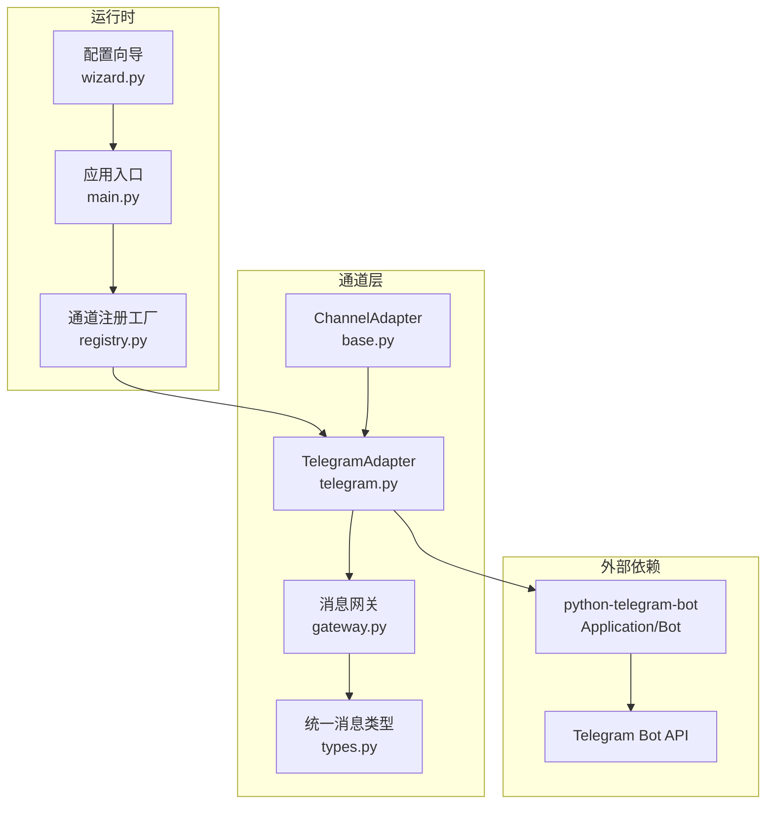
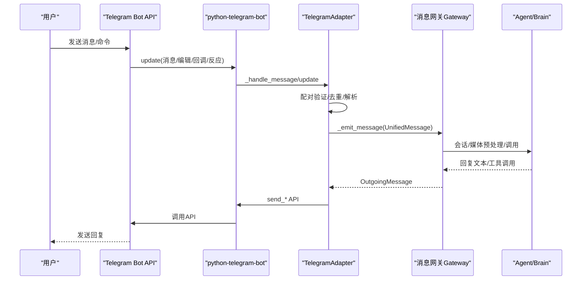
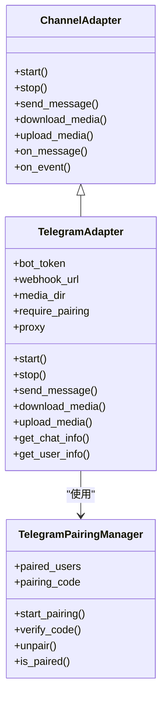

# Telegram适配器

<cite>
**本文引用的文件**
- [telegram.py](file://src/synapse/channels/adapters/telegram.py)
- [base.py](file://src/synapse/channels/base.py)
- [types.py](file://src/synapse/channels/types.py)
- [gateway.py](file://src/synapse/channels/gateway.py)
- [run_telegram_bot.py](file://scripts/run_telegram_bot.py)
- [test_telegram_simple.py](file://tests/test_telegram_simple.py)
- [TELEGRAM_IM_NOTES.md](file://docs/TELEGRAM_IM_NOTES.md)
- [wizard.py](file://src/synapse/setup/wizard.py)
- [main.py](file://src/synapse/main.py)
- [registry.py](file://src/synapse/channels/registry.py)
</cite>

## 目录
1. [简介](#简介)
2. [项目结构](#项目结构)
3. [核心组件](#核心组件)
4. [架构总览](#架构总览)
5. [详细组件分析](#详细组件分析)
6. [依赖分析](#依赖分析)
7. [性能考虑](#性能考虑)
8. [故障排查指南](#故障排查指南)
9. [结论](#结论)
10. [附录](#附录)

## 简介
本技术文档面向Telegram适配器，系统阐述其基于python-telegram-bot的事件处理、消息路由、配对验证、媒体下载上传、Inline键盘支持现状与扩展建议、Webhook与Long Polling两种接入方式、消息格式转换、用户与聊天信息获取、初始化配置、事件监听器设置、消息解析流程、错误重试与健康监测、并发处理策略与性能优化建议，并提供Telegram Bot Father创建指南与部署注意事项。

## 项目结构
Telegram适配器位于通道适配器子模块中，核心文件与周边模块如下：
- 适配器实现：src/synapse/channels/adapters/telegram.py
- 通道基类与回调接口：src/synapse/channels/base.py
- 统一消息类型定义：src/synapse/channels/types.py
- 消息网关与会话集成：src/synapse/channels/gateway.py
- 示例脚本（简易Telegram Bot）：scripts/run_telegram_bot.py
- 测试用例（底层API与消息转换）：tests/test_telegram_simple.py
- 适配器设计与问题清单文档：docs/TELEGRAM_IM_NOTES.md
- 配置向导与环境变量模板：src/synapse/setup/wizard.py
- 应用入口注册适配器：src/synapse/main.py
- 通道注册工厂：src/synapse/channels/registry.py

图表来源
- [telegram.py:374-532](file://src/synapse/channels/adapters/telegram.py#L374-L532)
- [base.py:38-105](file://src/synapse/channels/base.py#L38-L105)
- [types.py:18-615](file://src/synapse/channels/types.py#L18-L615)
- [gateway.py:1-200](file://src/synapse/channels/gateway.py#L1-L200)
- [main.py:725-756](file://src/synapse/main.py#L725-L756)
- [registry.py:89-112](file://src/synapse/channels/registry.py#L89-L112)
- [wizard.py:907-915](file://src/synapse/setup/wizard.py#L907-L915)

章节来源
- [telegram.py:1-120](file://src/synapse/channels/adapters/telegram.py#L1-L120)
- [base.py:38-105](file://src/synapse/channels/base.py#L38-L105)
- [types.py:18-120](file://src/synapse/channels/types.py#L18-L120)
- [gateway.py:1-100](file://src/synapse/channels/gateway.py#L1-L100)
- [main.py:725-756](file://src/synapse/main.py#L725-L756)
- [registry.py:89-112](file://src/synapse/channels/registry.py#L89-L112)
- [wizard.py:907-915](file://src/synapse/setup/wizard.py#L907-L915)

## 核心组件
- TelegramAdapter：适配器主体，负责启动/停止、消息收发、媒体下载上传、配对验证、错误处理与健康监测。
- TelegramPairingManager：配对管理器，维护已配对用户、生成/校验配对码、等待配对状态。
- ChannelAdapter基类：定义统一接口（start/stop/send_message/download_media/upload_media/on_message等）。
- UnifiedMessage/MessageContent/MediaFile：统一消息与媒体模型，贯穿接收与发送两端。
- 消息网关Gateway：负责会话管理、媒体预处理、Agent调用、消息路由与中断机制。

章节来源
- [telegram.py:260-373](file://src/synapse/channels/adapters/telegram.py#L260-L373)
- [telegram.py:89-286](file://src/synapse/channels/adapters/telegram.py#L89-L286)
- [base.py:38-139](file://src/synapse/channels/base.py#L38-L139)
- [types.py:18-120](file://src/synapse/channels/types.py#L18-L120)
- [gateway.py:1-100](file://src/synapse/channels/gateway.py#L1-L100)

## 架构总览
Telegram适配器通过python-telegram-bot建立与Telegram Bot API的连接，支持Long Polling与Webhook两种接入方式。消息从Bot API进入，经适配器转换为UnifiedMessage，再由网关路由至Agent与会话管理；Agent回复经OutgoingMessage封装，适配器转换为Telegram API调用，实现双向通信。

图表来源
- [telegram.py:700-783](file://src/synapse/channels/adapters/telegram.py#L700-L783)
- [gateway.py:1-200](file://src/synapse/channels/gateway.py#L1-L200)
- [telegram.py:374-532](file://src/synapse/channels/adapters/telegram.py#L374-L532)

章节来源
- [TELEGRAM_IM_NOTES.md:97-128](file://docs/TELEGRAM_IM_NOTES.md#L97-L128)
- [telegram.py:374-532](file://src/synapse/channels/adapters/telegram.py#L374-L532)
- [gateway.py:1-200](file://src/synapse/channels/gateway.py#L1-L200)

## 详细组件分析

### 1) 配置参数与初始化
- 关键配置
  - TELEGRAM_ENABLED/TELEGRAM_BOT_TOKEN：开关与令牌
  - TELEGRAM_WEBHOOK_URL：Webhook URL（留空则使用Long Polling）
  - TELEGRAM_PAIRING_CODE/TELEGRAM_REQUIRE_PAIRING：配对码与是否启用配对验证
  - TELEGRAM_PROXY：代理（支持HTTP/SOCKS5）
  - TELEGRAM_FOOTER_ELAPSED/TELEGRAM_FOOTER_STATUS：思考卡片尾部显示配置
- 初始化流程
  - 延迟导入python-telegram-bot
  - 配置HTTPXRequest连接池与超时，支持代理
  - 注册命令处理器（/start、/unpair、/status）与全消息处理器
  - 注册Bot命令菜单（set_my_commands）
  - 根据webhook_url选择Webhook或Long Polling模式
  - 启动健康监测Watchdog（非Webhook模式）

章节来源
- [TELEGRAM_IM_NOTES.md:562-597](file://docs/TELEGRAM_IM_NOTES.md#L562-L597)
- [telegram.py:374-532](file://src/synapse/channels/adapters/telegram.py#L374-L532)
- [wizard.py:907-915](file://src/synapse/setup/wizard.py#L907-L915)
- [main.py:725-756](file://src/synapse/main.py#L725-L756)
- [registry.py:89-112](file://src/synapse/channels/registry.py#L89-L112)

### 2) 事件处理与消息路由
- 接收方式
  - Long Polling：updater.start_polling，drop_pending_updates控制离线消息策略
  - Webhook：set_webhook，当前实现未启动HTTP服务（见问题3）
- 去重与健康监测
  - 基于update_id的去重队列，防止重试与抖动导致重复处理
  - Watchdog定时检查polling状态，异常时自动重启（drop_pending_updates=False）
- 命令与消息处理
  - CommandHandler优先处理/start、/unpair、/status
  - MessageHandler处理所有消息，含系统命令（由网关拦截）
- 配对验证
  - require_pairing开启时，未配对用户需输入配对码；支持等待配对状态与超时

章节来源
- [TELEGRAM_IM_NOTES.md:9-22](file://docs/TELEGRAM_IM_NOTES.md#L9-L22)
- [telegram.py:558-597](file://src/synapse/channels/adapters/telegram.py#L558-L597)
- [telegram.py:700-783](file://src/synapse/channels/adapters/telegram.py#L700-L783)
- [telegram.py:600-655](file://src/synapse/channels/adapters/telegram.py#L600-L655)

### 3) 消息格式转换与Markdown
- 接收端转换
  - _convert_message解析text/photo/voice/audio/video/document/location/sticker等
  - 对message.audio归类存在缺陷（应为files而非voices），详见问题1
  - 支持mention检测、chat_type识别、thread_id映射（Forum/Topic）
- 发送端转换
  - send_message按content.images/files/voices/videoss分发对应API
  - Markdown降级策略：默认旧版Markdown，解析失败自动回退纯文本
  - caption长度限制（1024字符）与sendMediaGroup优化（多图相册）建议详见问题11/12/14

章节来源
- [TELEGRAM_IM_NOTES.md:189-225](file://docs/TELEGRAM_IM_NOTES.md#L189-L225)
- [telegram.py:793-870](file://src/synapse/channels/adapters/telegram.py#L793-L870)
- [telegram.py:840-946](file://src/synapse/channels/adapters/telegram.py#L840-L946)
- [TELEGRAM_IM_NOTES.md:481-492](file://docs/TELEGRAM_IM_NOTES.md#L481-L492)

### 4) Inline键盘与回调支持现状与扩展
- 当前支持
  - CallbackQueryHandler与MessageReactionHandler预留注册点
  - _handle_callback_query处理安全确认按钮（sec_*）
- 未实现
  - inline_query订阅与处理
  - callback_query的完整交互（按钮点击、确认等）
- 建议
  - 扩展回调查询处理，支持安全决策与UI确认
  - 引入InlineKeyboardMarkup与回调数据约定

章节来源
- [telegram.py:434-442](file://src/synapse/channels/adapters/telegram.py#L434-L442)
- [telegram.py:666-699](file://src/synapse/channels/adapters/telegram.py#L666-L699)
- [TELEGRAM_IM_NOTES.md:169-170](file://docs/TELEGRAM_IM_NOTES.md#L169-L170)

### 5) 多媒体文件处理
- 下载
  - download_media通过_get_file()+download_to_drive，支持本地缓存与状态管理
  - 20MB下载限制（getFile限制），建议在下载前检查size并给出友好提示（问题6）
- 上传
  - upload_media在Telegram无需预上传，直接返回MediaFile
- 预处理
  - _preprocess_media对voices/files/images/videos进行下载与转写（STT）
- 发送
  - send_message支持图片/文件/语音；视频发送未实现（问题4），Sticker发送未实现（问题7）

章节来源
- [telegram.py:1618-1649](file://src/synapse/channels/adapters/telegram.py#L1618-L1649)
- [TELEGRAM_IM_NOTES.md:38-44](file://docs/TELEGRAM_IM_NOTES.md#L38-L44)
- [TELEGRAM_IM_NOTES.md:137-147](file://docs/TELEGRAM_IM_NOTES.md#L137-L147)
- [TELEGRAM_IM_NOTES.md:338-377](file://docs/TELEGRAM_IM_NOTES.md#L338-L377)

### 6) 用户与聊天信息获取
- 用户信息：get_user_info返回None（Telegram不支持直接获取用户信息）
- 聊天信息：get_chat_info通过get_chat获取id/type/title/username等

章节来源
- [telegram.py:1651-1679](file://src/synapse/channels/adapters/telegram.py#L1651-L1679)

### 7) 错误处理与重试机制
- 错误处理
  - _on_error统一捕获update处理异常，防止静默丢失
  - _on_polling_error同步函数，记录网络错误并自动重试
- 健康监测
  - _polling_watchdog定期检查updater状态，异常重启
- Markdown解析失败降级
  - 发送时遇BadRequest("Can't parse entities")自动回退纯文本

章节来源
- [telegram.py:558-597](file://src/synapse/channels/adapters/telegram.py#L558-L597)
- [TELEGRAM_IM_NOTES.md:695-701](file://docs/TELEGRAM_IM_NOTES.md#L695-L701)

### 8) 并发处理策略与性能优化
- 并发
  - python-telegram-bot内部事件循环与异步协程
  - Gateway侧工具并行执行（tool_max_parallel）与中断检查
- 限流与分片
  - 发送分片间隔（_SPLIT_SEND_INTERVAL["telegram"]=0.5s）
  - caption长度限制（1024字符）
- 代理与超时
  - HTTPXRequest连接池与超时配置，支持代理
- 建议
  - sendMediaGroup批量发送相册（问题12）
  - 优化audio与voice归类（问题1）
  - 增强Webhook服务（问题3）

章节来源
- [TELEGRAM_IM_NOTES.md:129-136](file://docs/TELEGRAM_IM_NOTES.md#L129-L136)
- [TELEGRAM_IM_NOTES.md:481-492](file://docs/TELEGRAM_IM_NOTES.md#L481-L492)
- [TELEGRAM_IM_NOTES.md:494-506](file://docs/TELEGRAM_IM_NOTES.md#L494-L506)
- [TELEGRAM_IM_NOTES.md:508-517](file://docs/TELEGRAM_IM_NOTES.md#L508-L517)

### 9) 初始化配置与事件监听器设置
- 应用入口注册
  - main.py根据settings自动注册TelegramAdapter
  - registry.py按credentials创建适配器实例
- 监听器
  - CommandHandler：/start、/unpair、/status
  - MessageHandler：filters.ALL
  - 可选：CallbackQueryHandler、MessageReactionHandler

章节来源
- [main.py:725-756](file://src/synapse/main.py#L725-L756)
- [registry.py:89-112](file://src/synapse/channels/registry.py#L89-L112)
- [telegram.py:418-442](file://src/synapse/channels/adapters/telegram.py#L418-L442)

### 10) 消息解析流程
- 接收：update.message或update.edited_message → _handle_message → 配对验证 → _convert_message → _emit_message → Gateway
- 发送：Gateway生成OutgoingMessage → send_message → _convert_to_telegram_markdown → Bot API调用 → 回退纯文本

章节来源
- [TELEGRAM_IM_NOTES.md:99-128](file://docs/TELEGRAM_IM_NOTES.md#L99-L128)
- [telegram.py:700-783](file://src/synapse/channels/adapters/telegram.py#L700-L783)
- [telegram.py:840-946](file://src/synapse/channels/adapters/telegram.py#L840-L946)

### 11) 配对管理机制
- 配对码生成与持久化（data/telegram/pairing/pairing_code.txt）
- 等待配对状态与超时（5分钟）
- 命令：/start开始配对、/unpair取消、/status查看状态

章节来源
- [TELEGRAM_IM_NOTES.md:84-94](file://docs/TELEGRAM_IM_NOTES.md#L84-L94)
- [telegram.py:89-286](file://src/synapse/channels/adapters/telegram.py#L89-L286)

### 12) Webhook与Long Polling两种接收方式
- Long Polling
  - 默认模式，drop_pending_updates=True（初次启动）
  - Watchdog重启时drop_pending_updates=False（保留消息）
- Webhook
  - set_webhook已调用，但未启动HTTP服务（当前实现不完整）
  - 建议使用start_webhook或集成到现有FastAPI/aiohttp服务

章节来源
- [TELEGRAM_IM_NOTES.md:13-21](file://docs/TELEGRAM_IM_NOTES.md#L13-L21)
- [TELEGRAM_IM_NOTES.md:310-337](file://docs/TELEGRAM_IM_NOTES.md#L310-L337)
- [telegram.py:490-516](file://src/synapse/channels/adapters/telegram.py#L490-L516)

### 13) Telegram Bot Father创建指南与部署注意事项
- 创建Bot
  - 通过@BotFather创建新Bot，获取Bot Token
- 配置向导
  - wizard.py提供交互式配置，生成.env与IM通道配置
- 部署要点
  - Long Polling无需公网IP，适合开发与内网
  - Webhook需公网HTTPS URL（当前实现未启动HTTP服务）
  - 中国大陆需配置代理（支持HTTP/SOCKS5）
  - 配对验证可选，生产环境建议开启

章节来源
- [wizard.py:907-915](file://src/synapse/setup/wizard.py#L907-L915)
- [TELEGRAM_IM_NOTES.md:562-597](file://docs/TELEGRAM_IM_NOTES.md#L562-L597)

## 依赖分析
- 适配器依赖
  - python-telegram-bot：Application/Bot/HTTPXRequest
  - 统一消息类型：types.py
  - 网关：gateway.py
- 外部依赖
  - Telegram Bot API与文件API
  - 可选代理（httpx原生代理）

图表来源
- [base.py:38-139](file://src/synapse/channels/base.py#L38-L139)
- [telegram.py:260-373](file://src/synapse/channels/adapters/telegram.py#L260-L373)
- [telegram.py:89-286](file://src/synapse/channels/adapters/telegram.py#L89-L286)

章节来源
- [base.py:38-139](file://src/synapse/channels/base.py#L38-L139)
- [telegram.py:260-373](file://src/synapse/channels/adapters/telegram.py#L260-L373)
- [telegram.py:89-286](file://src/synapse/channels/adapters/telegram.py#L89-L286)

## 性能考虑
- 连接与超时
  - HTTPXRequest连接池与超时参数已优化，代理场景下自动启用
- 发送速率
  - 分片间隔0.5s，避免限流；caption长度限制1024字符
- 媒体处理
  - 本地缓存与状态管理，20MB下载限制需注意
- 并发
  - Gateway侧工具并行与中断检查，适配器内部事件循环异步

章节来源
- [TELEGRAM_IM_NOTES.md:129-136](file://docs/TELEGRAM_IM_NOTES.md#L129-L136)
- [TELEGRAM_IM_NOTES.md:481-492](file://docs/TELEGRAM_IM_NOTES.md#L481-L492)
- [TELEGRAM_IM_NOTES.md:395-412](file://docs/TELEGRAM_IM_NOTES.md#L395-L412)

## 故障排查指南
- 连接失败
  - InvalidToken/Unauthorized：检查Bot Token
  - ConnectError：配置代理（TELEGRAM_PROXY/ALL_PROXY/HTTPS_PROXY/HTTP_PROXY）
- Polling异常
  - Watchdog检测到停止会自动重启；检查网络与代理
- Markdown解析失败
  - 自动回退纯文本；检查内容格式
- Webhook未生效
  - 当前实现未启动HTTP服务；建议使用start_webhook或集成现有服务
- 媒体下载失败
  - 20MB限制；建议在下载前检查size并提示用户

章节来源
- [telegram.py:444-464](file://src/synapse/channels/adapters/telegram.py#L444-L464)
- [telegram.py:560-573](file://src/synapse/channels/adapters/telegram.py#L560-L573)
- [TELEGRAM_IM_NOTES.md:310-337](file://docs/TELEGRAM_IM_NOTES.md#L310-L337)
- [TELEGRAM_IM_NOTES.md:395-412](file://docs/TELEGRAM_IM_NOTES.md#L395-L412)

## 结论
Telegram适配器提供了完整的消息收发、配对验证、媒体处理与错误重试机制，支持Long Polling与Webhook（当前实现不完整）。通过统一消息模型与网关集成，实现了与Agent的顺畅协作。针对音频归类、视频发送、Inline键盘、Webhook服务等，文档提出了明确的问题与修复建议，便于后续迭代完善。

## 附录
- 示例脚本：scripts/run_telegram_bot.py展示了基于python-telegram-bot的简化实现
- 测试用例：tests/test_telegram_simple.py验证了底层API与消息转换
- 设计文档：docs/TELEGRAM_IM_NOTES.md提供了功能矩阵、问题清单与修复建议

章节来源
- [run_telegram_bot.py:1-292](file://scripts/run_telegram_bot.py#L1-L292)
- [test_telegram_simple.py:1-315](file://tests/test_telegram_simple.py#L1-L315)
- [TELEGRAM_IM_NOTES.md:1-926](file://docs/TELEGRAM_IM_NOTES.md#L1-L926)