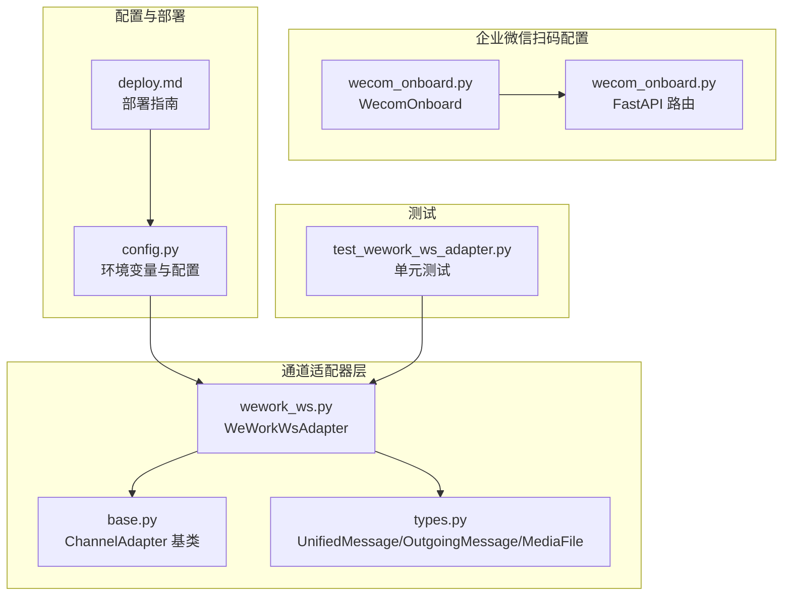
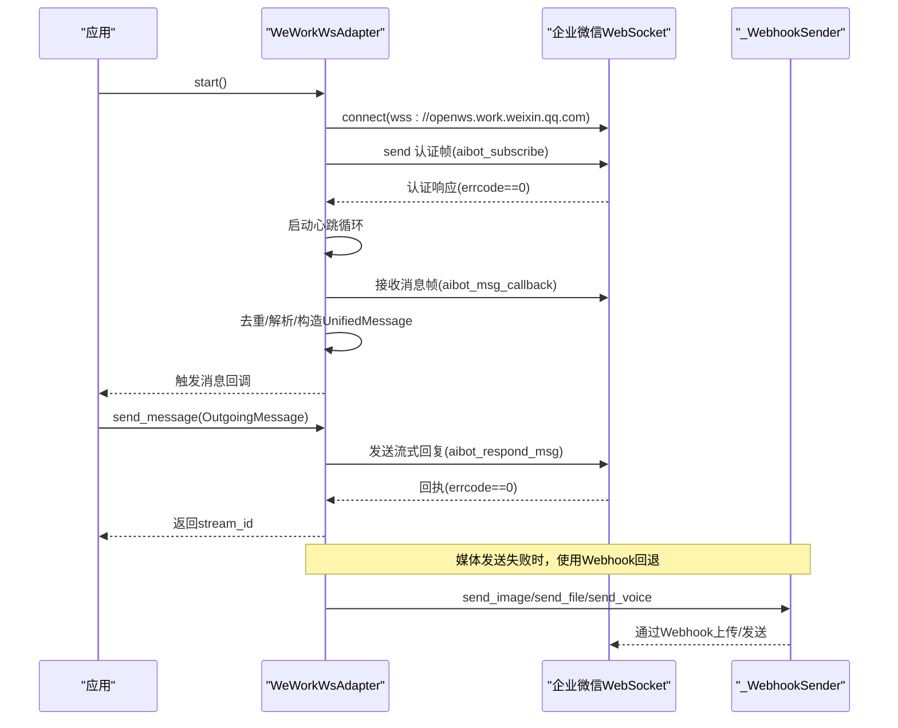
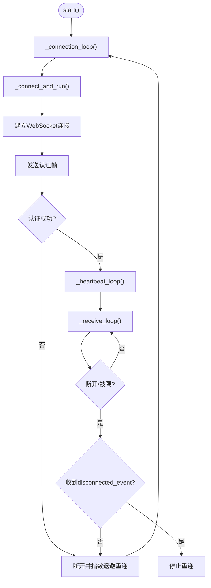
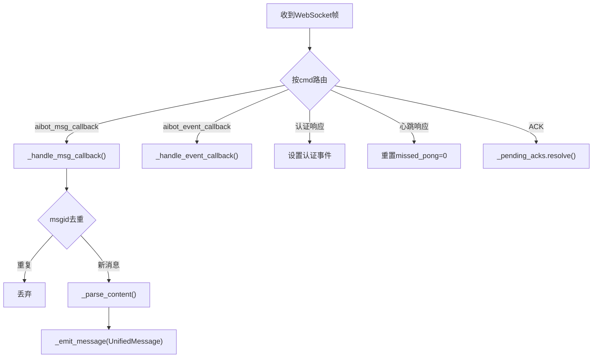
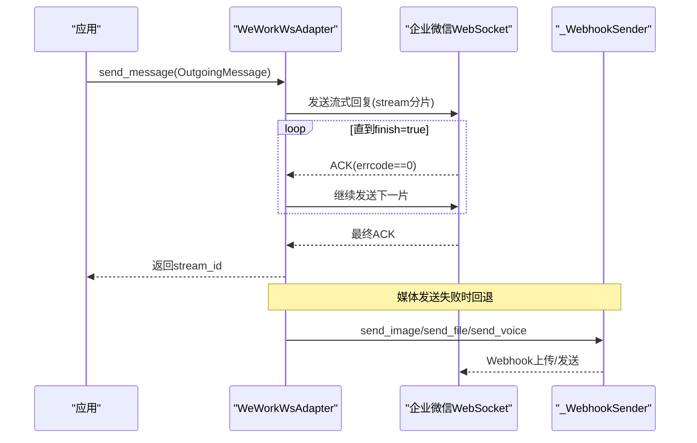
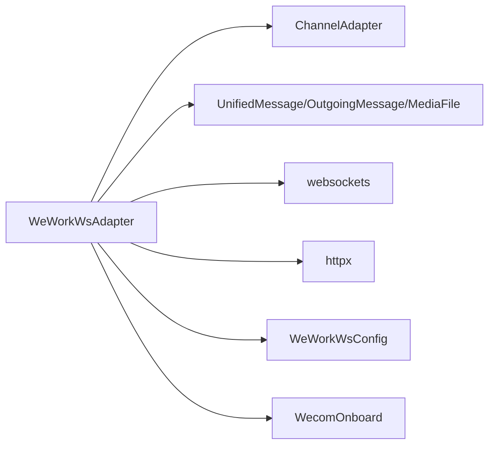

# 企业微信WebSocket适配器

<cite>
**本文档引用的文件**
- [wework_ws.py](file://src/synapse/channels/adapters/wework_ws.py)
- [WEWORK_WS_IM_NOTES.md](file://docs/WEWORK_WS_IM_NOTES.md)
- [base.py](file://src/synapse/channels/base.py)
- [types.py](file://src/synapse/channels/types.py)
- [wecom_onboard.py](file://src/synapse/setup/wecom_onboard.py)
- [wecom_onboard.py](file://src/synapse/api/routes/wecom_onboard.py)
- [config.py](file://src/synapse/config.py)
- [test_wework_ws_adapter.py](file://tests/unit/test_wework_ws_adapter.py)
- [deploy.md](file://docs/deploy.md)
</cite>

## 目录
1. [简介](#简介)
2. [项目结构](#项目结构)
3. [核心组件](#核心组件)
4. [架构总览](#架构总览)
5. [详细组件分析](#详细组件分析)
6. [依赖关系分析](#依赖关系分析)
7. [性能考量](#性能考量)
8. [故障排查指南](#故障排查指南)
9. [结论](#结论)
10. [附录](#附录)

## 简介
本技术文档面向企业微信WebSocket适配器（WeCom WebSocket Adapter），系统性阐述其架构设计、实现细节与运维实践。该适配器基于企业微信智能机器人WebSocket协议，提供：
- 实时消息接收（文本/图片/图文混排/语音/文件/视频）
- 流式回复与模板卡片回复
- 事件监听（进入会话/模板卡片点击/用户反馈/连接断开）
- 主动推送（Markdown/模板卡片/图片/文件/语音/视频）
- WebSocket分片上传临时素材
- 文件下载与AES-256-CBC逐文件解密
- 心跳保活、指数退避重连、消息去重、并发控制与错误恢复

## 项目结构
企业微信WebSocket适配器位于通道适配器子模块中，采用模块化设计，核心文件如下：
- 适配器实现：`src/synapse/channels/adapters/wework_ws.py`
- 协议与功能说明：`docs/WEWORK_WS_IM_NOTES.md`
- 通道基类与统一消息类型：`src/synapse/channels/base.py`、`src/synapse/channels/types.py`
- 企业微信扫码配置（QR Onboarding）：`src/synapse/setup/wecom_onboard.py`、`src/synapse/api/routes/wecom_onboard.py`
- 配置与部署：`src/synapse/config.py`、`docs/deploy.md`
- 单元测试：`tests/unit/test_wework_ws_adapter.py`

**图表来源**
- [wework_ws.py:514-800](file://src/synapse/channels/adapters/wework_ws.py#L514-L800)
- [base.py:38-158](file://src/synapse/channels/base.py#L38-L158)
- [types.py:197-466](file://src/synapse/channels/types.py#L197-L466)
- [wecom_onboard.py:41-133](file://src/synapse/setup/wecom_onboard.py#L41-L133)
- [wecom_onboard.py:15-53](file://src/synapse/api/routes/wecom_onboard.py#L15-L53)
- [config.py:323-337](file://src/synapse/config.py#L323-L337)
- [deploy.md:685-761](file://docs/deploy.md#L685-L761)
- [test_wework_ws_adapter.py:1-120](file://tests/unit/test_wework_ws_adapter.py#L1-L120)

**章节来源**
- [wework_ws.py:1-120](file://src/synapse/channels/adapters/wework_ws.py#L1-L120)
- [WEWORK_WS_IM_NOTES.md:1-120](file://docs/WEWORK_WS_IM_NOTES.md#L1-L120)
- [base.py:38-158](file://src/synapse/channels/base.py#L38-L158)
- [types.py:197-466](file://src/synapse/channels/types.py#L197-L466)
- [wecom_onboard.py:41-133](file://src/synapse/setup/wecom_onboard.py#L41-L133)
- [wecom_onboard.py:15-53](file://src/synapse/api/routes/wecom_onboard.py#L15-L53)
- [config.py:323-337](file://src/synapse/config.py#L323-L337)
- [deploy.md:685-761](file://docs/deploy.md#L685-L761)
- [test_wework_ws_adapter.py:1-120](file://tests/unit/test_wework_ws_adapter.py#L1-L120)

## 核心组件
- WeWorkWsAdapter：适配器主体，负责连接管理、消息解析、事件处理、媒体上传与回复路由。
- WeWorkWsConfig：适配器配置对象，包含bot_id、secret、ws_url、心跳间隔、重连策略、回复ACK超时等。
- _WebhookSender：Webhook辅助发送器，用于图片/语音/文件的HTTP回退发送。
- _RateLimitTracker：频率限制跟踪器，按会话维度记录回复与主动发送频率。
- 统一消息类型：UnifiedMessage、OutgoingMessage、MessageContent、MediaFile，支撑跨平台消息抽象。

**章节来源**
- [wework_ws.py:514-633](file://src/synapse/channels/adapters/wework_ws.py#L514-L633)
- [wework_ws.py:332-351](file://src/synapse/channels/adapters/wework_ws.py#L332-L351)
- [wework_ws.py:385-510](file://src/synapse/channels/adapters/wework_ws.py#L385-L510)
- [wework_ws.py:180-245](file://src/synapse/channels/adapters/wework_ws.py#L180-L245)
- [types.py:197-466](file://src/synapse/channels/types.py#L197-L466)

## 架构总览
适配器采用异步事件驱动架构，通过WebSocket与企业微信服务端建立长连接，实现双向通信。整体架构包括：
- 连接生命周期：start → 连接循环 → 认证 → 心跳与接收 → 断开与指数退避重连
- 消息处理：接收帧 → 路由分发 → 消息解析 → 去重与回调触发
- 事件处理：enter_chat/template_card_event/feedback_event/disconnected_event
- 媒体处理：下载 → AES-256-CBC解密 → WS分片上传 → 媒体ID回传
- 并发控制：按req_id串行回复、按chat_id串行消息处理、回复ACK超时与重试

**图表来源**
- [wework_ws.py:685-790](file://src/synapse/channels/adapters/wework_ws.py#L685-L790)
- [wework_ws.py:792-800](file://src/synapse/channels/adapters/wework_ws.py#L792-L800)
- [wework_ws.py:489-503](file://src/synapse/channels/adapters/wework_ws.py#L489-L503)

**章节来源**
- [wework_ws.py:685-790](file://src/synapse/channels/adapters/wework_ws.py#L685-L790)
- [WEWORK_WS_IM_NOTES.md:276-345](file://docs/WEWORK_WS_IM_NOTES.md#L276-L345)

## 详细组件分析

### 连接管理与生命周期
- 启动与停止：start()创建连接任务，stop()取消心跳与接收任务，关闭WebSocket与Webhook客户端。
- 连接循环：指数退避重连，最大重连次数可配置；认证失败累计达到阈值后永久禁用适配器。
- 认证：连接后立即发送订阅帧，等待10秒认证响应；认证失败则断开并重连。
- 心跳保活：30秒间隔发送ping，missed_pong超过阈值触发断开与重连。
- 断线与踢下线：收到disconnected_event时设置_displaced并停止重连，避免无限循环。

**图表来源**
- [wework_ws.py:685-744](file://src/synapse/channels/adapters/wework_ws.py#L685-L744)
- [wework_ws.py:745-790](file://src/synapse/channels/adapters/wework_ws.py#L745-L790)

**章节来源**
- [wework_ws.py:649-682](file://src/synapse/channels/adapters/wework_ws.py#L649-L682)
- [wework_ws.py:685-744](file://src/synapse/channels/adapters/wework_ws.py#L685-L744)
- [wework_ws.py:745-790](file://src/synapse/channels/adapters/wework_ws.py#L745-L790)

### 配置参数与初始化
- WeWorkWsConfig：包含bot_id、secret、ws_url、心跳间隔、最大missed_pong、最大重连次数、基础/最大重连延迟、回复ACK超时、最大回复队列等。
- 初始化：设置媒体目录、欢迎消息、Webhook辅助发送器、状态标志、去重缓存、回复ACK映射、流式状态、速率限制器等。

**章节来源**
- [wework_ws.py:332-351](file://src/synapse/channels/adapters/wework_ws.py#L332-L351)
- [wework_ws.py:546-633](file://src/synapse/channels/adapters/wework_ws.py#L546-L633)

### 消息接收与解析
- 帧路由：按cmd分发至消息回调、事件回调、认证响应、心跳响应或ACK处理。
- 消息解析：支持text/image/mixed/voice/file/video，引用消息quote解析，think标签归一化。
- 去重：按msgid去重，10分钟TTL + 数量上限500的LRU淘汰。
- 回调触发：构造UnifiedMessage，触发消息回调。

**图表来源**
- [wework_ws.py:800-800](file://src/synapse/channels/adapters/wework_ws.py#L800-L800)
- [wework_ws.py:800-800](file://src/synapse/channels/adapters/wework_ws.py#L800-L800)

**章节来源**
- [wework_ws.py:800-800](file://src/synapse/channels/adapters/wework_ws.py#L800-L800)
- [wework_ws.py:800-800](file://src/synapse/channels/adapters/wework_ws.py#L800-L800)

### 事件处理
- enter_chat：进入会话事件，可触发欢迎语回复。
- template_card_event：模板卡片点击事件。
- feedback_event：用户反馈事件。
- disconnected_event：连接被新连接踢下线，停止重连。

**章节来源**
- [wework_ws.py:800-800](file://src/synapse/channels/adapters/wework_ws.py#L800-L800)
- [WEWORK_WS_IM_NOTES.md:108-116](file://docs/WEWORK_WS_IM_NOTES.md#L108-L116)

### 流式回复与媒体发送
- 流式回复：按20480字节分片发送，finish=true表示结束；中间流消息不超过85帧。
- 主动推送：生成自定义req_id，支持Markdown与模板卡片。
- 媒体发送：优先通过WS分片上传获取media_id，失败时回退Webhook；语音优先AMR格式。
- 媒体上传协议：init/chunk/finish三步，支持图片/语音/视频/文件，上传会话30分钟有效期。

**图表来源**
- [wework_ws.py:489-503](file://src/synapse/channels/adapters/wework_ws.py#L489-L503)
- [WEWORK_WS_IM_NOTES.md:137-158](file://docs/WEWORK_WS_IM_NOTES.md#L137-L158)

**章节来源**
- [wework_ws.py:489-503](file://src/synapse/channels/adapters/wework_ws.py#L489-L503)
- [WEWORK_WS_IM_NOTES.md:137-158](file://docs/WEWORK_WS_IM_NOTES.md#L137-L158)

### 文件下载与解密
- 下载：HTTP GET获取文件，从Content-Disposition解析文件名。
- 解密：逐文件AES-256-CBC解密，iv=key[:16]，PKCS#7填充。
- 上传：WS分片上传，init/chunk/finish，返回media_id。

**章节来源**
- [wework_ws.py:357-380](file://src/synapse/channels/adapters/wework_ws.py#L357-L380)
- [WEWORK_WS_IM_NOTES.md:137-158](file://docs/WEWORK_WS_IM_NOTES.md#L137-L158)

### 并发控制与错误恢复
- 按req_id串行回复：确保同一消息的回复顺序与ACK一致性。
- 按chat_id串行消息处理：避免同一会话消息并发导致乱序。
- 回复ACK超时：默认15秒，超时后触发重试或回退。
- 失败回复队列：断连时暂存最终回复，重连后通过response_url或主动推送重试。
- 速率限制：按会话维度记录24小时回复与当日主动发送频率，接近阈值发出警告。

**章节来源**
- [wework_ws.py:180-245](file://src/synapse/channels/adapters/wework_ws.py#L180-L245)
- [wework_ws.py:606-610](file://src/synapse/channels/adapters/wework_ws.py#L606-L610)

### 企业微信应用配置与扫码配置
- 企业微信应用配置：在管理后台创建应用，获取bot_id与secret；支持WebSocket长连接模式与HTTP回调模式。
- 扫码配置：通过WecomOnboard生成二维码与轮询结果，获取bot_id与secret；提供Web API路由与桌面端UI集成。

**章节来源**
- [wecom_onboard.py:41-133](file://src/synapse/setup/wecom_onboard.py#L41-L133)
- [wecom_onboard.py:15-53](file://src/synapse/api/routes/wecom_onboard.py#L15-L53)
- [WEWORK_WS_IM_NOTES.md:240-273](file://docs/WEWORK_WS_IM_NOTES.md#L240-L273)

## 依赖关系分析
适配器依赖关系清晰，遵循分层设计：
- 适配器依赖通道基类与统一消息类型，保证跨平台一致性。
- 适配器依赖第三方库（websockets、httpx）进行WebSocket与HTTP通信。
- 适配器依赖配置模块与部署文档，确保运行环境与参数正确。

**图表来源**
- [wework_ws.py:34-76](file://src/synapse/channels/adapters/wework_ws.py#L34-L76)
- [base.py:38-158](file://src/synapse/channels/base.py#L38-L158)
- [types.py:197-466](file://src/synapse/channels/types.py#L197-L466)
- [config.py:323-337](file://src/synapse/config.py#L323-L337)
- [wecom_onboard.py:41-133](file://src/synapse/setup/wecom_onboard.py#L41-L133)

**章节来源**
- [wework_ws.py:34-76](file://src/synapse/channels/adapters/wework_ws.py#L34-L76)
- [base.py:38-158](file://src/synapse/channels/base.py#L38-L158)
- [types.py:197-466](file://src/synapse/channels/types.py#L197-L466)
- [config.py:323-337](file://src/synapse/config.py#L323-L337)
- [wecom_onboard.py:41-133](file://src/synapse/setup/wecom_onboard.py#L41-L133)

## 性能考量
- 流式分片：20480字节/片，中间流消息≤85帧，避免超限。
- 心跳保活：30秒心跳，missed_pong阈值2，防止长时间无响应。
- 去重缓存：OrderedDict + TTL + LRU，控制内存占用。
- 速率限制：24小时回复与当日主动发送双维度滑动窗口，80%阈值预警。
- 并发控制：按req_id与chat_id串行，减少锁竞争与消息乱序。

[本节为通用指导，无需具体文件分析]

## 故障排查指南
- 认证失败：检查bot_id与secret是否正确；连续失败达到阈值后适配器被永久禁用。
- 连接断开：查看心跳missed_pong与disconnected_event；确认网络与防火墙。
- 媒体发送失败：检查ffmpeg是否可用；回退Webhook发送；语音优先AMR格式。
- 消息重复：检查msgid去重逻辑与TTL设置；确认服务重启导致缓存清空。
- 回复超时：调整reply_ack_timeout；检查上游处理耗时；启用主动推送回退。

**章节来源**
- [wework_ws.py:685-744](file://src/synapse/channels/adapters/wework_ws.py#L685-L744)
- [wework_ws.py:180-245](file://src/synapse/channels/adapters/wework_ws.py#L180-L245)
- [test_wework_ws_adapter.py:142-174](file://tests/unit/test_wework_ws_adapter.py#L142-L174)

## 结论
企业微信WebSocket适配器通过标准化的协议实现与严格的并发控制，提供了稳定可靠的实时消息通道。其完善的去重、限流、重连与回退机制，使其适用于生产环境。配合扫码配置与部署指南，可快速完成企业微信机器人的接入与上线。

[本节为总结性内容，无需具体文件分析]

## 附录

### 配置参数一览
- 企业微信WebSocket配置（.env）：WEWORK_WS_ENABLED、WEWORK_WS_BOT_ID、WEWORK_WS_SECRET、WEWORK_WS_THINKING_INDICATOR、WEWORK_WS_MSG_ITEM_IMAGES、WEWORK_WS_WEBHOOK_URL。
- 企业微信HTTP回调配置（.env）：WEWORK_ENABLED、WEWORK_CORP_ID、WEWORK_TOKEN、WEWORK_ENCODING_AES_KEY、WEWORK_CALLBACK_PORT、WEWORK_CALLBACK_HOST。

**章节来源**
- [config.py:323-337](file://src/synapse/config.py#L323-L337)
- [deploy.md:511-522](file://docs/deploy.md#L511-L522)

### 生产部署建议
- 使用systemd/Docker守护进程，确保服务自启动与健康监控。
- 配置代理与网络策略，保障WebSocket长连接稳定性。
- 监控日志与指标，关注认证失败、连接断开、媒体上传失败与回复超时。

**章节来源**
- [deploy.md:685-761](file://docs/deploy.md#L685-L761)