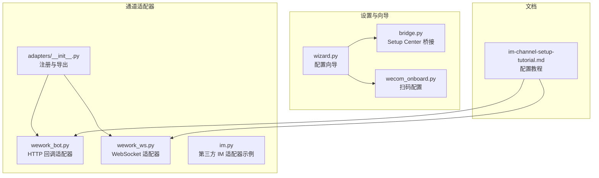
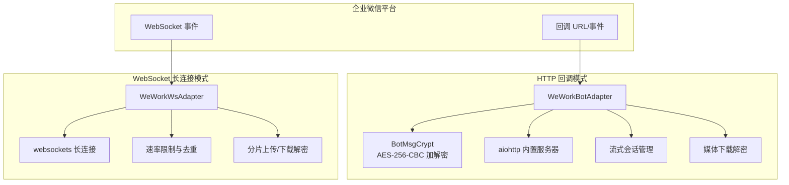
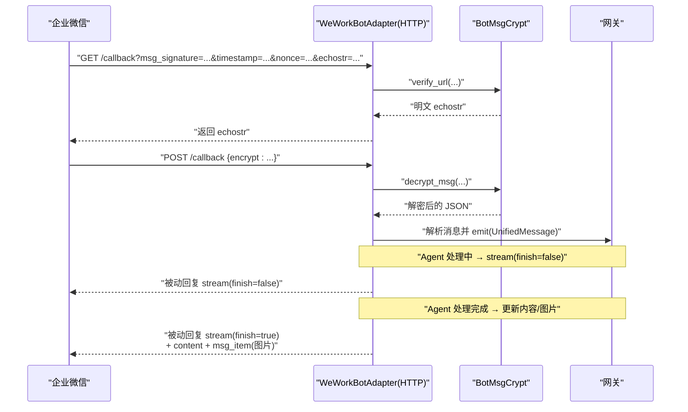
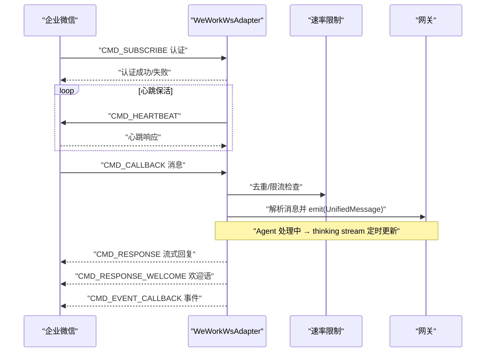
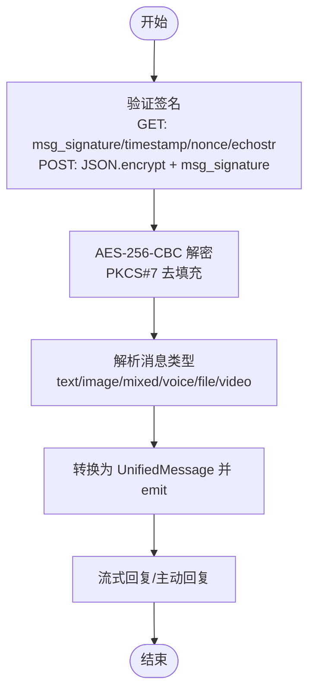
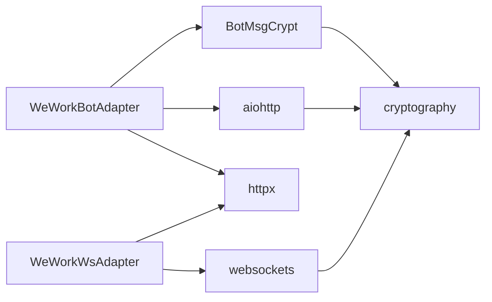

# 企业微信机器人适配器

<cite>
**本文档引用的文件**
- [wework_bot.py](file://src/synapse/channels/adapters/wework_bot.py)
- [wework_ws.py](file://src/synapse/channels/adapters/wework_ws.py)
- [im.py](file://src/synapse/integrations/adapters/im.py)
- [wecom_onboard.py](file://src/synapse/setup/wecom_onboard.py)
- [__init__.py](file://src/synapse/channels/adapters/__init__.py)
- [wizard.py](file://src/synapse/setup/wizard.py)
- [bridge.py](file://src/synapse/setup_center/bridge.py)
- [im-channel-setup-tutorial.md](file://docs/im-channel-setup-tutorial.md)
</cite>

## 目录
1. [简介](#简介)
2. [项目结构](#项目结构)
3. [核心组件](#核心组件)
4. [架构总览](#架构总览)
5. [详细组件分析](#详细组件分析)
6. [依赖关系分析](#依赖关系分析)
7. [性能考虑](#性能考虑)
8. [故障排除指南](#故障排除指南)
9. [结论](#结论)
10. [附录](#附录)

## 简介
本技术文档面向企业微信机器人适配器的实现与使用，涵盖两种接入模式：
- HTTP 回调模式（智能机器人）：基于 aiohttp 内置 HTTP 服务器接收 JSON 格式的加密回调消息，支持消息加解密、流式被动回复、媒体下载解密与图片队列发送。
- WebSocket 长连接模式（智能机器人）：基于 websockets 的长连接，支持消息接收、流式回复、事件回调、主动推送与媒体上传。

文档重点说明配置参数（corp_id、token、encoding_aes_key、callback_port、callback_host 等）、消息签名验证、消息解析流程、重试与降级机制、错误处理策略、Webhook 配置方法、消息格式规范、安全验证流程、批量消息处理、性能优化建议与部署注意事项，并提供企业微信管理后台的机器人配置指南与常见问题排查方法。

## 项目结构
企业微信适配器位于通道适配器子模块中，包含 HTTP 回调与 WebSocket 两种实现，并提供统一的注册入口与创建工厂。

**图表来源**
- [__init__.py:1-34](file://src/synapse/channels/adapters/__init__.py#L1-L34)
- [wework_bot.py:1-200](file://src/synapse/channels/adapters/wework_bot.py#L1-L200)
- [wework_ws.py:1-200](file://src/synapse/channels/adapters/wework_ws.py#L1-L200)
- [wizard.py:1046-1075](file://src/synapse/setup/wizard.py#L1046-L1075)
- [bridge.py:536-541](file://src/synapse/setup_center/bridge.py#L536-L541)
- [wecom_onboard.py:1-133](file://src/synapse/setup/wecom_onboard.py#L1-L133)
- [im-channel-setup-tutorial.md:688-800](file://docs/im-channel-setup-tutorial.md#L688-L800)

**章节来源**
- [__init__.py:1-34](file://src/synapse/channels/adapters/__init__.py#L1-L34)
- [wizard.py:1046-1075](file://src/synapse/setup/wizard.py#L1046-L1075)
- [bridge.py:536-541](file://src/synapse/setup_center/bridge.py#L536-L541)
- [im-channel-setup-tutorial.md:688-800](file://docs/im-channel-setup-tutorial.md#L688-L800)

## 核心组件
- WeWorkBotAdapter（HTTP 回调模式）
  - 内置 aiohttp HTTP 服务器，处理 GET/POST 回调
  - 消息加解密（AES-256-CBC，receiveid 为空）
  - 流式被动回复（stream），支持文字 + 图片混排
  - response_url 主动回复（markdown，备用）
  - 媒体下载解密与本地缓存
- WeWorkWsAdapter（WebSocket 长连接模式）
  - WebSocket 长连接，支持消息接收、流式回复、事件回调
  - 主动消息推送（markdown、模板卡片、图片/语音/文件）
  - 媒体分片上传与下载解密
  - 指数退避重连、心跳保活、去重与速率限制
- WeComAdapter（第三方 IM 适配器，示例）
  - 基于 webhook 的消息发送（非回调接收）

**章节来源**
- [wework_bot.py:346-387](file://src/synapse/channels/adapters/wework_bot.py#L346-L387)
- [wework_ws.py:514-544](file://src/synapse/channels/adapters/wework_ws.py#L514-L544)
- [im.py:56-79](file://src/synapse/integrations/adapters/im.py#L56-L79)

## 架构总览
企业微信适配器采用“适配器 + 加解密 + 媒体处理”的分层设计，支持两种接入路径：

**图表来源**
- [wework_bot.py:463-503](file://src/synapse/channels/adapters/wework_bot.py#L463-L503)
- [wework_ws.py:685-744](file://src/synapse/channels/adapters/wework_ws.py#L685-L744)

**章节来源**
- [wework_bot.py:463-503](file://src/synapse/channels/adapters/wework_bot.py#L463-L503)
- [wework_ws.py:685-744](file://src/synapse/channels/adapters/wework_ws.py#L685-L744)

## 详细组件分析

### HTTP 回调模式（WeWorkBotAdapter）
- 配置参数
  - corp_id：企业 ID（必填）
  - token：回调验证 Token（必填）
  - encoding_aes_key：EncodingAESKey（必填）
  - callback_port：回调端口（默认 9880）
  - callback_host：绑定主机（默认 0.0.0.0）
  - media_dir：媒体文件本地缓存目录
- 回调验证与消息解密
  - GET 回调：verify_url 校验 URL，返回明文 echostr
  - POST 回调：decrypt_msg 解密 JSON，验证签名
- 流式被动回复
  - 创建 StreamSession，被动回复 stream(finish=false)
  - 企业微信定期刷新回调，返回当前内容或最终内容
  - settle 延迟确保 send_image 入队完成后再 finish
- 主动回复降级
  - response_url 有效期 1 小时，仅可调用一次
  - 超时或已完成时使用 response_url 发送 markdown
- 媒体处理
  - 下载 URL 内容，使用 EncodingAESKey 解密
  - 保存到本地 media_dir，供后续使用

**图表来源**
- [wework_bot.py:548-601](file://src/synapse/channels/adapters/wework_bot.py#L548-L601)
- [wework_bot.py:602-714](file://src/synapse/channels/adapters/wework_bot.py#L602-L714)
- [wework_bot.py:731-829](file://src/synapse/channels/adapters/wework_bot.py#L731-L829)

**章节来源**
- [wework_bot.py:322-341](file://src/synapse/channels/adapters/wework_bot.py#L322-L341)
- [wework_bot.py:548-601](file://src/synapse/channels/adapters/wework_bot.py#L548-L601)
- [wework_bot.py:731-829](file://src/synapse/channels/adapters/wework_bot.py#L731-L829)
- [wework_bot.py:1225-1280](file://src/synapse/channels/adapters/wework_bot.py#L1225-L1280)
- [wework_bot.py:1307-1360](file://src/synapse/channels/adapters/wework_bot.py#L1307-L1360)
- [wework_bot.py:1557-1599](file://src/synapse/channels/adapters/wework_bot.py#L1557-L1599)

### WebSocket 长连接模式（WeWorkWsAdapter）
- 配置参数
  - bot_id：机器人 ID（必填）
  - secret：机器人密钥（必填）
  - ws_url：WebSocket 地址（默认 wss://openws.work.weixin.qq.com）
  - 心跳间隔、最大重连次数、指数退避参数
- 连接与认证
  - 认证帧包含 bot_id 与 secret
  - 心跳保活，missed pong 超限时断开
  - 连接断开事件（disconnected_event）阻止无限重连
- 消息与事件处理
  - CMD_CALLBACK：消息回调，解析内容与引用，去重与速率限制
  - CMD_EVENT_CALLBACK：事件回调（enter_chat、template_card_event、feedback_event、disconnected_event）
- 流式回复与思考指示器
  - 预发送 thinking stream，定时更新计数
  - finalize_stream 整合思考过程、链路与回复文本
- 媒体处理
  - 分片上传临时素材，获取 media_id
  - per-file aeskey 解密下载内容
  - 图片压缩与 msg_item 兼容回退

**图表来源**
- [wework_ws.py:792-803](file://src/synapse/channels/adapters/wework_ws.py#L792-L803)
- [wework_ws.py:806-833](file://src/synapse/channels/adapters/wework_ws.py#L806-L833)
- [wework_ws.py:908-940](file://src/synapse/channels/adapters/wework_ws.py#L908-L940)
- [wework_ws.py:1143-1208](file://src/synapse/channels/adapters/wework_ws.py#L1143-L1208)

**章节来源**
- [wework_ws.py:332-352](file://src/synapse/channels/adapters/wework_ws.py#L332-L352)
- [wework_ws.py:685-744](file://src/synapse/channels/adapters/wework_ws.py#L685-L744)
- [wework_ws.py:908-940](file://src/synapse/channels/adapters/wework_ws.py#L908-L940)
- [wework_ws.py:1143-1208](file://src/synapse/channels/adapters/wework_ws.py#L1143-L1208)
- [wework_ws.py:1490-1506](file://src/synapse/channels/adapters/wework_ws.py#L1490-L1506)

### 消息格式与安全验证
- HTTP 回调模式
  - GET 验证：msg_signature、timestamp、nonce、echostr
  - POST 回调：JSON 格式，字段 encrypt，签名验证后解密
  - 加密算法：AES-256-CBC，PKCS#7 填充，receiveid 为空字符串
- WebSocket 长连接模式
  - 帧结构：cmd、headers.req_id、body
  - 认证帧：bot_id + secret
  - 心跳帧：ping
- 媒体下载解密
  - 智能机器人图片/文件 URL 下载内容经 AES 加密，使用 EncodingAESKey 解密

**图表来源**
- [wework_bot.py:185-221](file://src/synapse/channels/adapters/wework_bot.py#L185-L221)
- [wework_bot.py:833-872](file://src/synapse/channels/adapters/wework_bot.py#L833-L872)
- [wework_ws.py:941-1139](file://src/synapse/channels/adapters/wework_ws.py#L941-L1139)

**章节来源**
- [wework_bot.py:185-221](file://src/synapse/channels/adapters/wework_bot.py#L185-L221)
- [wework_ws.py:941-1139](file://src/synapse/channels/adapters/wework_ws.py#L941-L1139)

### 配置参数与部署
- HTTP 回调模式（智能机器人）
  - 必填：WEWORK_CORP_ID、WEWORK_TOKEN、WEWORK_ENCODING_AES_KEY
  - 可选：WEWORK_CALLBACK_PORT、WEWORK_CALLBACK_HOST
  - 需要公网可访问的回调 URL（如 http://your-domain:9880/callback）
- WebSocket 长连接模式（智能机器人）
  - 必填：WEWORK_WS_BOT_ID、WEWORK_WS_SECRET
  - 可选：WEWORK_WS_ENABLED、WEWORK_MODE（websocket/http）
- Setup Center 与向导
  - wizard.py 提示输入 corp_id、token、encoding_aes_key、callback 端口与主机
  - bridge.py 定义通道启用键与必需键
- 管理后台配置
  - 智能机器人 → 接收消息服务器配置 → URL（回调地址）
  - WebSocket 事件订阅（长连接模式）

**章节来源**
- [wizard.py:1046-1075](file://src/synapse/setup/wizard.py#L1046-L1075)
- [bridge.py:536-541](file://src/synapse/setup_center/bridge.py#L536-L541)
- [im-channel-setup-tutorial.md:698-800](file://docs/im-channel-setup-tutorial.md#L698-L800)

## 依赖关系分析
- 组件耦合
  - WeWorkBotAdapter 依赖 BotMsgCrypt（加解密）、aiohttp（HTTP 服务器）、httpx（HTTP 客户端）
  - WeWorkWsAdapter 依赖 websockets（长连接）、httpx（分片上传）、速率限制与去重模块
- 外部依赖
  - cryptography（AES-256-CBC）
  - aiohttp/aiohttp.web（HTTP 服务器）
  - websockets（WebSocket）
  - httpx（HTTP 客户端）
- 潜在循环依赖
  - 适配器之间无直接循环依赖，通过网关与类型定义解耦

**图表来源**
- [wework_bot.py:56-76](file://src/synapse/channels/adapters/wework_bot.py#L56-L76)
- [wework_ws.py:48-76](file://src/synapse/channels/adapters/wework_ws.py#L48-L76)

**章节来源**
- [wework_bot.py:56-76](file://src/synapse/channels/adapters/wework_bot.py#L56-L76)
- [wework_ws.py:48-76](file://src/synapse/channels/adapters/wework_ws.py#L48-L76)

## 性能考虑
- 流式会话与 settle 延迟
  - STREAM_SETTLE_DELAY（默认 8 秒）确保图片入队完成后再 finish，避免丢失
  - STREAM_TIMEOUT（默认 330 秒）限制最长流式会话时间，超时强制结束
- 媒体处理
  - 图片格式转换与压缩（JPG/PNG，≤10MB，最多 10 张）
  - 分片上传（WebSocket）与回退（Webhook）结合，提升成功率
- 速率限制与去重
  - 按 chat_id 滑动窗口限制回复频率
  - 按 msgid 去重，支持 TTL 与容量上限
- 心跳与重连
  - 指数退避重连，避免频繁重试
  - 心跳保活，missed pong 超限断开，防止僵尸连接

**章节来源**
- [wework_bot.py:279-285](file://src/synapse/channels/adapters/wework_bot.py#L279-L285)
- [wework_ws.py:180-245](file://src/synapse/channels/adapters/wework_ws.py#L180-L245)
- [wework_ws.py:806-833](file://src/synapse/channels/adapters/wework_ws.py#L806-L833)

## 故障排除指南
- HTTP 回调模式
  - 端口占用/权限不足：启动回调服务器时报错，检查 callback_port 与权限
  - URL 验证失败：核对 token、encoding_aes_key、签名算法
  - 消息解密失败：确认 EncodingAESKey 与 receiveid 空字符串规则
  - 流式会话超时：检查 STREAM_TIMEOUT 与 settle 延迟配置
  - response_url 失效：response_url 仅能使用一次，且有效期 1 小时
- WebSocket 长连接模式
  - 认证失败：核对 bot_id 与 secret，关注致命错误码
  - 连接断开：disconnected_event 表示被其他连接抢占，停止重连
  - 心跳失败：检查网络连通性与代理设置
  - 媒体上传失败：回退到 Webhook 或检查分片上传参数
- 通用问题
  - 代理与网络：确保公网可访问或使用内网穿透工具
  - 依赖缺失：安装 cryptography、aiohttp、websockets 等依赖

**章节来源**
- [wework_bot.py:531-542](file://src/synapse/channels/adapters/wework_bot.py#L531-L542)
- [wework_bot.py:1331-1360](file://src/synapse/channels/adapters/wework_bot.py#L1331-L1360)
- [wework_ws.py:688-744](file://src/synapse/channels/adapters/wework_ws.py#L688-L744)
- [wework_ws.py:893-896](file://src/synapse/channels/adapters/wework_ws.py#L893-L896)

## 结论
企业微信机器人适配器提供了两种稳定可靠的接入方式：HTTP 回调模式适合简单部署与公网可访问场景；WebSocket 长连接模式适合复杂交互与高并发场景。通过完善的加解密、流式回复、媒体处理与错误处理机制，适配器能够满足企业微信生态下的多样化需求。建议在生产环境中优先使用 WebSocket 模式，并配合内网穿透或公网服务器确保回调可达性。

## 附录

### 配置参数清单
- HTTP 回调模式（智能机器人）
  - WEWORK_CORP_ID：企业 ID（必填）
  - WEWORK_TOKEN：回调 Token（必填）
  - WEWORK_ENCODING_AES_KEY：EncodingAESKey（必填）
  - WEWORK_CALLBACK_PORT：回调端口（默认 9880）
  - WEWORK_CALLBACK_HOST：绑定主机（默认 0.0.0.0）
- WebSocket 长连接模式（智能机器人）
  - WEWORK_WS_BOT_ID：机器人 ID（必填）
  - WEWORK_WS_SECRET：机器人密钥（必填）
  - WEWORK_WS_ENABLED：启用开关
  - WEWORK_MODE：模式选择（websocket/http）

**章节来源**
- [wizard.py:1046-1075](file://src/synapse/setup/wizard.py#L1046-L1075)
- [bridge.py:536-541](file://src/synapse/setup_center/bridge.py#L536-L541)

### 企业微信管理后台配置步骤（HTTP 回调）
- 获取企业 ID（Corp ID）
- 在“应用管理 → 智能机器人”创建机器人
- “接收消息服务器配置”填写回调 URL（公网可访问）
- 保存后平台立即验证回调 URL

**章节来源**
- [im-channel-setup-tutorial.md:754-800](file://docs/im-channel-setup-tutorial.md#L754-L800)