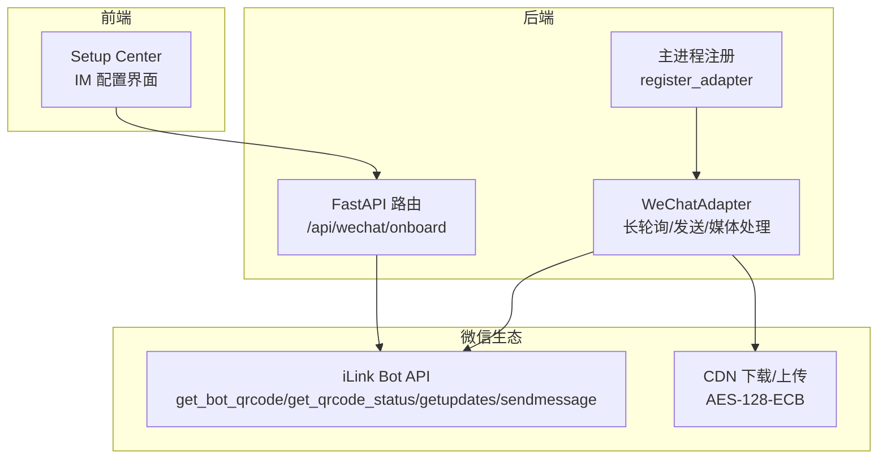
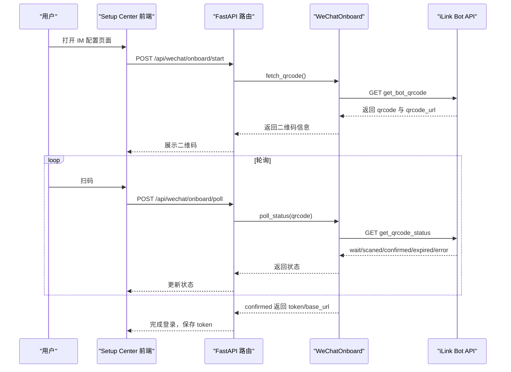
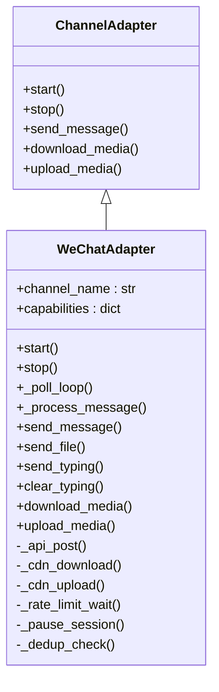
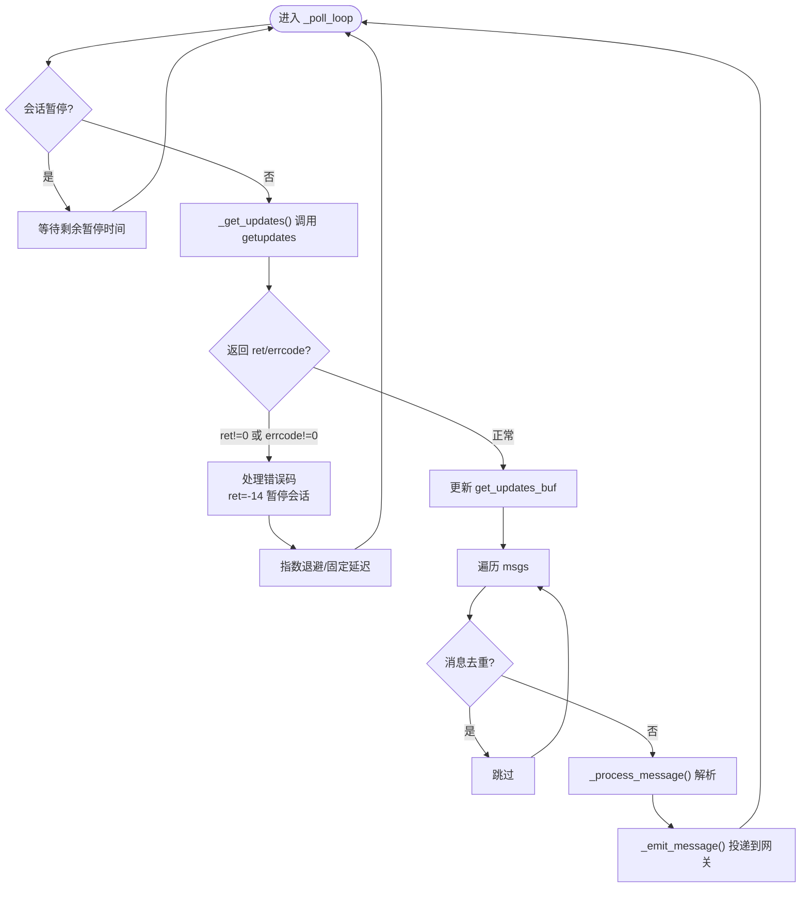
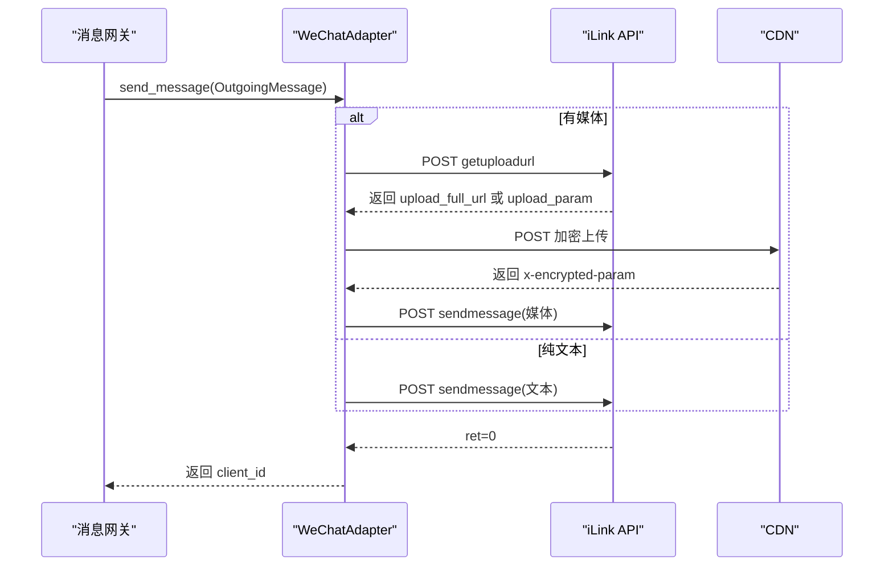
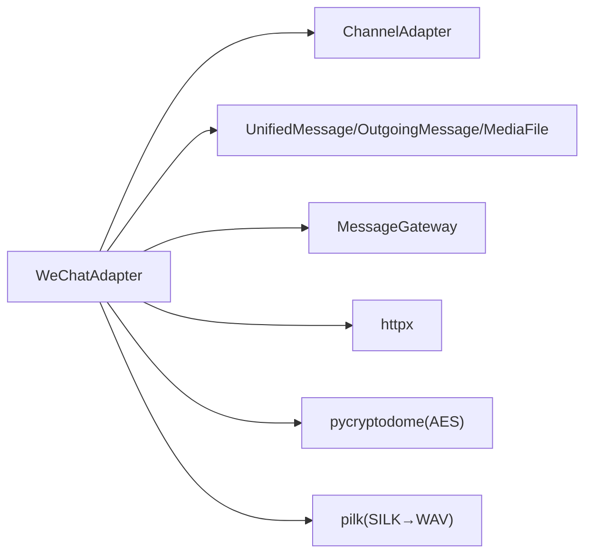

# 微信适配器

<cite>
**本文档引用的文件**
- [wechat.py](file://src/synapse/channels/adapters/wechat.py)
- [WECHAT_IM_NOTES.md](file://docs/WECHAT_IM_NOTES.md)
- [wechat_onboard.py](file://src/synapse/api/routes/wechat_onboard.py)
- [wechat_onboard.py](file://src/synapse/setup/wechat_onboard.py)
- [main.py](file://src/synapse/main.py)
- [IMView.tsx](file://apps/setup-center/src/views/IMView.tsx)
- [App.tsx](file://apps/setup-center/src/App.tsx)
- [config.py](file://src/synapse/api/routes/config.py)
- [config.py](file://src/synapse/tools/handlers/config.py)
</cite>

## 目录
1. [简介](#简介)
2. [项目结构](#项目结构)
3. [核心组件](#核心组件)
4. [架构总览](#架构总览)
5. [详细组件分析](#详细组件分析)
6. [依赖关系分析](#依赖关系分析)
7. [性能考量](#性能考量)
8. [故障排查指南](#故障排查指南)
9. [结论](#结论)
10. [附录](#附录)

## 简介
本文件为微信个人号适配器的技术文档，基于 iLink Bot API 实现，对接腾讯微信个人号生态。适配器提供以下能力：
- 基于 HTTP 长轮询的消息接收（getUpdates）
- 基于 HTTP API 的消息发送（sendMessage）
- CDN 媒体上传/下载与 AES-128-ECB 加解密
- 扫码登录获取 Bearer Token
- 打字指示器（sendTyping）
- 无需公网 IP 的内网直连

适配器遵循 @tencent-weixin/openclaw-weixin v2.1.6 协议规范，兼容版本与客户端版本号可通过环境变量覆盖。

## 项目结构
微信适配器相关代码分布如下：
- 适配器实现：src/synapse/channels/adapters/wechat.py
- 扫码登录 API：src/synapse/api/routes/wechat_onboard.py
- 扫码登录实现：src/synapse/setup/wechat_onboard.py
- 启动注册：src/synapse/main.py
- 前端配置入口：apps/setup-center/src/views/IMView.tsx、apps/setup-center/src/App.tsx
- 配置持久化与热重载：src/synapse/api/routes/config.py、src/synapse/tools/handlers/config.py
- 协议与功能说明：docs/WECHAT_IM_NOTES.md

图表来源
- [wechat.py:482-615](file://src/synapse/channels/adapters/wechat.py#L482-L615)
- [wechat_onboard.py:1-51](file://src/synapse/api/routes/wechat_onboard.py#L1-L51)
- [main.py:931-942](file://src/synapse/main.py#L931-L942)

章节来源
- [wechat.py:1-120](file://src/synapse/channels/adapters/wechat.py#L1-L120)
- [WECHAT_IM_NOTES.md:1-120](file://docs/WECHAT_IM_NOTES.md#L1-L120)

## 核心组件
- WeChatAdapter：适配器主体，负责长轮询、消息解析、发送、媒体下载/上传、打字指示器、上下文令牌与同步游标持久化。
- WeChatOnboard：扫码登录流程封装，提供获取二维码、轮询状态、自动刷新与确认。
- FastAPI 路由：对外暴露 /api/wechat/onboard/start 与 /api/wechat/onboard/poll。
- 主进程注册：在主进程中根据配置实例化并注册适配器。

关键特性
- 消息去重：基于消息 ID 的 LRU 去重（TTL 10 分钟，最大 500 条）
- 会话暂停：当收到会话过期错误码时暂停 1 小时
- 指数退避：轮询与错误重试采用指数退避策略
- Markdown 过滤：发送前将 Markdown 转为纯文本
- 语音转码：可选的 SILK→WAV 转码（依赖 pilk）

章节来源
- [wechat.py:482-615](file://src/synapse/channels/adapters/wechat.py#L482-L615)
- [wechat_onboard.py:55-172](file://src/synapse/setup/wechat_onboard.py#L55-L172)
- [WECHAT_IM_NOTES.md:10-60](file://docs/WECHAT_IM_NOTES.md#L10-L60)

## 架构总览
微信适配器采用“长轮询+HTTP API+CDN+扫码登录”的架构。前端通过 Setup Center 触发扫码登录，后端通过 iLink Bot API 获取 Token 并注册适配器，随后通过长轮询接收消息，解析后投递给消息网关，再由网关进行媒体下载与统一消息格式转换。

图表来源
- [wechat_onboard.py:19-51](file://src/synapse/api/routes/wechat_onboard.py#L19-L51)
- [wechat_onboard.py:77-172](file://src/synapse/setup/wechat_onboard.py#L77-L172)

章节来源
- [wechat_onboard.py:1-51](file://src/synapse/api/routes/wechat_onboard.py#L1-L51)
- [wechat_onboard.py:55-172](file://src/synapse/setup/wechat_onboard.py#L55-L172)

## 详细组件分析

### WeChatAdapter 类
WeChatAdapter 继承自 ChannelAdapter，实现微信个人号通道的完整生命周期与消息处理。

图表来源
- [wechat.py:482-500](file://src/synapse/channels/adapters/wechat.py#L482-L500)
- [wechat.py:502-615](file://src/synapse/channels/adapters/wechat.py#L502-L615)

章节来源
- [wechat.py:482-615](file://src/synapse/channels/adapters/wechat.py#L482-L615)

### 配置参数与环境变量
- WECHAT_ENABLED：启用微信通道
- WECHAT_TOKEN：Bearer Token（扫码登录获取）
- WECHAT_BASE_URL：API 基础 URL，默认 https://ilinkai.weixin.qq.com
- WECHAT_CDN_BASE_URL：CDN 基础 URL，默认 https://novac2c.cdn.weixin.qq.com/c2c
- WECHAT_OPENCLAW_COMPAT_VERSION：协议兼容版本号，默认 2.1.6
- WECHAT_ILINK_APP_ID：iLink 应用 ID，默认 bot
- WECHAT_FOOTER_ELAPSED：是否在回复尾部显示耗时，默认 true

章节来源
- [WECHAT_IM_NOTES.md:205-216](file://docs/WECHAT_IM_NOTES.md#L205-L216)

### 扫码登录流程
- 前端触发 /api/wechat/onboard/start，后端调用 WeChatOnboard.fetch_qrcode 获取二维码与二维码图片
- 前端轮询 /api/wechat/onboard/poll，后端调用 WeChatOnboard.poll_status 轮询状态
- 状态包括 wait、scaned、scaned_but_redirect、confirmed、expired、error
- confirmed 时返回 bot_token、base_url、ilink_bot_id、ilink_user_id

章节来源
- [wechat_onboard.py:19-51](file://src/synapse/api/routes/wechat_onboard.py#L19-L51)
- [wechat_onboard.py:77-172](file://src/synapse/setup/wechat_onboard.py#L77-L172)

### 消息接收与处理
- 长轮询：_poll_loop() 持续调用 _get_updates()，动态超时由服务端 longpolling_timeout_ms 控制
- 去重：_dedup_check() 基于消息 ID 的 LRU 去重（TTL 10 分钟）
- 解析：_process_message() 提取消息正文、引用消息、媒体项，构建 UnifiedMessage 投递到网关
- 斜杠命令：/_echo 与 /toggle-debug 诊断命令

图表来源
- [wechat.py:704-776](file://src/synapse/channels/adapters/wechat.py#L704-L776)
- [wechat.py:947-1047](file://src/synapse/channels/adapters/wechat.py#L947-L1047)

章节来源
- [wechat.py:704-776](file://src/synapse/channels/adapters/wechat.py#L704-L776)
- [wechat.py:947-1047](file://src/synapse/channels/adapters/wechat.py#L947-L1047)

### 消息发送与媒体处理
- 文本发送：_send_text() 通过 ilink/bot/sendmessage 发送，支持多段重试与会话过期处理
- 媒体发送：_send_media_by_mime() 先通过 getuploadurl 获取上传参数，CDN 加密上传，再发送媒体消息
- CDN 加解密：_cdn_download/_cdn_upload 使用 AES-128-ECB（无 IV），PKCS7 填充
- 限流：_rate_limit_wait() 保证每用户的最小发送间隔 2.5 秒

图表来源
- [wechat.py:1104-1302](file://src/synapse/channels/adapters/wechat.py#L1104-L1302)
- [wechat.py:1442-1541](file://src/synapse/channels/adapters/wechat.py#L1442-L1541)

章节来源
- [wechat.py:1104-1302](file://src/synapse/channels/adapters/wechat.py#L1104-L1302)
- [wechat.py:1442-1541](file://src/synapse/channels/adapters/wechat.py#L1442-L1541)

### 打字指示器与上下文令牌
- 打字指示器：_get_typing_ticket() 通过 getconfig 获取 typing_ticket，周期性发送 sendtyping
- 上下文令牌：_resolve_context_token() 优先使用缓存的 context_token，提高发送成功率
- 持久化：_save_sync_buf/_load_sync_buf 与 _save_context_tokens/_load_context_tokens 将同步游标与令牌持久化到磁盘

章节来源
- [wechat.py:1315-1416](file://src/synapse/channels/adapters/wechat.py#L1315-L1416)
- [wechat.py:1576-1626](file://src/synapse/channels/adapters/wechat.py#L1576-L1626)

### 服务器配置与注册
- 主进程在启动时根据配置实例化 WeChatAdapter 并注册到消息网关
- 支持多机器人配置（im_bots），按类型与凭据创建适配器

章节来源
- [main.py:931-964](file://src/synapse/main.py#L931-L964)

### 前端配置入口
- Setup Center 的 IMView.tsx 与 App.tsx 提供微信配置入口，支持扫码登录与保存配置
- 自动保存键包括 WECHAT_ENABLED、WECHAT_TOKEN 等

章节来源
- [IMView.tsx:1981-2010](file://apps/setup-center/src/views/IMView.tsx#L1981-L2010)
- [App.tsx:2145-2161](file://apps/setup-center/src/App.tsx#L2145-L2161)

## 依赖关系分析
- 第三方库依赖
  - httpx：异步 HTTP 客户端
  - pycryptodome：AES-128-ECB 加解密
  - pilk（可选）：SILK→WAV 转码
- 内部模块依赖
  - ChannelAdapter：适配器基类
  - UnifiedMessage/OutgoingMessage/MediaFile：消息与媒体抽象
  - MessageGateway：消息网关负责媒体下载与路由

图表来源
- [wechat.py:38-46](file://src/synapse/channels/adapters/wechat.py#L38-L46)
- [wechat.py:56-65](file://src/synapse/channels/adapters/wechat.py#L56-L65)

章节来源
- [wechat.py:38-65](file://src/synapse/channels/adapters/wechat.py#L38-L65)

## 性能考量
- 轮询超时：动态跟随服务端 longpolling_timeout_ms，避免不必要的短轮询
- 指数退避：连续失败后采用 BACKOFF_DELAY_S 与 RETRY_DELAY_S 的退避策略
- 限流：每用户最小间隔 2.5 秒，避免触发微信侧频率限制
- 去重：LRU 去重减少重复消息处理成本
- CDN 加密：仅对媒体文件进行 AES-128-ECB 加密，避免全量数据加密带来的 CPU 开销

## 故障排查指南
常见问题与处理
- 会话过期（ret=-14）
  - 现象：发送/轮询报错，提示会话过期
  - 处理：自动暂停 1 小时，需重新扫码登录获取新 Token
- CDN 下载/上传失败
  - 现象：x-error-message 响应头携带错误信息
  - 处理：检查 AES 密钥格式（base64 16 字节或 32 字符十六进制），确认 full_url/encrypt_query_param 正确
- 语音转码失败
  - 现象：SILK 文件无法转码为 WAV
  - 处理：安装 pilk 依赖或忽略转码（保留 .silk）
- 二维码过期
  - 现象：poll_status 返回 expired
  - 处理：WeChatOnboard 自动刷新二维码（最多 3 次），超时后提示重新开始

章节来源
- [wechat.py:642-701](file://src/synapse/channels/adapters/wechat.py#L642-L701)
- [wechat_onboard.py:168-221](file://src/synapse/setup/wechat_onboard.py#L168-L221)
- [WECHAT_IM_NOTES.md:175-261](file://docs/WECHAT_IM_NOTES.md#L175-L261)

## 结论
微信适配器通过 iLink Bot API 实现了微信个人号的稳定接入，具备完善的扫码登录、消息接收/发送、媒体处理与错误恢复机制。其设计遵循协议兼容版本与客户端版本号可配置原则，便于在不同环境下快速部署与维护。建议在生产环境中结合会话暂停与指数退避策略，确保服务稳定性。

## 附录

### 配置项一览
- 必填
  - WECHAT_ENABLED：启用微信通道
  - WECHAT_TOKEN：Bearer Token（扫码登录获取）
- 可选
  - WECHAT_BASE_URL：API 基础 URL，默认 https://ilinkai.weixin.qq.com
  - WECHAT_CDN_BASE_URL：CDN 基础 URL，默认 https://novac2c.cdn.weixin.qq.com/c2c
  - WECHAT_OPENCLAW_COMPAT_VERSION：协议兼容版本号，默认 2.1.6
  - WECHAT_ILINK_APP_ID：iLink 应用 ID，默认 bot
  - WECHAT_FOOTER_ELAPSED：是否在回复尾部显示耗时，默认 true

章节来源
- [WECHAT_IM_NOTES.md:205-216](file://docs/WECHAT_IM_NOTES.md#L205-L216)

### 开发与测试建议
- 开发环境
  - 使用 Setup Center 的 IM 配置页面进行扫码登录与参数校验
  - 通过斜杠命令 /echo 与 /toggle-debug 进行基本功能验证
- 测试方法
  - 单元测试：参考 docs/WECHAT_IM_NOTES.md 中的功能清单，编写针对消息解析、媒体下载/上传、去重与会话暂停的测试
  - E2E 测试：模拟扫码登录、消息收发、CDN 加解密与错误恢复流程
- 安全注意事项
  - Token 有效期有限，需在过期后重新扫码登录
  - 单设备登录限制：同一微信号只能在一处使用 iLink Bot API
  - 敏感信息脱敏：日志中对 token、user_id、URL 进行脱敏处理

章节来源
- [IMView.tsx:1981-2010](file://apps/setup-center/src/views/IMView.tsx#L1981-L2010)
- [WECHAT_IM_NOTES.md:242-261](file://docs/WECHAT_IM_NOTES.md#L242-L261)