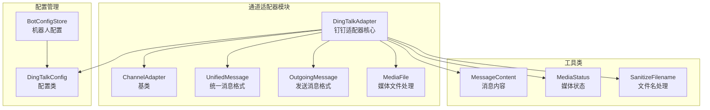
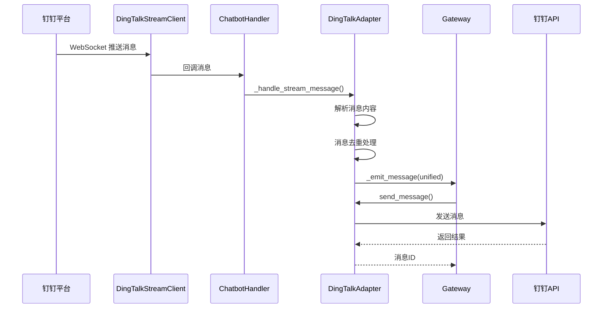
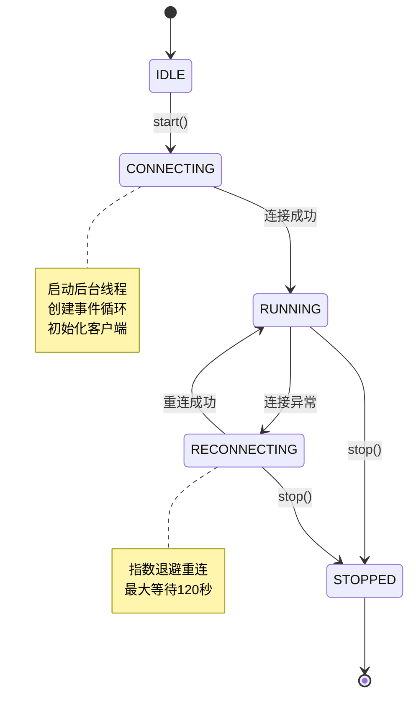
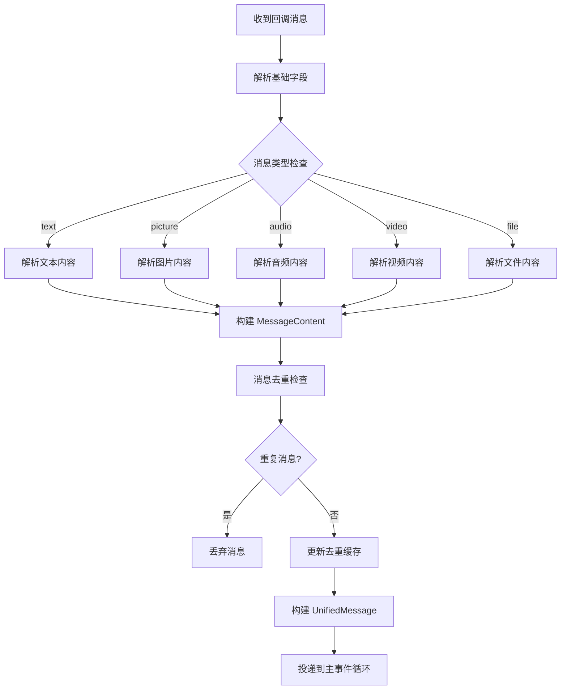
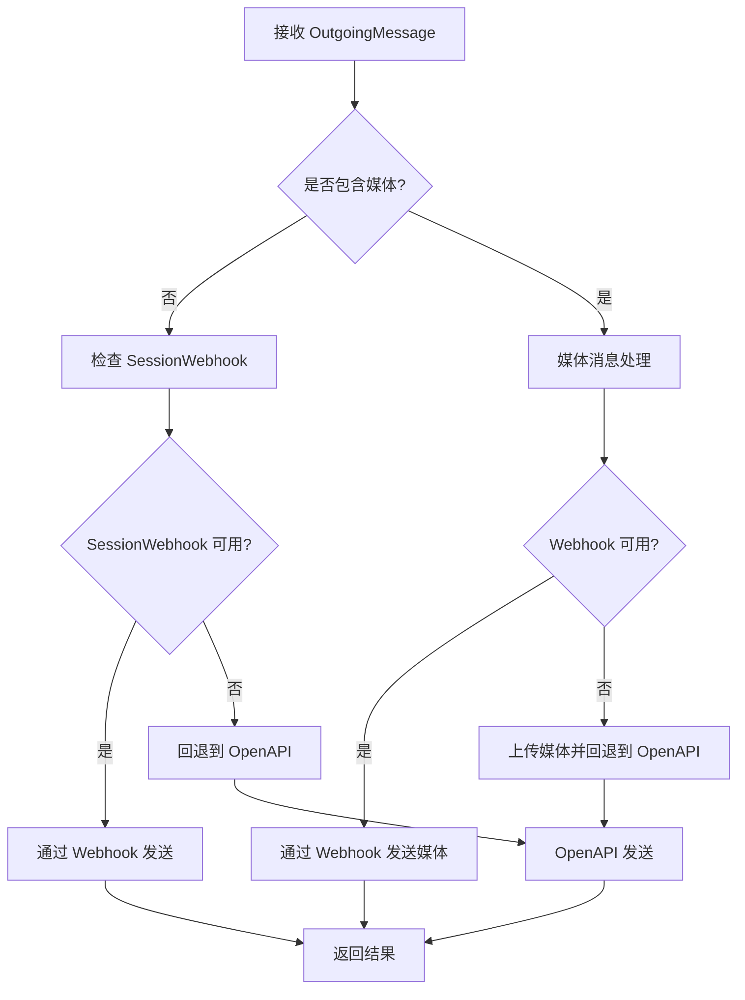
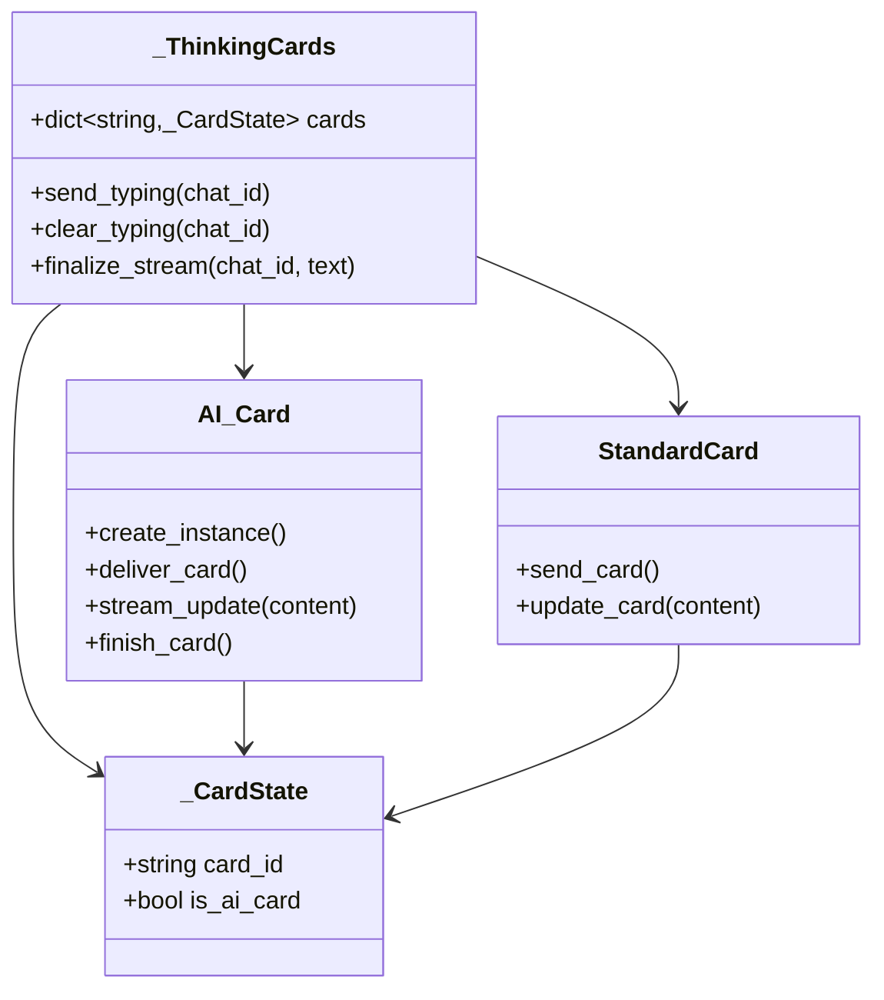
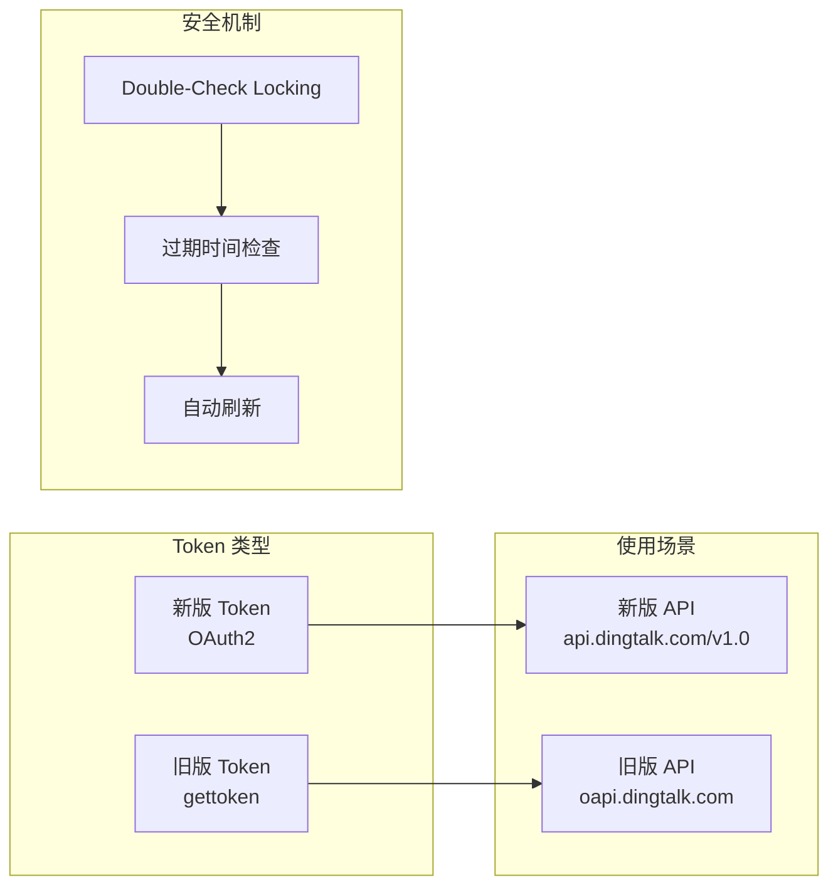
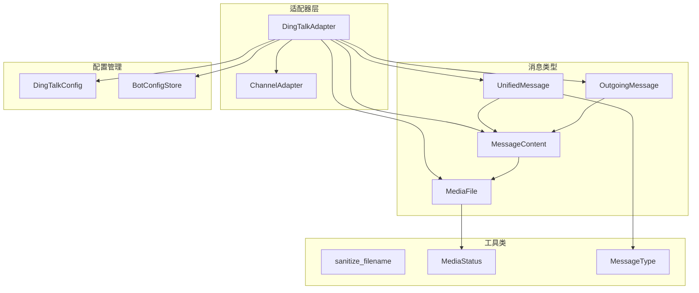

# 钉钉适配器

<cite>
**本文档引用的文件**
- [dingtalk.py](file://src/synapse/channels/adapters/dingtalk.py)
- [DINGTALK_IM_NOTES.md](file://docs/DINGTALK_IM_NOTES.md)
- [base.py](file://src/synapse/channels/base.py)
- [types.py](file://src/synapse/channels/types.py)
- [__init__.py](file://src/synapse/channels/adapters/__init__.py)
- [bot_config.py](file://src/synapse/channels/bot_config.py)
- [SKILL.md](file://skills/dingtalk-cli/SKILL.md)
</cite>

## 目录
1. [简介](#简介)
2. [项目结构](#项目结构)
3. [核心组件](#核心组件)
4. [架构概览](#架构概览)
5. [详细组件分析](#详细组件分析)
6. [依赖分析](#依赖分析)
7. [性能考虑](#性能考虑)
8. [故障排除指南](#故障排除指南)
9. [结论](#结论)
10. [附录](#附录)

## 简介

钉钉适配器是基于钉钉开放平台实现的即时通讯适配器，采用 Stream 模式通过 WebSocket 长连接接收消息，无需公网 IP 和域名。该适配器支持多种消息类型的接收和发送，包括文本、图片、语音、文件、视频等，并提供了丰富的媒体处理能力和流式回复功能。

## 项目结构

钉钉适配器位于 Synapse 项目的通道适配器模块中，采用模块化设计：

**图表来源**
- [dingtalk.py:112-250](file://src/synapse/channels/adapters/dingtalk.py#L112-L250)
- [base.py:38-100](file://src/synapse/channels/base.py#L38-L100)
- [types.py:18-50](file://src/synapse/channels/types.py#L18-L50)

**章节来源**
- [dingtalk.py:1-50](file://src/synapse/channels/adapters/dingtalk.py#L1-L50)
- [__init__.py:15-33](file://src/synapse/channels/adapters/__init__.py#L15-L33)

## 核心组件

### 钉钉适配器配置

钉钉适配器的核心配置类定义了必需的认证参数：

| 配置参数 | 类型 | 必需 | 描述 |
|---------|------|------|------|
| app_key | str | 是 | 应用 Client ID（原 AppKey） |
| app_secret | str | 是 | 应用 Client Secret（原 AppSecret） |
| agent_id | str | 否 | 应用 AgentId（发送消息时需要） |

### 消息类型支持

适配器支持以下消息类型：

| 消息类型 | 接收 | 发送 | 描述 |
|---------|------|------|------|
| text | ✅ | ✅ | 纯文本消息 |
| picture | ✅ | ✅ | 图片消息 |
| richText | ✅ | ❌ | 富文本消息 |
| audio | ✅ | ✅ | 语音消息 |
| video | ✅ | ✅ | 视频消息 |
| file | ✅ | ✅ | 文件消息 |

### 能力特性

| 能力 | 支持状态 | 描述 |
|------|----------|------|
| streaming | ✅ | 支持流式消息处理 |
| send_image | ✅ | 支持图片发送 |
| send_file | ✅ | 支持文件发送 |
| send_voice | ✅ | 支持语音发送 |
| markdown | ✅ | 支持 Markdown 格式 |
| delete_message | ❌ | 不支持消息删除 |
| edit_message | ❌ | 不支持消息编辑 |

**章节来源**
- [dingtalk.py:65-140](file://src/synapse/channels/adapters/dingtalk.py#L65-L140)
- [types.py:18-31](file://src/synapse/channels/types.py#L18-L31)

## 架构概览

钉钉适配器采用事件驱动的异步架构，通过 WebSocket 长连接实现实时通信：

**图表来源**
- [dingtalk.py:509-570](file://src/synapse/channels/adapters/dingtalk.py#L509-L570)
- [dingtalk.py:641-770](file://src/synapse/channels/adapters/dingtalk.py#L641-L770)

### 连接生命周期管理

**图表来源**
- [dingtalk.py:80-89](file://src/synapse/channels/adapters/dingtalk.py#L80-L89)
- [dingtalk.py:585-640](file://src/synapse/channels/adapters/dingtalk.py#L585-L640)

**章节来源**
- [dingtalk.py:396-496](file://src/synapse/channels/adapters/dingtalk.py#L396-L496)
- [DINGTALK_IM_NOTES.md:509-544](file://docs/DINGTALK_IM_NOTES.md#L509-L544)

## 详细组件分析

### 消息接收处理

#### Stream 模式消息处理流程

**图表来源**
- [dingtalk.py:641-770](file://src/synapse/channels/adapters/dingtalk.py#L641-L770)
- [dingtalk.py:771-911](file://src/synapse/channels/adapters/dingtalk.py#L771-L911)

#### 消息去重机制

适配器实现了智能的消息去重机制，防止 Stream 模式重连导致的消息重复：

| 去重机制 | 实现方式 | 配置参数 |
|---------|----------|----------|
| 去重键 | `{bot_id}:{msg_id}` | - |
| TTL 过期 | 60秒 | `_seen_message_ids_ttl` |
| 容量限制 | 5000条 | `_seen_message_ids_max` |
| 清理策略 | 超半数时清理过期条目 | - |
| 内存保护 | 达到上限时移除最旧条目 | - |

**章节来源**
- [dingtalk.py:669-691](file://src/synapse/channels/adapters/dingtalk.py#L669-L691)
- [DINGTALK_IM_NOTES.md:275-286](file://docs/DINGTALK_IM_NOTES.md#L275-L286)

### 消息发送处理

#### 智能路由发送策略

**图表来源**
- [dingtalk.py:1239-1375](file://src/synapse/channels/adapters/dingtalk.py#L1239-L1375)
- [dingtalk.py:1487-1533](file://src/synapse/channels/adapters/dingtalk.py#L1487-L1533)

#### 媒体文件处理

| 媒体类型 | 上传方式 | 发送方式 | 降级处理 |
|---------|----------|----------|----------|
| 图片 | 上传获取 media_id | OpenAPI sampleImageMsg | Webhook Markdown 嵌入 |
| 文件 | 上传获取 media_id | OpenAPI sampleFile | Webhook 文本提示 |
| 语音 | 上传获取 media_id | OpenAPI sampleAudio | 降级为文件发送 |
| 视频 | 上传获取 media_id | OpenAPI sampleVideo | Webhook 文本提示 |

**章节来源**
- [dingtalk.py:1599-1724](file://src/synapse/channels/adapters/dingtalk.py#L1599-L1724)
- [dingtalk.py:1725-1828](file://src/synapse/channels/adapters/dingtalk.py#L1725-L1828)

### 互动卡片系统

#### Typing 提示架构

**图表来源**
- [dingtalk.py:105-110](file://src/synapse/channels/adapters/dingtalk.py#L105-L110)
- [dingtalk.py:928-962](file://src/synapse/channels/adapters/dingtalk.py#L928-L962)
- [dingtalk.py:1077-1132](file://src/synapse/channels/adapters/dingtalk.py#L1077-L1132)

#### 卡片状态管理

| 状态 | 描述 | 触发条件 |
|------|------|----------|
| PROCESSING | 处理中 | 创建 AI Card 实例 |
| INPUTING | 输入中 | 流式更新内容 |
| FINISHED | 已完成 | 最终内容更新 |
| ERROR | 错误状态 | API 调用失败 |

**章节来源**
- [dingtalk.py:963-1040](file://src/synapse/channels/adapters/dingtalk.py#L963-L1040)
- [DINGTALK_IM_NOTES.md:585-695](file://docs/DINGTALK_IM_NOTES.md#L585-L695)

### Token 管理系统

#### 双 Token 体系

**图表来源**
- [dingtalk.py:192-199](file://src/synapse/channels/adapters/dingtalk.py#L192-L199)
- [dingtalk.py:2037-2123](file://src/synapse/channels/adapters/dingtalk.py#L2037-L2123)

#### Token 刷新策略

| Token 类型 | 刷新间隔 | 过期时间 | 安全余量 |
|-----------|----------|----------|----------|
| 新版 Token | 7200秒 | 7200秒 | 300秒 |
| 旧版 Token | 7200秒 | 7200秒 | 300秒 |

**章节来源**
- [DINGTALK_IM_NOTES.md:64-72](file://docs/DINGTALK_IM_NOTES.md#L64-L72)
- [dingtalk.py:2047-2081](file://src/synapse/channels/adapters/dingtalk.py#L2047-L2081)

## 依赖分析

### 外部依赖

| 依赖库 | 版本 | 用途 |
|-------|------|------|
| dingtalk-stream | - | WebSocket 客户端 |
| httpx | - | HTTP 客户端 |
| asyncio | - | 异步 I/O |
| json | - | JSON 处理 |
| pathlib | - | 路径处理 |

### 内部依赖关系

**图表来源**
- [dingtalk.py:28-36](file://src/synapse/channels/adapters/dingtalk.py#L28-L36)
- [types.py:18-170](file://src/synapse/channels/types.py#L18-L170)
- [base.py:38-100](file://src/synapse/channels/base.py#L38-L100)

**章节来源**
- [__init__.py:15-33](file://src/synapse/channels/adapters/__init__.py#L15-L33)
- [base.py:114-138](file://src/synapse/channels/base.py#L114-L138)

## 性能考虑

### 连接管理优化

1. **后台线程管理**：使用独立线程运行 Stream 客户端，避免阻塞主事件循环
2. **智能重连**：指数退避重连机制，最大等待120秒
3. **连接状态监控**：实时监控连接状态和消息接收情况

### 内存管理优化

1. **消息去重缓存**：限制去重缓存大小为5000条，超过一半时清理过期条目
2. **媒体文件缓存**：智能缓存下载的媒体文件，避免重复下载
3. **事件循环对齐**：确保 Stream 线程的事件循环正确关闭

### 网络性能优化

1. **HTTP 客户端复用**：使用异步 HTTP 客户端，支持连接池复用
2. **批量发送优化**：支持批量发送媒体文件，减少 API 调用次数
3. **超时控制**：合理设置超时时间，避免长时间阻塞

## 故障排除指南

### 常见问题及解决方案

#### 认证失败

**症状**：连接钉钉 API 时出现认证错误

**原因分析**：
- AppKey 或 AppSecret 无效
- 网络连接问题
- Token 获取失败

**解决方案**：
1. 检查应用凭据是否正确
2. 验证网络连接状态
3. 查看 Token 刷新日志

#### 消息重复

**症状**：收到重复的消息

**原因分析**：
- Stream 模式重连导致的消息重复
- 去重机制失效

**解决方案**：
1. 检查去重缓存配置
2. 验证消息 ID 生成机制
3. 查看去重命中日志

#### 媒体发送失败

**症状**：图片、文件、语音发送失败

**原因分析**：
- 上传失败
- 权限不足
- API 调用错误

**解决方案**：
1. 检查媒体文件格式和大小
2. 验证机器人权限配置
3. 查看 API 返回错误信息

**章节来源**
- [DINGTALK_IM_NOTES.md:232-366](file://docs/DINGTALK_IM_NOTES.md#L232-L366)
- [dingtalk.py:404-418](file://src/synapse/channels/adapters/dingtalk.py#L404-L418)

### 调试技巧

1. **启用详细日志**：查看消息接收和发送的详细日志
2. **监控连接状态**：观察连接状态变化和重连次数
3. **检查 Token 状态**：验证 Token 刷新和过期情况
4. **验证媒体处理**：确认媒体文件上传和下载流程

## 结论

钉钉适配器是一个功能完整、性能优良的即时通讯适配器，具有以下特点：

1. **可靠性**：采用 Stream 模式实现稳定的长连接通信
2. **完整性**：支持多种消息类型和媒体文件处理
3. **可扩展性**：模块化设计便于功能扩展和维护
4. **易用性**：提供简洁的 API 接口和完善的错误处理

该适配器适用于企业内部的自动化消息处理和智能机器人应用场景，能够满足大多数即时通讯需求。

## 附录

### 配置参数详解

| 参数名称 | 类型 | 必需 | 默认值 | 描述 |
|---------|------|------|--------|------|
| app_key | str | 是 | - | 应用 Client ID |
| app_secret | str | 是 | - | 应用 Client Secret |
| agent_id | str | 否 | - | 应用 AgentId |
| media_dir | Path | 否 | data/media/dingtalk | 媒体文件存储目录 |
| channel_name | str | 否 | dingtalk | 通道名称 |
| bot_id | str | 否 | dingtalk | Bot 实例唯一标识 |
| agent_profile_id | str | 否 | default | 绑定的 agent profile ID |

### API 参考

#### 消息发送 API

| API 名称 | URL | 方法 | 描述 |
|---------|-----|------|------|
| 群聊消息发送 | /v1.0/robot/groupMessages/send | POST | 发送群聊消息 |
| 单聊消息发送 | /v1.0/robot/oToMessages/batchSend | POST | 发送单聊消息 |
| 媒体文件上传 | /media/upload | POST | 上传媒体文件 |
| 文件下载 | /v1.0/robot/messageFiles/download | POST | 下载文件 |

#### 互动卡片 API

| API 名称 | URL | 方法 | 描述 |
|---------|-----|------|------|
| AI Card 创建 | /v1.0/card/instances | POST | 创建 AI Card 实例 |
| AI Card 投递 | /v1.0/card/instances/deliver | POST | 投递 AI Card |
| AI Card 流式更新 | /v1.0/card/streaming | PUT | 流式更新 AI Card |
| 标准卡片发送 | /v1.0/im/v1.0/robot/interactiveCards/send | POST | 发送标准卡片 |
| 标准卡片更新 | /v1.0/im/robots/interactiveCards | PUT | 更新标准卡片 |

### 部署注意事项

1. **网络配置**：确保服务器能够访问钉钉开放平台 API
2. **权限配置**：在钉钉开发者后台开通相应权限
3. **证书配置**：确保 SSL 证书有效
4. **防火墙设置**：允许必要的端口通信
5. **监控配置**：设置适当的日志和监控