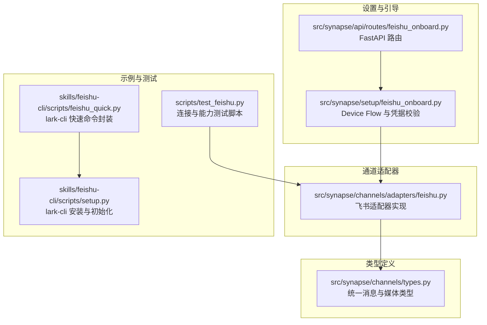
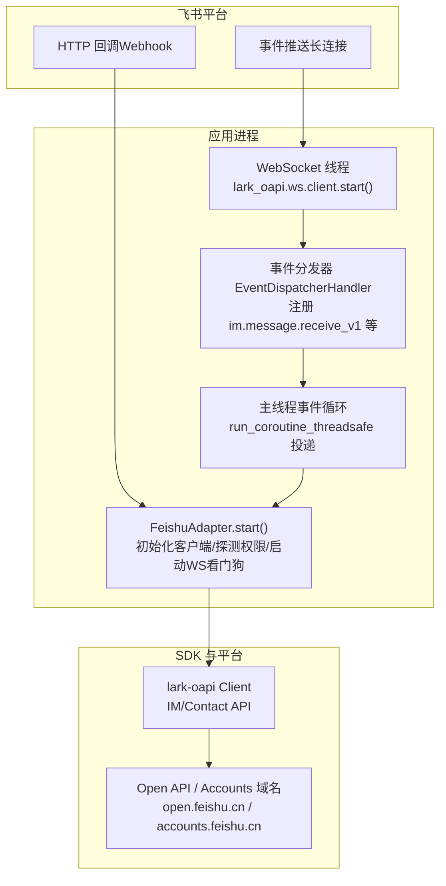
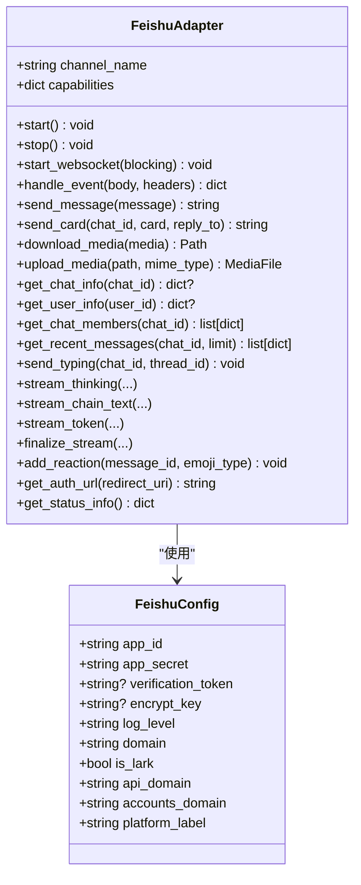
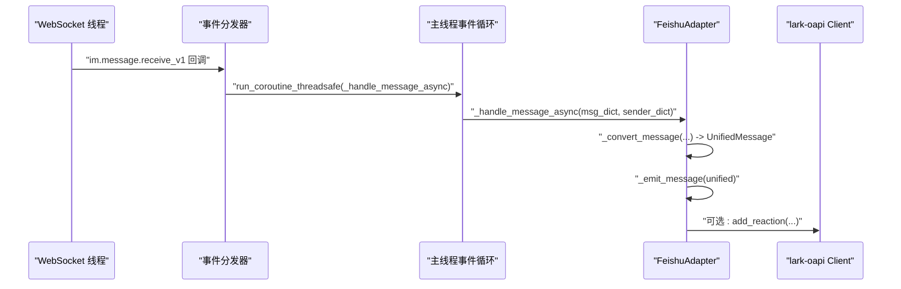
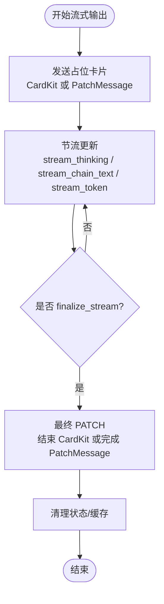
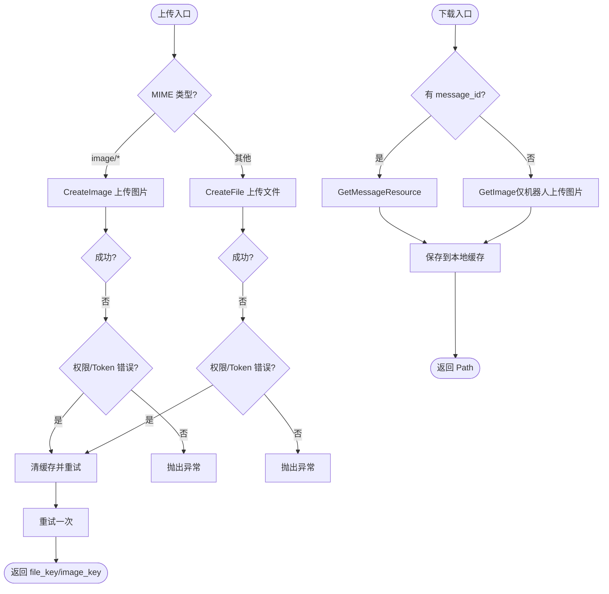
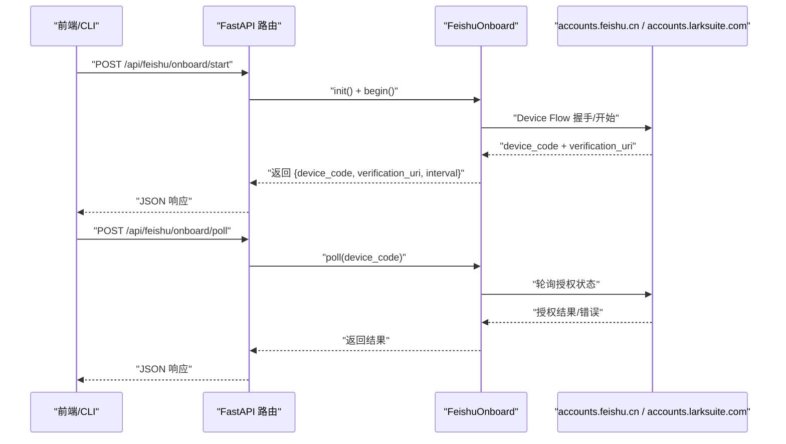
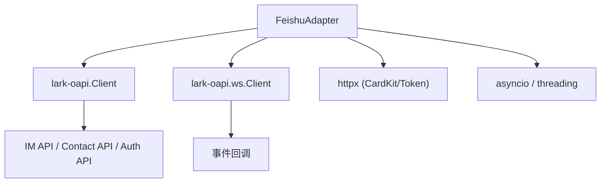

# 飞书适配器

<cite>
**本文档引用的文件**
- [feishu.py](file://src/synapse/channels/adapters/feishu.py)
- [feishu_onboard.py](file://src/synapse/setup/feishu_onboard.py)
- [feishu_onboard.py](file://src/synapse/api/routes/feishu_onboard.py)
- [test_feishu.py](file://scripts/test_feishu.py)
- [types.py](file://src/synapse/channels/types.py)
- [feishu_quick.py](file://skills/feishu-cli/scripts/feishu_quick.py)
- [setup.py](file://skills/feishu-cli/scripts/setup.py)
</cite>

## 目录
1. [简介](#简介)
2. [项目结构](#项目结构)
3. [核心组件](#核心组件)
4. [架构总览](#架构总览)
5. [详细组件分析](#详细组件分析)
6. [依赖分析](#依赖分析)
7. [性能考虑](#性能考虑)
8. [故障排查指南](#故障排查指南)
9. [结论](#结论)
10. [附录](#附录)

## 简介
本技术文档面向飞书（Lark）适配器的实现与使用，基于 lark-oapi 库提供完整的即时通讯能力：  
- 事件订阅：支持长连接 WebSocket 与 Webhook 两种方式  
- 消息类型：文本、富文本（post）、图片、语音（音频）、视频、文件、表情包  
- 卡片消息：支持交互式卡片与流式卡片（含“思考中…”占位与 Footer 耗时/状态展示）  
- 流式输出：节流更新、链路追踪、最终定稿  
- 权限探测：自动探测并记录可用能力（如获取群信息、用户信息、上传图片、CardKit 流式卡片等）  
- 媒体处理：上传/下载、本地缓存、MIME 类型与元数据管理  
- 配置参数：app_id、app_secret、verification_token、encrypt_key、domain 等  
- 认证流程：支持 OAuth2 授权 URL 生成与凭据校验（Device Flow）

## 项目结构
飞书适配器位于通道适配器目录，配套提供设备流程（Device Flow）建应用与凭据校验、Web API 路由、CLI 快速脚本与测试脚本。

**图表来源**
- [feishu.py:141-318](file://src/synapse/channels/adapters/feishu.py#L141-L318)
- [feishu_onboard.py:42-120](file://src/synapse/setup/feishu_onboard.py#L42-L120)
- [feishu_onboard.py:24-56](file://src/synapse/api/routes/feishu_onboard.py#L24-L56)
- [test_feishu.py:152-194](file://scripts/test_feishu.py#L152-L194)
- [types.py:55-170](file://src/synapse/channels/types.py#L55-L170)
- [feishu_quick.py:19-80](file://skills/feishu-cli/scripts/feishu_quick.py#L19-L80)
- [setup.py:21-48](file://skills/feishu-cli/scripts/setup.py#L21-L48)

**章节来源**
- [feishu.py:1-140](file://src/synapse/channels/adapters/feishu.py#L1-L140)
- [feishu_onboard.py:42-120](file://src/synapse/setup/feishu_onboard.py#L42-L120)
- [feishu_onboard.py:24-56](file://src/synapse/api/routes/feishu_onboard.py#L24-L56)
- [test_feishu.py:1-60](file://scripts/test_feishu.py#L1-L60)
- [types.py:1-100](file://src/synapse/channels/types.py#L1-L100)
- [feishu_quick.py:1-40](file://skills/feishu-cli/scripts/feishu_quick.py#L1-L40)
- [setup.py:1-30](file://skills/feishu-cli/scripts/setup.py#L1-L30)

## 核心组件
- 飞书适配器（FeishuAdapter）：负责事件接入、消息转换、发送、流式卡片、权限探测、媒体上传下载、WebSocket 管理与看门狗重启
- 配置对象（FeishuConfig）：封装 app_id、app_secret、verification_token、encrypt_key、log_level、domain 等
- 设备流程（FeishuOnboard）：支持飞书/Lark 的 Device Flow 建应用与凭据校验
- Web API 路由：提供 /api/feishu/onboard/start 与 /poll 两个端点
- 统一消息类型：MessageContent、MediaFile、UnifiedMessage、OutgoingMessage 等

关键特性
- 事件订阅：长连接 WebSocket（推荐）与 Webhook 两种模式
- 流式卡片：CardKit 流式卡片优先，回退至 PatchMessage；支持节流、Footer 耗时/状态
- 权限探测：自动探测“发消息/发文件/回复消息/获取群信息/用户信息/群成员/消息历史/上传图片/CardKit 流式卡片”等
- 媒体处理：图片/语音/视频/文件上传，消息资源下载，本地缓存与元数据
- 群聊 @ 与隐式 @：显式 mentions 与回复机器人消息的隐式 @
- 会话键：支持 thread_id 的话题模式

**章节来源**
- [feishu.py:98-139](file://src/synapse/channels/adapters/feishu.py#L98-L139)
- [feishu.py:141-318](file://src/synapse/channels/adapters/feishu.py#L141-L318)
- [feishu_onboard.py:42-120](file://src/synapse/setup/feishu_onboard.py#L42-L120)
- [feishu_onboard.py:24-56](file://src/synapse/api/routes/feishu_onboard.py#L24-L56)
- [types.py:55-170](file://src/synapse/channels/types.py#L55-L170)

## 架构总览
飞书适配器采用“适配器 + 事件分发 + SDK 客户端”的三层结构。WebSocket 线程负责事件接收，主线程负责消息处理与业务逻辑；同时支持 Webhook 模式直连 HTTP 服务器。

**图表来源**
- [feishu.py:319-448](file://src/synapse/channels/adapters/feishu.py#L319-L448)
- [feishu.py:645-715](file://src/synapse/channels/adapters/feishu.py#L645-L715)
- [feishu.py:717-771](file://src/synapse/channels/adapters/feishu.py#L717-L771)
- [feishu.py:1940-1973](file://src/synapse/channels/adapters/feishu.py#L1940-L1973)

**章节来源**
- [feishu.py:319-448](file://src/synapse/channels/adapters/feishu.py#L319-L448)
- [feishu.py:645-715](file://src/synapse/channels/adapters/feishu.py#L645-L715)
- [feishu.py:717-771](file://src/synapse/channels/adapters/feishu.py#L717-L771)
- [feishu.py:1940-1973](file://src/synapse/channels/adapters/feishu.py#L1940-L1973)

## 详细组件分析

### 飞书适配器（FeishuAdapter）
- 初始化与配置：支持 app_id、app_secret、verification_token、encrypt_key、log_level、domain、频道名称、Bot ID、代理 profile、流式开关与节流、群响应模式、Footer 开关等
- 启动流程：创建 lark-oapi Client、尝试获取机器人 open_id、启动 WebSocket（非阻塞）、探测权限、启动看门狗
- 事件处理：WebSocket 线程中同步回调，通过 run_coroutine_threadsafe 投递到主线程；Webhook 模式直接处理
- 消息转换：将飞书消息统一为 UnifiedMessage，解析 text/post/image/audio/media/file/sticker 等类型，提取 mentions、@所有人、用户名/群名缓存
- 发送消息：支持文本、富文本（Markdown 渲染）、图片、语音、文件、视频、卡片；支持话题回复与多媒体拼接
- 流式卡片：支持 CardKit 流式卡片与 PatchMessage 回退；节流更新、Footer 耗时/状态、最终定稿
- 媒体处理：上传图片/文件（含 token 过期自动重试）、下载消息资源、本地缓存与元数据
- 权限探测：通过调用 API 并判断响应消息关键字，记录可用能力
- WebSocket 看门狗：周期检查线程存活，指数退避重连，超过阈值判定致命失败并上报

**图表来源**
- [feishu.py:98-139](file://src/synapse/channels/adapters/feishu.py#L98-L139)
- [feishu.py:141-318](file://src/synapse/channels/adapters/feishu.py#L141-L318)

**章节来源**
- [feishu.py:173-318](file://src/synapse/channels/adapters/feishu.py#L173-L318)
- [feishu.py:319-448](file://src/synapse/channels/adapters/feishu.py#L319-L448)
- [feishu.py:449-515](file://src/synapse/channels/adapters/feishu.py#L449-L515)
- [feishu.py:516-643](file://src/synapse/channels/adapters/feishu.py#L516-L643)
- [feishu.py:645-715](file://src/synapse/channels/adapters/feishu.py#L645-L715)
- [feishu.py:717-771](file://src/synapse/channels/adapters/feishu.py#L717-L771)
- [feishu.py:1896-1938](file://src/synapse/channels/adapters/feishu.py#L1896-L1938)
- [feishu.py:1940-1973](file://src/synapse/channels/adapters/feishu.py#L1940-L1973)
- [feishu.py:2376-2576](file://src/synapse/channels/adapters/feishu.py#L2376-L2576)
- [feishu.py:2578-2706](file://src/synapse/channels/adapters/feishu.py#L2578-L2706)
- [feishu.py:2708-2727](file://src/synapse/channels/adapters/feishu.py#L2708-L2727)
- [feishu.py:2728-2764](file://src/synapse/channels/adapters/feishu.py#L2728-L2764)
- [feishu.py:2765-2818](file://src/synapse/channels/adapters/feishu.py#L2765-L2818)
- [feishu.py:2820-2835](file://src/synapse/channels/adapters/feishu.py#L2820-L2835)
- [feishu.py:2837-2897](file://src/synapse/channels/adapters/feishu.py#L2837-L2897)
- [feishu.py:2899-2937](file://src/synapse/channels/adapters/feishu.py#L2899-L2937)
- [feishu.py:2939-3007](file://src/synapse/channels/adapters/feishu.py#L2939-L3007)
- [feishu.py:3009-3077](file://src/synapse/channels/adapters/feishu.py#L3009-L3077)
- [feishu.py:3079-3147](file://src/synapse/channels/adapters/feishu.py#L3079-L3147)
- [feishu.py:3149-3196](file://src/synapse/channels/adapters/feishu.py#L3149-L3196)
- [feishu.py:3198-3231](file://src/synapse/channels/adapters/feishu.py#L3198-L3231)
- [feishu.py:3233-3287](file://src/synapse/channels/adapters/feishu.py#L3233-L3287)

### 事件订阅与处理流程（WebSocket/Webhook）
- WebSocket：在独立线程创建 lark_oapi.ws.client，使用 importlib.util 为每个线程复制模块副本，避免全局 loop 被多实例覆盖；事件分发器注册 im.message.receive_v1、消息已读、表情回复、机器人入群/被踢、群信息更新、卡片动作等
- Webhook：处理 challenge 验证与 verification_token 校验，按 event_type 分派到消息事件或卡片动作回调

**图表来源**
- [feishu.py:717-771](file://src/synapse/channels/adapters/feishu.py#L717-L771)
- [feishu.py:824-844](file://src/synapse/channels/adapters/feishu.py#L824-L844)
- [feishu.py:1849-1894](file://src/synapse/channels/adapters/feishu.py#L1849-L1894)

**章节来源**
- [feishu.py:645-715](file://src/synapse/channels/adapters/feishu.py#L645-L715)
- [feishu.py:717-771](file://src/synapse/channels/adapters/feishu.py#L717-L771)
- [feishu.py:824-844](file://src/synapse/channels/adapters/feishu.py#L824-L844)
- [feishu.py:1849-1894](file://src/synapse/channels/adapters/feishu.py#L1849-L1894)
- [feishu.py:1940-1973](file://src/synapse/channels/adapters/feishu.py#L1940-L1973)

### 流式卡片输出（Thinking Card）
- 首次调用 send_typing 发送“思考中…”占位卡片，优先 CardKit streaming（无编辑次数限制），失败则回退至 PatchMessage（有编辑限制）
- stream_thinking/stream_chain_text/stream_token 节流更新卡片内容，finalize_stream 最终定稿并清理状态
- Footer 可显示耗时与状态，支持“完成”提示

**图表来源**
- [feishu.py:1383-1426](file://src/synapse/channels/adapters/feishu.py#L1383-L1426)
- [feishu.py:1632-1767](file://src/synapse/channels/adapters/feishu.py#L1632-L1767)
- [feishu.py:1768-1815](file://src/synapse/channels/adapters/feishu.py#L1768-L1815)
- [feishu.py:1427-1456](file://src/synapse/channels/adapters/feishu.py#L1427-L1456)

**章节来源**
- [feishu.py:1383-1426](file://src/synapse/channels/adapters/feishu.py#L1383-L1426)
- [feishu.py:1632-1767](file://src/synapse/channels/adapters/feishu.py#L1632-L1767)
- [feishu.py:1768-1815](file://src/synapse/channels/adapters/feishu.py#L1768-L1815)
- [feishu.py:1427-1456](file://src/synapse/channels/adapters/feishu.py#L1427-L1456)

### 媒体文件处理
- 上传：图片使用 CreateImage，文件使用 CreateFile；对 401/权限错误主动清缓存并重试一次
- 下载：消息资源统一走 GetMessageResource；机器人上传的图片走 GetImage
- 本地缓存：sanitize_filename 过滤非法字符，保存到 data/media/feishu 目录

**图表来源**
- [feishu.py:2728-2764](file://src/synapse/channels/adapters/feishu.py#L2728-L2764)
- [feishu.py:3198-3231](file://src/synapse/channels/adapters/feishu.py#L3198-L3231)
- [feishu.py:2765-2818](file://src/synapse/channels/adapters/feishu.py#L2765-L2818)

**章节来源**
- [feishu.py:2728-2764](file://src/synapse/channels/adapters/feishu.py#L2728-L2764)
- [feishu.py:3198-3231](file://src/synapse/channels/adapters/feishu.py#L3198-L3231)
- [feishu.py:2765-2818](file://src/synapse/channels/adapters/feishu.py#L2765-L2818)

### 权限探测与能力清单
- 通过调用相应 API 并检查响应消息关键字判断权限是否满足
- 记录能力清单：发消息、发文件、回复消息、获取群信息、用户信息、群成员、消息历史、上传图片、CardKit 流式卡片

**章节来源**
- [feishu.py:516-643](file://src/synapse/channels/adapters/feishu.py#L516-L643)

### 设备流程（Device Flow）与凭据校验
- 支持飞书（feishu）与 Lark（lark）双域
- 提供 /api/feishu/onboard/start 与 /poll 两个端点，返回 device_code 与 verification_uri
- 提供 validate_credentials 方法验证 app_id/app_secret

**图表来源**
- [feishu_onboard.py:24-56](file://src/synapse/api/routes/feishu_onboard.py#L24-L56)
- [feishu_onboard.py:66-155](file://src/synapse/setup/feishu_onboard.py#L66-L155)

**章节来源**
- [feishu_onboard.py:42-120](file://src/synapse/setup/feishu_onboard.py#L42-L120)
- [feishu_onboard.py:24-56](file://src/synapse/api/routes/feishu_onboard.py#L24-L56)

### 统一消息与媒体类型
- MessageContent：聚合文本与多种媒体（images/voices/videos/files）
- MediaFile：统一媒体字段（id/filename/mime_type/size/url/file_id/local_path/status/duration/extra 等）
- UnifiedMessage/OutgoingMessage：跨平台统一消息抽象

**章节来源**
- [types.py:55-170](file://src/synapse/channels/types.py#L55-L170)
- [types.py:197-350](file://src/synapse/channels/types.py#L197-L350)

## 依赖分析
- 第三方依赖：lark-oapi（事件订阅、IM/Contact/Open API 调用）
- 环境变量：FEISHU_STREAMING_ENABLED、FEISHU_GROUP_STREAMING、FEISHU_STREAMING_THROTTLE_MS、FEISHU_GROUP_RESPONSE_MODE、FEISHU_FOOTER_ELAPSED、FEISHU_FOOTER_STATUS
- 平台域名：open.feishu.cn / accounts.feishu.cn（飞书）与 open.larksuite.com / accounts.larksuite.com（Lark）

**图表来源**
- [feishu.py:328-339](file://src/synapse/channels/adapters/feishu.py#L328-L339)
- [feishu.py:679-691](file://src/synapse/channels/adapters/feishu.py#L679-L691)
- [feishu.py:1248-1267](file://src/synapse/channels/adapters/feishu.py#L1248-L1267)
- [feishu.py:1269-1285](file://src/synapse/channels/adapters/feishu.py#L1269-L1285)

**章节来源**
- [feishu.py:328-339](file://src/synapse/channels/adapters/feishu.py#L328-L339)
- [feishu.py:679-691](file://src/synapse/channels/adapters/feishu.py#L679-L691)
- [feishu.py:1248-1267](file://src/synapse/channels/adapters/feishu.py#L1248-L1267)
- [feishu.py:1269-1285](file://src/synapse/channels/adapters/feishu.py#L1269-L1285)

## 性能考虑
- 事件循环隔离：WebSocket 线程使用独立 asyncio loop，并通过 importlib.util 为每个线程复制 lark_oapi.ws.client 模块副本，避免全局 loop 被多实例覆盖导致消息静默丢失
- 任务取消与循环清理：stop() 中先取消任务再停止 loop，并在 finally 块中 drain 未完成任务，防止进程阻塞
- 去重与陈旧消息防护：维护 seen_message_ids 与时间戳，避免重复处理与过期消息
- 缓存与节流：用户名/群名缓存、流式节流、Footer 耗时统计
- 权限探测：减少不必要的 API 调用，避免权限错误带来的重试风暴
- 媒体上传重试：对 401/权限错误主动清缓存并重试一次，避免频繁失败

**章节来源**
- [feishu.py:42-71](file://src/synapse/channels/adapters/feishu.py#L42-L71)
- [feishu.py:1896-1938](file://src/synapse/channels/adapters/feishu.py#L1896-L1938)
- [feishu.py:1847-1894](file://src/synapse/channels/adapters/feishu.py#L1847-L1894)
- [feishu.py:2728-2764](file://src/synapse/channels/adapters/feishu.py#L2728-L2764)
- [feishu.py:3198-3231](file://src/synapse/channels/adapters/feishu.py#L3198-L3231)

## 故障排查指南
- SDK 导入失败：检查 lark-oapi 安装与 simplejson 版本，必要时执行一键修复
- App ID/App Secret 无效：ConnectionError 提示，检查飞书后台应用凭据
- 网络连接失败：提示无法连接 API，检查网络与 DNS
- WebSocket 连续重启：看门狗记录并上报，检查凭据与平台状态
- 权限不足：capability 探测提示缺少权限，前往飞书开放平台开通相应 scope
- 事件订阅未生效：确认已订阅 im.message.receive_v1（或 v2.0）事件
- Webhook 验证失败：检查 verification_token 与 challenge 处理
- 媒体上传失败：检查上传权限与文件大小限制，必要时重试

**章节来源**
- [feishu.py:77-96](file://src/synapse/channels/adapters/feishu.py#L77-L96)
- [feishu.py:404-421](file://src/synapse/channels/adapters/feishu.py#L404-L421)
- [feishu.py:486-494](file://src/synapse/channels/adapters/feishu.py#L486-L494)
- [feishu.py:516-643](file://src/synapse/channels/adapters/feishu.py#L516-L643)
- [feishu.py:1953-1962](file://src/synapse/channels/adapters/feishu.py#L1953-L1962)
- [feishu.py:2728-2764](file://src/synapse/channels/adapters/feishu.py#L2728-L2764)
- [test_feishu.py:34-82](file://scripts/test_feishu.py#L34-L82)

## 结论
飞书适配器提供了完整的企业微信即时通讯能力：事件订阅（长连接与 Webhook）、多模态消息、交互式卡片与流式输出、权限探测与媒体处理。通过严格的事件循环隔离、任务清理与缓存策略，保证在复杂场景下的稳定性与性能。配合设备流程与凭据校验，可快速完成应用创建与部署。

## 附录

### 配置参数与环境变量
- 配置参数（FeishuConfig）
  - app_id：飞书应用 App ID
  - app_secret：飞书应用 App Secret
  - verification_token：事件订阅验证 Token（Webhook 模式需要）
  - encrypt_key：事件加密密钥（若开启加密）
  - log_level：日志级别（DEBUG/INFO/WARN/ERROR）
  - domain：平台域（feishu 或 lark）
- 环境变量（适配器内部读取）
  - FEISHU_STREAMING_ENABLED：是否启用流式输出
  - FEISHU_GROUP_STREAMING：是否在群聊启用流式输出
  - FEISHU_STREAMING_THROTTLE_MS：流式更新节流间隔（毫秒）
  - FEISHU_GROUP_RESPONSE_MODE：群聊响应模式（如 mention_only）
  - FEISHU_FOOTER_ELAPSED：Footer 是否显示耗时
  - FEISHU_FOOTER_STATUS：Footer 是否显示状态

**章节来源**
- [feishu.py:98-139](file://src/synapse/channels/adapters/feishu.py#L98-L139)
- [feishu.py:260-310](file://src/synapse/channels/adapters/feishu.py#L260-L310)

### 初始化示例与使用要点
- 初始化适配器：传入 app_id、app_secret、verification_token（可选）、encrypt_key（可选）、domain（可选）
- 启动：调用 start()，自动创建 lark-oapi Client、探测权限、启动 WebSocket（非阻塞）
- 发送消息：send_message() 支持文本、富文本（Markdown）、图片、语音、文件、视频、卡片
- 流式输出：send_typing() + stream_thinking()/stream_chain_text()/stream_token() + finalize_stream()
- Webhook：handle_event() 处理 HTTP 回调，自动处理 challenge 与 verification_token 校验
- 设备流程：/api/feishu/onboard/start 与 /poll 获取 device_code 与授权结果；validate_credentials 校验凭据

**章节来源**
- [feishu.py:173-218](file://src/synapse/channels/adapters/feishu.py#L173-L218)
- [feishu.py:319-448](file://src/synapse/channels/adapters/feishu.py#L319-L448)
- [feishu.py:2376-2576](file://src/synapse/channels/adapters/feishu.py#L2376-L2576)
- [feishu.py:1632-1815](file://src/synapse/channels/adapters/feishu.py#L1632-L1815)
- [feishu.py:1940-1973](file://src/synapse/channels/adapters/feishu.py#L1940-L1973)
- [feishu_onboard.py:24-56](file://src/synapse/api/routes/feishu_onboard.py#L24-L56)
- [feishu_onboard.py:169-202](file://src/synapse/setup/feishu_onboard.py#L169-L202)

### 飞书开放平台配置指南（概要）
- 创建应用：在飞书开发者后台创建企业自建应用
- 添加应用能力：机器人（IM）
- 配置事件订阅：订阅“接收消息 v2.0”（im.message.receive_v1）
- 选择事件接收方式：
  - 长连接（推荐）：无需公网服务器，SDK 自动管理连接
  - Webhook：需要公网可访问的服务器，配置回调 URL
- 权限开通：根据能力探测结果开通相应 scope（如 im:resource:upload、cardkit:card:write）
- OAuth2 授权：get_auth_url() 生成授权 URL，redirect_uri 可省略由平台自动使用

**章节来源**
- [test_feishu.py:197-227](file://scripts/test_feishu.py#L197-L227)
- [feishu.py:1834-1845](file://src/synapse/channels/adapters/feishu.py#L1834-L1845)