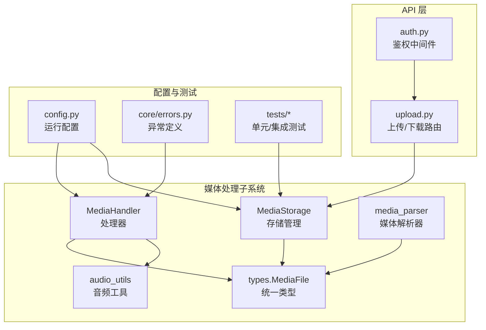
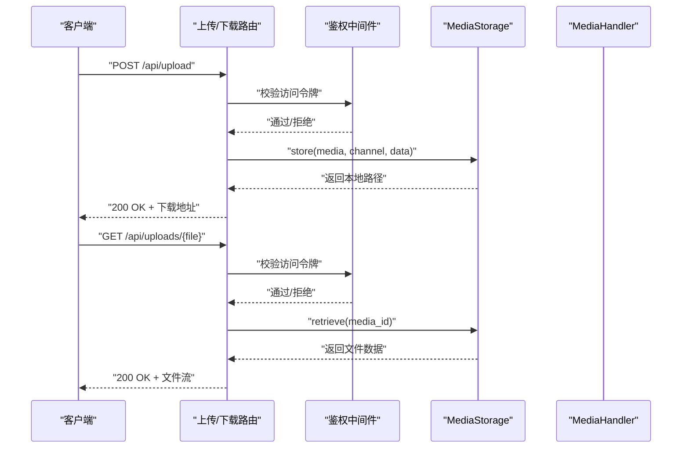
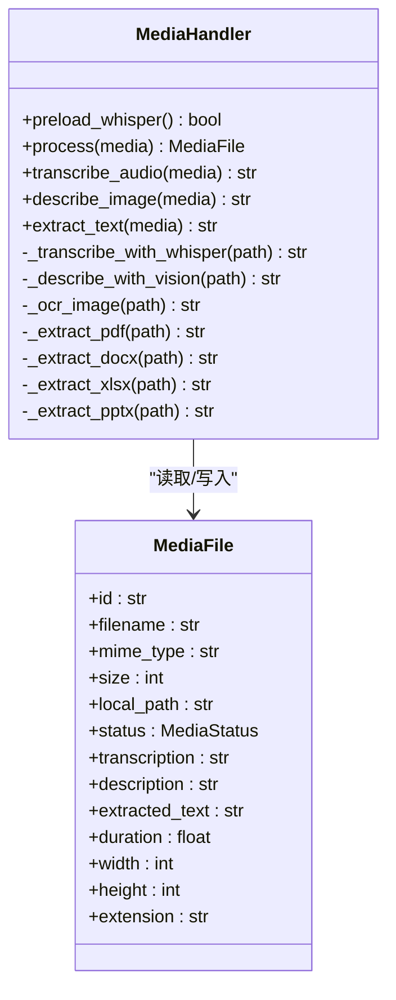
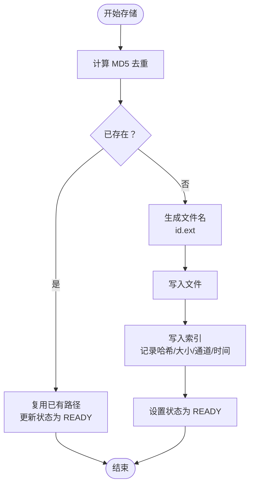
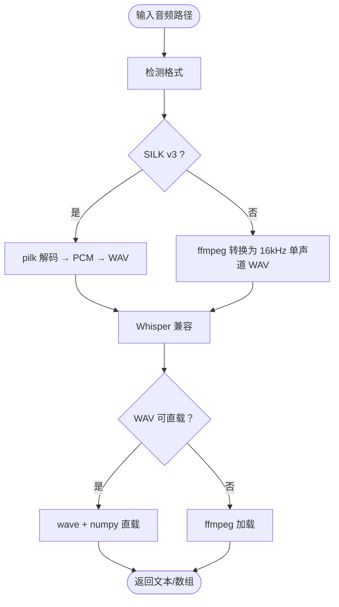
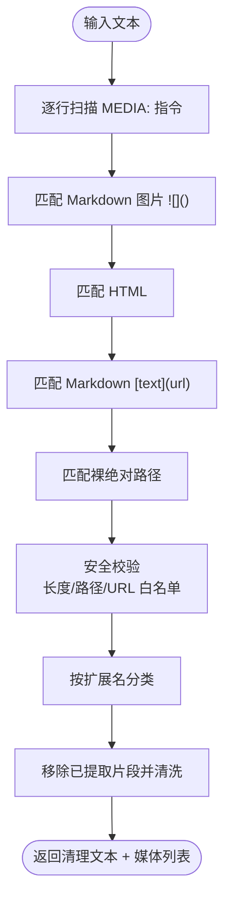
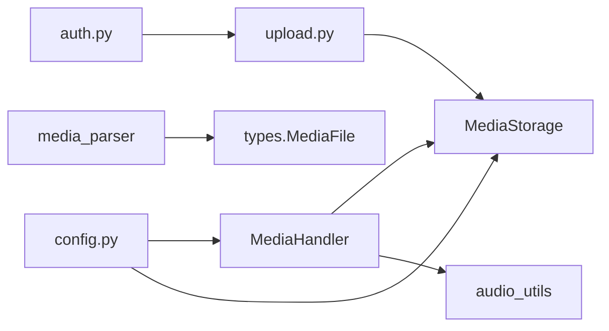

# 媒体文件处理

<cite>
**本文引用的文件**
- [src/synapse/channels/media/__init__.py](file://src/synapse/channels/media/__init__.py)
- [src/synapse/channels/media/handler.py](file://src/synapse/channels/media/handler.py)
- [src/synapse/channels/media/storage.py](file://src/synapse/channels/media/storage.py)
- [src/synapse/channels/media/audio_utils.py](file://src/synapse/channels/media/audio_utils.py)
- [src/synapse/channels/media_parser.py](file://src/synapse/channels/media_parser.py)
- [src/synapse/channels/types.py](file://src/synapse/channels/types.py)
- [src/synapse/api/routes/upload.py](file://src/synapse/api/routes/upload.py)
- [src/synapse/api/auth.py](file://src/synapse/api/auth.py)
- [src/synapse/config.py](file://src/synapse/config.py)
- [src/synapse/core/errors.py](file://src/synapse/core/errors.py)
- [tests/test_new_features.py](file://tests/test_new_features.py)
- [tests/legacy/test_new_features.py](file://tests/legacy/test_new_features.py)
</cite>

## 目录
1. [简介](#简介)
2. [项目结构](#项目结构)
3. [核心组件](#核心组件)
4. [架构总览](#架构总览)
5. [详细组件分析](#详细组件分析)
6. [依赖分析](#依赖分析)
7. [性能考虑](#性能考虑)
8. [故障排查指南](#故障排查指南)
9. [结论](#结论)
10. [附录](#附录)

## 简介
本技术文档面向媒体文件处理系统，围绕图片预处理、音频处理、文档内容提取、文件上传与下载、存储策略与缓存、安全校验与格式验证、以及性能优化与带宽控制等方面进行系统化说明。文档同时给出关键流程的时序图与类图，帮助读者快速理解整体架构与实现细节。

## 项目结构
媒体处理相关代码主要集中在 channels 子模块中，包括媒体处理器、存储管理、音频工具、媒体解析器与统一类型定义；API 层提供上传与鉴权能力；配置模块提供运行期参数；测试覆盖了存储去重等关键行为。

图表来源
- [src/synapse/channels/media/handler.py:104-133](file://src/synapse/channels/media/handler.py#L104-L133)
- [src/synapse/channels/media/storage.py:61-112](file://src/synapse/channels/media/storage.py#L61-L112)
- [src/synapse/channels/media/audio_utils.py:133-184](file://src/synapse/channels/media/audio_utils.py#L133-L184)
- [src/synapse/channels/media_parser.py:154-283](file://src/synapse/channels/media_parser.py#L154-L283)
- [src/synapse/channels/types.py:55-194](file://src/synapse/channels/types.py#L55-L194)
- [src/synapse/api/routes/upload.py:88-100](file://src/synapse/api/routes/upload.py#L88-L100)
- [src/synapse/api/auth.py:263-379](file://src/synapse/api/auth.py#L263-L379)
- [src/synapse/config.py:162-177](file://src/synapse/config.py#L162-L177)
- [src/synapse/core/errors.py:6-21](file://src/synapse/core/errors.py#L6-L21)
- [tests/test_new_features.py:832-846](file://tests/test_new_features.py#L832-L846)
- [tests/legacy/test_new_features.py:832-846](file://tests/legacy/test_new_features.py#L832-L846)

章节来源
- [src/synapse/channels/media/__init__.py:1-17](file://src/synapse/channels/media/__init__.py#L1-L17)

## 核心组件
- 媒体处理器 MediaHandler：根据媒体类型自动选择处理路径，支持语音转文字（Whisper）、图片描述（Claude Vision 或 OCR）、文档内容提取（PDF/Docx/Xlsx/Pptx/文本）。
- 媒体存储 MediaStorage：按通道组织本地存储、文件去重（MD5）、索引管理、过期与容量清理、统计查询。
- 音频工具 audio_utils：兼容 Whisper/LLM 的音频格式转换（SILK/OPUS/OGG/AMR/WMA/AAC 等），提供 WAV 直载与 numpy 加载路径。
- 媒体解析器 media_parser：从文本中提取图片/音频/视频/文件引用，内置路径安全校验与 URL scheme 白名单。
- 统一类型 types.MediaFile：封装媒体元数据、状态机与扩展名推断。
- API 与鉴权：上传/下载路由与鉴权中间件，支持 Bearer Token、X-API-Key、查询参数 token 等多种认证方式。
- 运行配置：Whisper 开关与模型/语言设置、日志、代理等。

章节来源
- [src/synapse/channels/media/handler.py:104-133](file://src/synapse/channels/media/handler.py#L104-L133)
- [src/synapse/channels/media/storage.py:61-112](file://src/synapse/channels/media/storage.py#L61-L112)
- [src/synapse/channels/media/audio_utils.py:133-184](file://src/synapse/channels/media/audio_utils.py#L133-L184)
- [src/synapse/channels/media_parser.py:154-283](file://src/synapse/channels/media_parser.py#L154-L283)
- [src/synapse/channels/types.py:55-194](file://src/synapse/channels/types.py#L55-L194)
- [src/synapse/api/routes/upload.py:88-100](file://src/synapse/api/routes/upload.py#L88-L100)
- [src/synapse/api/auth.py:263-379](file://src/synapse/api/auth.py#L263-L379)
- [src/synapse/config.py:162-177](file://src/synapse/config.py#L162-L177)

## 架构总览
媒体处理流程从消息接收开始，经由媒体解析器抽取媒体引用，下载到本地存储，再交由处理器进行格式转换与内容理解，最后通过 API 提供下载与鉴权保护。

图表来源
- [src/synapse/api/routes/upload.py:88-100](file://src/synapse/api/routes/upload.py#L88-L100)
- [src/synapse/api/auth.py:357-377](file://src/synapse/api/auth.py#L357-L377)
- [src/synapse/channels/media/storage.py:114-134](file://src/synapse/channels/media/storage.py#L114-L134)

## 详细组件分析

### 媒体处理器 MediaHandler
- 自动类型判定：根据 MIME 类型区分图片、音频、文档与视频。
- 语音转文字：优先使用本地 Whisper（可按语言自动选择 .en 模型），失败回退为简短描述。
- 图片理解：优先使用 Claude Vision（Base64 图片 + MIME），失败回退 OCR；可配置是否启用 OCR。
- 文档内容提取：支持 PDF（PyMuPDF 优先，pypdf 回退）、DOCX、XLSX（限制行数）、PPTX、纯文本与常见脚本/样式文件。
- 错误处理：捕获异常并记录日志，保证主流程不中断。

图表来源
- [src/synapse/channels/media/handler.py:104-133](file://src/synapse/channels/media/handler.py#L104-L133)
- [src/synapse/channels/media/handler.py:163-197](file://src/synapse/channels/media/handler.py#L163-L197)
- [src/synapse/channels/media/handler.py:230-266](file://src/synapse/channels/media/handler.py#L230-L266)
- [src/synapse/channels/media/handler.py:293-433](file://src/synapse/channels/media/handler.py#L293-L433)
- [src/synapse/channels/types.py:55-194](file://src/synapse/channels/types.py#L55-L194)

章节来源
- [src/synapse/channels/media/handler.py:104-133](file://src/synapse/channels/media/handler.py#L104-L133)
- [src/synapse/channels/media/handler.py:163-197](file://src/synapse/channels/media/handler.py#L163-L197)
- [src/synapse/channels/media/handler.py:230-266](file://src/synapse/channels/media/handler.py#L230-L266)
- [src/synapse/channels/media/handler.py:293-433](file://src/synapse/channels/media/handler.py#L293-L433)

### 媒体存储 MediaStorage
- 存储策略：按 channel 维度组织目录，文件名采用媒体 ID + 扩展名，避免冲突。
- 去重机制：对文件内容计算 MD5，若已存在则复用路径并更新状态。
- 索引管理：维护 index.json，记录路径、哈希、大小、通道、创建时间。
- 清理策略：按过期时间（天）与总容量（MB）清理，优先删除最旧文件，清理至 80% 阈值。
- 查询统计：提供总文件数、总大小、使用率、按通道分布等统计信息。

图表来源
- [src/synapse/channels/media/storage.py:61-112](file://src/synapse/channels/media/storage.py#L61-L112)
- [src/synapse/channels/media/storage.py:160-219](file://src/synapse/channels/media/storage.py#L160-L219)

章节来源
- [src/synapse/channels/media/storage.py:61-112](file://src/synapse/channels/media/storage.py#L61-L112)
- [src/synapse/channels/media/storage.py:160-219](file://src/synapse/channels/media/storage.py#L160-L219)
- [tests/test_new_features.py:832-846](file://tests/test_new_features.py#L832-L846)
- [tests/legacy/test_new_features.py:832-846](file://tests/legacy/test_new_features.py#L832-L846)

### 音频工具 audio_utils
- 格式兼容：针对 QQ/微信 SILK v3（魔数识别）、OPUS/OGG/AMR/WEBM/WMA/AAC 等非标准格式，提供转换为 Whisper/LLM 兼容的 WAV。
- 转换链路：SILK → pilk 解码 → PCM → wave 写入 → Whisper；非 SILK 通过 ffmpeg 转换。
- 直载优化：对已转换的 WAV，可直接读取为 numpy 数组，跳过 ffmpeg 依赖，提高性能。
- LLM 兼容：提供 ensure_llm_compatible，按不同模型要求输出目标格式。

图表来源
- [src/synapse/channels/media/audio_utils.py:133-184](file://src/synapse/channels/media/audio_utils.py#L133-L184)
- [src/synapse/channels/media/audio_utils.py:187-237](file://src/synapse/channels/media/audio_utils.py#L187-L237)

章节来源
- [src/synapse/channels/media/audio_utils.py:133-184](file://src/synapse/channels/media/audio_utils.py#L133-L184)
- [src/synapse/channels/media/audio_utils.py:187-237](file://src/synapse/channels/media/audio_utils.py#L187-L237)

### 媒体解析器 media_parser
- 提取范围：Markdown 图片、HTML img、Markdown 链接、MEDIA: 指令行、裸绝对路径。
- 安全校验：长度限制、路径规范化、禁止路径穿越、URL scheme 白名单（拒绝 javascript:/data:/file:/ftp: 等）。
- 分类归集：按 image/audio/video/file 归类，支持去重与文本清洗。

图表来源
- [src/synapse/channels/media_parser.py:154-283](file://src/synapse/channels/media_parser.py#L154-L283)
- [src/synapse/channels/media_parser.py:101-139](file://src/synapse/channels/media_parser.py#L101-L139)

章节来源
- [src/synapse/channels/media_parser.py:154-283](file://src/synapse/channels/media_parser.py#L154-L283)
- [src/synapse/channels/media_parser.py:101-139](file://src/synapse/channels/media_parser.py#L101-L139)

### 统一类型与状态机
- MediaFile：封装媒体标识、来源、本地路径、状态、处理结果与元数据，并提供扩展名推断与序列化。
- MediaStatus：统一的状态机（PENDING/DOWNLOADING/READY/FAILED/PROCESSED），便于流程控制与错误恢复。

章节来源
- [src/synapse/channels/types.py:45-53](file://src/synapse/channels/types.py#L45-L53)
- [src/synapse/channels/types.py:55-194](file://src/synapse/channels/types.py#L55-L194)

### API 与鉴权
- 上传/下载路由：安全校验文件名相对路径，推断 MIME 类型，返回文件响应。
- 鉴权中间件：支持 Bearer Token、X-API-Key、查询参数 token，支持本地直连豁免与代理转发识别。

章节来源
- [src/synapse/api/routes/upload.py:88-100](file://src/synapse/api/routes/upload.py#L88-L100)
- [src/synapse/api/auth.py:263-379](file://src/synapse/api/auth.py#L263-L379)

### 运行配置与异常
- Whisper 配置：开关、模型大小、语言（含 .en 模型自动切换）。
- 其他：日志、代理、IPv4 强制模式、模型下载源等。
- 异常：用户取消任务异常，便于中断长流程。

章节来源
- [src/synapse/config.py:162-177](file://src/synapse/config.py#L162-L177)
- [src/synapse/core/errors.py:6-21](file://src/synapse/core/errors.py#L6-L21)

## 依赖分析
- 组件内聚：处理器与存储分别负责“处理”和“持久化”，职责清晰；音频工具与解析器分别负责“格式转换”和“引用提取”，边界明确。
- 外部依赖：Whisper、Claude Vision、OCR（pytesseract）、PDF/Office 解析库、ffmpeg（可选）。
- 关键耦合点：MediaHandler 依赖 MediaStorage 的本地路径；API 路由依赖 MediaStorage 的检索能力；鉴权中间件贯穿上传/下载。

图表来源
- [src/synapse/channels/media/handler.py:175-178](file://src/synapse/channels/media/handler.py#L175-L178)
- [src/synapse/channels/media/storage.py:61-112](file://src/synapse/channels/media/storage.py#L61-L112)
- [src/synapse/api/routes/upload.py:88-100](file://src/synapse/api/routes/upload.py#L88-L100)
- [src/synapse/api/auth.py:357-377](file://src/synapse/api/auth.py#L357-L377)
- [src/synapse/config.py:162-177](file://src/synapse/config.py#L162-L177)

## 性能考虑
- 模型预热：MediaHandler 提供预加载 Whisper 的异步方法，避免首次调用延迟。
- 直载优化：Whisper 对 WAV 直载 numpy 数组可跳过 ffmpeg，显著降低 I/O 与编解码开销。
- 去重与缓存：MediaStorage 基于 MD5 去重，减少重复存储与网络传输。
- 清理策略：按过期与容量阈值清理，维持磁盘空间健康；清理至 80% 阈值，预留缓冲。
- 并行与中断：工具并行执行与中断检查可提升吞吐，但需谨慎配置以平衡一致性与性能。

章节来源
- [src/synapse/channels/media/handler.py:63-82](file://src/synapse/channels/media/handler.py#L63-L82)
- [src/synapse/channels/media/audio_utils.py:187-237](file://src/synapse/channels/media/audio_utils.py#L187-L237)
- [src/synapse/channels/media/storage.py:160-219](file://src/synapse/channels/media/storage.py#L160-L219)
- [src/synapse/config.py:88-96](file://src/synapse/config.py#L88-L96)

## 故障排查指南
- 语音转写失败：检查 Whisper 是否可用与模型加载是否成功；确认音频格式是否可被 Whisper/ffmpeg 处理；必要时使用 audio_utils.ensure_whisper_compatible。
- 图片理解失败：确认 Claude Vision 可用与 Base64 编码正确；若启用 OCR，检查 pytesseract 安装与语言包。
- 文档提取失败：确认对应库（PDF/DOCX/XLSX/PPTX）安装；注意 XLSX 行数限制。
- 存储异常：检查 index.json 是否损坏；确认 base_path 可写；关注清理日志与统计信息。
- 上传/下载失败：核对文件名相对路径校验、MIME 类型推断；确认鉴权头或查询参数有效。
- 用户取消：捕获 UserCancelledError，确保流程可中断并释放资源。

章节来源
- [src/synapse/channels/media/handler.py:163-197](file://src/synapse/channels/media/handler.py#L163-L197)
- [src/synapse/channels/media/handler.py:230-266](file://src/synapse/channels/media/handler.py#L230-L266)
- [src/synapse/channels/media/handler.py:293-433](file://src/synapse/channels/media/handler.py#L293-L433)
- [src/synapse/channels/media/storage.py:247-265](file://src/synapse/channels/media/storage.py#L247-L265)
- [src/synapse/api/routes/upload.py:88-100](file://src/synapse/api/routes/upload.py#L88-L100)
- [src/synapse/api/auth.py:357-377](file://src/synapse/api/auth.py#L357-L377)
- [src/synapse/core/errors.py:6-21](file://src/synapse/core/errors.py#L6-L21)

## 结论
该媒体文件处理系统通过统一类型与分层架构实现了图片、音频、文档的自动化处理与存储管理。结合安全校验、格式兼容与清理策略，系统在易用性与稳定性之间取得良好平衡。建议在生产环境中启用 Whisper 预热、合理配置清理阈值，并完善监控与告警以保障长期稳定运行。

## 附录
- 配置项要点
  - Whisper：whisper_enabled、whisper_model、whisper_language
  - 日志：log_level、log_dir、log_max_size_mb、log_backup_count、log_retention_days
  - 代理：http_proxy、https_proxy、all_proxy、force_ipv4
  - 模型下载源：model_download_source
- 测试要点
  - 存储去重：相同内容多次存储应复用同一路径
  - 上传/下载：文件名相对路径校验与 MIME 推断
  - 鉴权：多方式认证与本地直连豁免

章节来源
- [src/synapse/config.py:162-177](file://src/synapse/config.py#L162-L177)
- [tests/test_new_features.py:832-846](file://tests/test_new_features.py#L832-L846)
- [tests/legacy/test_new_features.py:832-846](file://tests/legacy/test_new_features.py#L832-L846)
- [src/synapse/api/routes/upload.py:88-100](file://src/synapse/api/routes/upload.py#L88-L100)
- [src/synapse/api/auth.py:263-379](file://src/synapse/api/auth.py#L263-L379)