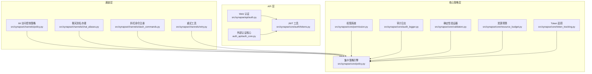
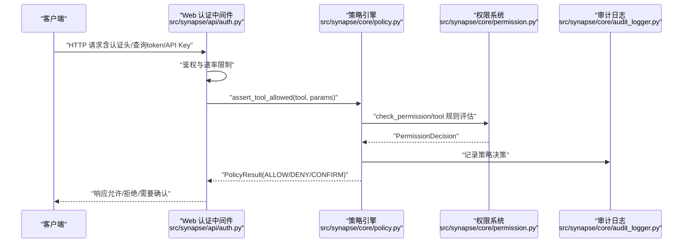
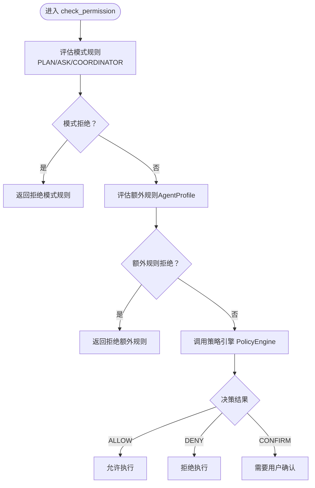
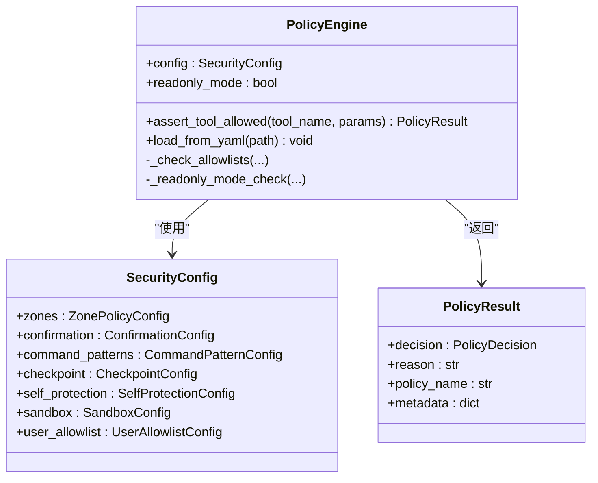
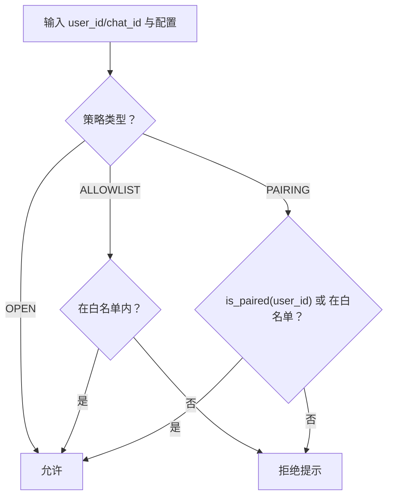
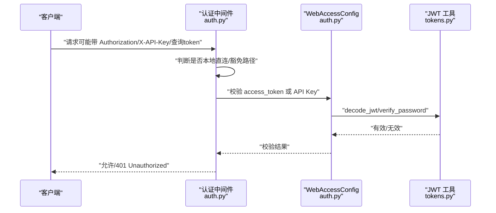
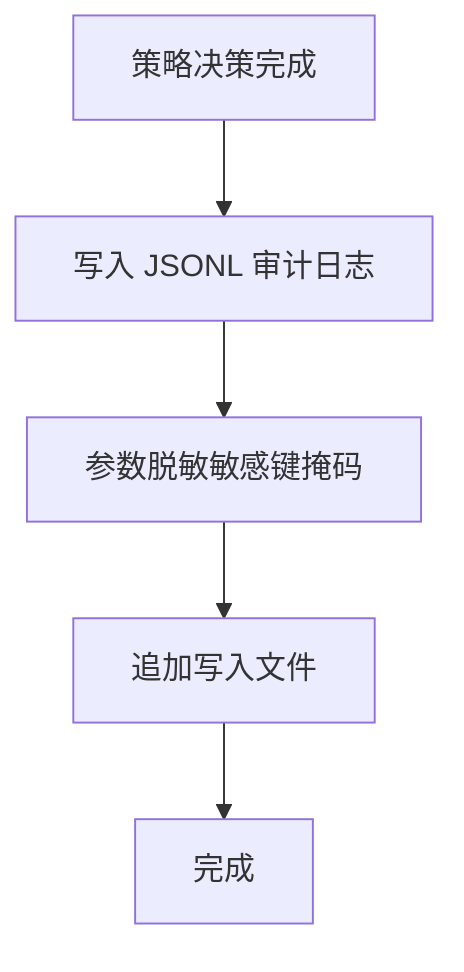
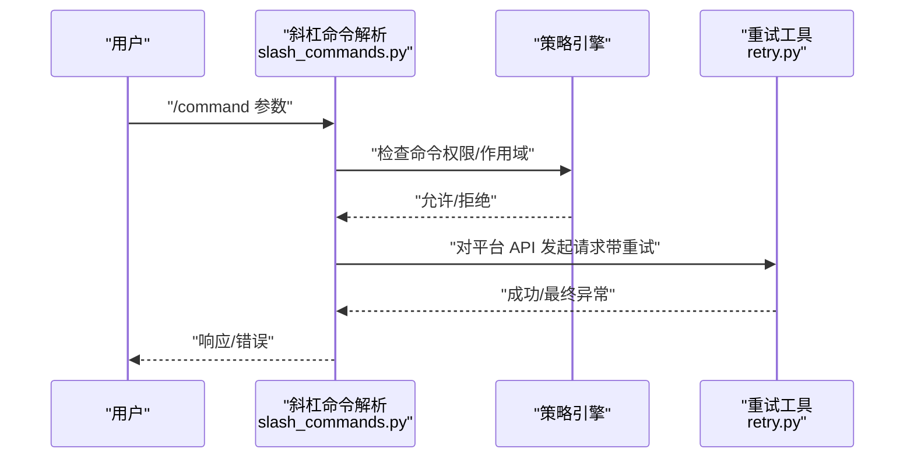
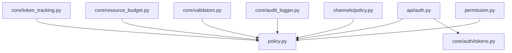

# 安全策略与权限控制

<cite>
**本文档引用的文件**
- [permission.py](file://src/synapse/core/permission.py)
- [policy.py](file://src/synapse/core/policy.py)
- [auth.py](file://src/synapse/api/auth.py)
- [tokens.py](file://src/synapse/core/auth/tokens.py)
- [auth_core.py](file://auth_api/auth_core.py)
- [policy.py](file://src/synapse/channels/policy.py)
- [chat_aliases.py](file://src/synapse/channels/chat_aliases.py)
- [slash_commands.py](file://src/synapse/channels/slash_commands.py)
- [retry.py](file://src/synapse/channels/retry.py)
- [audit_logger.py](file://src/synapse/core/audit_logger.py)
- [validators.py](file://src/synapse/core/validators.py)
- [resource_budget.py](file://src/synapse/core/resource_budget.py)
- [token_tracking.py](file://src/synapse/core/token_tracking.py)
- [errors.py](file://src/synapse/core/errors.py)
</cite>

## 目录
1. [引言](#引言)
2. [项目结构](#项目结构)
3. [核心组件](#核心组件)
4. [架构总览](#架构总览)
5. [详细组件分析](#详细组件分析)
6. [依赖关系分析](#依赖关系分析)
7. [性能考虑](#性能考虑)
8. [故障排除指南](#故障排除指南)
9. [结论](#结论)
10. [附录](#附录)

## 引言
本技术文档聚焦于安全策略与权限控制系统，围绕通道安全策略、权限验证流程、访问控制模型展开，同时覆盖重试机制、聊天别名管理、斜杠命令的安全处理，以及API速率限制、请求验证、恶意行为检测。文档还提供安全配置最佳实践、审计日志与异常监控方案，并讨论合规性、数据保护与隐私安全的实现要点。

## 项目结构
安全相关能力主要分布在以下模块：
- 核心权限与策略：src/synapse/core/permission.py、src/synapse/core/policy.py
- 通道访问控制：src/synapse/channels/policy.py
- 认证与授权：src/synapse/api/auth.py、src/synapse/core/auth/tokens.py、auth_api/auth_core.py
- 通道功能与安全：src/synapse/channels/chat_aliases.py、src/synapse/channels/slash_commands.py、src/synapse/channels/retry.py
- 审计与监控：src/synapse/core/audit_logger.py、src/synapse/core/validators.py、src/synapse/core/resource_budget.py、src/synapse/core/token_tracking.py
- 异常与错误：src/synapse/core/errors.py

**图表来源**
- [auth.py:1-380](file://src/synapse/api/auth.py#L1-L380)
- [tokens.py:1-77](file://src/synapse/core/auth/tokens.py#L1-L77)
- [auth_core.py:1-86](file://auth_api/auth_core.py#L1-L86)
- [policy.py:1-122](file://src/synapse/channels/policy.py#L1-L122)
- [chat_aliases.py:1-76](file://src/synapse/channels/chat_aliases.py#L1-L76)
- [slash_commands.py:1-184](file://src/synapse/channels/slash_commands.py#L1-L184)
- [retry.py:1-113](file://src/synapse/channels/retry.py#L1-L113)
- [permission.py:1-495](file://src/synapse/core/permission.py#L1-L495)
- [policy.py:1-800](file://src/synapse/core/policy.py#L1-L800)
- [audit_logger.py:1-111](file://src/synapse/core/audit_logger.py#L1-L111)
- [validators.py:1-447](file://src/synapse/core/validators.py#L1-L447)
- [resource_budget.py:1-363](file://src/synapse/core/resource_budget.py#L1-L363)
- [token_tracking.py:1-225](file://src/synapse/core/token_tracking.py#L1-L225)

**章节来源**
- [permission.py:1-495](file://src/synapse/core/permission.py#L1-L495)
- [policy.py:1-800](file://src/synapse/core/policy.py#L1-L800)
- [auth.py:1-380](file://src/synapse/api/auth.py#L1-L380)
- [tokens.py:1-77](file://src/synapse/core/auth/tokens.py#L1-L77)
- [auth_core.py:1-86](file://auth_api/auth_core.py#L1-L86)
- [policy.py:1-122](file://src/synapse/channels/policy.py#L1-L122)
- [chat_aliases.py:1-76](file://src/synapse/channels/chat_aliases.py#L1-L76)
- [slash_commands.py:1-184](file://src/synapse/channels/slash_commands.py#L1-L184)
- [retry.py:1-113](file://src/synapse/channels/retry.py#L1-L113)
- [audit_logger.py:1-111](file://src/synapse/core/audit_logger.py#L1-L111)
- [validators.py:1-447](file://src/synapse/core/validators.py#L1-L447)
- [resource_budget.py:1-363](file://src/synapse/core/resource_budget.py#L1-L363)
- [token_tracking.py:1-225](file://src/synapse/core/token_tracking.py#L1-L225)

## 核心组件
- 权限系统（Permission System）：以规则集（Ruleset）为核心，支持通配匹配、最后匹配规则生效、路径级检查、fail-closed/fail-open策略，覆盖工具级与路径级权限。
- 集中策略引擎（Policy Engine）：六层安全防护（L1+L3），包括四区矩阵（workspace/control/protected/forbidden）、平台危险命令模式匹配、工具策略、范围策略、确认门、自保护与沙箱。
- 通道访问控制（Channel Policy）：针对私聊与群聊的策略类型（开放/配对/白名单/禁用），提供策略检查结果与提示信息。
- 认证与授权（Web Access）：单密码模式、JWT 令牌、刷新令牌、速率限制、本地直连豁免、中间件鉴权。
- 审计与监控：JSONL 审计日志、敏感信息脱敏、确定性验证器、资源预算与Token追踪。
- 通道功能与安全：聊天别名存储、斜杠命令注册与权限分类、统一重试机制。

**章节来源**
- [permission.py:103-332](file://src/synapse/core/permission.py#L103-L332)
- [policy.py:526-800](file://src/synapse/core/policy.py#L526-L800)
- [policy.py:1-122](file://src/synapse/channels/policy.py#L1-L122)
- [auth.py:328-380](file://src/synapse/api/auth.py#L328-L380)
- [audit_logger.py:54-111](file://src/synapse/core/audit_logger.py#L54-L111)
- [validators.py:91-447](file://src/synapse/core/validators.py#L91-L447)
- [resource_budget.py:91-363](file://src/synapse/core/resource_budget.py#L91-L363)
- [token_tracking.py:77-225](file://src/synapse/core/token_tracking.py#L77-L225)

## 架构总览
整体安全架构采用“分层防护 + 统一决策”的设计：
- 分层防护：通道层（IM/CLI）、API层（认证/授权）、核心策略层（权限/策略/审计/验证/预算/追踪）。
- 统一决策：权限系统与策略引擎作为统一决策点，结合模式规则、额外规则、策略引擎与审计日志，形成闭环。

**图表来源**
- [auth.py:328-380](file://src/synapse/api/auth.py#L328-L380)
- [policy.py:759-800](file://src/synapse/core/policy.py#L759-L800)
- [permission.py:248-332](file://src/synapse/core/permission.py#L248-L332)
- [audit_logger.py:61-85](file://src/synapse/core/audit_logger.py#L61-L85)

## 详细组件分析

### 权限系统（Permission System）
- 规则模型：PermissionRule(permission, pattern, action)，支持通配匹配与最后匹配规则生效。
- 工具映射：编辑类工具（write_file、edit_file、delete_file、rename_file 等）映射到 "edit"，读取类工具映射到 "read"，其他工具映射到自身名称。
- 模式规则：PLAN_MODE、ASK_MODE、COORDINATOR_MODE 的规则集，分别限定不同模式下的可用工具与路径。
- 统一决策：check_permission 先评估模式规则，再评估额外规则（如 AgentProfile.permission_rules），最后调用策略引擎，失败时根据工具风险级别决定 fail-closed 或 fail-open。
- 路径检查：check_path 在运行时对具体路径进行检查，结合日志与审计。

**图表来源**
- [permission.py:248-332](file://src/synapse/core/permission.py#L248-L332)
- [permission.py:334-380](file://src/synapse/core/permission.py#L334-L380)
- [permission.py:103-124](file://src/synapse/core/permission.py#L103-L124)

**章节来源**
- [permission.py:57-187](file://src/synapse/core/permission.py#L57-L187)
- [permission.py:383-495](file://src/synapse/core/permission.py#L383-L495)

### 集中策略引擎（Policy Engine）
- 六层安全防护：
  - L1：四区矩阵（workspace/control/protected/forbidden）× 操作类型（read/create/edit/overwrite/delete/recursive_delete）。
  - L3：平台危险命令模式匹配（Windows/macOS/Linux），分为 CRITICAL/HIGH/MEDIUM/LOW 风险等级。
  - 工具策略、范围策略、确认门、自保护（死亡开关）、沙箱。
- 关键能力：
  - assert_tool_allowed：统一入口，先检查允许清单，再检查只读模式，然后执行 L1/L3 检查，记录审计。
  - 自保护：连续拒绝触发只读模式，拒绝非只读操作。
  - 确认门：支持超时、自动确认、缓存 TTL，支持 UI 确认。
  - 沙箱：按风险等级启用，支持网络白名单与豁免。
  - 审计：PolicyResult 包含决策、原因、策略名与元数据，持久化到 JSONL。

**图表来源**
- [policy.py:526-800](file://src/synapse/core/policy.py#L526-L800)
- [policy.py:381-394](file://src/synapse/core/policy.py#L381-L394)
- [policy.py:268-276](file://src/synapse/core/policy.py#L268-L276)

**章节来源**
- [policy.py:759-800](file://src/synapse/core/policy.py#L759-L800)
- [policy.py:116-215](file://src/synapse/core/policy.py#L116-L215)
- [policy.py:278-394](file://src/synapse/core/policy.py#L278-L394)

### 通道访问控制（IM Policy）
- 私聊策略（DmPolicyType）：OPEN（任何人）、PAIRING（配对码验证或白名单）、ALLOWLIST（白名单）。
- 群聊策略（GroupPolicyType）：OPEN（任何群）、ALLOWLIST（白名单）、DISABLED（完全禁用）。
- 返回 PolicyResult，包含 allowed 标志、拒绝原因与提示消息。

**图表来源**
- [policy.py:54-122](file://src/synapse/channels/policy.py#L54-L122)

**章节来源**
- [policy.py:32-122](file://src/synapse/channels/policy.py#L32-L122)

### 认证与授权（Web Access）
- 单密码模式：环境变量或配置文件存储密码哈希，支持动态更新与提示。
- JWT 令牌：访问令牌与刷新令牌，版本号用于强制登出。
- 中间件：支持本地直连豁免、代理转发识别、Authorization 头、查询参数 token、X-API-Key。
- 速率限制：登录接口滑动窗口限流（每 IP 每分钟最多 5 次）。

**图表来源**
- [auth.py:328-380](file://src/synapse/api/auth.py#L328-L380)
- [auth.py:91-250](file://src/synapse/api/auth.py#L91-L250)
- [tokens.py:26-51](file://src/synapse/core/auth/tokens.py#L26-L51)

**章节来源**
- [auth.py:38-50](file://src/synapse/api/auth.py#L38-L50)
- [auth.py:263-283](file://src/synapse/api/auth.py#L263-L283)
- [auth.py:303-319](file://src/synapse/api/auth.py#L303-L319)

### 审计日志与异常监控
- 审计日志：PolicyResult 决策持久化到 JSONL，包含时间戳、工具名、决策、原因、策略名与参数脱敏。
- 敏感信息脱敏：对常见敏感键进行正则替换与掩码。
- 异常监控：确定性验证器（Plan/Artifact/Tool/File/CompletePlan）与资源预算（Token/Cost/Duration/Iterations/ToolCalls）配合追踪。

**图表来源**
- [audit_logger.py:61-85](file://src/synapse/core/audit_logger.py#L61-L85)
- [audit_logger.py:36-51](file://src/synapse/core/audit_logger.py#L36-L51)

**章节来源**
- [audit_logger.py:54-111](file://src/synapse/core/audit_logger.py#L54-L111)
- [validators.py:91-447](file://src/synapse/core/validators.py#L91-L447)
- [resource_budget.py:91-363](file://src/synapse/core/resource_budget.py#L91-L363)

### 通道功能与安全
- 聊天别名管理：按 (channel, chat_id) 存储用户自定义显示名，持久化到 JSON 文件，支持增删查。
- 斜杠命令注册：统一注册表，支持 CLI/IM/Both 与管理员命令，帮助文本格式化。
- 重试机制：统一异步重试工具，支持指数退避、抖动、HTTP 429 Retry-After 提取与自定义 should_retry。

**图表来源**
- [slash_commands.py:132-184](file://src/synapse/channels/slash_commands.py#L132-L184)
- [retry.py:57-113](file://src/synapse/channels/retry.py#L57-L113)

**章节来源**
- [chat_aliases.py:21-76](file://src/synapse/channels/chat_aliases.py#L21-L76)
- [slash_commands.py:18-184](file://src/synapse/channels/slash_commands.py#L18-L184)
- [retry.py:21-113](file://src/synapse/channels/retry.py#L21-L113)

## 依赖关系分析
- 权限系统依赖策略引擎进行工具级决策，策略引擎依赖配置与审计日志。
- 通道访问控制策略与集中策略引擎协同，共同决定 IM 交互的准入。
- 认证中间件依赖 WebAccessConfig 与 JWT 工具，提供统一鉴权入口。
- 审计日志与验证器、资源预算、Token 追踪共同构成监控闭环。

**图表来源**
- [permission.py:295-313](file://src/synapse/core/permission.py#L295-L313)
- [policy.py:526-800](file://src/synapse/core/policy.py#L526-L800)
- [auth.py:328-380](file://src/synapse/api/auth.py#L328-L380)
- [audit_logger.py:100-111](file://src/synapse/core/audit_logger.py#L100-L111)
- [validators.py:388-447](file://src/synapse/core/validators.py#L388-L447)
- [resource_budget.py:91-363](file://src/synapse/core/resource_budget.py#L91-L363)
- [token_tracking.py:77-225](file://src/synapse/core/token_tracking.py#L77-L225)

**章节来源**
- [permission.py:294-332](file://src/synapse/core/permission.py#L294-L332)
- [policy.py:526-800](file://src/synapse/core/policy.py#L526-L800)
- [auth.py:328-380](file://src/synapse/api/auth.py#L328-L380)

## 性能考虑
- 异步重试：指数退避与抖动降低平台限流与瞬时故障的影响，Retry-After 头优化等待时间。
- 速率限制：登录接口滑动窗口限流，防止暴力破解。
- 审计日志：JSONL 追加写入，避免频繁打开关闭；Token 追踪使用后台线程批量写入 SQLite WAL 模式。
- 确定性验证器：减少对 LLM 的依赖，提高验证效率与稳定性。
- 资源预算：在 ReasoningEngine 迭代中定期检查，提前暂停或降级，避免资源滥用。

[本节为通用指导，无需特定文件分析]

## 故障排除指南
- 认证失败：
  - 检查 Authorization 头、查询参数 token、X-API-Key 是否正确。
  - 确认本地直连豁免与代理转发配置（TRUST_PROXY）。
  - 查看登录速率限制是否触发。
- 策略拒绝：
  - 检查模式规则（PLAN/ASK/COORDINATOR）与工具权限映射。
  - 查看策略引擎配置（zones、command_patterns、sandbox、self_protection）。
  - 审计日志定位拒绝原因与策略名。
- 通道访问受限：
  - 私聊/群聊策略类型与白名单配置。
  - 配对码验证回调 is_paired 是否正确实现。
- 异常与取消：
  - 用户取消任务会抛出 UserCancelledError，需在上层捕获并清理资源。
- 重试问题：
  - 自定义 should_retry 函数是否正确识别可重试异常。
  - HTTP 429 Retry-After 是否被正确提取。

**章节来源**
- [auth.py:328-380](file://src/synapse/api/auth.py#L328-L380)
- [permission.py:248-332](file://src/synapse/core/permission.py#L248-L332)
- [policy.py:759-800](file://src/synapse/core/policy.py#L759-L800)
- [audit_logger.py:61-85](file://src/synapse/core/audit_logger.py#L61-L85)
- [errors.py:6-21](file://src/synapse/core/errors.py#L6-L21)

## 结论
本系统通过“分层防护 + 统一决策”的架构，实现了从通道接入、工具调用到策略执行的全链路安全控制。权限系统与策略引擎提供灵活的规则与风险分级，通道访问控制保障 IM 场景的准入安全，认证中间件与速率限制抵御外部攻击，审计日志与监控工具提供持续可观测性。建议在生产环境中结合业务场景细化策略配置，强化白名单与沙箱策略，并定期审查审计日志与异常事件。

[本节为总结性内容，无需特定文件分析]

## 附录
- 安全配置最佳实践：
  - 使用强密码并通过环境变量注入，启用 JWT 版本号以支持强制登出。
  - 启用策略引擎的确认门与沙箱，合理设置风险等级阈值。
  - 严格划分四区路径，将受保护与禁止访问区配置到最小必要范围。
  - 开启自保护与只读模式阈值，防止异常放大。
  - 启用审计日志与 Token 追踪，建立合规与溯源能力。
- 合规性与隐私：
  - 审计日志对敏感键进行脱敏，满足数据最小化与隐私保护要求。
  - 速率限制与 fail-closed/fail-open 策略降低滥用风险。
  - 通道别名与斜杠命令的权限控制避免越权操作。

[本节为通用指导，无需特定文件分析]