# 消息路由系统

<cite>
**本文档引用的文件**
- [gateway.py](file://src/synapse/channels/gateway.py)
- [messenger.py](file://src/synapse/orgs/messenger.py)
- [stream_presenter.py](file://src/synapse/channels/stream_presenter.py)
- [group_response.py](file://src/synapse/channels/group_response.py)
- [text_splitter.py](file://src/synapse/channels/text_splitter.py)
- [base.py](file://src/synapse/channels/base.py)
- [types.py](file://src/synapse/channels/types.py)
- [policy.py](file://src/synapse/channels/policy.py)
- [bot_config.py](file://src/synapse/channels/bot_config.py)
- [runtime.py](file://src/synapse/orgs/runtime.py)
- [test_messenger.py](file://tests/orgs/test_messenger.py)
- [test_gateway.py](file://tests/integration/test_gateway.py)
</cite>

## 目录
1. [简介](#简介)
2. [项目结构](#项目结构)
3. [核心组件](#核心组件)
4. [架构总览](#架构总览)
5. [详细组件分析](#详细组件分析)
6. [依赖关系分析](#依赖关系分析)
7. [性能考量](#性能考量)
8. [故障排除指南](#故障排除指南)
9. [结论](#结论)
10. [附录](#附录)

## 简介
本技术文档围绕消息路由系统展开，系统以消息网关为核心枢纽，负责统一接入多渠道即时通讯（IM）平台，完成消息预处理、路由分发、并发控制、流式反馈、群组响应策略与文本分割等关键能力。系统同时提供优先级队列、死锁检测与恢复、中断机制、模型/思考模式命令拦截、以及面向多组织场景的编排与监控能力。

## 项目结构
消息路由系统主要分布在 channels 与 orgs 两大模块：
- channels：通道适配器、消息类型定义、网关、流式呈现、群组响应策略、文本分割、策略与配置等
- orgs：组织编排、消息传递器（Messenger）、运行时与死锁检测等

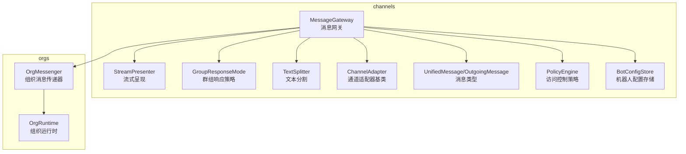

**图表来源**
- [gateway.py:835-960](file://src/synapse/channels/gateway.py#L835-L960)
- [messenger.py:51-113](file://src/synapse/orgs/messenger.py#L51-L113)
- [stream_presenter.py:26-82](file://src/synapse/channels/stream_presenter.py#L26-L82)
- [group_response.py:20-26](file://src/synapse/channels/group_response.py#L20-L26)
- [text_splitter.py:144-198](file://src/synapse/channels/text_splitter.py#L144-L198)
- [base.py:38-105](file://src/synapse/channels/base.py#L38-L105)
- [types.py:18-615](file://src/synapse/channels/types.py#L18-L615)
- [policy.py:29-81](file://src/synapse/channels/policy.py#L29-L81)
- [bot_config.py:27-58](file://src/synapse/channels/bot_config.py#L27-L58)
- [runtime.py:1579-1607](file://src/synapse/orgs/runtime.py#L1579-L1607)

**章节来源**
- [gateway.py:835-960](file://src/synapse/channels/gateway.py#L835-L960)
- [messenger.py:51-113](file://src/synapse/orgs/messenger.py#L51-L113)
- [stream_presenter.py:26-82](file://src/synapse/channels/stream_presenter.py#L26-L82)
- [group_response.py:20-26](file://src/synapse/channels/group_response.py#L20-L26)
- [text_splitter.py:144-198](file://src/synapse/channels/text_splitter.py#L144-L198)
- [base.py:38-105](file://src/synapse/channels/base.py#L38-L105)
- [types.py:18-615](file://src/synapse/channels/types.py#L18-L615)
- [policy.py:29-81](file://src/synapse/channels/policy.py#L29-L81)
- [bot_config.py:27-58](file://src/synapse/channels/bot_config.py#L27-L58)
- [runtime.py:1579-1607](file://src/synapse/orgs/runtime.py#L1579-L1607)

## 核心组件
- 消息网关（MessageGateway）：统一入口，负责适配器管理、消息预处理、会话管理、Agent 调用、并发控制、中断机制、系统级命令拦截、群组响应策略与上下文缓冲、进度事件节流、后台任务等
- 组织消息传递器（OrgMessenger）：基于优先级队列的节点间消息传递，支持暂停/恢复、带宽限制、死锁检测与恢复、TTL 过期
- 流式呈现（StreamPresenter）：统一 IM 平台的流式反馈生命周期（start/update/finalize），内置节流与降级
- 群组响应策略（GroupResponseMode/SmartModeThrottle）：群聊响应模式与智能限流，批量积攒非@消息，降低 LLM 调用频率
- 文本分割（TextSplitter）：Markdown 感知的文本分块，保持代码块完整性，支持按字节长度拆分与序号标记
- 通道适配器基类（ChannelAdapter）：抽象 IM 适配器接口，提供能力声明、媒体下载/上传、回调注册、可选能力（typing、编辑、删除等）
- 消息类型（UnifiedMessage/OutgoingMessage/MediaFile）：跨平台统一消息格式，包含文本、媒体、命令、地理位置、表情等
- 访问控制策略（PolicyEngine）：私聊/群聊策略，白名单/配对授权等
- 机器人配置存储（BotConfigStore）：按聊天/用户粒度的启用/禁用与响应模式覆盖

**章节来源**
- [gateway.py:835-960](file://src/synapse/channels/gateway.py#L835-L960)
- [messenger.py:51-113](file://src/synapse/orgs/messenger.py#L51-L113)
- [stream_presenter.py:26-82](file://src/synapse/channels/stream_presenter.py#L26-L82)
- [group_response.py:20-26](file://src/synapse/channels/group_response.py#L20-L26)
- [text_splitter.py:144-198](file://src/synapse/channels/text_splitter.py#L144-L198)
- [base.py:38-105](file://src/synapse/channels/base.py#L38-L105)
- [types.py:18-615](file://src/synapse/channels/types.py#L18-L615)
- [policy.py:29-81](file://src/synapse/channels/policy.py#L29-L81)
- [bot_config.py:27-58](file://src/synapse/channels/bot_config.py#L27-L58)

## 架构总览
消息从各 IM 通道适配器进入网关，经过预处理（媒体下载、语音转写、命令拦截）、会话管理、并发控制与中断机制，再进入 Agent 处理，最终通过适配器回送到对应平台。组织层面的 Messenger 负责节点间消息传递与死锁检测。

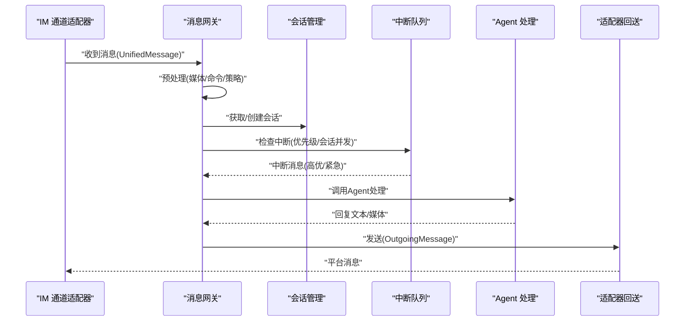

**图表来源**
- [gateway.py:2873-2903](file://src/synapse/channels/gateway.py#L2873-L2903)
- [base.py:142-159](file://src/synapse/channels/base.py#L142-L159)
- [types.py:468-615](file://src/synapse/channels/types.py#L468-L615)

**章节来源**
- [gateway.py:2873-2903](file://src/synapse/channels/gateway.py#L2873-L2903)
- [base.py:142-159](file://src/synapse/channels/base.py#L142-L159)
- [types.py:468-615](file://src/synapse/channels/types.py#L468-L615)

## 详细组件分析

### 消息网关（MessageGateway）
职责与特性：
- 适配器管理：注册/启动/停止多通道适配器，跟踪失败适配器
- 消息处理队列：统一消息队列，支持预/后处理钩子
- 并发控制：会话级信号量控制并发会话数量
- 中断机制：会话级优先队列，支持 NORMAL/HIGH/URGENT 优先级
- 系统级命令拦截：模型切换、思考模式、终极重启等命令的早期拦截
- 群组响应策略：always/mention_only/smart/allowlist/disabled
- 群组上下文缓冲：未@消息缓存，供后续@时注入上下文
- 进度事件节流：聚合计划/交付等进度事件，避免刷屏
- 后台任务：/background 命令创建独立任务执行

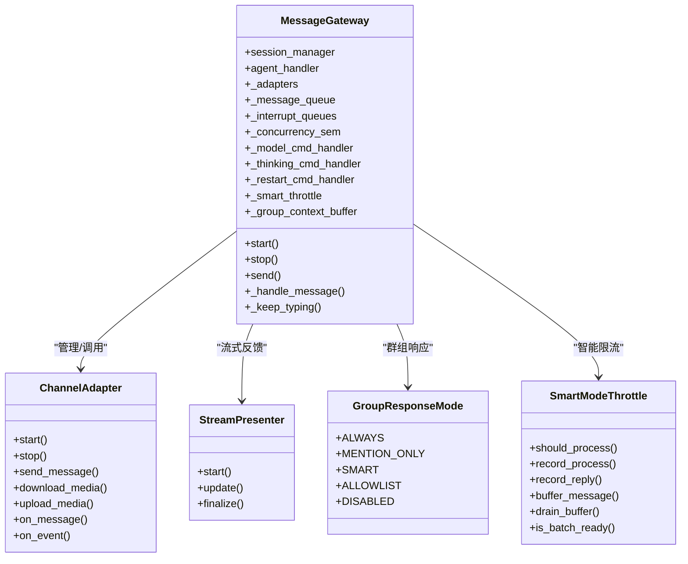

**图表来源**
- [gateway.py:835-960](file://src/synapse/channels/gateway.py#L835-L960)
- [base.py:38-105](file://src/synapse/channels/base.py#L38-L105)
- [stream_presenter.py:26-82](file://src/synapse/channels/stream_presenter.py#L26-L82)
- [group_response.py:20-26](file://src/synapse/channels/group_response.py#L20-L26)
- [text_splitter.py:28-131](file://src/synapse/channels/text_splitter.py#L28-L131)

**章节来源**
- [gateway.py:835-960](file://src/synapse/channels/gateway.py#L835-L960)
- [base.py:38-105](file://src/synapse/channels/base.py#L38-L105)
- [stream_presenter.py:26-82](file://src/synapse/channels/stream_presenter.py#L26-L82)
- [group_response.py:20-26](file://src/synapse/channels/group_response.py#L20-L26)
- [text_splitter.py:28-131](file://src/synapse/channels/text_splitter.py#L28-L131)

### 组织消息传递器（OrgMessenger）
职责与特性：
- 节点邮箱（NodeMailbox）：基于优先级队列的消息投递，支持暂停/恢复、phantom 记录、handler 处理标记
- 发送与路由：根据边带宽限制与环路检测，向目标节点投递消息并触发处理器
- 死锁检测：周期扫描等待图，移除形成环的边以打破死锁
- TTL 过期：定时清理超时消息，避免悬挂

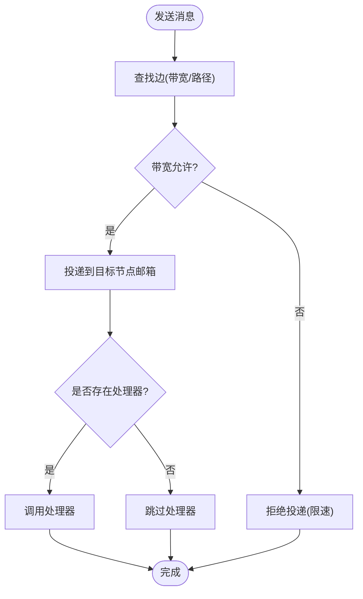

**图表来源**
- [messenger.py:331-362](file://src/synapse/orgs/messenger.py#L331-L362)

**章节来源**
- [messenger.py:51-113](file://src/synapse/orgs/messenger.py#L51-L113)
- [messenger.py:212-242](file://src/synapse/orgs/messenger.py#L212-L242)
- [messenger.py:243-271](file://src/synapse/orgs/messenger.py#L243-L271)
- [messenger.py:331-362](file://src/synapse/orgs/messenger.py#L331-L362)

### 流式消息呈现（StreamPresenter）
职责与特性：
- 生命周期：start → update → finalize，屏蔽平台差异
- 节流：最小更新间隔，避免平台限流
- 思维内容格式化：统一<think>包裹或平台专属标签
- 降级：不支持流式的平台自动发送占位消息并在完成时替换

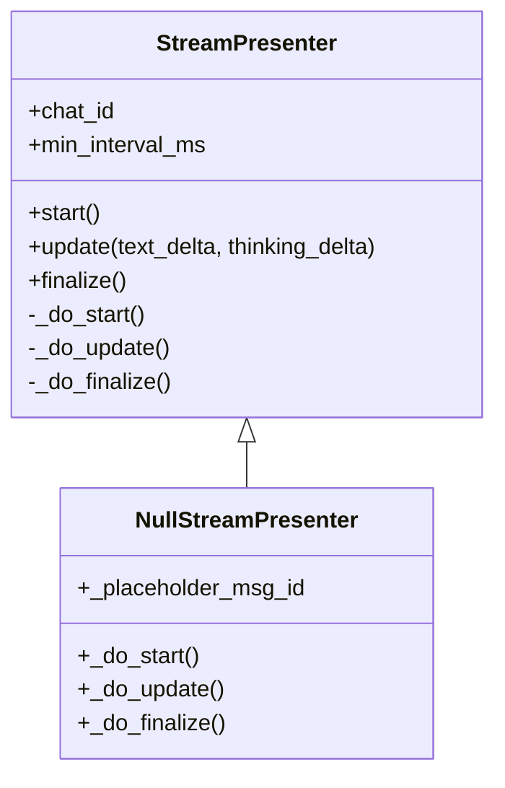

**图表来源**
- [stream_presenter.py:26-82](file://src/synapse/channels/stream_presenter.py#L26-L82)
- [stream_presenter.py:146-177](file://src/synapse/channels/stream_presenter.py#L146-L177)

**章节来源**
- [stream_presenter.py:26-82](file://src/synapse/channels/stream_presenter.py#L26-L82)
- [stream_presenter.py:146-177](file://src/synapse/channels/stream_presenter.py#L146-L177)

### 群组响应合并（GroupResponseMode + SmartModeThrottle）
职责与特性：
- 响应模式：always/mention_only/smart/allowlist/disabled
- 智能限流：批量积攒非@消息，达到批次大小或超时后一次性送 LLM 判断，减少调用次数
- 冷却期：回复后进入冷却，避免频繁触发

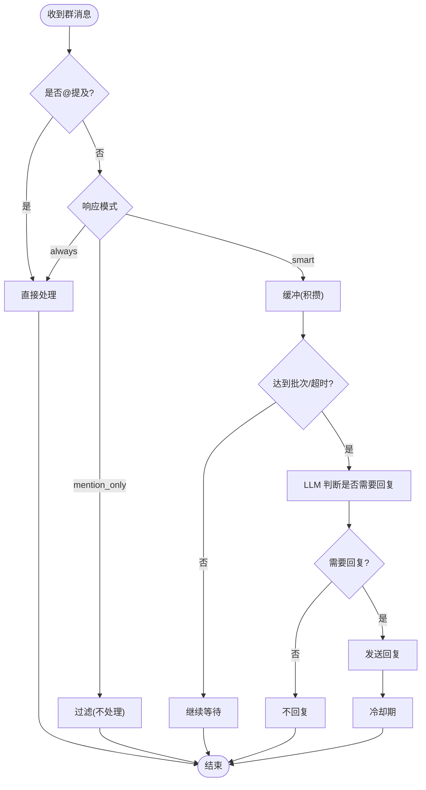

**图表来源**
- [group_response.py:28-131](file://src/synapse/channels/group_response.py#L28-L131)

**章节来源**
- [group_response.py:20-26](file://src/synapse/channels/group_response.py#L20-L26)
- [group_response.py:28-131](file://src/synapse/channels/group_response.py#L28-L131)

### 文本分割处理（TextSplitter）
职责与特性：
- Markdown 感知：代码块围栏不被拆散，优先段落边界切分
- 超长行二次拆分：补齐围栏，保证语法完整性
- 字节安全：按 UTF-8 字节长度拆分，适配企业微信等平台
- 序号标记：[1/N]、(1/3)、emoji 数字等格式
- 纯文本降级：将 Markdown 转为纯文本，保留结构与链接 URL

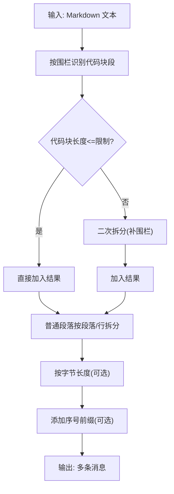

**图表来源**
- [text_splitter.py:144-198](file://src/synapse/channels/text_splitter.py#L144-L198)
- [text_splitter.py:209-257](file://src/synapse/channels/text_splitter.py#L209-L257)
- [text_splitter.py:279-310](file://src/synapse/channels/text_splitter.py#L279-L310)
- [text_splitter.py:340-393](file://src/synapse/channels/text_splitter.py#L340-L393)

**章节来源**
- [text_splitter.py:144-198](file://src/synapse/channels/text_splitter.py#L144-L198)
- [text_splitter.py:209-257](file://src/synapse/channels/text_splitter.py#L209-L257)
- [text_splitter.py:279-310](file://src/synapse/channels/text_splitter.py#L279-L310)
- [text_splitter.py:340-393](file://src/synapse/channels/text_splitter.py#L340-L393)

### 通道适配器基类（ChannelAdapter）
职责与特性：
- 抽象接口：启动/停止、消息收发、媒体下载/上传、事件回调
- 能力声明：streaming/send_image/send_file/send_voice/delete_message/edit_message 等
- 可选能力：typing 状态、成员列表、最近消息、删除/编辑消息等
- 配置检查：占位符提示、端口范围检查等

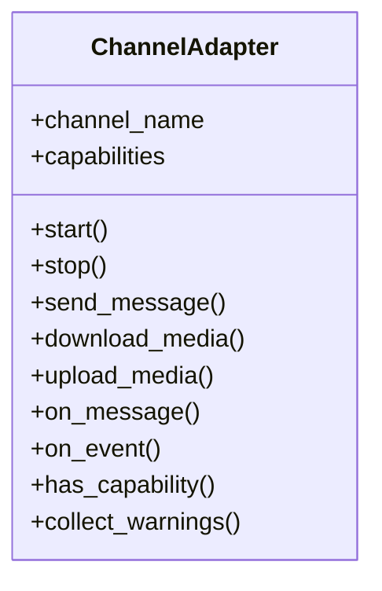

**图表来源**
- [base.py:38-105](file://src/synapse/channels/base.py#L38-L105)

**章节来源**
- [base.py:38-105](file://src/synapse/channels/base.py#L38-L105)

### 消息类型（UnifiedMessage/OutgoingMessage/MediaFile）
职责与特性：
- 统一消息格式：跨平台抽象，包含文本、媒体、命令、地理位置、表情等
- 媒体文件：状态机（pending/downloading/ready/failed/processed），支持转写/描述/提取文本
- 内容推断：根据字段自动推断消息类型
- 序列化/反序列化：支持 to_dict/from_dict

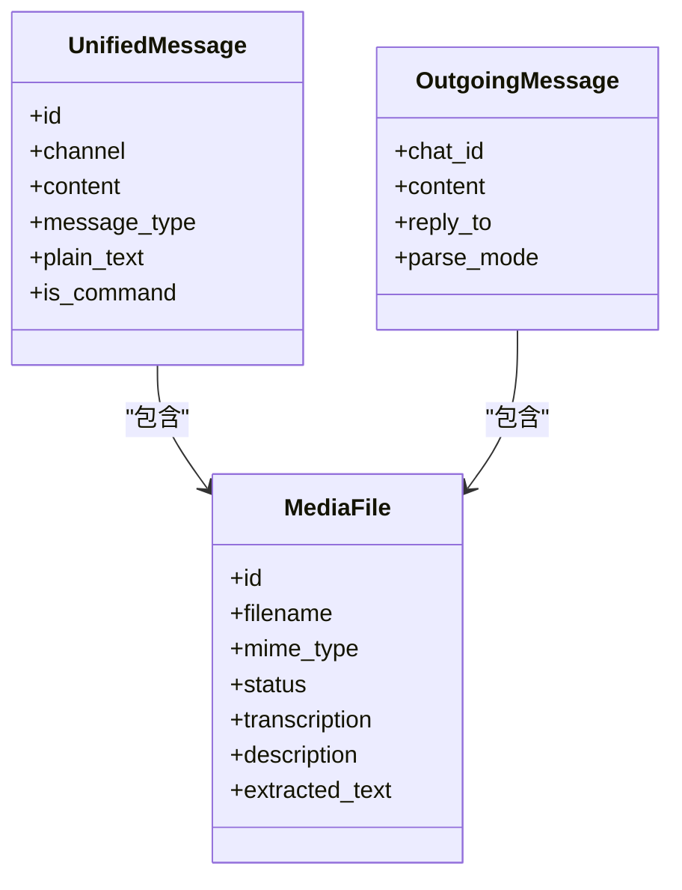

**图表来源**
- [types.py:341-466](file://src/synapse/channels/types.py#L341-L466)
- [types.py:468-615](file://src/synapse/channels/types.py#L468-L615)
- [types.py:55-195](file://src/synapse/channels/types.py#L55-L195)

**章节来源**
- [types.py:341-466](file://src/synapse/channels/types.py#L341-L466)
- [types.py:468-615](file://src/synapse/channels/types.py#L468-L615)
- [types.py:55-195](file://src/synapse/channels/types.py#L55-L195)

### 访问控制策略（PolicyEngine）
职责与特性：
- 私聊策略：open/pairing/allowlist，支持配对授权与白名单
- 群聊策略：open/allowlist/disabled，支持拒绝提示
- 策略检查返回 PolicyResult，包含 allowed 标志与可选原因/提示

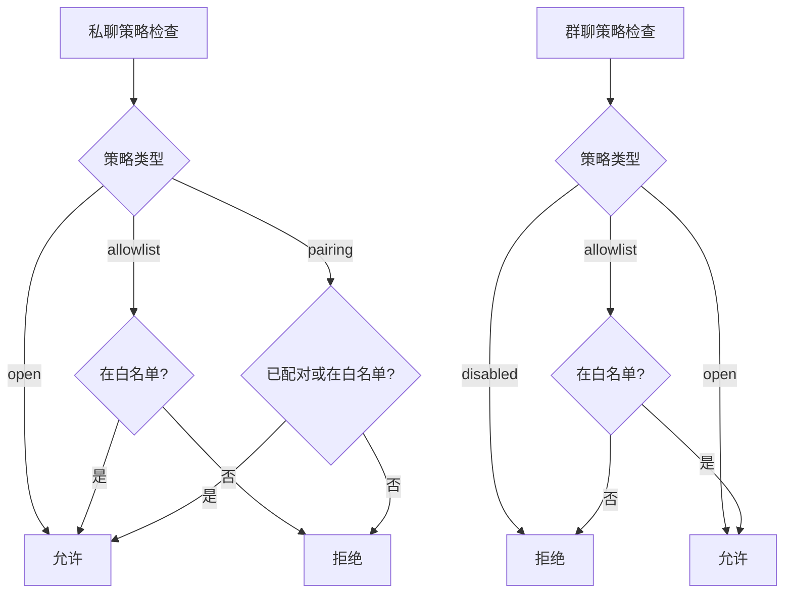

**图表来源**
- [policy.py:54-81](file://src/synapse/channels/policy.py#L54-L81)
- [policy.py:99-122](file://src/synapse/channels/policy.py#L99-L122)

**章节来源**
- [policy.py:54-81](file://src/synapse/channels/policy.py#L54-L81)
- [policy.py:99-122](file://src/synapse/channels/policy.py#L99-L122)

### 机器人配置存储（BotConfigStore）
职责与特性：
- 按聊天/用户粒度的启用/禁用与响应模式覆盖
- 匹配优先级：精确匹配 > 通配符匹配 > 默认启用
- 原子写入：规则变更持久化

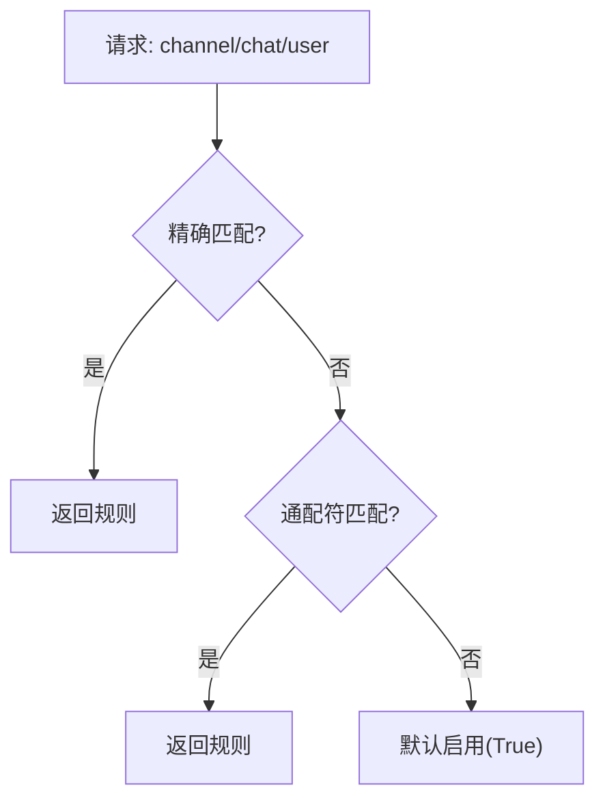

**图表来源**
- [bot_config.py:41-58](file://src/synapse/channels/bot_config.py#L41-L58)

**章节来源**
- [bot_config.py:41-58](file://src/synapse/channels/bot_config.py#L41-L58)

## 依赖关系分析
- MessageGateway 依赖 ChannelAdapter 抽象、StreamPresenter、GroupResponseMode、SmartModeThrottle、BotConfigStore、PolicyEngine、UnifiedMessage/OutgoingMessage
- OrgMessenger 依赖 NodeMailbox（优先级队列）、死锁检测与 TTL 清理
- 运行时（OrgRuntime）为组织提供消息传递器实例与死锁事件上报

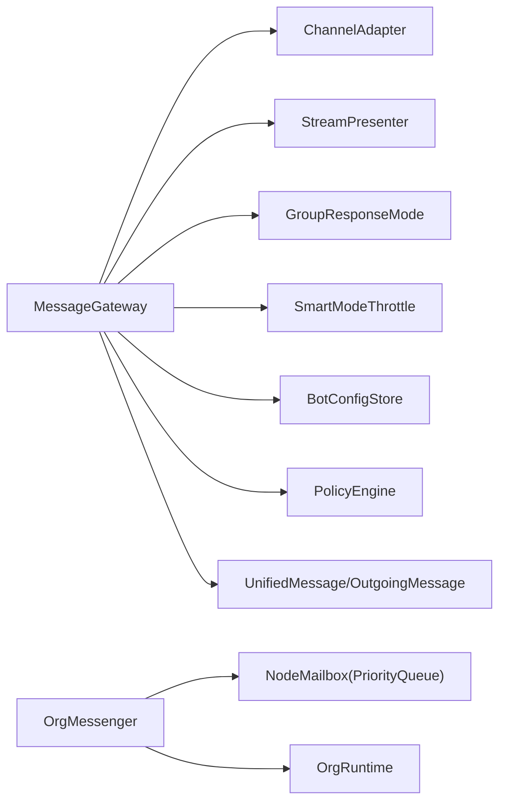

**图表来源**
- [gateway.py:835-960](file://src/synapse/channels/gateway.py#L835-L960)
- [messenger.py:51-113](file://src/synapse/orgs/messenger.py#L51-L113)
- [runtime.py:1579-1607](file://src/synapse/orgs/runtime.py#L1579-L1607)

**章节来源**
- [gateway.py:835-960](file://src/synapse/channels/gateway.py#L835-L960)
- [messenger.py:51-113](file://src/synapse/orgs/messenger.py#L51-L113)
- [runtime.py:1579-1607](file://src/synapse/orgs/runtime.py#L1579-L1607)

## 性能考量
- 并发控制：通过会话级信号量限制并发会话数量，默认环境变量 MAX_CONCURRENT_SESSIONS 控制上限
- 优先级队列：NodeMailbox 使用优先队列，结合时间戳与序列号保证公平性与有序性
- 智能限流：SmartModeThrottle 批量积攒群消息，降低 LLM 调用频率
- 流式节流：StreamPresenter 最小更新间隔，避免平台限流
- 死锁检测：OrgMessenger 周期扫描等待图并移除形成环的边，保障系统稳定性
- TTL 过期：定时清理超时消息，释放资源

**章节来源**
- [gateway.py:922-924](file://src/synapse/channels/gateway.py#L922-L924)
- [messenger.py:51-113](file://src/synapse/orgs/messenger.py#L51-L113)
- [group_response.py:28-131](file://src/synapse/channels/group_response.py#L28-L131)
- [stream_presenter.py:96-112](file://src/synapse/channels/stream_presenter.py#L96-L112)
- [messenger.py:212-242](file://src/synapse/orgs/messenger.py#L212-L242)
- [messenger.py:243-271](file://src/synapse/orgs/messenger.py#L243-L271)

## 故障排除指南
- 适配器失败：检查 collect_warnings 输出，关注占位符与端口范围提示；通过 _failed_adapters/_failed_adapter_reasons 跟踪失败原因
- 会话并发突破：确认 MAX_CONCURRENT_SESSIONS 设置；排查 _post_task_hook 与 _auto_send_result 的竞态导致的并发超限
- 死锁问题：观察死锁检测日志，确认已移除环形等待边；必要时人工干预等待图
- 群组响应异常：检查 GroupResponseMode 与 SmartModeThrottle 配置；确认缓冲区大小与 TTL 设置
- 文本分割异常：确认 max_length/max_bytes 参数；检查序号前缀预留空间
- 命令拦截失效：确认系统级命令处理器初始化与注入（ModelCommandHandler/ThinkingCommandHandler/RestartCommandHandler）

**章节来源**
- [base.py:106-138](file://src/synapse/channels/base.py#L106-L138)
- [gateway.py:922-924](file://src/synapse/channels/gateway.py#L922-L924)
- [messenger.py:212-242](file://src/synapse/orgs/messenger.py#L212-L242)
- [group_response.py:74-90](file://src/synapse/channels/group_response.py#L74-L90)
- [text_splitter.py:209-257](file://src/synapse/channels/text_splitter.py#L209-L257)
- [gateway.py:932-940](file://src/synapse/channels/gateway.py#L932-L940)

## 结论
消息路由系统通过统一网关与组织编排，实现了跨平台、可扩展、高可靠的即时消息处理。优先级队列、死锁检测、智能群组响应与流式呈现等机制共同保障了性能与用户体验。建议在生产环境中合理配置并发与限流参数，结合监控指标持续优化。

## 附录

### 配置选项与环境变量
- MAX_CONCURRENT_SESSIONS：会话并发上限
- MAX_CONCURRENT_NODES_PER_ORG：组织内并发节点上限（运行时）
- SMART_REACTION_ENABLED：Smart 模式下是否添加反应（避免刷屏）
- 群组上下文 TTL 与最大条数：控制群聊上下文缓冲区容量与时效

**章节来源**
- [gateway.py:922-924](file://src/synapse/channels/gateway.py#L922-L924)
- [gateway.py:1555-1569](file://src/synapse/channels/gateway.py#L1555-L1569)
- [messenger.py:243-271](file://src/synapse/orgs/messenger.py#L243-L271)

### 监控指标与健康检查
- API 事件循环延迟：测量事件循环调度延迟
- LLM 并发统计：LLM 客户端并发状态
- 组织并发统计：按组织统计活跃节点与上限

**章节来源**
- [health.py:395-423](file://src/synapse/api/routes/health.py#L395-L423)

### 测试参考
- NodeMailbox 优先级与暂停/恢复行为
- UnifiedMessage/OutgoingMessage 基础用例

**章节来源**
- [test_messenger.py:35-76](file://tests/orgs/test_messenger.py#L35-L76)
- [test_gateway.py:18-51](file://tests/integration/test_gateway.py#L18-L51)