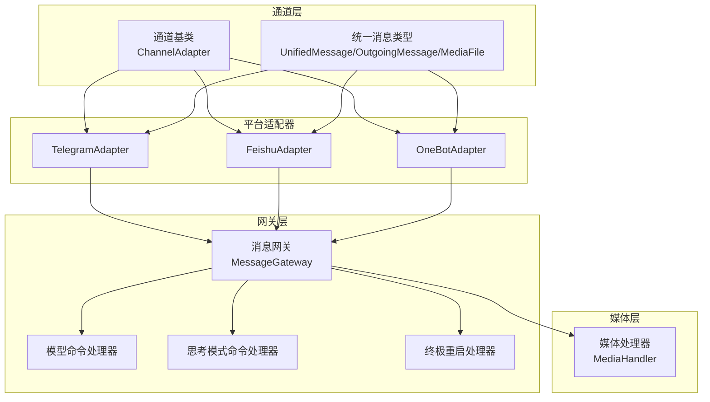
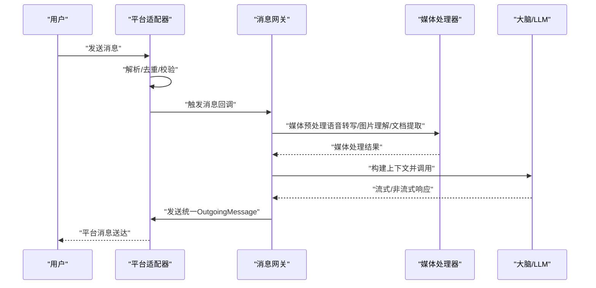
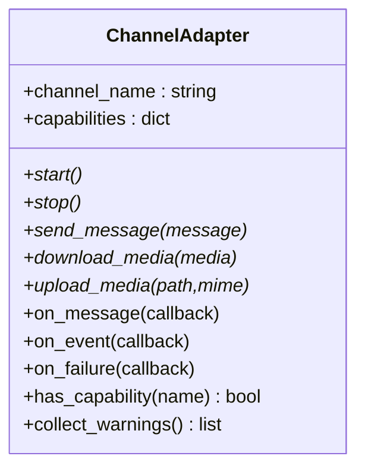
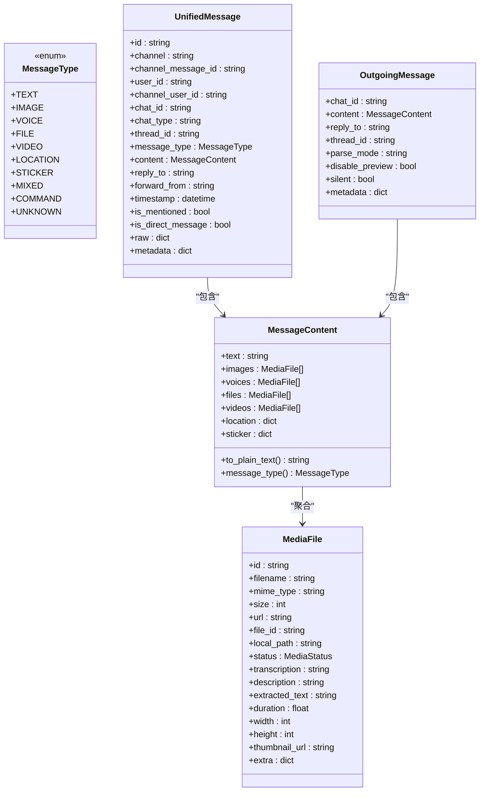
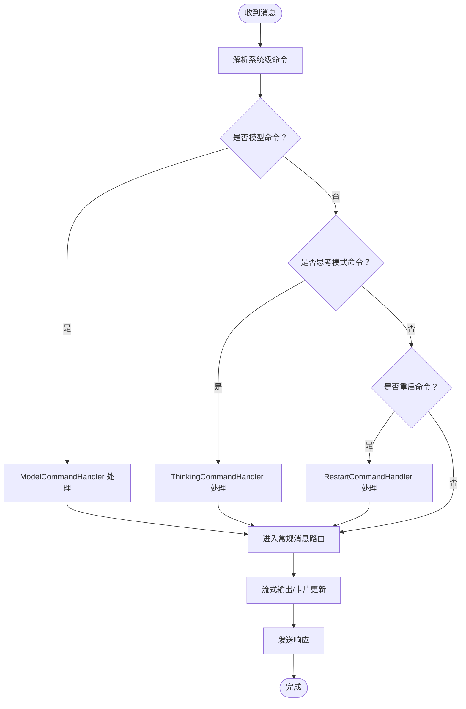
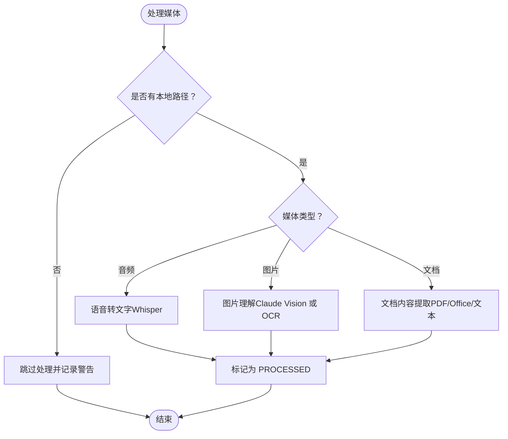
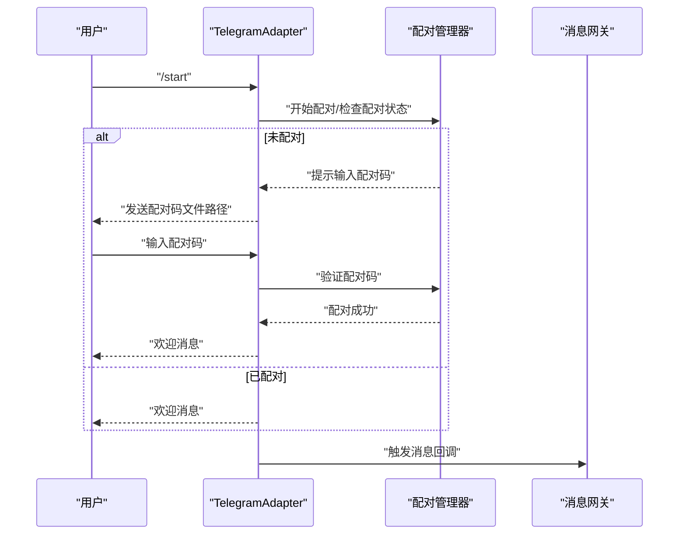
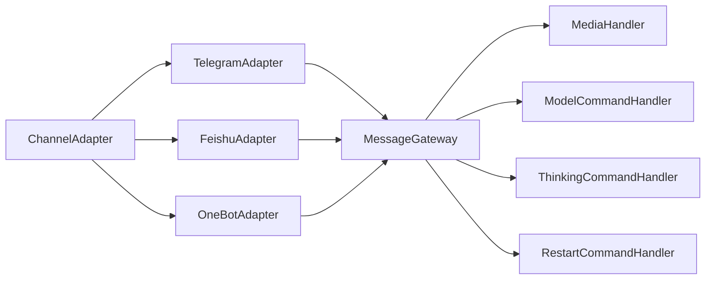

# 通信通道系统

<cite>
**本文引用的文件**
- [channels/__init__.py](file://src/synapse/channels/__init__.py)
- [channels/base.py](file://src/synapse/channels/base.py)
- [channels/gateway.py](file://src/synapse/channels/gateway.py)
- [channels/types.py](file://src/synapse/channels/types.py)
- [channels/adapters/telegram.py](file://src/synapse/channels/adapters/telegram.py)
- [channels/adapters/feishu.py](file://src/synapse/channels/adapters/feishu.py)
- [channels/adapters/onebot.py](file://src/synapse/channels/adapters/onebot.py)
- [channels/media/handler.py](file://src/synapse/channels/media/handler.py)
</cite>

## 目录
1. [简介](#简介)
2. [项目结构](#项目结构)
3. [核心组件](#核心组件)
4. [架构总览](#架构总览)
5. [详细组件分析](#详细组件分析)
6. [依赖分析](#依赖分析)
7. [性能考虑](#性能考虑)
8. [故障排除指南](#故障排除指南)
9. [结论](#结论)
10. [附录](#附录)

## 简介
通信通道系统为多平台即时通讯（IM）提供统一接入与消息编排能力，支持6种主流IM平台的适配器，包括：Telegram、飞书（含 Lark）、OneBot（通用协议，兼容多种实现）、以及企业微信、钉钉、QQ 官方机器人等。系统通过“通道适配器 + 消息网关 + 媒体处理”的分层架构，实现跨平台消息的统一收发、流式输出、媒体文件处理、扫码绑定、系统级命令拦截与紧急重启等高级能力。

## 项目结构
- 顶层模块导出通道相关类型与入口：
  - [channels/__init__.py](file://src/synapse/channels/__init__.py)
- 通道适配器基类与通用类型：
  - [channels/base.py](file://src/synapse/channels/base.py)
  - [channels/types.py](file://src/synapse/channels/types.py)
- 消息网关与系统级命令处理：
  - [channels/gateway.py](file://src/synapse/channels/gateway.py)
- 媒体处理模块：
  - [channels/media/handler.py](file://src/synapse/channels/media/handler.py)
- 平台适配器实现：
  - Telegram 适配器：[channels/adapters/telegram.py](file://src/synapse/channels/adapters/telegram.py)
  - 飞书适配器：[channels/adapters/feishu.py](file://src/synapse/channels/adapters/feishu.py)
  - OneBot 适配器：[channels/adapters/onebot.py](file://src/synapse/channels/adapters/onebot.py)

图表来源
- [channels/base.py:38-458](file://src/synapse/channels/base.py#L38-L458)
- [channels/types.py:18-615](file://src/synapse/channels/types.py#L18-L615)
- [channels/gateway.py:1-800](file://src/synapse/channels/gateway.py#L1-L800)
- [channels/adapters/telegram.py:260-800](file://src/synapse/channels/adapters/telegram.py#L260-L800)
- [channels/adapters/feishu.py:141-800](file://src/synapse/channels/adapters/feishu.py#L141-L800)
- [channels/adapters/onebot.py:66-800](file://src/synapse/channels/adapters/onebot.py#L66-L800)
- [channels/media/handler.py:21-434](file://src/synapse/channels/media/handler.py#L21-L434)

章节来源
- [channels/__init__.py:1-33](file://src/synapse/channels/__init__.py#L1-L33)
- [channels/base.py:38-458](file://src/synapse/channels/base.py#L38-L458)
- [channels/types.py:18-615](file://src/synapse/channels/types.py#L18-L615)

## 核心组件
- 通道适配器基类（ChannelAdapter）
  - 定义统一生命周期（start/stop）、消息收发（send_message/send_text/send_image 等）、媒体下载/上传、回调注册（on_message/on_event/on_failure）、可选能力（删除/编辑消息、获取聊天/用户信息、成员列表、最近消息、Markdown 支持等）。
  - 提供能力检查（has_capability）、通道类型解析（channel_type）、配置警告收集（collect_warnings）等通用能力。
- 统一消息类型（UnifiedMessage/OutgoingMessage/MediaFile）
  - 定义跨平台统一的消息结构，包含消息类型枚举（文本/图片/语音/文件/视频/位置/表情包/命令/未知）、消息内容聚合（文本+多类媒体）、媒体文件元数据（MIME、尺寸、时长、缩略图、转写/描述/提取文本等）。
- 消息网关（MessageGateway）
  - 负责消息路由、会话管理集成、媒体预处理、Agent 调用、流式输出与中断机制（优先级队列）、系统级命令拦截（模型切换/优先级/恢复/重启）、思维链进度推送、思考模式控制等。
- 媒体处理器（MediaHandler）
  - 提供语音转文字（Whisper）、图片理解/OCR、文档内容提取（PDF/Office/文本）等能力，支持异步处理与降级策略。

章节来源
- [channels/base.py:38-458](file://src/synapse/channels/base.py#L38-L458)
- [channels/types.py:18-615](file://src/synapse/channels/types.py#L18-L615)
- [channels/gateway.py:58-800](file://src/synapse/channels/gateway.py#L58-L800)
- [channels/media/handler.py:21-434](file://src/synapse/channels/media/handler.py#L21-L434)

## 架构总览
系统采用“适配器-网关-媒体”三层架构：
- 适配器层：对接具体IM平台，负责消息收发、事件回调、媒体下载/上传、平台特性能力暴露。
- 网关层：统一调度与编排，实现消息优先级队列、中断机制、系统级命令拦截、流式输出与卡片更新、会话状态管理。
- 媒体层：对语音、图片、文档等进行统一处理，产出可被LLM理解的文本描述。

图表来源
- [channels/gateway.py:58-800](file://src/synapse/channels/gateway.py#L58-L800)
- [channels/media/handler.py:104-134](file://src/synapse/channels/media/handler.py#L104-L134)
- [channels/types.py:468-615](file://src/synapse/channels/types.py#L468-L615)

## 详细组件分析

### 通道适配器基类（ChannelAdapter）
- 设计要点
  - 抽象接口：生命周期、消息收发、媒体处理、回调注册。
  - 能力矩阵：capabilities 字典声明平台能力，便于网关按能力路由与降级。
  - 配置检查：collect_warnings 检测占位符、端口风险等。
  - 可选能力：删除/编辑消息、获取聊天/用户信息、成员列表、最近消息、Markdown、typing 状态等。
- 关键方法
  - 生命周期：start/stop
  - 发送：send_message/send_text/send_image/send_file/send_voice
  - 媒体：download_media/upload_media
  - 回调：on_message/on_event/on_failure
  - 可选：get_chat_info/get_user_info/get_chat_members/get_recent_messages/delete_message/edit_message/send_typing/clear_typing

图表来源
- [channels/base.py:38-458](file://src/synapse/channels/base.py#L38-L458)

章节来源
- [channels/base.py:38-458](file://src/synapse/channels/base.py#L38-L458)

### 统一消息类型（UnifiedMessage/OutgoingMessage/MediaFile）
- 设计要点
  - MessageType 枚举覆盖文本、图片、语音、文件、视频、位置、表情包、命令、未知。
  - MediaFile 统一封装媒体元数据（ID/文件名/MIME/尺寸/时长/缩略图/转写/描述/提取文本/额外字段）。
  - MessageContent 聚合文本与多类媒体，提供 to_plain_text 与 message_type 推断。
  - OutgoingMessage 作为发送端统一载体，支持回复、线程、解析模式、禁用预览、静默发送等。
- 处理流程
  - 接收端：适配器将平台消息转换为 UnifiedMessage，注入 is_mentioned/is_direct_message 等标记。
  - 发送端：将 Agent 输出封装为 OutgoingMessage，交由适配器发送。

图表来源
- [channels/types.py:18-615](file://src/synapse/channels/types.py#L18-L615)

章节来源
- [channels/types.py:18-615](file://src/synapse/channels/types.py#L18-L615)

### 消息网关（MessageGateway）
- 设计要点
  - 中断优先级队列：InterruptPriority（NORMAL/HIGH/URGENT），InterruptMessage 按优先级与时间排序，支持在工具调用间隙插入新消息。
  - 系统级命令拦截：模型切换（/model,/switch,/priority,/restore,/cancel）、思考模式（/thinking,/thinking_depth,/chain）、终极重启（/restart,/取消重启）。
  - 流式输出与卡片更新：支持 per-session 流式缓冲、思考耗时/状态展示、思维链进度推送。
  - 会话管理集成：与 Session/SessionManager 协作，维护用户会话状态。
- 关键流程
  - 模型命令处理：ModelCommandHandler 解析与交互会话，支持临时切换、永久优先级调整、恢复默认。
  - 思考模式命令处理：ThinkingCommandHandler 控制思考模式与深度，支持链路进度推送。
  - 重启命令处理：RestartCommandHandler 提供带确认码的重启流程，支持倒计时与取消。

图表来源
- [channels/gateway.py:58-800](file://src/synapse/channels/gateway.py#L58-L800)

章节来源
- [channels/gateway.py:58-800](file://src/synapse/channels/gateway.py#L58-L800)

### 媒体处理（MediaHandler）
- 设计要点
  - 语音转文字：优先本地 Whisper（可按语言与模型尺寸选择 .en 变体），失败回退为简单描述。
  - 图片理解：优先使用 Brain 的视觉模型（Claude Vision），否则回退 OCR（pytesseract）。
  - 文档提取：PDF（PyMuPDF/pypdf）、DOCX、XLSX、PPTX、文本文件等。
- 处理流程
  - process 根据媒体类型自动选择处理路径，更新 MediaFile 的转写/描述/提取文本，并标记为 PROCESSED。

图表来源
- [channels/media/handler.py:104-134](file://src/synapse/channels/media/handler.py#L104-L134)

章节来源
- [channels/media/handler.py:21-434](file://src/synapse/channels/media/handler.py#L21-L434)

### 平台适配器实现

#### Telegram 适配器（TelegramAdapter）
- 能力与特性
  - 支持 Webhook 与 Long Polling 两种模式；具备流式输出、Markdown、删除/编辑消息、获取聊天信息、配对验证（扫码绑定）等能力。
  - 配对管理器（TelegramPairingManager）：生成/保存配对码、等待配对、验证配对码、取消配对、列出已配对用户。
  - 健康监测：轮询 watchdog 自动重启停止的 polling。
  - 去重：基于 update_id 的去重，防止 webhook 重试导致重复处理。
- 关键流程
  - /start 命令触发配对流程；/status 查看配对状态；/unpair 取消配对。
  - 消息转换：将 Telegram Update 转为 UnifiedMessage，注入 is_mentioned/is_direct_message 等标记。
  - 发送：支持文本、图片、文件、语音等，Markdown 解析。

图表来源
- [channels/adapters/telegram.py:260-800](file://src/synapse/channels/adapters/telegram.py#L260-L800)

章节来源
- [channels/adapters/telegram.py:260-800](file://src/synapse/channels/adapters/telegram.py#L260-L800)

#### 飞书适配器（FeishuAdapter）
- 能力与特性
  - 支持长连接 WebSocket 与 Webhook 两种事件订阅模式；具备流式输出、卡片消息、Markdown、获取聊天/用户/成员/历史、反应（add_reaction）等能力。
  - WebSocket 看门狗：自动检测线程退出并按指数退避重连，超过阈值判定致命失败。
  - 能力探测：通过调用 API 判断权限（如上传图片、CardKit 流式卡片）。
  - 缓存与去重：用户名/群名缓存、消息 ID 去重、最近用户消息追踪。
- 关键流程
  - 启动：初始化客户端、尝试获取 bot open_id、启动 WebSocket、探测能力、启动看门狗。
  - 事件处理：注册多种事件处理器（消息接收、已读、机器人进入/离开、群更新、表情回复、卡片交互等）。
  - 发送：支持文本/富文本/图片/文件/语音，流式卡片更新。

章节来源
- [channels/adapters/feishu.py:141-800](file://src/synapse/channels/adapters/feishu.py#L141-L800)

#### OneBot 适配器（OneBotAdapter）
- 能力与特性
  - 支持正向（forward）与反向（reverse）两种 WebSocket 连接模式；具备文本/图片/语音/文件收发、@提及检测、隐式提及（回复机器人消息）、群名缓存、去重等。
  - 反向 WS：Synapse 作为服务端监听，OneBot 实现主动连接；支持访问令牌校验。
  - 正向 WS：Synapse 主动连接 OneBot 服务器，具备自动重连机制。
  - CQ 码解析：将 OneBot v11 的消息段解析为统一内容结构。
- 关键流程
  - 连接：根据模式启动服务端或发起连接，处理连接丢失并自动重连。
  - 事件：解析消息事件，构建 UnifiedMessage，注入 is_mentioned/is_direct_message 等标记。
  - 发送：将 OutgoingMessage 转换为 OneBot 消息段数组，调用相应 API 发送。

章节来源
- [channels/adapters/onebot.py:66-800](file://src/synapse/channels/adapters/onebot.py#L66-L800)

## 依赖分析
- 组件耦合
  - 适配器依赖通道基类与统一消息类型，向上通过回调与网关交互，向下对接平台 API。
  - 网关依赖适配器集合、会话管理、媒体处理器、系统级命令处理器。
  - 媒体处理器依赖本地模型（Whisper/OCR）与第三方库（PDF/Office/图像处理）。
- 外部依赖
  - Telegram：python-telegram-bot（Webhook/Long Polling、代理支持、错误处理）。
  - 飞书：lark-oapi（事件订阅、WebSocket、CardKit、权限探测、线程隔离）。
  - OneBot：websockets（正向/反向 WS、CQ 码解析、API 回调管理）。
  - 媒体：openai-whisper、pytesseract、PyMuPDF/openpyxl/docx/pptx 等。

图表来源
- [channels/base.py:38-458](file://src/synapse/channels/base.py#L38-L458)
- [channels/gateway.py:58-800](file://src/synapse/channels/gateway.py#L58-L800)
- [channels/media/handler.py:21-434](file://src/synapse/channels/media/handler.py#L21-L434)

章节来源
- [channels/base.py:38-458](file://src/synapse/channels/base.py#L38-L458)
- [channels/gateway.py:58-800](file://src/synapse/channels/gateway.py#L58-L800)
- [channels/media/handler.py:21-434](file://src/synapse/channels/media/handler.py#L21-L434)

## 性能考虑
- 流式输出与节流
  - 网关层支持 per-session 流式缓冲、思考耗时/状态展示、思维链进度推送，降低用户等待感。
  - 飞书/Telegram 等适配器内置流式节流（如 FEISHU_STREAMING_THROTTLE_MS、Telegram 流式节流），避免频繁 PATCH 卡片。
- 去重与缓存
  - 适配器层广泛使用去重（update_id/message_id）与缓存（用户名/群名/最近消息），减少重复处理与 API 调用。
- 异步与并发
  - 媒体处理与模型调用均采用异步执行，结合线程池/进程池加载重型模型，避免阻塞事件循环。
- 代理与网络
  - Telegram 支持显式代理配置与环境变量注入；飞书/OneBot 提供连接超时与重连策略，提升稳定性。

## 故障排除指南
- Telegram
  - 无法连接 API：检查代理配置（proxy 字段或 TELEGRAM_PROXY 环境变量），确保可访问 api.telegram.org。
  - Token 无效：在 @BotFather 校验 Bot Token。
  - 配对失败：确认配对码文件路径与内容，检查配对管理器日志。
  - Polling 异常：watchdog 会自动重启，若持续失败，检查网络与代理。
- 飞书
  - WebSocket 连续重启：超过阈值将报告致命失败，检查 App ID/Secret 与网络；必要时开启 CardKit 权限。
  - 权限不足：能力探测失败时，根据提示开通对应权限（如上传图片、CardKit 流式卡片）。
- OneBot
  - 反向 WS 端口占用：修改 reverse_port 或释放端口。
  - 正向 WS 连接失败：检查 ws_url 与 access_token，观察自动重连日志。
  - CQ 码解析异常：确认消息段格式与编码，必要时解码 HTML 实体。
- 媒体处理
  - Whisper/OCR 不可用：安装对应依赖（openai-whisper/pytesseract），或启用降级逻辑。
  - PDF/Office 提取失败：确认对应库安装（fitz/openpyxl/docx/pptx），检查文件格式与权限。

章节来源
- [channels/adapters/telegram.py:444-516](file://src/synapse/channels/adapters/telegram.py#L444-L516)
- [channels/adapters/feishu.py:428-515](file://src/synapse/channels/adapters/feishu.py#L428-L515)
- [channels/adapters/onebot.py:142-187](file://src/synapse/channels/adapters/onebot.py#L142-L187)
- [channels/media/handler.py:83-103](file://src/synapse/channels/media/handler.py#L83-L103)

## 结论
通信通道系统通过统一的适配器接口与消息网关，实现了对6种IM平台的无缝接入与跨平台一致性体验。借助优先级队列、系统级命令拦截、流式输出与媒体处理能力，系统在复杂场景下仍能保持高可用与高性能。建议在生产环境中合理配置代理、启用能力探测与健康监测，并针对平台差异进行针对性优化。

## 附录
- 平台配置要点（示例）
  - Telegram：配置 bot_token、webhook_url（可选）、media_dir、proxy（可选）、require_pairing、footer_elapsed/footer_status 等。
  - 飞书：配置 app_id/app_secret/verification_token/encrypt_key/domain、media_dir、log_level、group_streaming/streaming_throttle_ms、group_response_mode、footer_elapsed/footer_status 等。
  - OneBot：配置 ws_url/access_token、media_dir、mode（reverse/forward）、reverse_host/reverse_port 等。
- API 集成示例（路径）
  - 发送文本：[channels/base.py:175-184](file://src/synapse/channels/base.py#L175-L184)
  - 发送图片：[channels/base.py:186-198](file://src/synapse/channels/base.py#L186-L198)
  - 发送文件：[channels/base.py:332-352](file://src/synapse/channels/base.py#L332-L352)
  - 发送语音：[channels/base.py:354-374](file://src/synapse/channels/base.py#L354-L374)
  - 下载媒体：[channels/base.py:210-221](file://src/synapse/channels/base.py#L210-L221)
  - 上传媒体：[channels/base.py:223-235](file://src/synapse/channels/base.py#L223-L235)
- 扫码绑定流程（Telegram）
  - [channels/adapters/telegram.py:260-800](file://src/synapse/channels/adapters/telegram.py#L260-L800)
- 媒体处理流程
  - [channels/media/handler.py:104-134](file://src/synapse/channels/media/handler.py#L104-L134)