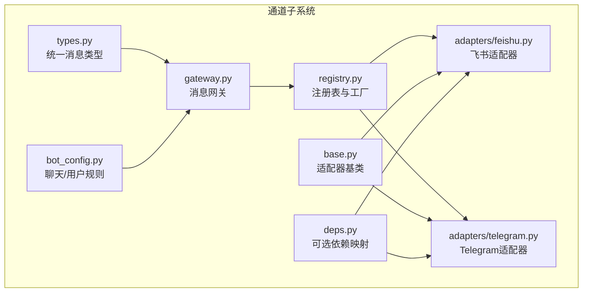
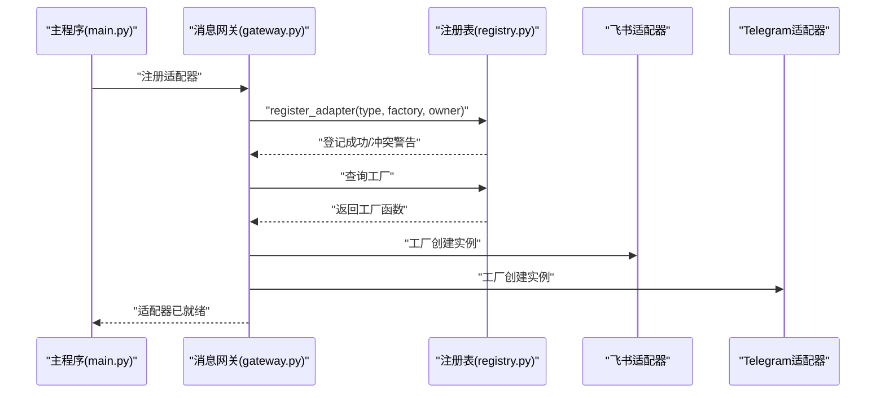
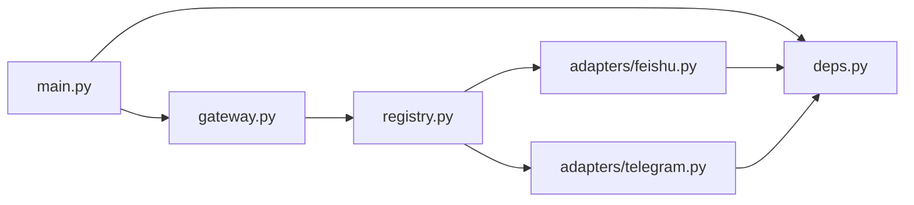

# 通道注册表

<cite>
**本文档引用的文件**
- [registry.py](file://src/synapse/channels/registry.py)
- [base.py](file://src/synapse/channels/base.py)
- [gateway.py](file://src/synapse/channels/gateway.py)
- [types.py](file://src/synapse/channels/types.py)
- [bot_config.py](file://src/synapse/channels/bot_config.py)
- [deps.py](file://src/synapse/channels/deps.py)
- [feishu.py](file://src/synapse/channels/adapters/feishu.py)
- [telegram.py](file://src/synapse/channels/adapters/telegram.py)
- [main.py](file://src/synapse/main.py)
</cite>

## 目录
1. [简介](#简介)
2. [项目结构](#项目结构)
3. [核心组件](#核心组件)
4. [架构总览](#架构总览)
5. [详细组件分析](#详细组件分析)
6. [依赖分析](#依赖分析)
7. [性能考虑](#性能考虑)
8. [故障排查指南](#故障排查指南)
9. [结论](#结论)
10. [附录](#附录)

## 简介
本技术文档围绕“通道注册表系统”展开，系统性阐述 IM 通道适配器的注册、工厂模式应用、动态创建机制与生命周期管理。重点覆盖：
- 注册表设计原理与工厂模式
- 适配器所有权控制与冲突解决策略
- 注册/注销流程、错误处理与调试工具
- 自定义适配器开发指南与最佳实践
- 配置验证、热重载支持与调试技巧

## 项目结构
通道注册表位于 channels 子系统中，围绕适配器基类、统一消息类型、消息网关与注册表共同构成 IM 通道生态。

图表来源
- [registry.py:1-227](file://src/synapse/channels/registry.py#L1-L227)
- [base.py:1-458](file://src/synapse/channels/base.py#L1-L458)
- [types.py:1-615](file://src/synapse/channels/types.py#L1-L615)
- [gateway.py:1-800](file://src/synapse/channels/gateway.py#L1-L800)
- [bot_config.py:1-114](file://src/synapse/channels/bot_config.py#L1-L114)
- [deps.py:1-34](file://src/synapse/channels/deps.py#L1-L34)
- [feishu.py:1-800](file://src/synapse/channels/adapters/feishu.py#L1-L800)
- [telegram.py:1-800](file://src/synapse/channels/adapters/telegram.py#L1-L800)

章节来源
- [registry.py:1-227](file://src/synapse/channels/registry.py#L1-L227)
- [base.py:1-458](file://src/synapse/channels/base.py#L1-L458)
- [types.py:1-615](file://src/synapse/channels/types.py#L1-L615)
- [gateway.py:1-800](file://src/synapse/channels/gateway.py#L1-L800)
- [bot_config.py:1-114](file://src/synapse/channels/bot_config.py#L1-L114)
- [deps.py:1-34](file://src/synapse/channels/deps.py#L1-L34)

## 核心组件
- 适配器注册表：集中管理适配器工厂函数，提供注册/注销与所有权控制。
- 适配器基类：定义统一接口与生命周期管理，提供回调注册、媒体处理、能力声明等。
- 统一消息类型：抽象跨平台消息格式，支撑网关路由与处理。
- 消息网关：负责消息路由、会话集成、中断机制与系统级命令拦截。
- 配置与依赖：聊天/用户规则与通道可选依赖映射，保障运行时一致性。

章节来源
- [registry.py:1-227](file://src/synapse/channels/registry.py#L1-L227)
- [base.py:1-458](file://src/synapse/channels/base.py#L1-L458)
- [types.py:1-615](file://src/synapse/channels/types.py#L1-L615)
- [gateway.py:1-800](file://src/synapse/channels/gateway.py#L1-L800)
- [bot_config.py:1-114](file://src/synapse/channels/bot_config.py#L1-L114)
- [deps.py:1-34](file://src/synapse/channels/deps.py#L1-L34)

## 架构总览
通道注册表通过工厂函数解耦具体适配器实现，消息网关在运行时按需创建适配器实例，结合统一消息类型完成跨平台消息流转。

图表来源
- [main.py:579-596](file://src/synapse/main.py#L579-L596)
- [gateway.py:2086-2110](file://src/synapse/channels/gateway.py#L2086-L2110)
- [registry.py:22-51](file://src/synapse/channels/registry.py#L22-L51)

章节来源
- [main.py:579-596](file://src/synapse/main.py#L579-L596)
- [gateway.py:2086-2110](file://src/synapse/channels/gateway.py#L2086-L2110)
- [registry.py:22-51](file://src/synapse/channels/registry.py#L22-L51)

## 详细组件分析

### 适配器注册表与工厂模式
- 设计要点
  - 工厂函数类型别名：将工厂函数抽象为可调用对象，便于注册与检索。
  - 注册表：维护 bot_type 到工厂函数的映射，以及 bot_type 到拥有者的映射。
  - 冲突保护：仅允许相同 owner 或未设置 owner 的重复注册；不同 owner 冲突时发出警告并拒绝。
  - 注销控制：仅原 owner 可注销；非原 owner 请求注销将被拒绝并记录警告。

- 注册/注销流程
  - 注册：register_adapter(bot_type, factory, owner) 将工厂加入注册表并记录拥有者。
  - 注销：unregister_adapter(bot_type, owner) 校验拥有者后移除映射，返回是否成功。

- 冲突解决策略
  - 优先级：相同 owner 或未设置 owner 的注册优先；不同 owner 冲突时拒绝并记录。
  - 建议：第三方插件使用唯一 owner 标识，避免与内置适配器冲突。

章节来源
- [registry.py:16-51](file://src/synapse/channels/registry.py#L16-L51)

### 适配器基类与生命周期
- 统一接口
  - 生命周期：start()/stop() 启停适配器，is_running 属性反映运行状态。
  - 消息收发：send_message()/send_text()/send_image()/send_file()/send_voice() 等。
  - 媒体处理：download_media()/upload_media()。
  - 回调注册：on_message()/on_event()/on_failure()。
  - 可选能力：get_chat_info()/get_user_info()/get_chat_members()/get_recent_messages() 等。
  - 辅助方法：sanitize_filename()、collect_warnings() 等。

- 生命周期管理
  - 运行态：_running 标记，回调触发前检查运行态。
  - 失败上报：_report_failure() 通过 on_failure 回调通知网关。
  - 配置校验：collect_warnings() 对占位符与端口等进行通用告警。

章节来源
- [base.py:38-458](file://src/synapse/channels/base.py#L38-L458)

### 统一消息类型与网关集成
- 统一消息类型
  - UnifiedMessage：接收消息的统一载体，包含渠道、聊天、内容、引用、时间戳、@提及等。
  - OutgoingMessage：发送消息的统一载体，包含目标聊天、内容、回复/话题、格式与元数据。
  - MessageContent：文本与多种媒体的组合，支持推断消息类型与纯文本转换。
  - MediaFile：媒体文件抽象，支持状态机与派生扩展名。

- 网关职责
  - 消息路由：将统一消息分发至对应适配器或会话。
  - 会话管理：与 SessionManager 集成，支持中断机制与系统级命令拦截。
  - 媒体处理：预处理图片/语音/文件，驱动上传/下载。
  - 适配器注册：register_adapter()/unregister_adapter() 与注册表协作。

章节来源
- [types.py:18-615](file://src/synapse/channels/types.py#L18-L615)
- [gateway.py:1-800](file://src/synapse/channels/gateway.py#L1-L800)

### 适配器实现示例与差异
- 飞书适配器
  - 能力：支持流式输出、图片/文件/语音发送、卡片消息、权限探测等。
  - 连接：长连接 WebSocket 与 Webhook 双模式，具备看门狗自动重启。
  - 配置：App ID/Secret、域名、日志级别、流式节流、卡片 footer 等。
  - 错误处理：SDK 导入兼容、权限错误识别、连接失败致命失败上报。

- Telegram 适配器
  - 能力：长轮询/Webhook、Markdown、配对验证、代理支持。
  - 安全：配对码管理、回调安全确认、去重与健康监测。
  - 配置：Bot Token、Webhook URL、代理、配对码、footer 显示等。

章节来源
- [feishu.py:1-800](file://src/synapse/channels/adapters/feishu.py#L1-L800)
- [telegram.py:1-800](file://src/synapse/channels/adapters/telegram.py#L1-L800)

### 注册/注销流程与错误处理
- 注册流程
  - 主程序在启动阶段调用消息网关 register_adapter()，将适配器实例注册到网关。
  - 网关内部委托注册表完成工厂注册，若冲突则记录警告并拒绝。

- 注销流程
  - 主程序在停止阶段调用消息网关 unregister_adapter()，网关委托注册表移除适配器。
  - 注销失败时记录警告并返回 False。

- 错误处理
  - 注册冲突：记录警告并忽略重复注册。
  - 注销失败：校验 owner 不一致时拒绝并记录警告。
  - 适配器失败上报：通过 on_failure 回调通知网关，保持状态面板一致。

章节来源
- [main.py:579-596](file://src/synapse/main.py#L579-L596)
- [gateway.py:2086-2110](file://src/synapse/channels/gateway.py#L2086-L2110)
- [registry.py:36-51](file://src/synapse/channels/registry.py#L36-L51)

### 配置验证与热重载支持
- 配置验证
  - 适配器基类 collect_warnings() 对占位符与端口进行通用告警。
  - 通道适配器内部对关键配置进行校验（如飞书 App ID/Secret、Telegram Token）。

- 热重载支持
  - 注册表支持动态注册/注销，配合网关实现运行时适配器增删。
  - 适配器自身具备健康监测与自动重启（如飞书 WS 看门狗、Telegram 轮询 watchdog）。

章节来源
- [base.py:106-138](file://src/synapse/channels/base.py#L106-L138)
- [feishu.py:459-515](file://src/synapse/channels/adapters/feishu.py#L459-L515)
- [telegram.py:574-597](file://src/synapse/channels/adapters/telegram.py#L574-L597)

### 调试工具与最佳实践
- 调试工具
  - 日志系统：统一日志配置，适配器内部记录关键事件与错误。
  - 网关广播：IM 事件通过广播接口通知前端状态。
  - 命令拦截：模型切换、思考模式、终极重启等系统级命令在网关层拦截处理。

- 最佳实践
  - 自定义适配器需继承 ChannelAdapter，实现生命周期与消息接口。
  - 使用 register_adapter() 注册工厂函数，提供 owner 标识避免冲突。
  - 在适配器中实现 collect_warnings()，提前暴露配置风险。
  - 通过 on_failure() 上报致命错误，确保网关状态面板准确。

章节来源
- [gateway.py:35-46](file://src/synapse/channels/gateway.py#L35-L46)
- [base.py:261-286](file://src/synapse/channels/base.py#L261-L286)

## 依赖分析
- 通道可选依赖映射：为各通道提供 import 名称与 pip 包名，便于安装提示与运行时检测。
- 依赖注入：主程序在启动时根据配置与依赖映射确保通道所需库可用。

图表来源
- [main.py:1-200](file://src/synapse/main.py#L1-L200)
- [deps.py:1-34](file://src/synapse/channels/deps.py#L1-L34)
- [gateway.py:1-800](file://src/synapse/channels/gateway.py#L1-L800)
- [registry.py:1-227](file://src/synapse/channels/registry.py#L1-L227)
- [feishu.py:1-800](file://src/synapse/channels/adapters/feishu.py#L1-L800)
- [telegram.py:1-800](file://src/synapse/channels/adapters/telegram.py#L1-L800)

章节来源
- [deps.py:1-34](file://src/synapse/channels/deps.py#L1-L34)
- [main.py:1-200](file://src/synapse/main.py#L1-L200)

## 性能考虑
- 事件循环与线程隔离：飞书适配器在独立线程中运行 WebSocket，避免跨实例事件循环污染。
- 去重与缓存：消息去重队列、用户名/群名缓存降低重复调用与网络开销。
- 流式输出节流：适配器支持流式节流阈值，平衡实时性与平台限制。
- 健康监测：看门狗定期检查连接状态，异常时自动重启，提升稳定性。

章节来源
- [feishu.py:42-71](file://src/synapse/channels/adapters/feishu.py#L42-L71)
- [feishu.py:233-318](file://src/synapse/channels/adapters/feishu.py#L233-L318)
- [feishu.py:459-515](file://src/synapse/channels/adapters/feishu.py#L459-L515)
- [telegram.py:346-373](file://src/synapse/channels/adapters/telegram.py#L346-L373)
- [telegram.py:574-597](file://src/synapse/channels/adapters/telegram.py#L574-L597)

## 故障排查指南
- 注册冲突
  - 现象：注册时出现“已被占用”的警告。
  - 处理：确认 owner 标识是否一致；避免不同来源重复注册相同 bot_type。

- 注销失败
  - 现象：注销返回 False。
  - 处理：核对请求 owner 与登记 owner 是否一致；检查是否存在其他持有者。

- 适配器启动失败
  - 飐象：飞书/Telegram 等适配器抛出连接或认证错误。
  - 处理：检查 App ID/Secret、Token、代理与网络连通性；查看看门狗日志。

- 媒体处理异常
  - 现象：下载/上传失败或媒体状态异常。
  - 处理：确认媒体目录权限、MIME 类型与平台权限；检查流式节流与缓存。

章节来源
- [registry.py:22-51](file://src/synapse/channels/registry.py#L22-L51)
- [feishu.py:404-448](file://src/synapse/channels/adapters/feishu.py#L404-L448)
- [telegram.py:444-464](file://src/synapse/channels/adapters/telegram.py#L444-L464)

## 结论
通道注册表系统通过工厂模式与注册表机制，实现了 IM 适配器的集中管理与动态创建。结合适配器基类的统一接口、消息网关的路由与会话集成，以及完善的生命周期与错误处理，形成了高内聚、低耦合的通道生态。遵循所有权控制与冲突解决策略，可安全地扩展自定义适配器并支持热重载与调试。

## 附录

### 自定义适配器开发指南
- 继承与实现
  - 继承 ChannelAdapter，实现 start()/stop()/send_message()/download_media()/upload_media()。
  - 在 __init__ 中设置 capabilities 与默认配置。
  - 实现 collect_warnings()，暴露配置风险。

- 注册与发布
  - 在模块内定义工厂函数，返回适配器实例。
  - 调用 register_adapter(bot_type, factory, owner)，owner 建议使用插件/包名。
  - 在主程序中通过消息网关注册实例，或在启动向导中自动发现。

- 调试与验证
  - 使用日志记录关键事件与错误。
  - 通过 on_failure() 上报致命错误。
  - 在本地验证配置与依赖，确保媒体目录与权限正确。

章节来源
- [base.py:38-458](file://src/synapse/channels/base.py#L38-L458)
- [registry.py:22-51](file://src/synapse/channels/registry.py#L22-L51)
- [deps.py:1-34](file://src/synapse/channels/deps.py#L1-L34)