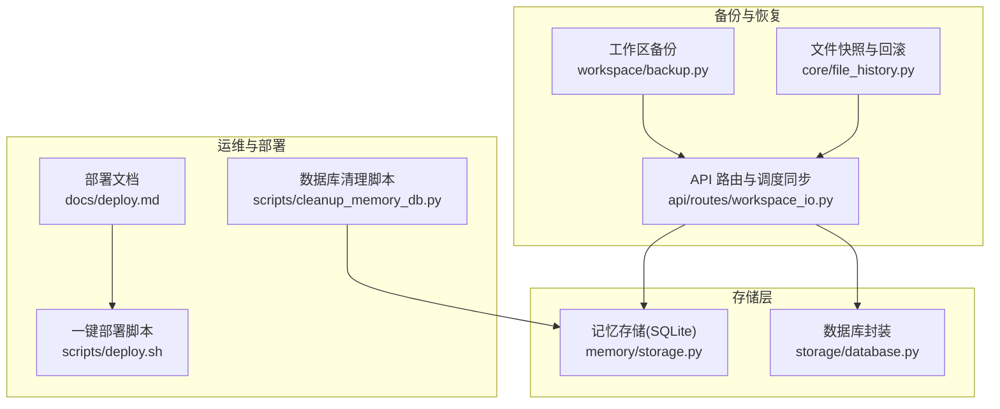
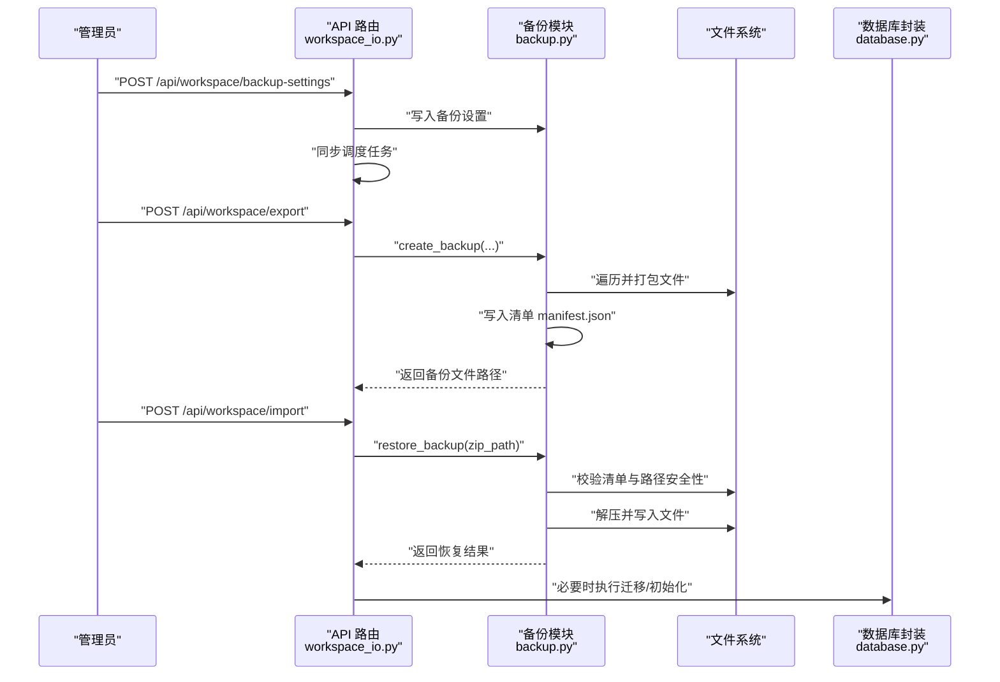
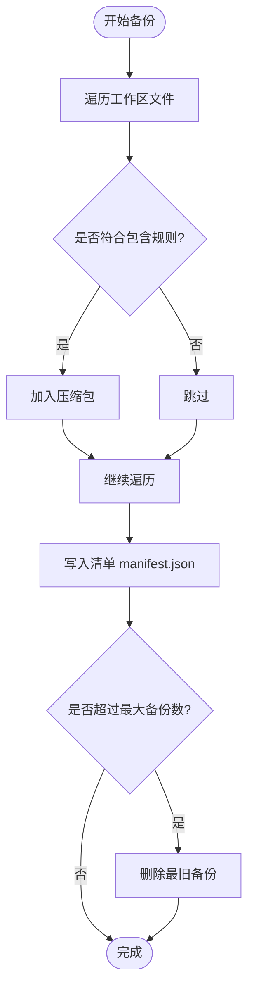
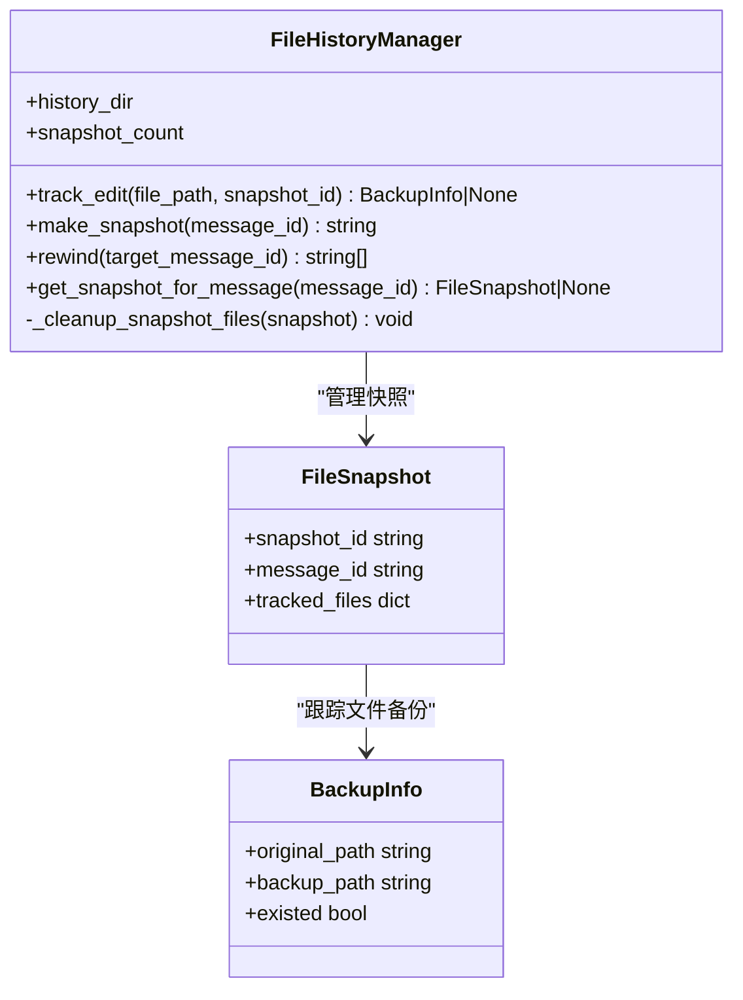
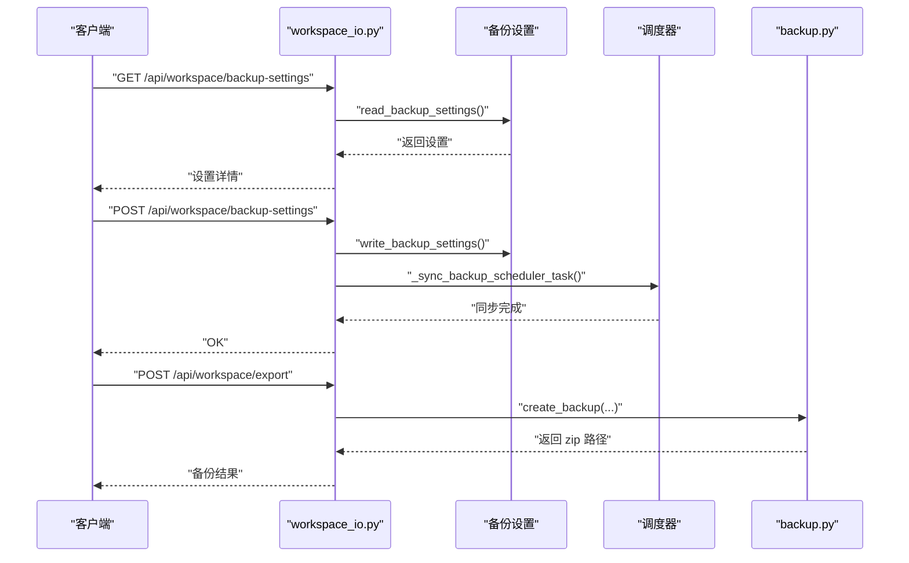
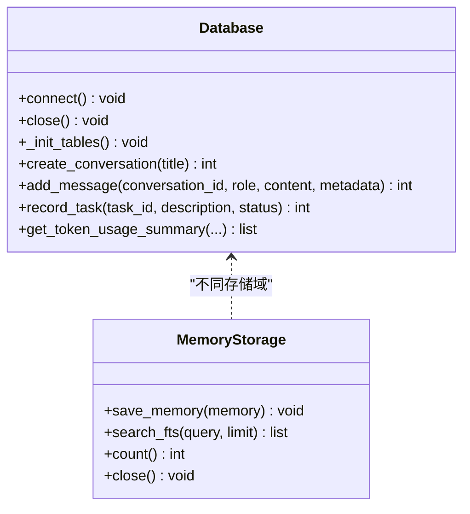
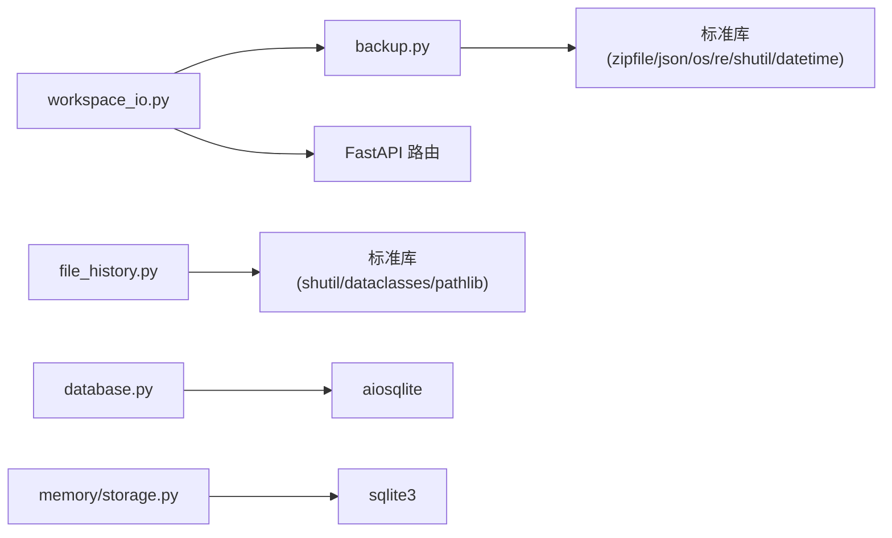

# 备份和恢复

<cite>
**本文档引用的文件**
- [backup.py](file://src/synapse/workspace/backup.py)
- [file_history.py](file://src/synapse/core/file_history.py)
- [workspace_io.py](file://src/synapse/api/routes/workspace_io.py)
- [database.py](file://src/synapse/storage/database.py)
- [storage.py](file://src/synapse/memory/storage.py)
- [deploy.md](file://docs/deploy.md)
- [deploy.sh](file://scripts/deploy.sh)
- [cleanup_memory_db.py](file://scripts/cleanup_memory_db.py)
</cite>

## 目录
1. [简介](#简介)
2. [项目结构](#项目结构)
3. [核心组件](#核心组件)
4. [架构总览](#架构总览)
5. [详细组件分析](#详细组件分析)
6. [依赖分析](#依赖分析)
7. [性能考量](#性能考量)
8. [故障排查指南](#故障排查指南)
9. [结论](#结论)
10. [附录](#附录)

## 简介
本运维手册面向数据备份与系统恢复场景，基于仓库中的工作区备份、文件系统快照与数据库存储能力，提供可落地的备份策略、恢复流程与灾难恢复计划。内容涵盖：
- 工作区备份策略与自动化调度
- 文件系统快照与回滚机制
- 数据库一致性与恢复要点
- 灾难恢复计划、RTO/RPO 设定与验证
- 备份数据的加密存储与异地容灾配置思路
- 定期备份执行脚本、数据验证方法与恢复演练流程

## 项目结构
围绕备份与恢复的关键代码分布在以下模块：
- 工作区备份与恢复：workspace/backup.py
- 文件系统快照与回滚：core/file_history.py
- API 路由与调度同步：api/routes/workspace_io.py
- 数据库存储与迁移：storage/database.py
- 记忆存储（SQLite）：memory/storage.py
- 部署与环境准备：docs/deploy.md、scripts/deploy.sh
- 数据库清理与维护：scripts/cleanup_memory_db.py

图表来源
- [backup.py:1-405](file://src/synapse/workspace/backup.py#L1-405)
- [file_history.py:1-210](file://src/synapse/core/file_history.py#L1-210)
- [workspace_io.py:1-242](file://src/synapse/api/routes/workspace_io.py#L1-242)
- [database.py:1-800](file://src/synapse/storage/database.py#L1-800)
- [storage.py:1-495](file://src/synapse/memory/storage.py#L1-495)
- [deploy.md:1-888](file://docs/deploy.md#L1-L888)
- [deploy.sh:1-781](file://scripts/deploy.sh#L1-781)
- [cleanup_memory_db.py:1-122](file://scripts/cleanup_memory_db.py#L1-122)

章节来源
- [backup.py:1-405](file://src/synapse/workspace/backup.py#L1-405)
- [file_history.py:1-210](file://src/synapse/core/file_history.py#L1-210)
- [workspace_io.py:1-242](file://src/synapse/api/routes/workspace_io.py#L1-242)
- [database.py:1-800](file://src/synapse/storage/database.py#L1-800)
- [storage.py:1-495](file://src/synapse/memory/storage.py#L1-495)
- [deploy.md:1-888](file://docs/deploy.md#L1-L888)
- [deploy.sh:1-781](file://scripts/deploy.sh#L1-781)
- [cleanup_memory_db.py:1-122](file://scripts/cleanup_memory_db.py#L1-122)

## 核心组件
- 工作区备份与恢复
  - 支持按配置包含/排除文件与目录，生成带清单的压缩包，并进行旧备份轮转。
  - 提供 REST API 以读取/保存备份设置、导出/导入备份、列出备份。
- 文件系统快照与回滚
  - 在文件编辑前自动备份，按消息 ID 创建快照点，支持回滚到任意历史快照。
- 数据库存储
  - 提供异步 SQLite 封装，包含表初始化、迁移与常用 CRUD。
  - 记忆存储采用 WAL 模式与触发器同步全文索引，保障一致性与查询效率。

章节来源
- [backup.py:119-273](file://src/synapse/workspace/backup.py#L119-L273)
- [workspace_io.py:55-164](file://src/synapse/api/routes/workspace_io.py#L55-L164)
- [file_history.py:43-192](file://src/synapse/core/file_history.py#L43-L192)
- [database.py:24-248](file://src/synapse/storage/database.py#L24-L248)
- [storage.py:55-101](file://src/synapse/memory/storage.py#L55-L101)

## 架构总览
备份与恢复的整体流程如下：
- 备份策略由工作区备份模块与调度器协同执行，通过 API 路由持久化设置并注册定时任务。
- 恢复流程通过 API 路由调用备份模块进行解压与写入，同时处理清单与安全校验。
- 文件系统层面提供细粒度快照，便于在对话/任务中快速回滚到历史状态。
- 存储层通过 SQLite 与触发器确保结构化数据与全文索引一致。

图表来源
- [workspace_io.py:65-116](file://src/synapse/api/routes/workspace_io.py#L65-L116)
- [backup.py:204-366](file://src/synapse/workspace/backup.py#L204-L366)
- [database.py:50-248](file://src/synapse/storage/database.py#L50-L248)

章节来源
- [workspace_io.py:55-164](file://src/synapse/api/routes/workspace_io.py#L55-L164)
- [backup.py:204-366](file://src/synapse/workspace/backup.py#L204-L366)
- [database.py:50-248](file://src/synapse/storage/database.py#L50-L248)

## 详细组件分析

### 工作区备份与恢复
- 备份规则
  - 基于白名单/黑名单策略，明确包含与排除的文件/目录，避免临时与无关文件进入备份。
  - 支持按需包含用户数据与媒体目录，便于差异化备份。
- 备份清单
  - 生成清单文件，记录格式版本、创建时间、工作区 ID 与包含范围，便于恢复时校验。
- 备份轮转
  - 按最大备份数限制保留最新备份，超出数量的旧备份自动删除。
- 恢复流程
  - 校验清单与路径安全性，跳过 SQLite 临时文件，记录跳过的文件以便人工干预。
  - 返回恢复统计与清单信息，便于审计与验证。

图表来源
- [backup.py:145-273](file://src/synapse/workspace/backup.py#L145-L273)

章节来源
- [backup.py:119-273](file://src/synapse/workspace/backup.py#L119-L273)

### 文件系统快照与回滚
- 快照点
  - 每次文件编辑前自动备份至 data/file-history/<session_id>，同一快照内同文件仅备份一次。
  - 每轮对话结束时创建快照点，记录关联的消息 ID。
- 回滚机制
  - 按消息 ID 定位快照，逆序回滚，恢复文件到目标时刻状态。
  - 清理被回滚快照对应的备份文件，维持空间稳定。
- 限制
  - 最多保留固定数量的快照，超出上限时清理最早快照。

图表来源
- [file_history.py:25-192](file://src/synapse/core/file_history.py#L25-L192)

章节来源
- [file_history.py:43-192](file://src/synapse/core/file_history.py#L43-L192)

### API 路由与调度同步
- 备份设置
  - 读取/保存 data/backup_settings.json，支持启用/禁用、Cron 调度、输出目录、最大备份数与包含范围。
- 导出/导入
  - 导出：调用备份模块生成压缩包并返回路径与大小。
  - 导入：校验备份有效性与路径安全性，执行恢复并返回统计。
- 调度同步
  - 注册/更新/禁用系统定时任务，使备份策略与调度器保持一致。

图表来源
- [workspace_io.py:55-164](file://src/synapse/api/routes/workspace_io.py#L55-L164)

章节来源
- [workspace_io.py:55-241](file://src/synapse/api/routes/workspace_io.py#L55-L241)

### 数据库存储与一致性
- 数据库封装
  - 提供异步连接、表初始化与迁移、常用 CRUD 操作，支持索引与统计查询。
- 记忆存储（SQLite）
  - 采用 WAL 模式提升并发写入性能；通过触发器自动同步 FTS5 全文索引，保证检索一致性。
  - 支持进程级共享实例，减少重复连接开销。

图表来源
- [database.py:24-248](file://src/synapse/storage/database.py#L24-L248)
- [storage.py:55-101](file://src/synapse/memory/storage.py#L55-L101)

章节来源
- [database.py:24-248](file://src/synapse/storage/database.py#L24-L248)
- [storage.py:55-101](file://src/synapse/memory/storage.py#L55-L101)

## 依赖分析
- 备份模块依赖
  - Python 标准库：zipfile、json、os、re、shutil、datetime 等。
  - FastAPI 路由模块用于暴露备份设置、导出/导入与备份列表接口。
- 文件快照模块依赖
  - 标准库：shutil、dataclasses、pathlib。
- 存储模块依赖
  - aiosqlite（数据库封装）、sqlite3（内存存储）、触发器与索引。

图表来源
- [backup.py:11-23](file://src/synapse/workspace/backup.py#L11-L23)
- [workspace_io.py:7-13](file://src/synapse/api/routes/workspace_io.py#L7-L13)
- [file_history.py:12-19](file://src/synapse/core/file_history.py#L12-L19)
- [database.py:11-19](file://src/synapse/storage/database.py#L11-L19)
- [storage.py:20-28](file://src/synapse/memory/storage.py#L20-L28)

章节来源
- [backup.py:11-23](file://src/synapse/workspace/backup.py#L11-L23)
- [workspace_io.py:7-13](file://src/synapse/api/routes/workspace_io.py#L7-L13)
- [file_history.py:12-19](file://src/synapse/core/file_history.py#L12-L19)
- [database.py:11-19](file://src/synapse/storage/database.py#L11-L19)
- [storage.py:20-28](file://src/synapse/memory/storage.py#L20-L28)

## 性能考量
- 备份性能
  - 使用 ZIP_DEFLATED 压缩与固定压缩等级，兼顾压缩比与 CPU 开销。
  - 遍历时跳过隐藏/排除目录，减少 IO。
  - 备份轮转在生成后执行，避免频繁扫描。
- 文件快照
  - 同一快照内同文件仅备份一次，避免冗余拷贝。
  - 快照上限控制内存与磁盘占用。
- 存储性能
  - 数据库封装采用异步连接，减少阻塞。
  - 记忆存储使用 WAL 模式与触发器同步，提升写入吞吐与查询一致性。

[本节为通用性能讨论，不直接分析具体文件，故无章节来源]

## 故障排查指南
- 备份失败
  - 检查备份设置是否启用、输出目录是否存在且可写。
  - 查看导出接口返回的错误信息，定位权限或路径问题。
- 恢复失败
  - 确认备份文件包含清单且路径安全；若部分文件被占用，恢复接口会返回跳过列表，建议重启后重试。
- 快照回滚
  - 若回滚后发现文件缺失，检查 data/file-history/<session_id> 是否存在对应备份文件。
- 数据库异常
  - 使用数据库封装的初始化与迁移逻辑修复；如需重建 FTS 索引，可参考记忆存储的重建流程。
- 部署与环境
  - 使用一键部署脚本准备运行环境，确保 Python、Git、依赖安装完成。

章节来源
- [workspace_io.py:118-148](file://src/synapse/api/routes/workspace_io.py#L118-L148)
- [backup.py:295-366](file://src/synapse/workspace/backup.py#L295-L366)
- [file_history.py:143-192](file://src/synapse/core/file_history.py#L143-L192)
- [database.py:50-248](file://src/synapse/storage/database.py#L50-L248)
- [deploy.sh:1-781](file://scripts/deploy.sh#L1-L781)

## 结论
本仓库提供了完善的工作区备份与恢复能力，配合文件系统快照与数据库存储，能够满足日常运维与灾难恢复需求。通过 API 与调度器的集成，备份策略可自动化执行；通过清单与安全校验，恢复过程具备可审计性。建议结合异地存储与加密策略进一步强化数据安全，并定期开展恢复演练以验证 RTO/RPO 目标。

[本节为总结性内容，不直接分析具体文件，故无章节来源]

## 附录

### 备份策略与实施建议
- 备份类型
  - 全量备份：包含配置、用户数据与媒体，建议每日执行。
  - 增量/差异：当前实现为全量打包，如需增量可结合文件系统快照在业务侧实现。
- 包含范围
  - 用户数据：用户生成的记忆、计划、报告等。
  - 媒体：生成的图片、截图、输出等。
  - 配置：端点、身份、技能等配置文件。
- 排除项
  - 日志、临时文件、缓存、编译产物等。
- 轮转策略
  - 保留最近 N 份备份，定期清理旧备份。

章节来源
- [backup.py:145-202](file://src/synapse/workspace/backup.py#L145-L202)
- [backup.py:276-290](file://src/synapse/workspace/backup.py#L276-L290)

### 灾难恢复计划（DRP）
- 目标设定
  - RTO：从故障发生到系统恢复的最长容忍时间。
  - RPO：允许丢失的数据量对应的时间窗口。
- 恢复流程
  - 识别故障类型与影响范围。
  - 选择最近可用备份，执行恢复并验证完整性。
  - 启动服务，监控运行状态与告警。
- 验证与演练
  - 定期进行恢复演练，记录 RTO/RPO 实际表现并优化策略。

[本节为概念性内容，不直接分析具体文件，故无章节来源]

### 备份数据加密与异地容灾
- 加密存储
  - 建议在备份文件外部增加加密层（如对称加密或基于密钥管理服务的加密），并在传输与归档阶段保持机密性。
- 异地容灾
  - 将备份文件同步至异地存储（对象存储或云存储），并定期校验可用性。
  - 在不同地理区域保留副本，以应对区域性灾难。

[本节为通用实践建议，不直接分析具体文件，故无章节来源]

### 定期备份执行脚本
- 一键部署脚本
  - 提供环境准备、依赖安装与配置初始化，便于快速搭建备份执行环境。
- 备份设置
  - 通过 API 路由保存备份设置并同步调度器，实现自动化执行。

章节来源
- [deploy.sh:1-781](file://scripts/deploy.sh#L1-L781)
- [workspace_io.py:65-83](file://src/synapse/api/routes/workspace_io.py#L65-L83)

### 数据验证方法
- 备份清单校验
  - 恢复后读取清单，核对格式版本、包含范围与创建时间。
- 文件完整性
  - 统计恢复文件数量与大小，对比备份清单中的记录。
- 功能验证
  - 启动系统后进行关键功能测试，确保配置与数据可用。

章节来源
- [backup.py:306-366](file://src/synapse/workspace/backup.py#L306-L366)
- [workspace_io.py:118-148](file://src/synapse/api/routes/workspace_io.py#L118-L148)

### 恢复演练组织流程
- 准备阶段
  - 明确演练目标、参与人员与角色分工。
  - 选择备份集合并制定恢复步骤。
- 执行阶段
  - 按步骤执行恢复，记录时间与问题。
- 评估阶段
  - 对比 RTO/RPO 目标，评估流程有效性并形成改进建议。

[本节为流程性内容，不直接分析具体文件，故无章节来源]