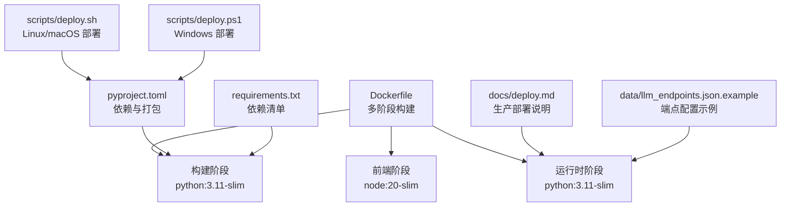
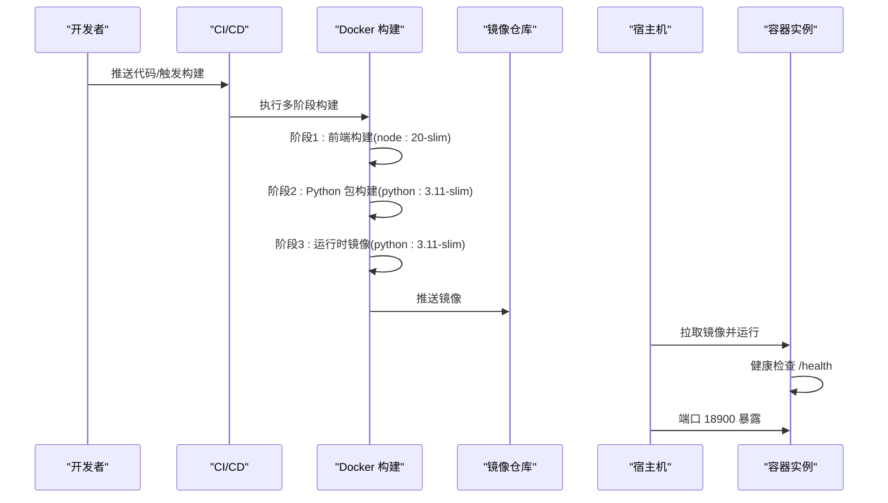
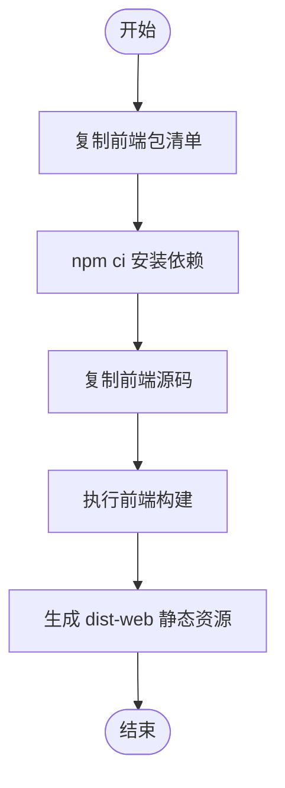
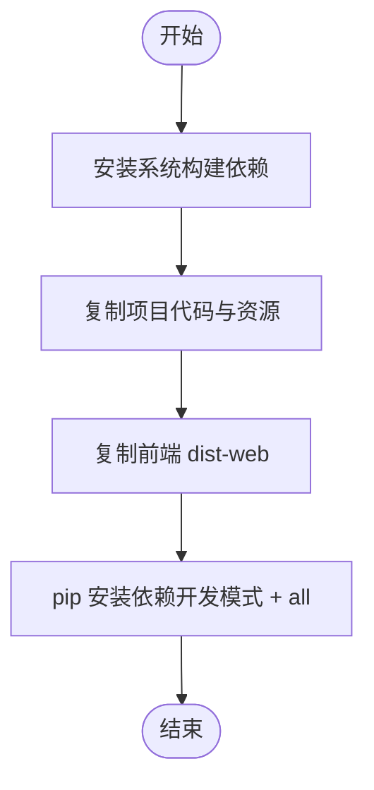
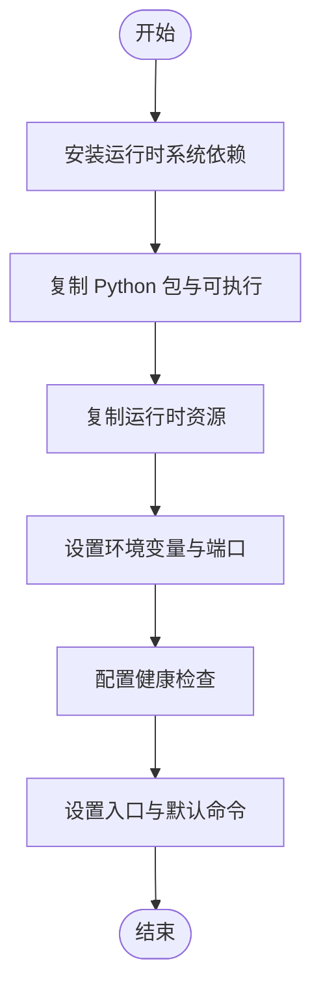
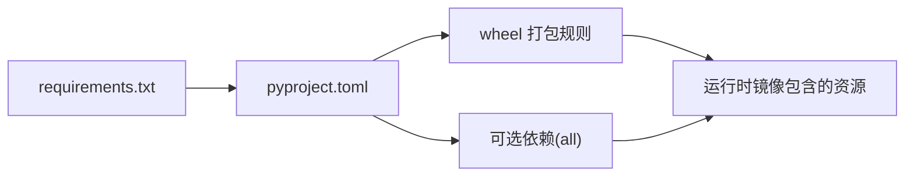
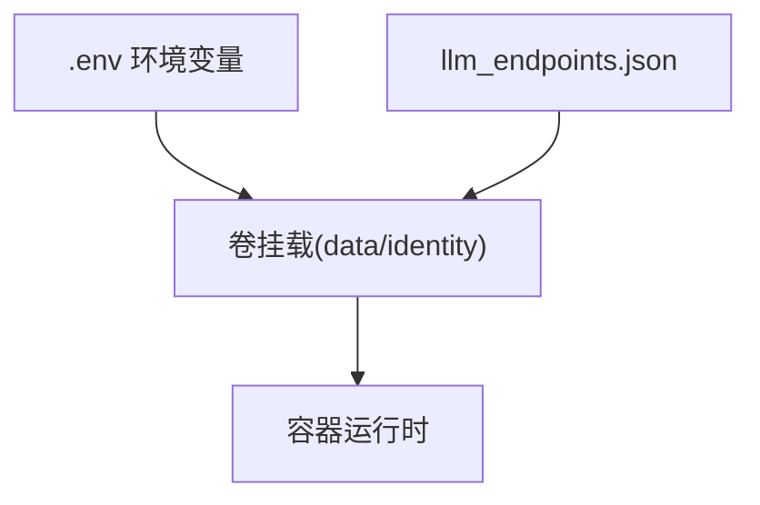
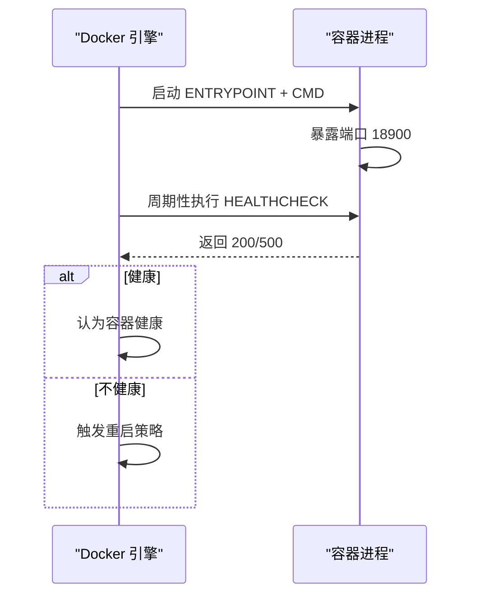
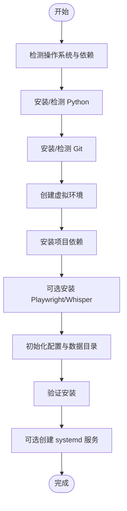
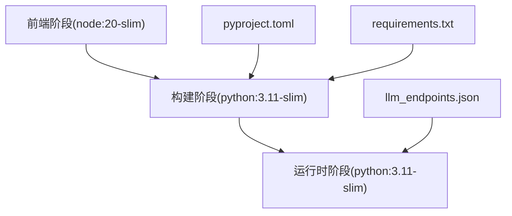

# 容器化部署

<cite>
**本文档引用的文件**
- [Dockerfile](file://Dockerfile)
- [pyproject.toml](file://pyproject.toml)
- [requirements.txt](file://requirements.txt)
- [scripts/deploy.sh](file://scripts/deploy.sh)
- [scripts/deploy.ps1](file://scripts/deploy.ps1)
- [docs/deploy.md](file://docs/deploy.md)
- [docs/deploy_en.md](file://docs/deploy_en.md)
- [data/llm_endpoints.json.example](file://data/llm_endpoints.json.example)
</cite>

## 目录
1. [简介](#简介)
2. [项目结构](#项目结构)
3. [核心组件](#核心组件)
4. [架构总览](#架构总览)
5. [详细组件分析](#详细组件分析)
6. [依赖关系分析](#依赖关系分析)
7. [性能考量](#性能考量)
8. [故障排查指南](#故障排查指南)
9. [结论](#结论)
10. [附录](#附录)

## 简介
本指南面向容器化部署场景，围绕项目现有的多阶段 Docker 构建进行深入解析，覆盖前端构建阶段、Python 包构建阶段与最终运行时镜像的优化策略；阐述镜像分层结构、依赖管理与安全配置；提供完整的部署脚本使用方法、环境变量配置、端口映射与健康检查设置；并给出容器编排最佳实践、资源限制与故障恢复策略。

## 项目结构
- 顶层 Dockerfile 定义了三阶段构建：前端构建、Python 包构建、最终运行时镜像。
- pyproject.toml 与 requirements.txt 提供 Python 依赖清单与打包规则。
- scripts/deploy.sh 与 scripts/deploy.ps1 提供一键部署脚本，便于本地或 CI 场景快速安装与验证。
- docs/deploy.md 与 docs/deploy_en.md 提供生产部署与容器化参考说明。
- data/llm_endpoints.json.example 展示 LLM 端点配置结构，指导容器运行时的环境变量与挂载卷设计。

**图表来源**
- [Dockerfile:1-54](file://Dockerfile#L1-L54)
- [pyproject.toml:1-282](file://pyproject.toml#L1-L282)
- [requirements.txt:1-105](file://requirements.txt#L1-L105)
- [scripts/deploy.sh:1-781](file://scripts/deploy.sh#L1-L781)
- [scripts/deploy.ps1:1-751](file://scripts/deploy.ps1#L1-L751)
- [docs/deploy.md:721-752](file://docs/deploy.md#L721-L752)
- [data/llm_endpoints.json.example:1-110](file://data/llm_endpoints.json.example#L1-L110)

**章节来源**
- [Dockerfile:1-54](file://Dockerfile#L1-L54)
- [pyproject.toml:1-282](file://pyproject.toml#L1-L282)
- [requirements.txt:1-105](file://requirements.txt#L1-L105)
- [scripts/deploy.sh:1-781](file://scripts/deploy.sh#L1-L781)
- [scripts/deploy.ps1:1-751](file://scripts/deploy.ps1#L1-L751)
- [docs/deploy.md:721-752](file://docs/deploy.md#L721-L752)
- [data/llm_endpoints.json.example:1-110](file://data/llm_endpoints.json.example#L1-L110)

## 核心组件
- 多阶段构建流水线
  - 前端构建阶段：基于 node:20-slim，执行前端打包，产物输出至 dist-web。
  - Python 包构建阶段：基于 python:3.11-slim，安装系统依赖与 Python 依赖，将前端产物注入，构建可执行包。
  - 运行时阶段：基于 python:3.11-slim，仅拷贝运行所需依赖与资源，暴露端口并设置健康检查。
- 依赖管理
  - 以 pyproject.toml 为主要入口，requirements.txt 作为 pip install -r 的补充清单。
  - 构建阶段通过 pip install --no-cache-dir -e ".[all]" 安装完整功能集。
- 安全与最小化
  - 使用 slim 基础镜像，减少攻击面。
  - 构建阶段清理 apt 缓存，运行时仅保留必要系统工具（ffmpeg、curl）。
- 运行时配置
  - 端口 18900，健康检查通过 HTTP GET /health。
  - ENTRYPOINT 使用 synapse 可执行命令，CMD 提供默认服务参数。

**章节来源**
- [Dockerfile:1-54](file://Dockerfile#L1-L54)
- [pyproject.toml:1-282](file://pyproject.toml#L1-L282)
- [requirements.txt:1-105](file://requirements.txt#L1-L105)

## 架构总览
下图展示容器化部署的端到端流程：从源码到镜像构建，再到容器运行与健康检查。

**图表来源**
- [Dockerfile:1-54](file://Dockerfile#L1-L54)
- [docs/deploy.md:721-752](file://docs/deploy.md#L721-L752)

## 详细组件分析

### 前端构建阶段（Stage 1）
- 基础镜像：node:20-slim
- 关键步骤：
  - 复制前端 package.json 与 package-lock.json，执行 npm ci。
  - 复制前端源码，执行 npm run build:web 产出 dist-web。
- 作用：为后续 Python 构建阶段提供静态资源产物，确保运行时镜像中包含前端页面。

**图表来源**
- [Dockerfile:1-8](file://Dockerfile#L1-L8)

**章节来源**
- [Dockerfile:1-8](file://Dockerfile#L1-L8)

### Python 包构建阶段（Stage 2）
- 基础镜像：python:3.11-slim
- 系统依赖：build-essential、git。
- 代码与资源：
  - 复制 pyproject.toml、README.md、src/、skills/、mcps/、identity/。
  - 复制前端 dist-web 到 apps/setup-center/dist-web。
- 依赖安装：pip install --no-cache-dir -e ".[all]"。
- 作用：将项目打包为可执行包，准备运行时所需的 Python 依赖与内置资源。

**图表来源**
- [Dockerfile:10-28](file://Dockerfile#L10-L28)
- [pyproject.toml:75-141](file://pyproject.toml#L75-L141)

**章节来源**
- [Dockerfile:10-28](file://Dockerfile#L10-L28)
- [pyproject.toml:75-141](file://pyproject.toml#L75-L141)

### 运行时镜像阶段（Stage 3）
- 基础镜像：python:3.11-slim
- 系统依赖：ffmpeg、curl。
- 资源复制：
  - 从构建阶段复制 Python 包与可执行文件。
  - 复制 src/、skills/、identity/ 等运行时资源。
- 环境与运行：
  - 设置 PYTHONUNBUFFERED=1。
  - 暴露端口 18900。
  - 健康检查：curl -f http://localhost:18900/health || exit 1。
  - 入口：ENTRYPOINT ["synapse"]，默认 CMD ["serve","--host","0.0.0.0","--port","18900"]。

**图表来源**
- [Dockerfile:30-54](file://Dockerfile#L30-L54)

**章节来源**
- [Dockerfile:30-54](file://Dockerfile#L30-L54)

### 依赖管理与打包策略
- pyproject.toml
  - 作为权威依赖清单，定义核心依赖、可选依赖与打包目标。
  - tool.hatch.build.targets.wheel.force-include 将前端 dist-web、docs-site/.vitepress/dist 与内置技能、MCP 配置打包进 wheel，确保 pip 安装后即可直接运行。
- requirements.txt
  - 与 pyproject.toml 保持一致，便于 pip install -r 快速安装。
- 构建阶段安装策略
  - 使用 pip install --no-cache-dir -e ".[all]"，确保完整功能可用，同时避免缓存污染镜像层。

**图表来源**
- [pyproject.toml:156-233](file://pyproject.toml#L156-L233)
- [requirements.txt:1-105](file://requirements.txt#L1-L105)

**章节来源**
- [pyproject.toml:156-233](file://pyproject.toml#L156-L233)
- [requirements.txt:1-105](file://requirements.txt#L1-L105)

### 环境变量与配置挂载
- LLM 端点配置
  - data/llm_endpoints.json.example 展示端点结构，容器运行时可通过挂载卷将该配置持久化。
- 环境变量
  - 通过 .env 文件注入敏感信息（如 API Key），容器运行时建议通过环境变量或密钥管理服务注入。
- 数据与身份目录
  - data/、identity/ 等目录建议以卷形式挂载，确保配置与数据持久化。

**图表来源**
- [data/llm_endpoints.json.example:1-110](file://data/llm_endpoints.json.example#L1-L110)
- [docs/deploy.md:194-204](file://docs/deploy.md#L194-L204)

**章节来源**
- [data/llm_endpoints.json.example:1-110](file://data/llm_endpoints.json.example#L1-L110)
- [docs/deploy.md:194-204](file://docs/deploy.md#L194-L204)

### 健康检查与运行参数
- 健康检查
  - 使用 HTTP 健康检查，探测 /health 路径，失败时容器重启策略生效。
- 运行参数
  - 默认 CMD 提供 host 与 port 参数，便于容器编排时覆盖。
- 端口映射
  - 容器暴露 18900，建议在编排时映射到宿主机非特权端口。

**图表来源**
- [Dockerfile:46-53](file://Dockerfile#L46-L53)

**章节来源**
- [Dockerfile:46-53](file://Dockerfile#L46-L53)

### 部署脚本使用方法
- Linux/macOS
  - 使用 scripts/deploy.sh，自动检测系统、安装 Python 与 Git、创建虚拟环境、安装依赖、初始化配置与数据目录，并可选择创建 systemd 服务。
- Windows
  - 使用 scripts/deploy.ps1，自动检测与安装 Python、Git，创建虚拟环境，安装依赖，初始化配置与数据目录。
- 两者均支持可选安装 Playwright 与 Whisper 模型，便于本地开发与测试。

**图表来源**
- [scripts/deploy.sh:70-105](file://scripts/deploy.sh#L70-L105)
- [scripts/deploy.ps1:103-159](file://scripts/deploy.ps1#L103-L159)

**章节来源**
- [scripts/deploy.sh:70-105](file://scripts/deploy.sh#L70-L105)
- [scripts/deploy.ps1:103-159](file://scripts/deploy.ps1#L103-L159)

## 依赖关系分析
- 构建链路
  - 前端阶段依赖 node:20-slim 与前端包清单。
  - 构建阶段依赖 python:3.11-slim、系统构建工具与 pip 安装的完整依赖集合。
  - 运行时阶段依赖 python:3.11-slim、少量系统工具与已安装的 Python 包。
- 外部依赖
  - LLM 端点配置通过 data/llm_endpoints.json.example 描述，容器运行时需配合 .env 注入 API Key。
- 内部依赖
  - pyproject.toml 定义的可选依赖（如 feishu、windows、all）在构建阶段通过 pip 安装，确保运行时具备相应能力。

**图表来源**
- [Dockerfile:1-54](file://Dockerfile#L1-L54)
- [pyproject.toml:1-282](file://pyproject.toml#L1-L282)
- [requirements.txt:1-105](file://requirements.txt#L1-L105)
- [data/llm_endpoints.json.example:1-110](file://data/llm_endpoints.json.example#L1-L110)

**章节来源**
- [Dockerfile:1-54](file://Dockerfile#L1-L54)
- [pyproject.toml:1-282](file://pyproject.toml#L1-L282)
- [requirements.txt:1-105](file://requirements.txt#L1-L105)
- [data/llm_endpoints.json.example:1-110](file://data/llm_endpoints.json.example#L1-L110)

## 性能考量
- 分层优化
  - 前端构建与 Python 依赖安装分别在不同层，提升缓存命中率。
  - 构建阶段使用 --no-cache-dir，避免缓存污染镜像体积。
- 运行时精简
  - 仅安装 ffmpeg、curl 等必要系统工具，降低镜像大小与攻击面。
- 端口与健康检查
  - 明确端口暴露与健康检查，便于编排系统进行负载均衡与故障转移。

[本节为通用指导，不涉及具体文件分析]

## 故障排查指南
- 健康检查失败
  - 检查容器日志与 /health 接口状态，确认服务正常启动。
  - 确认端口 18900 未被占用，且防火墙允许访问。
- 依赖安装失败
  - 构建阶段若 pip 安装失败，可参考一键部署脚本中的镜像回退逻辑，或在本地网络不佳时使用国内镜像源。
- 配置未生效
  - 确认 .env 与 data/llm_endpoints.json 已正确挂载至容器，并具有读权限。
- 端口冲突
  - 在容器编排时将 18900 映射到宿主机非冲突端口。

**章节来源**
- [scripts/deploy.sh:250-285](file://scripts/deploy.sh#L250-L285)
- [scripts/deploy.ps1:222-268](file://scripts/deploy.ps1#L222-L268)
- [Dockerfile:46-53](file://Dockerfile#L46-L53)

## 结论
通过三层构建与运行时精简，结合明确的健康检查与端口策略，项目可在容器环境中实现高效、稳定与可维护的部署。配合一键部署脚本与生产部署文档，可快速完成从开发到生产的落地。

[本节为总结性内容，不涉及具体文件分析]

## 附录

### 容器编排最佳实践
- 资源限制
  - 为容器设置 CPU 与内存限制，避免资源争抢。
- 存储卷
  - 将 .env、data/、identity/ 等目录以持久卷挂载，确保配置与数据持久化。
- 网络与代理
  - 若需要访问特定 API，配置 HTTP_PROXY/HTTPS_PROXY 或使用编排平台的网络策略。
- 健康检查与重启
  - 使用内置 HEALTHCHECK，结合 restart-policy 实现自动恢复。

**章节来源**
- [Dockerfile:46-53](file://Dockerfile#L46-L53)
- [docs/deploy.md:721-752](file://docs/deploy.md#L721-L752)

### 端口与卷挂载建议
- 端口：18900（容器内），建议映射到宿主机 18900 或更高范围端口。
- 卷：
  - .env → /app/.env
  - data/ → /app/data
  - identity/ → /app/identity

**章节来源**
- [Dockerfile:46-53](file://Dockerfile#L46-L53)
- [docs/deploy.md:744-750](file://docs/deploy.md#L744-L750)