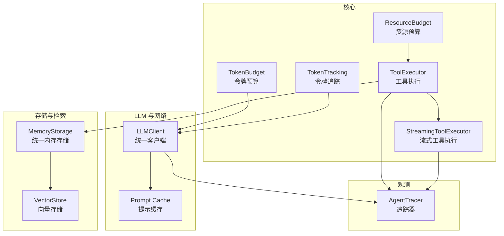
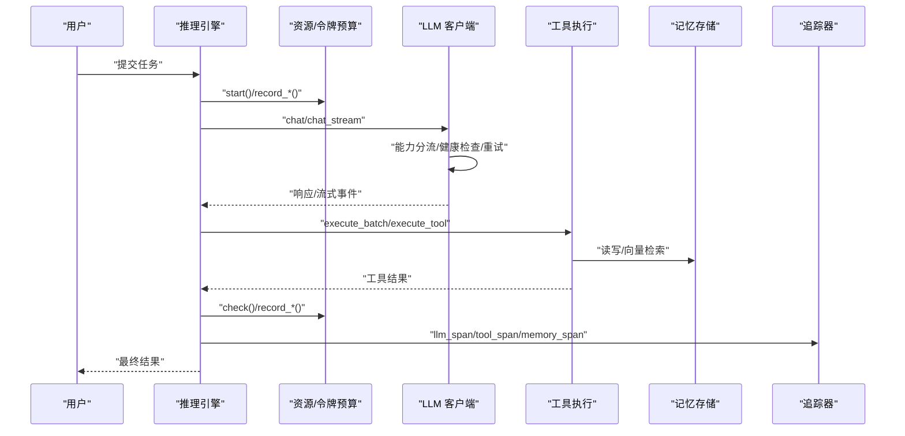
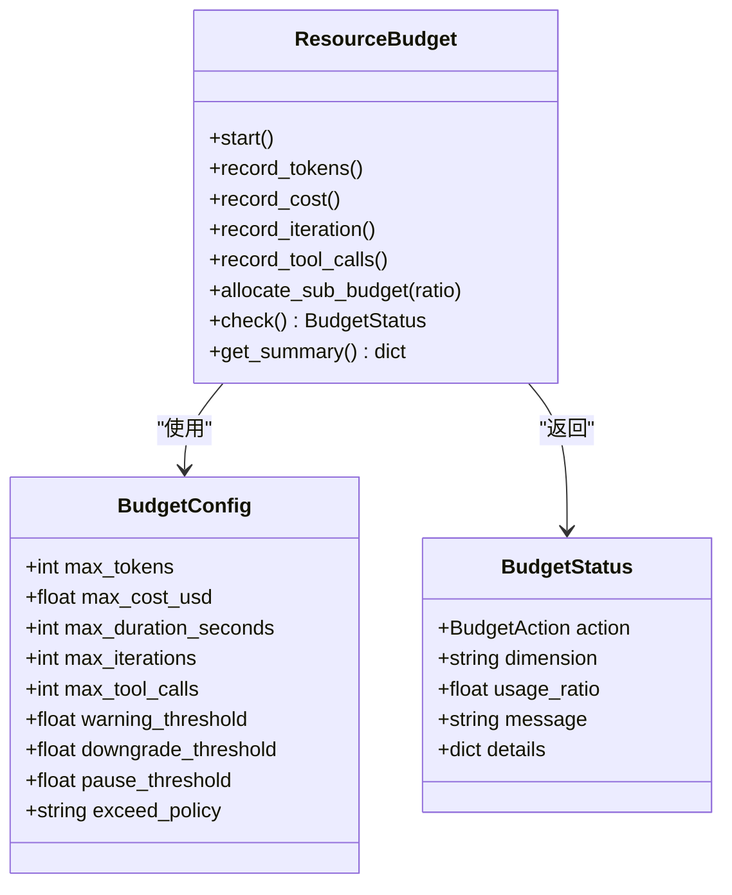
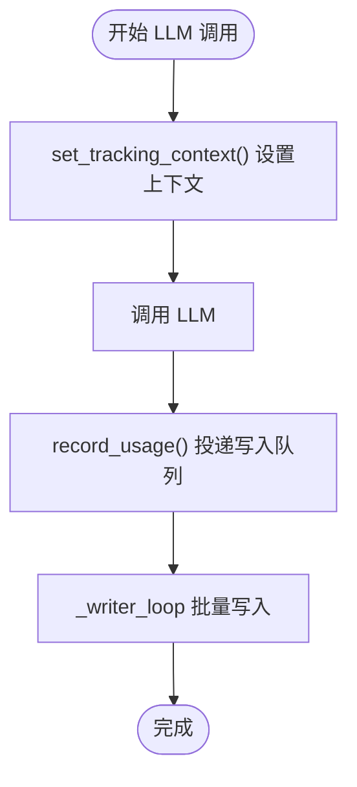
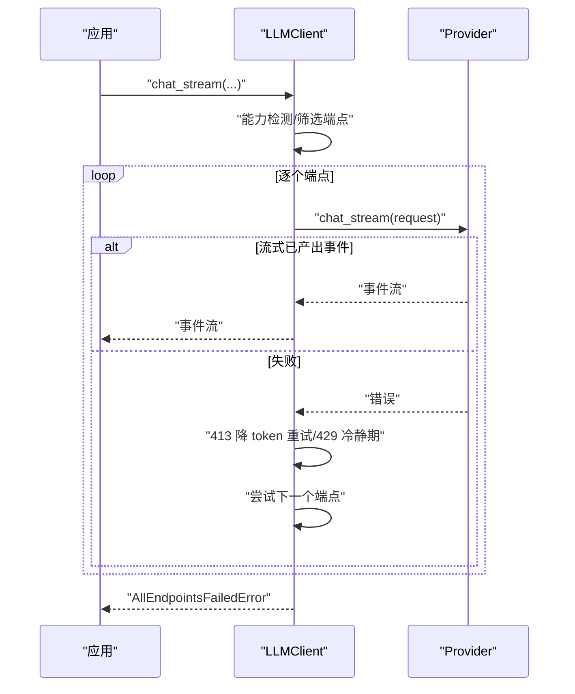
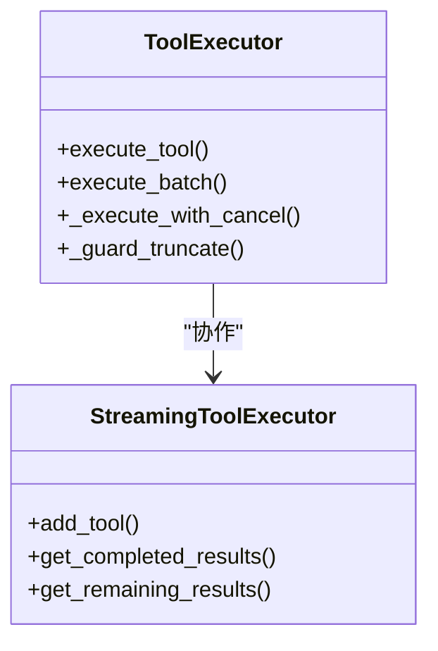
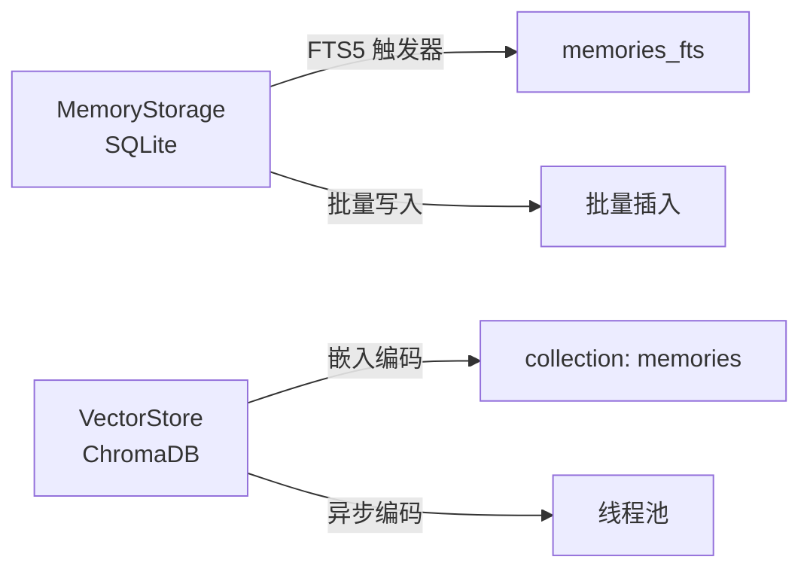
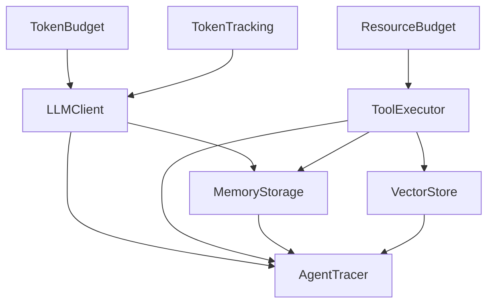

# 性能优化

<cite>
**本文引用的文件**
- [resource_budget.py](file://src/synapse/core/resource_budget.py)
- [token_tracking.py](file://src/synapse/core/token_tracking.py)
- [token_budget.py](file://src/synapse/core/token_budget.py)
- [cache.py](file://src/synapse/llm/cache.py)
- [storage.py](file://src/synapse/memory/storage.py)
- [vector_store.py](file://src/synapse/memory/vector_store.py)
- [streaming_tool_executor.py](file://src/synapse/core/streaming_tool_executor.py)
- [client.py](file://src/synapse/llm/client.py)
- [tool_executor.py](file://src/synapse/core/tool_executor.py)
- [tracer.py](file://src/synapse/tracing/tracer.py)
</cite>

## 目录
1. [简介](#简介)
2. [项目结构](#项目结构)
3. [核心组件](#核心组件)
4. [架构总览](#架构总览)
5. [详细组件分析](#详细组件分析)
6. [依赖分析](#依赖分析)
7. [性能考量](#性能考量)
8. [故障排查指南](#故障排查指南)
9. [结论](#结论)
10. [附录](#附录)

## 简介
本技术指南聚焦系统性能优化，围绕资源预算管理、令牌跟踪机制、内存优化策略、缓存策略、并发处理优化、I/O 性能提升、数据库查询优化、网络请求压缩与响应时间监控、性能测试与基准测试、性能回归检测以及不同负载场景下的调优参数与容量规划建议展开。文档基于仓库中的核心模块进行深入分析，并提供可视化图示与实操建议，帮助读者在不同场景下实现稳定、高效与可扩展的系统表现。

## 项目结构
本项目采用分层与模块化组织方式，核心性能相关能力分布在以下模块：
- 核心资源与令牌：资源预算、令牌预算、令牌追踪
- LLM 与网络：统一客户端、重试与降级、流式处理
- 工具执行：并发与互斥、超时与截断守卫
- 记忆与存储：统一内存存储、向量存储、FTS 全文检索
- 追踪与可观测：Span/Trace、决策追踪、指标导出

**图表来源**
- [resource_budget.py:91-363](file://src/synapse/core/resource_budget.py#L91-L363)
- [token_budget.py:19-98](file://src/synapse/core/token_budget.py#L19-L98)
- [token_tracking.py:77-225](file://src/synapse/core/token_tracking.py#L77-L225)
- [tool_executor.py:120-800](file://src/synapse/core/tool_executor.py#L120-L800)
- [streaming_tool_executor.py:38-179](file://src/synapse/core/streaming_tool_executor.py#L38-L179)
- [client.py:146-800](file://src/synapse/llm/client.py#L146-L800)
- [cache.py:25-162](file://src/synapse/llm/cache.py#L25-L162)
- [storage.py:55-800](file://src/synapse/memory/storage.py#L55-L800)
- [vector_store.py:81-581](file://src/synapse/memory/vector_store.py#L81-L581)
- [tracer.py:178-507](file://src/synapse/tracing/tracer.py#L178-L507)

**章节来源**
- [resource_budget.py:1-363](file://src/synapse/core/resource_budget.py#L1-L363)
- [token_tracking.py:1-225](file://src/synapse/core/token_tracking.py#L1-L225)
- [token_budget.py:1-98](file://src/synapse/core/token_budget.py#L1-L98)
- [cache.py:1-162](file://src/synapse/llm/cache.py#L1-L162)
- [storage.py:1-800](file://src/synapse/memory/storage.py#L1-L800)
- [vector_store.py:1-581](file://src/synapse/memory/vector_store.py#L1-L581)
- [streaming_tool_executor.py:1-179](file://src/synapse/core/streaming_tool_executor.py#L1-L179)
- [client.py:1-800](file://src/synapse/llm/client.py#L1-L800)
- [tool_executor.py:1-800](file://src/synapse/core/tool_executor.py#L1-L800)
- [tracer.py:1-507](file://src/synapse/tracing/tracer.py#L1-L507)

## 核心组件
- 资源预算管理：按任务粒度控制 token、成本、时长、迭代次数与工具调用次数，支持分级动作（警告、降级、暂停）与父预算透传。
- 令牌预算与追踪：支持用户侧 token 预算指令解析与注入提示，后台线程异步写入 SQLite，降低主线程阻塞。
- LLM 统一客户端：多端点配置、能力分流、健康检查、动态切换、指数退避重试、流式降级策略、并发控制。
- 工具执行引擎：串并行策略、互斥锁管理、超时与截断守卫、权限与策略检查、交付回执捕获。
- 记忆与存储：统一 SQLite 存储、WAL 模式、FTS5 全文索引、向量存储（ChromaDB）、异步编码与批量写入。
- 追踪与可观测：Span/Trace 数据模型、LLM/工具/记忆/推理等多类型 Span、决策追踪、指标导出。

**章节来源**
- [resource_budget.py:91-363](file://src/synapse/core/resource_budget.py#L91-L363)
- [token_budget.py:19-98](file://src/synapse/core/token_budget.py#L19-L98)
- [token_tracking.py:77-225](file://src/synapse/core/token_tracking.py#L77-L225)
- [client.py:146-800](file://src/synapse/llm/client.py#L146-L800)
- [tool_executor.py:120-800](file://src/synapse/core/tool_executor.py#L120-L800)
- [storage.py:55-800](file://src/synapse/memory/storage.py#L55-L800)
- [vector_store.py:81-581](file://src/synapse/memory/vector_store.py#L81-L581)
- [tracer.py:178-507](file://src/synapse/tracing/tracer.py#L178-L507)

## 架构总览
系统在“任务驱动”的推理循环中，结合资源预算与令牌追踪保障成本与时长可控；通过 LLM 统一客户端实现多端点能力分流与降级；工具执行引擎在并发与互斥之间取得平衡，并对长耗时工具设置硬超时与截断守卫；记忆与存储模块提供结构化与向量检索能力；追踪器贯穿全链路，记录关键指标与决策轨迹。

**图表来源**
- [client.py:351-737](file://src/synapse/llm/client.py#L351-L737)
- [tool_executor.py:538-800](file://src/synapse/core/tool_executor.py#L538-L800)
- [storage.py:484-751](file://src/synapse/memory/storage.py#L484-L751)
- [tracer.py:310-410](file://src/synapse/tracing/tracer.py#L310-L410)
- [resource_budget.py:134-250](file://src/synapse/core/resource_budget.py#L134-L250)
- [token_tracking.py:77-113](file://src/synapse/core/token_tracking.py#L77-L113)

## 详细组件分析

### 资源预算管理（ResourceBudget）
- 预算维度：token、成本、时长、迭代次数、工具调用次数，支持阈值分级与动作策略。
- 父子预算：子任务按比例分配预算，父预算累计汇总，便于跨层级控制。
- 检查流程：每轮迭代调用 check()，返回最严重状态并记录决策轨迹。
- 配置来源：从 settings 动态创建预算实例。

**图表来源**
- [resource_budget.py:50-363](file://src/synapse/core/resource_budget.py#L50-L363)

**章节来源**
- [resource_budget.py:91-363](file://src/synapse/core/resource_budget.py#L91-L363)

### 令牌预算与追踪（TokenBudget / TokenTracking）
- 令牌预算：从用户消息解析预算指令，达到阈值时注入提示，超出时终止。
- 令牌追踪：通过 contextvars 上下文传递调用元数据，后台线程批量写入 SQLite，支持索引与迁移。

**图表来源**
- [token_tracking.py:43-113](file://src/synapse/core/token_tracking.py#L43-L113)
- [token_tracking.py:145-225](file://src/synapse/core/token_tracking.py#L145-L225)

**章节来源**
- [token_budget.py:19-98](file://src/synapse/core/token_budget.py#L19-L98)
- [token_tracking.py:1-225](file://src/synapse/core/token_tracking.py#L1-L225)

### LLM 统一客户端（LLMClient）
- 多端点与能力分流：根据工具、视觉、音频、视频、PDF、思考模式等需求筛选端点。
- 健康检查与动态切换：启动时轻量健康检查，认证失败端点永久跳过，支持临时覆盖与亲和性。
- 降级策略：thinking 软降级、冷静期等待、强制重试、兜底遍历。
- 并发控制：全局信号量限制同时在飞请求数，监控并发状态。
- 流式处理：中途失败不切换端点，413 自动降 token 重试，429/529/503 指数退避。

**图表来源**
- [client.py:515-737](file://src/synapse/llm/client.py#L515-L737)

**章节来源**
- [client.py:146-800](file://src/synapse/llm/client.py#L146-L800)

### 工具执行引擎（ToolExecutor / StreamingToolExecutor）
- 并发与互斥：并发安全工具并行，浏览器/桌面/MCP 等互斥锁；支持最大并行度。
- 超时与截断：长耗时工具硬超时，通用结果截断守卫与溢出文件保存。
- 权限与策略：统一权限检查、确认缓存、沙箱执行与检查点。
- 流式工具：工具块到达即执行，已完成结果可即时返回，剩余结果等待完成。

**图表来源**
- [tool_executor.py:120-800](file://src/synapse/core/tool_executor.py#L120-L800)
- [streaming_tool_executor.py:38-179](file://src/synapse/core/streaming_tool_executor.py#L38-L179)

**章节来源**
- [tool_executor.py:120-800](file://src/synapse/core/tool_executor.py#L120-L800)
- [streaming_tool_executor.py:1-179](file://src/synapse/core/streaming_tool_executor.py#L1-L179)

### 记忆与存储（MemoryStorage / VectorStore）
- 统一内存存储：SQLite 为主，WAL 模式、外键、busy_timeout、FTS5 全文索引与触发器同步。
- 向量存储：ChromaDB 持久化集合，Sentence Transformers 嵌入，异步编码，后台初始化与冷却重试。
- 批量写入：批量插入与批量添加，减少事务开销。

**图表来源**
- [storage.py:162-478](file://src/synapse/memory/storage.py#L162-L478)
- [vector_store.py:135-299](file://src/synapse/memory/vector_store.py#L135-L299)

**章节来源**
- [storage.py:55-800](file://src/synapse/memory/storage.py#L55-L800)
- [vector_store.py:81-581](file://src/synapse/memory/vector_store.py#L81-L581)

### 追踪与可观测（AgentTracer）
- Span/Trace：多类型 Span（LLM、工具、记忆、推理、任务、决策、验证、监督、委派）。
- 决策追踪：记录决策类型、理由、结果与维度，便于审计与回归分析。
- 导出器：支持自定义导出器，失败不中断追踪。

**章节来源**
- [tracer.py:178-507](file://src/synapse/tracing/tracer.py#L178-L507)

## 依赖分析
- 资源预算与令牌追踪：在 LLM 调用前后记录消耗，形成闭环控制。
- LLM 客户端：依赖端点配置与 Provider，实现能力分流与降级。
- 工具执行：依赖工具处理器注册表、权限策略、沙箱与检查点。
- 存储：MemoryStorage 与 VectorStore 共享底层嵌入缓存与索引策略。
- 追踪：贯穿 LLM、工具、记忆与决策，支撑性能分析与回归检测。

**图表来源**
- [resource_budget.py:91-363](file://src/synapse/core/resource_budget.py#L91-L363)
- [token_tracking.py:77-225](file://src/synapse/core/token_tracking.py#L77-L225)
- [token_budget.py:19-98](file://src/synapse/core/token_budget.py#L19-L98)
- [client.py:146-800](file://src/synapse/llm/client.py#L146-L800)
- [tool_executor.py:120-800](file://src/synapse/core/tool_executor.py#L120-L800)
- [storage.py:55-800](file://src/synapse/memory/storage.py#L55-L800)
- [vector_store.py:81-581](file://src/synapse/memory/vector_store.py#L81-L581)
- [tracer.py:178-507](file://src/synapse/tracing/tracer.py#L178-L507)

**章节来源**
- [client.py:146-800](file://src/synapse/llm/client.py#L146-L800)
- [tool_executor.py:120-800](file://src/synapse/core/tool_executor.py#L120-L800)
- [storage.py:55-800](file://src/synapse/memory/storage.py#L55-L800)
- [vector_store.py:81-581](file://src/synapse/memory/vector_store.py#L81-L581)
- [tracer.py:178-507](file://src/synapse/tracing/tracer.py#L178-L507)

## 性能考量

### 资源预算管理
- 合理设置阈值：根据业务 SLA 与成本目标设定 max_tokens、max_cost_usd、max_duration_seconds、max_iterations、max_tool_calls。
- 父子预算：对委派任务按比例分配，避免子任务超额导致整体超支。
- 动态策略：在接近阈值时自动降级模型或暂停，确保任务可控。

**章节来源**
- [resource_budget.py:91-363](file://src/synapse/core/resource_budget.py#L91-L363)

### 令牌跟踪与成本控制
- 异步写入：后台线程批量写入，避免阻塞主线程。
- 索引与迁移：建立必要索引，支持历史字段迁移，保障查询效率。
- 场景标注：使用 usage_scene 与 agent_profile_id 粒度化成本归因。

**章节来源**
- [token_tracking.py:77-225](file://src/synapse/core/token_tracking.py#L77-L225)

### 缓存策略
- Prompt Cache：系统提示静态/动态分段缓存、工具 Schema 缓存标记、消息缓存断点、Schema LRU 缓存。
- 向量缓存：Embedding 缓存表，减少重复计算。
- FTS5：全文索引自动同步，提升检索性能。

**章节来源**
- [cache.py:25-162](file://src/synapse/llm/cache.py#L25-L162)
- [storage.py:162-478](file://src/synapse/memory/storage.py#L162-L478)

### 并发处理优化
- LLM 并发：全局信号量限制在飞请求数，避免事件循环拥塞。
- 工具并发：并发安全工具并行，互斥锁保护状态型工具；长耗时工具硬超时。
- 流式工具：工具块到达即执行，已完成结果即时返回，降低端到端等待。

**章节来源**
- [client.py:146-200](file://src/synapse/llm/client.py#L146-L200)
- [tool_executor.py:120-200](file://src/synapse/core/tool_executor.py#L120-L200)
- [streaming_tool_executor.py:38-100](file://src/synapse/core/streaming_tool_executor.py#L38-L100)

### I/O 性能提升
- SQLite WAL：提升并发写入与读写性能。
- FTS5：虚拟表与触发器同步，支持 BM25 排序与 LIKE 回退。
- 向量存储：异步编码与线程池，后台初始化与冷却重试，避免阻塞启动。

**章节来源**
- [storage.py:83-100](file://src/synapse/memory/storage.py#L83-L100)
- [vector_store.py:135-299](file://src/synapse/memory/vector_store.py#L135-L299)

### 数据库查询优化
- 索引策略：按查询模式建立索引（会话、时间戳、工具标记、提取状态等）。
- 查询裁剪：按范围与条件裁剪，避免全表扫描。
- FTS5：BM25 排序与 CJK 回退策略，提升检索质量与速度。

**章节来源**
- [storage.py:362-478](file://src/synapse/memory/storage.py#L362-L478)

### 网络请求压缩与响应时间监控
- 压缩：HTTP 层面可结合上游 API 支持启用压缩（需在部署层配置）。
- 响应时间：通过追踪器记录 LLM/工具/记忆等关键 Span 的耗时与状态，形成指标基线。

**章节来源**
- [tracer.py:178-507](file://src/synapse/tracing/tracer.py#L178-L507)

### 性能测试与基准测试
- 方法论：构造典型任务场景（不同长度提示、工具调用频率、并发度），测量 P50/P95 延迟、吞吐、错误率与成本。
- 基准测试：固定输入规模与并发，对比不同配置（模型、端点、缓存策略、并发度）下的指标。
- 回归检测：持续集成中引入自动化回归脚本，定期跑基准并报警。

[本节为通用指导，不直接分析具体文件]

### 负载场景调优与容量规划
- 低负载：适度放宽并发，启用缓存与预热。
- 中负载：启用健康检查与冷静期，合理设置阈值与降级策略。
- 高负载：严格并发上限，启用端点亲和性与工具互斥，启用向量缓存与批量写入。

[本节为通用指导，不直接分析具体文件]

## 故障排查指南
- LLM 端点失败：查看友好提示与错误分类，区分配额、认证、瞬时与结构性错误，定位端点状态。
- 流式中途失败：若已产出事件则不切换端点，检查上游错误与重试策略。
- 工具超时/中断：检查硬超时与取消事件，确认互斥锁与权限策略。
- 存储锁冲突：调整 busy_timeout 与写入策略，避免长时间持有锁。
- 追踪导出失败：检查导出器实现，确保失败不中断追踪。

**章节来源**
- [client.py:54-84](file://src/synapse/llm/client.py#L54-L84)
- [client.py:627-737](file://src/synapse/llm/client.py#L627-L737)
- [tool_executor.py:283-371](file://src/synapse/core/tool_executor.py#L283-L371)
- [storage.py:51-53](file://src/synapse/memory/storage.py#L51-L53)
- [tracer.py:480-489](file://src/synapse/tracing/tracer.py#L480-L489)

## 结论
通过资源预算与令牌追踪实现成本与时长的闭环控制，借助 LLM 统一客户端与工具执行引擎在多端点与并发间取得平衡，配合记忆与存储的索引与缓存策略，以及全面的追踪与可观测能力，系统在不同负载场景下均能保持稳定、高效与可扩展。建议在生产环境中结合基准测试与回归检测，持续优化阈值、并发与缓存策略，实现最佳性价比与用户体验。

## 附录
- 关键路径参考
  - [LLM 统一客户端:351-737](file://src/synapse/llm/client.py#L351-L737)
  - [工具执行引擎:538-800](file://src/synapse/core/tool_executor.py#L538-L800)
  - [流式工具执行:38-179](file://src/synapse/core/streaming_tool_executor.py#L38-L179)
  - [统一内存存储:484-751](file://src/synapse/memory/storage.py#L484-L751)
  - [向量存储:305-426](file://src/synapse/memory/vector_store.py#L305-L426)
  - [令牌追踪:77-225](file://src/synapse/core/token_tracking.py#L77-L225)
  - [资源预算:192-345](file://src/synapse/core/resource_budget.py#L192-L345)
  - [追踪器:178-507](file://src/synapse/tracing/tracer.py#L178-L507)