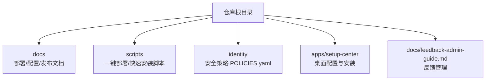
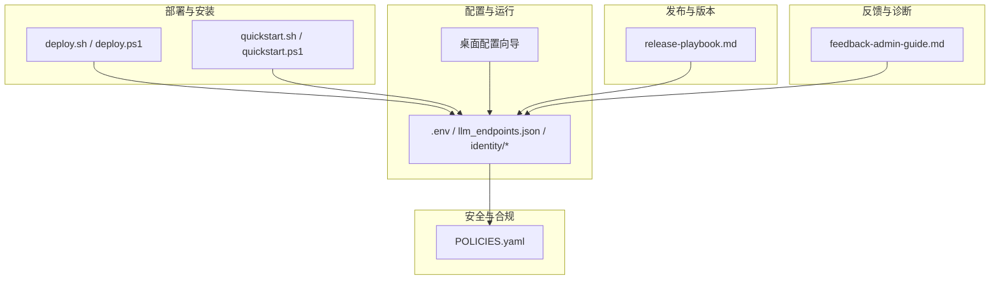
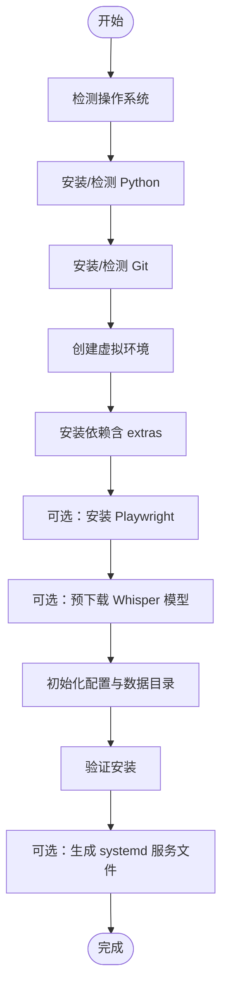
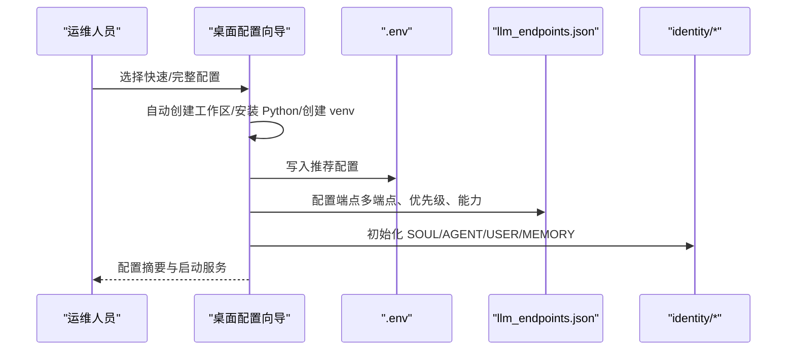
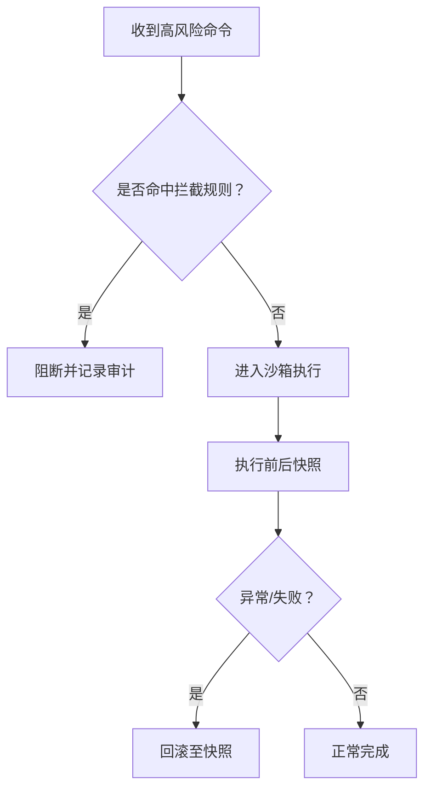
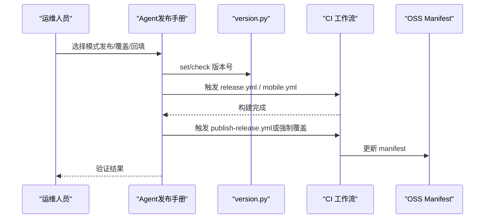
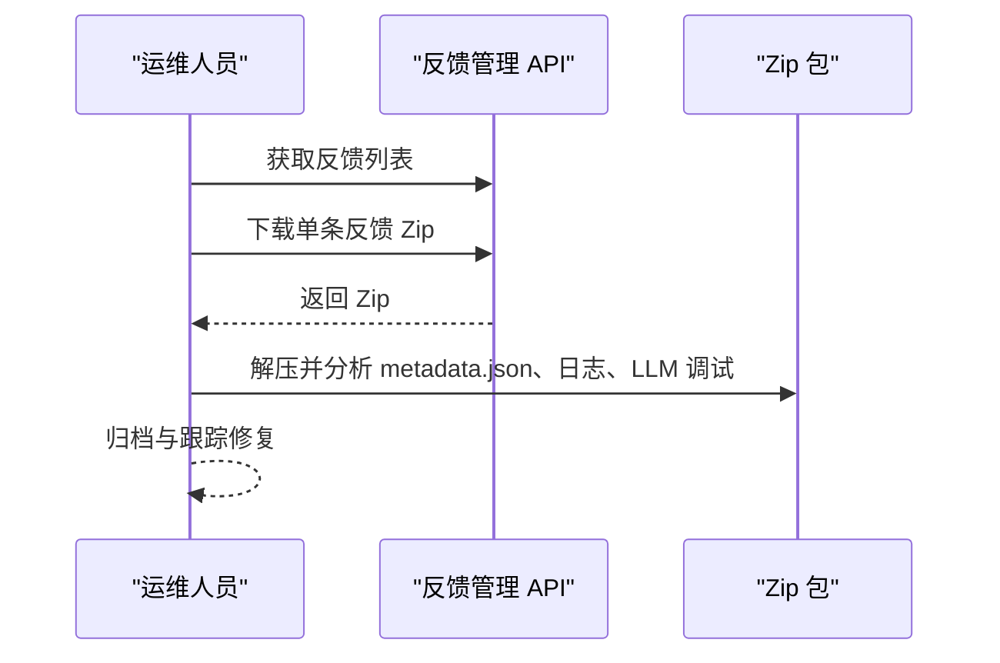
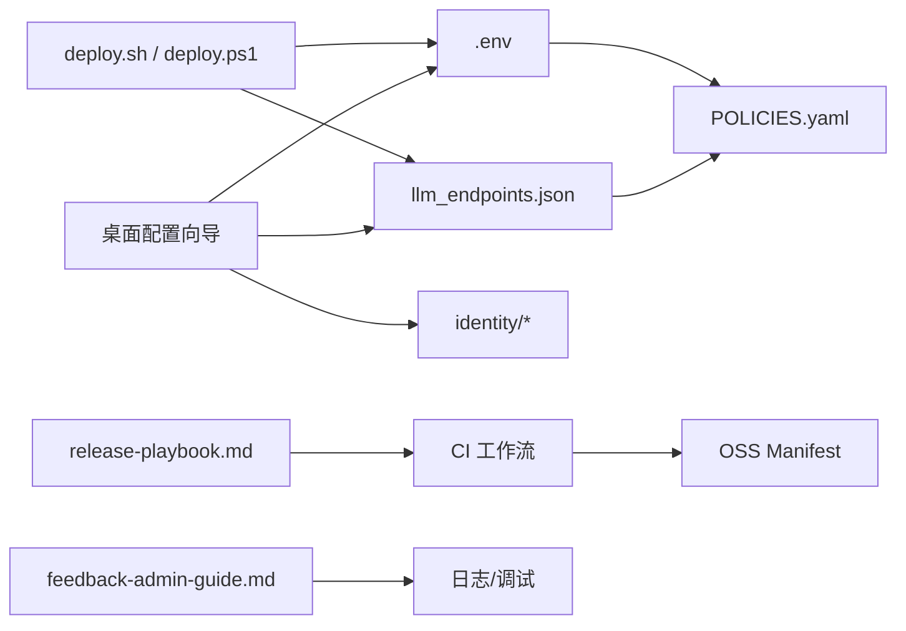

# 日常运维

<cite>
**本文引用的文件**
- [README.md](file://README.md)
- [deploy.md](file://docs/deploy.md)
- [configuration-guide.md](file://docs/configuration-guide.md)
- [configuration.md](file://docs/configuration.md)
- [release-playbook.md](file://docs/release-playbook.md)
- [POLICIES.yaml](file://identity/POLICIES.yaml)
- [deploy.sh](file://scripts/deploy.sh)
- [deploy.ps1](file://scripts/deploy.ps1)
- [quickstart.sh](file://scripts/quickstart.sh)
- [quickstart.ps1](file://scripts/quickstart.ps1)
- [feedback-admin-guide.md](file://docs/feedback-admin-guide.md)
</cite>

## 目录
1. [简介](#简介)
2. [项目结构](#项目结构)
3. [核心组件](#核心组件)
4. [架构总览](#架构总览)
5. [详细组件分析](#详细组件分析)
6. [依赖关系分析](#依赖关系分析)
7. [性能考量](#性能考量)
8. [故障排查指南](#故障排查指南)
9. [结论](#结论)
10. [附录](#附录)

## 简介
本指南面向日常运维团队，聚焦于系统维护、定期检查、预防性维护、版本升级、配置变更与回滚、用户账户与权限审计、安全补丁更新、运维脚本与批量操作、以及故障响应与知识库维护。文档结合仓库内的部署与配置文档、策略配置与发布手册，形成可执行、可追溯、可复用的运维实践。

## 项目结构
- 文档与发布：docs 目录包含部署、配置、发布手册等运维相关文档。
- 运维脚本：scripts 目录提供一键部署与快速安装脚本，覆盖 Linux/macOS 与 Windows。
- 安全策略：identity/POLICIES.yaml 定义安全策略与防护边界。
- 桌面客户端与配置向导：apps/setup-center 提供图形化配置与安装体验。
- 反馈与诊断：docs/feedback-admin-guide.md 提供反馈收集与批量下载能力。

章节来源
- [README.md:1-719](file://README.md#L1-L719)

## 核心组件
- 部署与安装
  - 一键部署脚本：Linux/macOS 与 Windows 的自动化安装与环境准备。
  - 快速安装脚本：PyPI 一键安装，支持 extras、镜像、Playwright、包装器等参数。
- 配置与运行
  - 桌面配置向导：快速/完整配置模式，LLM 端点、IM 通道、工具与技能、Agent 与系统等。
  - 环境变量与配置文件：.env、llm_endpoints.json、identity/* 等。
- 安全与合规
  - POLICIES.yaml：路径分区、确认门、命令拦截、快照检查点、自保护、沙箱等。
- 发布与版本管理
  - release-playbook.md：渠道配置、版本号同步、工作流触发与回填。
- 反馈与诊断
  - 反馈管理 API：管理员接口、批量下载、Zip 包结构与元数据。

章节来源
- [deploy.md:1-888](file://docs/deploy.md#L1-L888)
- [configuration-guide.md:1-703](file://docs/configuration-guide.md#L1-L703)
- [configuration.md:1-312](file://docs/configuration.md#L1-L312)
- [POLICIES.yaml:1-81](file://identity/POLICIES.yaml#L1-L81)
- [release-playbook.md:1-350](file://docs/release-playbook.md#L1-L350)
- [feedback-admin-guide.md:1-125](file://docs/feedback-admin-guide.md#L1-L125)

## 架构总览
下图展示运维相关的关键组件与交互关系：部署脚本负责环境准备与安装；配置向导与配置文件共同决定运行态；安全策略贯穿执行过程；发布手册指导版本与渠道管理；反馈系统支撑问题闭环。

图表来源
- [deploy.sh:1-781](file://scripts/deploy.sh#L1-L781)
- [deploy.ps1:1-751](file://scripts/deploy.ps1#L1-L751)
- [quickstart.sh:1-222](file://scripts/quickstart.sh#L1-L222)
- [quickstart.ps1:1-150](file://scripts/quickstart.ps1#L1-L150)
- [configuration-guide.md:1-703](file://docs/configuration-guide.md#L1-L703)
- [configuration.md:1-312](file://docs/configuration.md#L1-L312)
- [POLICIES.yaml:1-81](file://identity/POLICIES.yaml#L1-L81)
- [release-playbook.md:1-350](file://docs/release-playbook.md#L1-L350)
- [feedback-admin-guide.md:1-125](file://docs/feedback-admin-guide.md#L1-L125)

## 详细组件分析

### 1) 部署与安装脚本
- Linux/macOS 一键部署脚本
  - 自动检测/安装 Python、Git，创建虚拟环境，安装依赖，可选安装 Playwright 与 Whisper 模型，初始化配置与数据目录，验证安装并通过 systemd 服务文件示例。
- Windows 一键部署脚本
  - 自动检测/安装 Python、Git，创建虚拟环境，安装依赖，可选安装 Playwright 与 Whisper 模型，初始化配置与数据目录，验证安装。
- PyPI 一键安装脚本
  - 支持 extras、镜像源、Torch 预装、Playwright、初始化向导、包装器安装与 PATH 提示。

图表来源
- [deploy.sh:725-781](file://scripts/deploy.sh#L725-L781)
- [deploy.ps1:700-751](file://scripts/deploy.ps1#L700-L751)

章节来源
- [deploy.sh:1-781](file://scripts/deploy.sh#L1-L781)
- [deploy.ps1:1-751](file://scripts/deploy.ps1#L1-L751)
- [quickstart.sh:1-222](file://scripts/quickstart.sh#L1-L222)
- [quickstart.ps1:1-150](file://scripts/quickstart.ps1#L1-L150)

### 2) 配置与运行
- 桌面配置向导
  - 快速配置：自动创建默认工作区、安装内置 Python、创建虚拟环境、安装依赖、写入推荐配置、可选 IM 通道。
  - 完整配置：工作区、Python 环境、安装来源与 extras、LLM 端点（多端点与故障转移）、IM 通道、工具与技能、Agent 与系统（日志、调度器、会话、活人感与表情包、Persona 等）。
- 环境变量与配置文件
  - .env：环境变量集中地，覆盖默认值。
  - llm_endpoints.json：多端点、优先级、能力标签、健康检查与冷却机制。
  - identity/*：SOUL/AGENT/USER/MEMORY，核心人格与记忆模板。

图表来源
- [configuration-guide.md:1-703](file://docs/configuration-guide.md#L1-L703)
- [configuration.md:1-312](file://docs/configuration.md#L1-L312)

章节来源
- [configuration-guide.md:1-703](file://docs/configuration-guide.md#L1-L703)
- [configuration.md:1-312](file://docs/configuration.md#L1-L312)

### 3) 安全与合规
- POLICIES.yaml 关键要点
  - 路径分区：workspace、controlled、protected、forbidden，限定执行域。
  - 确认门：危险操作需用户确认，超时拒绝。
  - 命令拦截：黑名单命令（如 reg、regedit、shutdown 等）。
  - 快照检查点：文件写入前快照，支持回滚。
  - 自保护：保护 data/identity/logs/src 等目录，审计记录持久化。
  - 沙箱：高风险命令自动进入 OS 级沙箱（bwrap/seatbelt/MIC）。

图表来源
- [POLICIES.yaml:1-81](file://identity/POLICIES.yaml#L1-L81)

章节来源
- [POLICIES.yaml:1-81](file://identity/POLICIES.yaml#L1-L81)

### 4) 发布与版本管理
- 渠道配置：release-channels.json 控制 minor → 渠道映射（release/pre-release/dev）。
- 版本号同步：scripts/version.py 作为单一版本源，同步到多文件。
- 工作流：release.yml、mobile.yml、publish-release.yml、backfill-oss.yml。
- Agent 交互模式：切换渠道、发布新版本、覆盖指定版本、回填历史 manifest。

图表来源
- [release-playbook.md:1-350](file://docs/release-playbook.md#L1-L350)

章节来源
- [release-playbook.md:1-350](file://docs/release-playbook.md#L1-L350)

### 5) 反馈与诊断
- 管理员 API：查看/下载/删除反馈，支持按类型与数量筛选。
- 批量下载：一键下载未处理反馈到本地目录。
- Zip 包结构：metadata.json、images、logs、llm_debug。

图表来源
- [feedback-admin-guide.md:1-125](file://docs/feedback-admin-guide.md#L1-L125)

章节来源
- [feedback-admin-guide.md:1-125](file://docs/feedback-admin-guide.md#L1-L125)

## 依赖关系分析
- 部署脚本依赖操作系统与包管理器，创建隔离环境并安装依赖。
- 配置向导依赖 .env 与 llm_endpoints.json，后者决定 LLM 调用链路与可用性。
- 安全策略 POLICIES.yaml 在运行期贯穿工具调用、文件写入与命令执行。
- 发布手册依赖 CI 工作流与 OSS，确保版本与渠道一致性。
- 反馈系统为问题定位与回归验证提供证据链。

图表来源
- [deploy.sh:1-781](file://scripts/deploy.sh#L1-L781)
- [deploy.ps1:1-751](file://scripts/deploy.ps1#L1-L751)
- [configuration-guide.md:1-703](file://docs/configuration-guide.md#L1-L703)
- [configuration.md:1-312](file://docs/configuration.md#L1-L312)
- [POLICIES.yaml:1-81](file://identity/POLICIES.yaml#L1-L81)
- [release-playbook.md:1-350](file://docs/release-playbook.md#L1-L350)
- [feedback-admin-guide.md:1-125](file://docs/feedback-admin-guide.md#L1-L125)

## 性能考量
- LLM 端点多实例与优先级：通过 llm_endpoints.json 的优先级与冷却机制提升可用性与稳定性。
- 资源限制与日志轮转：合理设置日志大小与保留天数，避免磁盘压力。
- 沙箱与快照：高风险操作进入沙箱并保留快照，减少系统影响面。
- 依赖安装与镜像：使用国内镜像源加速安装，降低网络波动对部署的影响。

## 故障排查指南
- 部署失败
  - 检查 Python 版本与包管理器可用性；确认网络与镜像源；查看脚本输出与日志。
- LLM 端点不可用
  - 核对 llm_endpoints.json 的优先级、能力标签与健康检查；观察冷却期与降级行为。
- 安全策略导致误拦截
  - 检查 POLICIES.yaml 的路径分区与命令拦截规则；必要时临时豁免或调整策略。
- 反馈问题定位
  - 使用反馈管理 API 下载 Zip 包，重点分析 metadata.json、日志与最近 LLM 调试文件。

章节来源
- [deploy.md:764-800](file://docs/deploy.md#L764-L800)
- [configuration.md:291-312](file://docs/configuration.md#L291-L312)
- [POLICIES.yaml:1-81](file://identity/POLICIES.yaml#L1-L81)
- [feedback-admin-guide.md:85-125](file://docs/feedback-admin-guide.md#L85-L125)

## 结论
通过标准化的部署脚本、可视化配置向导、严格的策略配置与完善的发布流程，本项目提供了可落地的日常运维实践。建议将上述流程纳入 SOP，配合反馈与审计体系，形成“部署—配置—运行—发布—反馈—回归”的闭环，持续提升系统稳定性与可维护性。

## 附录

### A. 日常运维任务清单
- 系统维护
  - 检查磁盘空间与日志轮转；验证 LLM 端点健康与冷却期；审查 POLICIES.yaml 的拦截与快照策略。
- 定期检查
  - 运行 synapse status 与日志巡检；检查 IM 通道连通性；核对 llm_endpoints.json 的优先级与能力标签。
- 预防性维护
  - 预热 Whisper 模型；更新依赖与镜像源；备份 .env 与 llm_endpoints.json；演练回滚（快照/配置）。
- 版本升级
  - 使用 scripts/version.py 同步版本；在目标分支上打 tag；触发 release.yml 与 publish-release.yml；验证 OSS manifest。
- 配置变更与回滚
  - 通过桌面配置向导或 .env/llm_endpoints.json 修改；变更后重启服务；若异常，回滚至快照或上一版本配置。
- 用户账户与权限审计
  - 审核 POLICIES.yaml 的受信名单与豁免；检查 data/audit/policy_decisions.jsonl；定期清理过期策略。
- 安全补丁更新
  - 更新依赖与镜像源；验证 Playwright/Whisper 等可选组件；重新安装后验证功能。
- 运维脚本与批量操作
  - 使用 quickstart.* 与 deploy.* 脚本进行批量安装与升级；使用反馈批量下载脚本归档问题。
- 故障响应与知识库
  - 建立问题分类与标签；沉淀 Zip 包分析模板；定期回顾发布与回滚案例，完善知识库。

### B. 关键命令与路径
- 部署与安装
  - Linux/macOS: scripts/deploy.sh
  - Windows: scripts/deploy.ps1
  - PyPI 一键安装: scripts/quickstart.sh / scripts/quickstart.ps1
- 配置
  - .env、data/llm_endpoints.json、identity/*
- 安全
  - identity/POLICIES.yaml
- 发布
  - docs/release-playbook.md、scripts/version.py
- 反馈
  - docs/feedback-admin-guide.md