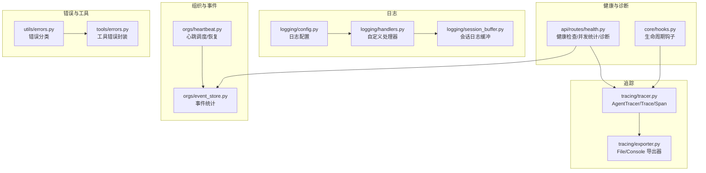
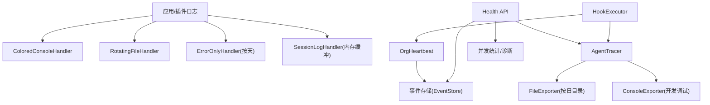
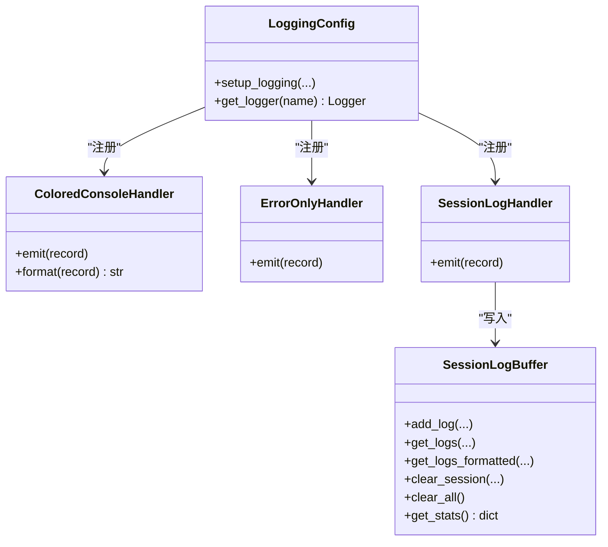
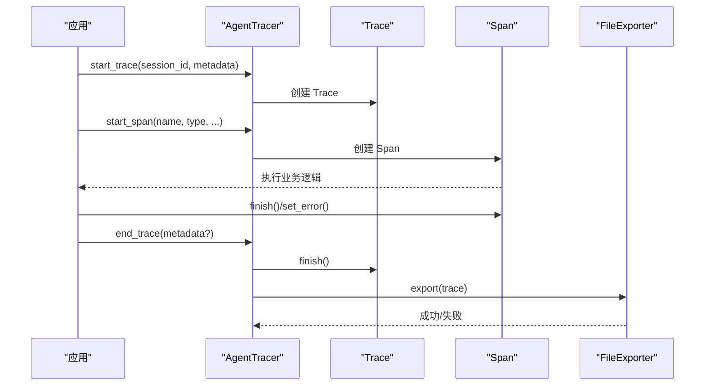
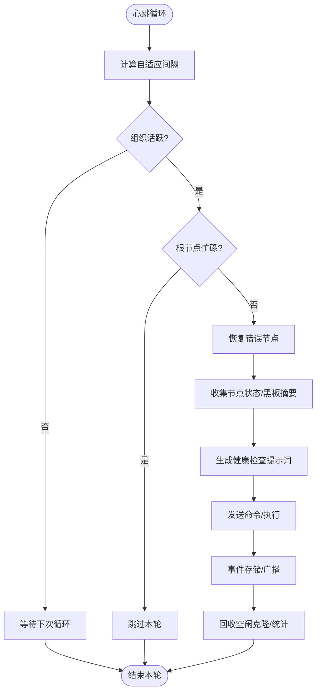
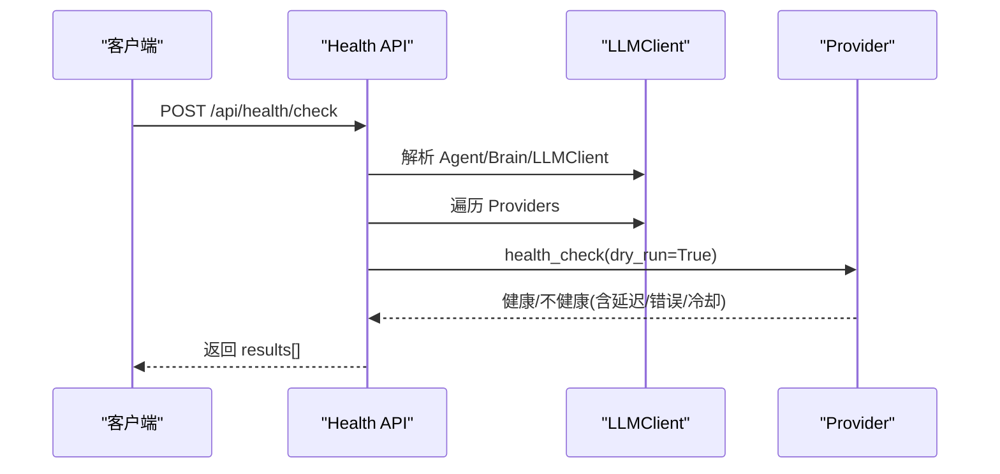
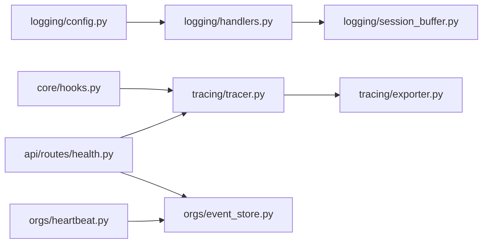

# 监控和日志

<cite>
**本文引用的文件**
- [src/synapse/logging/config.py](file://src/synapse/logging/config.py)
- [src/synapse/logging/handlers.py](file://src/synapse/logging/handlers.py)
- [src/synapse/logging/session_buffer.py](file://src/synapse/logging/session_buffer.py)
- [src/synapse/plugins/api.py](file://src/synapse/plugins/api.py)
- [src/synapse/tracing/tracer.py](file://src/synapse/tracing/tracer.py)
- [src/synapse/tracing/exporter.py](file://src/synapse/tracing/exporter.py)
- [src/synapse/orgs/heartbeat.py](file://src/synapse/orgs/heartbeat.py)
- [src/synapse/orgs/event_store.py](file://src/synapse/orgs/event_store.py)
- [src/synapse/api/routes/health.py](file://src/synapse/api/routes/health.py)
- [src/synapse/core/hooks.py](file://src/synapse/core/hooks.py)
- [src/synapse/utils/errors.py](file://src/synapse/utils/errors.py)
- [src/synapse/tools/errors.py](file://src/synapse/tools/errors.py)
- [tests/unit/test_logging_buffer.py](file://tests/unit/test_logging_buffer.py)
- [tests/orgs/test_heartbeat.py](file://tests/orgs/test_heartbeat.py)
- [tests/integration/test_api_endpoints.py](file://tests/integration/test_api_endpoints.py)
</cite>

## 目录
1. [简介](#简介)
2. [项目结构](#项目结构)
3. [核心组件](#核心组件)
4. [架构总览](#架构总览)
5. [详细组件分析](#详细组件分析)
6. [依赖关系分析](#依赖关系分析)
7. [性能考量](#性能考量)
8. [故障排查指南](#故障排查指南)
9. [结论](#结论)
10. [附录](#附录)

## 简介
本运维文档聚焦于监控与日志体系，覆盖以下方面：
- 日志收集与存储策略：统一日志配置、文件轮转、错误日志分离、会话日志缓冲与查询。
- 日志格式标准化与轮转配置：控制台彩色输出、统一格式、按大小与按天轮转策略。
- 分布式追踪系统：Trace/ Span 生命周期、导出器（文件/控制台）、摘要统计。
- 性能指标采集：并发统计、事件统计、健康检查接口与诊断能力。
- 告警规则与通知：基于事件与健康检查结果的通知通道。
- 仪表板搭建与关键指标：基于事件存储与健康检查数据的可视化建议。
- 异常检测与自动恢复：心跳机制中的自动恢复策略与错误节点重置。
- 日志分析工具使用：会话日志缓冲与查询接口、单元测试示例。
- 性能瓶颈识别与系统健康评估：事件统计、健康检查、并发与延迟指标。

## 项目结构
围绕监控与日志的关键模块分布如下：
- 日志系统：配置、处理器、会话缓冲
- 追踪系统：Tracer、导出器
- 组织心跳与事件：心跳调度、事件存储
- 健康检查与诊断：API 健康检查、并发统计、诊断接口
- 钩子系统：生命周期钩子扩展点
- 错误分类：统一错误分类与工具错误封装

图表来源
- [src/synapse/logging/config.py:20-107](file://src/synapse/logging/config.py#L20-L107)
- [src/synapse/logging/handlers.py:19-169](file://src/synapse/logging/handlers.py#L19-L169)
- [src/synapse/logging/session_buffer.py:43-265](file://src/synapse/logging/session_buffer.py#L43-L265)
- [src/synapse/tracing/tracer.py:106-506](file://src/synapse/tracing/tracer.py#L106-L506)
- [src/synapse/tracing/exporter.py:36-205](file://src/synapse/tracing/exporter.py#L36-L205)
- [src/synapse/orgs/heartbeat.py:24-455](file://src/synapse/orgs/heartbeat.py#L24-L455)
- [src/synapse/orgs/event_store.py:204-240](file://src/synapse/orgs/event_store.py#L204-L240)
- [src/synapse/api/routes/health.py:128-424](file://src/synapse/api/routes/health.py#L128-L424)
- [src/synapse/core/hooks.py:24-293](file://src/synapse/core/hooks.py#L24-L293)
- [src/synapse/utils/errors.py:13-40](file://src/synapse/utils/errors.py#L13-L40)
- [src/synapse/tools/errors.py:107-154](file://src/synapse/tools/errors.py#L107-L154)

章节来源
- [src/synapse/logging/config.py:20-107](file://src/synapse/logging/config.py#L20-L107)
- [src/synapse/logging/handlers.py:19-169](file://src/synapse/logging/handlers.py#L19-L169)
- [src/synapse/logging/session_buffer.py:43-265](file://src/synapse/logging/session_buffer.py#L43-L265)
- [src/synapse/tracing/tracer.py:106-506](file://src/synapse/tracing/tracer.py#L106-L506)
- [src/synapse/tracing/exporter.py:36-205](file://src/synapse/tracing/exporter.py#L36-L205)
- [src/synapse/orgs/heartbeat.py:24-455](file://src/synapse/orgs/heartbeat.py#L24-L455)
- [src/synapse/orgs/event_store.py:204-240](file://src/synapse/orgs/event_store.py#L204-L240)
- [src/synapse/api/routes/health.py:128-424](file://src/synapse/api/routes/health.py#L128-L424)
- [src/synapse/core/hooks.py:24-293](file://src/synapse/core/hooks.py#L24-L293)
- [src/synapse/utils/errors.py:13-40](file://src/synapse/utils/errors.py#L13-L40)
- [src/synapse/tools/errors.py:107-154](file://src/synapse/tools/errors.py#L107-L154)

## 核心组件
- 日志配置与处理器
  - 统一配置入口，支持控制台与文件输出、错误日志按天轮转、会话日志缓冲。
  - 自定义处理器：彩色控制台、仅错误级别文件、会话日志内存缓冲。
- 会话日志缓冲
  - 按会话分组存储，支持全局与会话过滤、格式化输出、清理与统计。
- 追踪系统
  - Trace/ Span 生命周期管理，支持嵌套、属性与错误标记；导出器支持文件与控制台。
- 组织心跳与事件
  - 心跳调度、自适应间隔、错误节点自动恢复；事件存储提供统计与错误聚合。
- 健康检查与诊断
  - 健康检查接口、并发统计、诊断报告、池与编排器状态。
- 钩子系统
  - 生命周期钩子扩展点，支持回调与 Shell 钩子，便于集成外部监控与告警。
- 错误分类
  - 统一错误分类与工具错误封装，便于告警与诊断。

章节来源
- [src/synapse/logging/config.py:20-107](file://src/synapse/logging/config.py#L20-L107)
- [src/synapse/logging/handlers.py:19-169](file://src/synapse/logging/handlers.py#L19-L169)
- [src/synapse/logging/session_buffer.py:43-265](file://src/synapse/logging/session_buffer.py#L43-L265)
- [src/synapse/tracing/tracer.py:178-506](file://src/synapse/tracing/tracer.py#L178-L506)
- [src/synapse/tracing/exporter.py:36-205](file://src/synapse/tracing/exporter.py#L36-L205)
- [src/synapse/orgs/heartbeat.py:39-100](file://src/synapse/orgs/heartbeat.py#L39-L100)
- [src/synapse/orgs/event_store.py:204-240](file://src/synapse/orgs/event_store.py#L204-L240)
- [src/synapse/api/routes/health.py:128-424](file://src/synapse/api/routes/health.py#L128-L424)
- [src/synapse/core/hooks.py:24-293](file://src/synapse/core/hooks.py#L24-L293)
- [src/synapse/utils/errors.py:13-40](file://src/synapse/utils/errors.py#L13-L40)
- [src/synapse/tools/errors.py:107-154](file://src/synapse/tools/errors.py#L107-L154)

## 架构总览
下图展示监控与日志相关模块之间的交互关系：

图表来源
- [src/synapse/logging/handlers.py:19-169](file://src/synapse/logging/handlers.py#L19-L169)
- [src/synapse/logging/config.py:64-98](file://src/synapse/logging/config.py#L64-L98)
- [src/synapse/tracing/tracer.py:178-506](file://src/synapse/tracing/tracer.py#L178-L506)
- [src/synapse/tracing/exporter.py:36-205](file://src/synapse/tracing/exporter.py#L36-L205)
- [src/synapse/orgs/heartbeat.py:144-279](file://src/synapse/orgs/heartbeat.py#L144-L279)
- [src/synapse/orgs/event_store.py:204-240](file://src/synapse/orgs/event_store.py#L204-L240)
- [src/synapse/api/routes/health.py:356-424](file://src/synapse/api/routes/health.py#L356-L424)
- [src/synapse/core/hooks.py:192-293](file://src/synapse/core/hooks.py#L192-L293)

## 详细组件分析

### 日志系统
- 统一配置
  - 控制台处理器：彩色输出、UTF-8 安全处理、终端颜色检测。
  - 文件处理器：按大小轮转（MB），保留备份数量。
  - 错误日志处理器：仅记录 ERROR/CRITICAL，按天轮转。
  - 会话日志处理器：内存缓冲，简化格式，按会话分组。
- 会话日志缓冲
  - 单例模式、线程安全、最大会话数与每会话条目上限。
  - 提供按会话检索、过滤级别、格式化输出、清理与统计。

图表来源
- [src/synapse/logging/config.py:20-107](file://src/synapse/logging/config.py#L20-L107)
- [src/synapse/logging/handlers.py:19-169](file://src/synapse/logging/handlers.py#L19-L169)
- [src/synapse/logging/session_buffer.py:43-265](file://src/synapse/logging/session_buffer.py#L43-L265)

章节来源
- [src/synapse/logging/config.py:20-107](file://src/synapse/logging/config.py#L20-L107)
- [src/synapse/logging/handlers.py:19-169](file://src/synapse/logging/handlers.py#L19-L169)
- [src/synapse/logging/session_buffer.py:43-265](file://src/synapse/logging/session_buffer.py#L43-L265)
- [tests/unit/test_logging_buffer.py:39-76](file://tests/unit/test_logging_buffer.py#L39-L76)

### 追踪系统
- Tracer
  - Trace/ Span 数据结构与序列化，支持父 Span、结束时间、持续时间、错误信息。
  - 上下文管理器与非上下文管理器两种开始/结束方式，支持嵌套与导出栈。
- 导出器
  - FileExporter：按日期分目录存储 JSON，维护每日摘要文件，聚合 LLM/工具调用与令牌统计。
  - ConsoleExporter：开发调试用，打印 Trace 摘要与详细 Span 信息。

图表来源
- [src/synapse/tracing/tracer.py:212-242](file://src/synapse/tracing/tracer.py#L212-L242)
- [src/synapse/tracing/tracer.py:434-478](file://src/synapse/tracing/tracer.py#L434-L478)
- [src/synapse/tracing/exporter.py:55-77](file://src/synapse/tracing/exporter.py#L55-L77)

章节来源
- [src/synapse/tracing/tracer.py:106-176](file://src/synapse/tracing/tracer.py#L106-L176)
- [src/synapse/tracing/tracer.py:178-506](file://src/synapse/tracing/tracer.py#L178-L506)
- [src/synapse/tracing/exporter.py:36-205](file://src/synapse/tracing/exporter.py#L36-L205)

### 组织心跳与事件
- 心跳调度
  - 自适应心跳间隔，避免空闲时高频率轮询；支持手动触发。
  - 错误节点自动恢复：重置 ERROR 节点至 IDLE 并清理代理缓存。
- 事件存储
  - 提供事件查询、类型分布、节点活动、任务完成/失败统计与错误列表。

图表来源
- [src/synapse/orgs/heartbeat.py:120-143](file://src/synapse/orgs/heartbeat.py#L120-L143)
- [src/synapse/orgs/heartbeat.py:144-279](file://src/synapse/orgs/heartbeat.py#L144-L279)
- [src/synapse/orgs/event_store.py:204-240](file://src/synapse/orgs/event_store.py#L204-L240)

章节来源
- [src/synapse/orgs/heartbeat.py:24-455](file://src/synapse/orgs/heartbeat.py#L24-L455)
- [src/synapse/orgs/event_store.py:204-240](file://src/synapse/orgs/event_store.py#L204-L240)
- [tests/orgs/test_heartbeat.py:39-68](file://tests/orgs/test_heartbeat.py#L39-L68)

### 健康检查与诊断
- 健康检查接口
  - GET /api/health：基础健康信息（版本、进程、本地 IP、API 主机与端口等）。
  - POST /api/health/check：对指定或全部 LLM 提供商进行 dry-run 健康检查，返回延迟、错误与冷却状态。
  - GET /api/health/loop：事件循环延迟、LLM 并发统计、组织并发统计。
  - GET /api/debug/pool-stats：代理实例池统计。
  - GET /api/debug/orchestrator-state：编排器内部状态与健康统计。
  - GET /api/diagnostics：环境自检报告。
- 诊断能力
  - 运行时、包管理器、核心模块完整性检查，返回总结与证据列表。

图表来源
- [src/synapse/api/routes/health.py:356-387](file://src/synapse/api/routes/health.py#L356-L387)
- [src/synapse/api/routes/health.py:390-424](file://src/synapse/api/routes/health.py#L390-L424)

章节来源
- [src/synapse/api/routes/health.py:128-424](file://src/synapse/api/routes/health.py#L128-L424)
- [tests/integration/test_api_endpoints.py:50-88](file://tests/integration/test_api_endpoints.py#L50-L88)

### 钩子系统与告警
- 钩子事件
  - 覆盖工具使用、会话生命周期、代理停止、权限、通知、任务管理、配置变更、文件系统、工作树等。
- 执行器
  - 支持回调与 Shell 钩子，记录执行结果、耗时与错误，便于集成外部监控与告警系统。

章节来源
- [src/synapse/core/hooks.py:24-293](file://src/synapse/core/hooks.py#L24-L293)

### 错误分类与工具错误
- 统一错误分类
  - 将原始错误字符串映射到粗粒度类别（认证、配额、超时、内容过滤、网络、服务器、未知）。
- 工具错误封装
  - 将通用异常分类为结构化 ToolError，包含错误类型、提示、替代工具与细节，便于 LLM 决策。

章节来源
- [src/synapse/utils/errors.py:13-40](file://src/synapse/utils/errors.py#L13-L40)
- [src/synapse/tools/errors.py:107-154](file://src/synapse/tools/errors.py#L107-L154)

## 依赖关系分析
- 日志系统
  - logging/config.py 依赖 logging.handlers、自定义 handlers。
  - handlers.py 依赖 session_buffer.py。
- 追踪系统
  - tracer.py 依赖 exporter.py。
- 组织与事件
  - heartbeat.py 依赖 event_store.py。
- 健康检查
  - health.py 依赖 event_store.py、tracer.py。
- 钩子系统
  - core/hooks.py 与 tracer.py、heartbeat.py 解耦，通过事件驱动。

图表来源
- [src/synapse/logging/config.py:12-17](file://src/synapse/logging/config.py#L12-L17)
- [src/synapse/logging/handlers.py:13-16](file://src/synapse/logging/handlers.py#L13-L16)
- [src/synapse/logging/session_buffer.py:14-17](file://src/synapse/logging/session_buffer.py#L14-L17)
- [src/synapse/tracing/tracer.py:17-17](file://src/synapse/tracing/tracer.py#L17-L17)
- [src/synapse/tracing/exporter.py:10-17](file://src/synapse/tracing/exporter.py#L10-L17)
- [src/synapse/orgs/heartbeat.py:16-19](file://src/synapse/orgs/heartbeat.py#L16-L19)
- [src/synapse/orgs/event_store.py:204-240](file://src/synapse/orgs/event_store.py#L204-L240)
- [src/synapse/api/routes/health.py:16-18](file://src/synapse/api/routes/health.py#L16-L18)
- [src/synapse/core/hooks.py:16-21](file://src/synapse/core/hooks.py#L16-L21)

## 性能考量
- 日志性能
  - 控制台彩色输出与 Unicode 安全处理，避免编码异常导致流中断。
  - 文件轮转按大小与按天，结合备份数量控制磁盘占用。
- 追踪性能
  - 导出器异步失败不阻塞主流程，记录警告日志。
  - 摘要文件聚合统计，减少频繁 IO。
- 健康检查
  - dry-run 模式避免影响提供商状态与冷却计数。
  - 并发检查与超时控制，降低单点阻塞风险。
- 心跳与并发
  - 自适应间隔与根节点忙碌检测，避免无效轮询。
  - 组织并发统计与事件循环延迟测量，辅助定位阻塞。

章节来源
- [src/synapse/logging/handlers.py:92-114](file://src/synapse/logging/handlers.py#L92-L114)
- [src/synapse/tracing/exporter.py:75-76](file://src/synapse/tracing/exporter.py#L75-L76)
- [src/synapse/api/routes/health.py:166-217](file://src/synapse/api/routes/health.py#L166-L217)
- [src/synapse/orgs/heartbeat.py:57-72](file://src/synapse/orgs/heartbeat.py#L57-L72)
- [src/synapse/api/routes/health.py:390-424](file://src/synapse/api/routes/health.py#L390-L424)

## 故障排查指南
- 日志问题
  - 控制台乱码：确认彩色处理器的 UTF-8 包装与终端颜色支持。
  - 日志丢失：检查会话日志缓冲上限与淘汰策略，必要时增大最大会话数或每会话条目数。
  - 错误日志缺失：确认 ErrorOnlyHandler 的级别与按天轮转。
- 追踪问题
  - 导出失败：查看导出器警告日志，检查目标目录权限与磁盘空间。
  - 摘要统计异常：检查每日摘要文件读写权限与 JSON 格式。
- 健康检查
  - 超时：提高 per-endpoint 超时阈值或减少并发检查。
  - 冷却状态：根据返回的 consecutive_failures 与 cooldown_remaining 判断。
- 心跳问题
  - 跳过：检查根节点忙碌状态与运行中任务数量。
  - 自动恢复：确认错误节点被重置为 IDLE 并清理代理缓存。

章节来源
- [src/synapse/logging/handlers.py:62-104](file://src/synapse/logging/handlers.py#L62-L104)
- [src/synapse/logging/session_buffer.py:208-222](file://src/synapse/logging/session_buffer.py#L208-L222)
- [src/synapse/tracing/exporter.py:75-76](file://src/synapse/tracing/exporter.py#L75-L76)
- [src/synapse/api/routes/health.py:203-217](file://src/synapse/api/routes/health.py#L203-L217)
- [src/synapse/orgs/heartbeat.py:151-162](file://src/synapse/orgs/heartbeat.py#L151-L162)
- [tests/orgs/test_heartbeat.py:48-68](file://tests/orgs/test_heartbeat.py#L48-L68)

## 结论
本监控与日志体系通过统一日志配置、会话日志缓冲、追踪导出与健康检查接口，提供了可观测性与可维护性的基础能力。结合事件存储与钩子系统，可进一步扩展到更丰富的告警与自动化恢复场景。建议在生产环境中启用文件轮转与错误日志分离，并结合健康检查与心跳机制实现自动恢复与可视化监控。

## 附录
- 关键指标建议
  - 日志：错误率、会话日志条目数、缓冲命中率。
  - 追踪：Trace 数量、平均持续时间、工具调用次数与错误率、输入/输出令牌总量。
  - 事件：任务完成/失败数、消息发送数、节点活动分布。
  - 健康：LLM 并发、事件循环延迟、组织并发、诊断报告。
- 告警规则示例
  - 错误日志量突增、Trace 平均时延超阈、工具错误率上升、健康检查失败、心跳跳过次数过多。
- 仪表板搭建要点
  - 使用健康检查与事件存储数据构建看板，包含实时趋势、错误分布与节点状态概览。