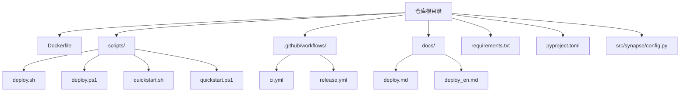
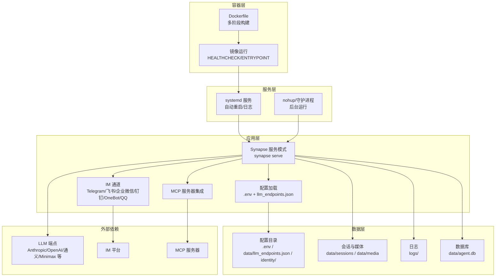
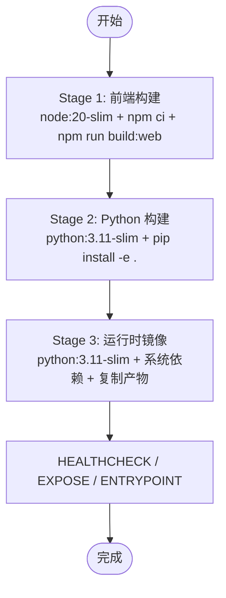
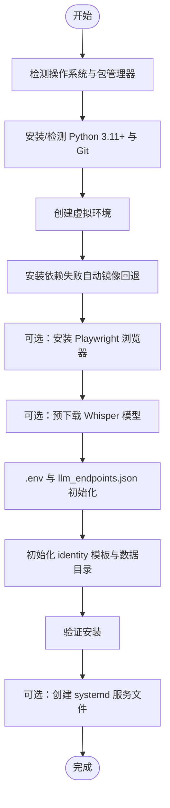
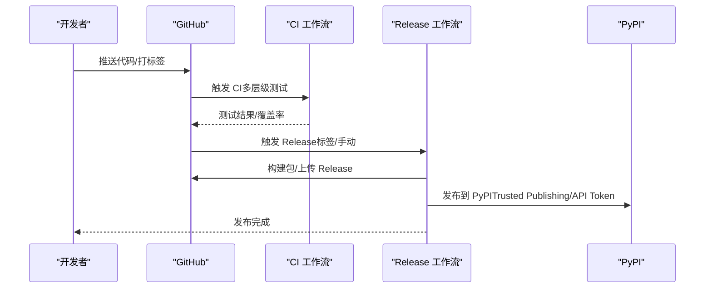
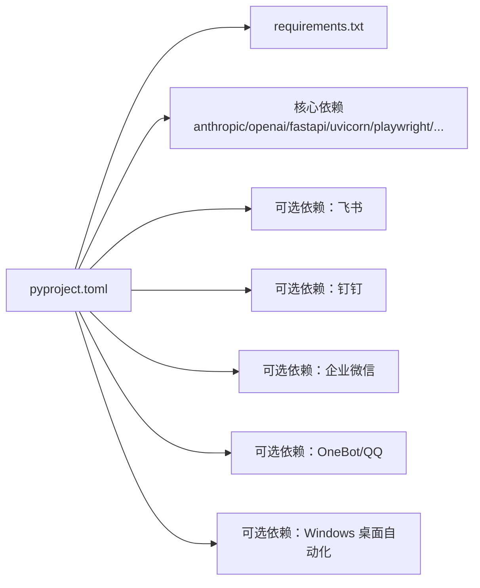

# 部署和运维

<cite>
**本文档引用的文件**
- [Dockerfile](file://Dockerfile)
- [scripts/deploy.sh](file://scripts/deploy.sh)
- [scripts/deploy.ps1](file://scripts/deploy.ps1)
- [scripts/quickstart.sh](file://scripts/quickstart.sh)
- [scripts/quickstart.ps1](file://scripts/quickstart.ps1)
- [docs/deploy.md](file://docs/deploy.md)
- [docs/deploy_en.md](file://docs/deploy_en.md)
- [.github/workflows/ci.yml](file://.github/workflows/ci.yml)
- [.github/workflows/release.yml](file://.github/workflows/release.yml)
- [requirements.txt](file://requirements.txt)
- [pyproject.toml](file://pyproject.toml)
- [src/synapse/config.py](file://src/synapse/config.py)
</cite>

## 目录
1. [简介](#简介)
2. [项目结构](#项目结构)
3. [核心组件](#核心组件)
4. [架构总览](#架构总览)
5. [详细组件分析](#详细组件分析)
6. [依赖关系分析](#依赖关系分析)
7. [性能考量](#性能考量)
8. [故障排除指南](#故障排除指南)
9. [结论](#结论)
10. [附录](#附录)

## 简介
本文件面向生产环境的部署与运维，围绕以下目标展开：提供完整的部署步骤、容器化与 CI/CD 流水线配置、监控与日志策略、性能优化与调优、备份与恢复方案、高可用架构设计原则与最佳实践。内容基于仓库中的部署脚本、Dockerfile、CI/CD 工作流、配置模块与官方部署文档进行系统化梳理，并辅以可视化图表帮助读者快速理解。

## 项目结构
- 部署与运维相关的关键文件分布如下：
  - Docker 容器化：Dockerfile
  - 一键部署脚本：Linux/macOS 与 Windows 的部署脚本
  - 快速安装脚本：PyPI 一键安装脚本（Linux/macOS 与 Windows）
  - CI/CD 工作流：CI 与发布（Release）流水线
  - 配置模块：运行时配置与路径解析
  - 官方部署文档：中文与英文部署指南

**图表来源**
- [Dockerfile](file://Dockerfile)
- [scripts/deploy.sh](file://scripts/deploy.sh)
- [scripts/deploy.ps1](file://scripts/deploy.ps1)
- [scripts/quickstart.sh](file://scripts/quickstart.sh)
- [scripts/quickstart.ps1](file://scripts/quickstart.ps1)
- [.github/workflows/ci.yml](file://.github/workflows/ci.yml)
- [.github/workflows/release.yml](file://.github/workflows/release.yml)
- [docs/deploy.md](file://docs/deploy.md)
- [docs/deploy_en.md](file://docs/deploy_en.md)
- [requirements.txt](file://requirements.txt)
- [pyproject.toml](file://pyproject.toml)
- [src/synapse/config.py](file://src/synapse/config.py)

**章节来源**
- [Dockerfile](file://Dockerfile)
- [scripts/deploy.sh](file://scripts/deploy.sh)
- [scripts/deploy.ps1](file://scripts/deploy.ps1)
- [scripts/quickstart.sh](file://scripts/quickstart.sh)
- [scripts/quickstart.ps1](file://scripts/quickstart.ps1)
- [.github/workflows/ci.yml](file://.github/workflows/ci.yml)
- [.github/workflows/release.yml](file://.github/workflows/release.yml)
- [docs/deploy.md](file://docs/deploy.md)
- [docs/deploy_en.md](file://docs/deploy_en.md)
- [requirements.txt](file://requirements.txt)
- [pyproject.toml](file://pyproject.toml)
- [src/synapse/config.py](file://src/synapse/config.py)

## 核心组件
- 容器化与镜像构建：Dockerfile 定义了多阶段构建（前端构建、Python 包构建、运行时镜像），包含健康检查与入口命令。
- 一键部署脚本：提供 Linux/macOS 与 Windows 的自动化安装、依赖安装、Playwright/Whisper 预下载、配置初始化与 systemd 服务创建。
- 快速安装脚本：通过 PyPI 一键安装，支持 extras、镜像源、Playwright、初始化向导与可执行包装器。
- CI/CD 流水线：CI 覆盖多层级测试与覆盖率上报；Release 流水线负责发布到 PyPI 与多平台桌面包构建。
- 配置模块：集中管理运行时配置（日志、代理、IM 通道、Docker 执行后端、追踪等），并提供路径解析与持久化状态。

**章节来源**
- [Dockerfile](file://Dockerfile)
- [scripts/deploy.sh](file://scripts/deploy.sh)
- [scripts/deploy.ps1](file://scripts/deploy.ps1)
- [scripts/quickstart.sh](file://scripts/quickstart.sh)
- [scripts/quickstart.ps1](file://scripts/quickstart.ps1)
- [.github/workflows/ci.yml](file://.github/workflows/ci.yml)
- [.github/workflows/release.yml](file://.github/workflows/release.yml)
- [src/synapse/config.py](file://src/synapse/config.py)

## 架构总览
下图展示了生产部署的总体架构：容器层（Docker）、服务层（systemd/守护进程）、应用层（Synapse 服务模式）、数据层（配置、会话、日志、数据库）与外部依赖（IM 通道、LLM 端点、MCP 服务器）。

**图表来源**
- [Dockerfile](file://Dockerfile)
- [docs/deploy.md](file://docs/deploy.md)
- [docs/deploy_en.md](file://docs/deploy_en.md)
- [src/synapse/config.py](file://src/synapse/config.py)

## 详细组件分析

### 容器化与镜像构建
- 多阶段构建：
  - 前端构建阶段：基于 Node.js 20，构建 Web 前端产物并注入到 Python 构建阶段。
  - Python 构建阶段：安装 Python 依赖（含可选 IM 通道与桌面自动化），打包项目。
  - 运行时镜像：基于 python:3.11-slim，安装系统依赖（ffmpeg/curl），复制构建产物与入口命令。
- 健康检查与运行参数：暴露端口 18900，健康检查通过 HTTP GET /health，入口命令为 synapse serve。
- 适用场景：容器编排（Kubernetes/Docker Compose）、CI 构建产物分发、快速试用与生产部署。

**图表来源**
- [Dockerfile](file://Dockerfile)

**章节来源**
- [Dockerfile](file://Dockerfile)

### 一键部署脚本（Linux/macOS）
- 自动化流程：
  - 检测并安装 Python 3.11+ 与 Git。
  - 创建虚拟环境并安装依赖（失败自动切换国内镜像）。
  - 可选安装 Playwright 浏览器与 Whisper 语音模型。
  - 初始化 .env、llm_endpoints.json、identity 模板与数据目录。
  - 验证安装并通过 systemd 创建服务文件（可选）。
- 使用建议：首次部署或批量安装时使用，适合非技术用户快速上手。

**图表来源**
- [scripts/deploy.sh](file://scripts/deploy.sh)

**章节来源**
- [scripts/deploy.sh](file://scripts/deploy.sh)

### 一键部署脚本（Windows）
- 自动化流程：
  - 通过 winget 或下载安装包安装 Python 3.11+。
  - 创建虚拟环境并安装依赖（失败自动镜像回退）。
  - 可选安装 Playwright 浏览器与 Whisper 语音模型。
  - 初始化 .env、llm_endpoints.json、identity 模板与数据目录。
  - 验证安装并通过 systemd 创建服务文件（可选）。
- 使用建议：Windows 环境下推荐使用，支持交互式选择与自动镜像回退。

**章节来源**
- [scripts/deploy.ps1](file://scripts/deploy.ps1)

### 快速安装脚本（PyPI）
- Linux/macOS：通过 curl 一键安装，支持 extras、镜像源、Playwright、初始化向导与可执行包装器。
- Windows：PowerShell 一键安装，支持 extras、镜像源、Playwright、初始化向导与 CMD 包装器。
- 使用建议：追求“零配置”快速体验，适合开发者与测试环境。

**章节来源**
- [scripts/quickstart.sh](file://scripts/quickstart.sh)
- [scripts/quickstart.ps1](file://scripts/quickstart.ps1)

### CI/CD 流水线
- CI 流水线：
  - Python 3.11 环境，安装开发依赖，执行 L1/L2/L3 测试与质量评估。
  - 覆盖率上报至 Codecov，跨平台（Linux/macOS/Windows）与多 Python 版本矩阵。
  - 前端与 Rust 构建检查（Setup Center/Tauri）。
- Release 流水线：
  - 自动创建/复用 Draft Release，构建 Python 包与插件 SDK，上传到 GitHub Releases。
  - 发布到 PyPI（Trusted Publishing 或 API Token），构建多平台桌面安装包（Windows/macOS/Linux）。
  - macOS 应用签名、公证与 DMG 重建。

**图表来源**
- [.github/workflows/ci.yml](file://.github/workflows/ci.yml)
- [.github/workflows/release.yml](file://.github/workflows/release.yml)

**章节来源**
- [.github/workflows/ci.yml](file://.github/workflows/ci.yml)
- [.github/workflows/release.yml](file://.github/workflows/release.yml)

### 配置与路径管理
- 配置来源优先级：环境变量 > .env 文件 > 代码默认值。
- 关键配置项（节选）：
  - LLM：API Key、Base URL、默认模型、最大输出 token、多端点配置与能力路由。
  - 日志：日志级别、目录、文件前缀、大小与保留策略、保留天数。
  - 代理：HTTP/HTTPS/全局代理、IPv4 强制模式。
  - IM 通道：Telegram、飞书、企业微信、钉钉、OneBot、QQ 官方机器人。
  - Docker 执行后端：启用、镜像、网络模式。
  - 追踪与评估：追踪开关、导出目录、评估开关与输出目录。
- 路径解析：项目根目录、数据库、日志、会话、表情包、MCP 配置等路径均通过配置模块统一管理。

**章节来源**
- [src/synapse/config.py](file://src/synapse/config.py)
- [docs/deploy.md](file://docs/deploy.md)
- [docs/deploy_en.md](file://docs/deploy_en.md)

## 依赖关系分析
- Python 依赖：核心 LLM 客户端、HTTP/异步、数据库、CLI、FastAPI/Uvicorn、浏览器自动化、图像处理、IM 通道 SDK、可选 Windows 桌面自动化。
- 可选依赖：按 IM 通道与平台拆分，支持 pip install synapse[all] 一键安装。
- 依赖一致性：requirements.txt 与 pyproject.toml 保持同步，确保 pip install -r 与 pip install -e . 的一致性。

**图表来源**
- [pyproject.toml](file://pyproject.toml)
- [requirements.txt](file://requirements.txt)

**章节来源**
- [pyproject.toml](file://pyproject.toml)
- [requirements.txt](file://requirements.txt)

## 性能考量
- LLM 端点与能力路由：多端点配置支持优先级与能力路由，结合冷却期与自动故障切换，提升稳定性与吞吐。
- 工具并行与中断检查：可配置单轮工具并行并发数与中断检查策略，平衡吞吐与可控性。
- 上下文压缩与预算控制：上下文窗口压缩比例、软硬阈值、工具结果独立压缩与任务预算（token/成本/时长/迭代/工具调用）。
- Docker 执行后端：隔离高风险命令执行，网络模式可选 none/bridge/host。
- 日志与追踪：可配置日志级别、文件大小与保留策略，追踪导出目录便于定位性能瓶颈。

**章节来源**
- [src/synapse/config.py](file://src/synapse/config.py)
- [docs/deploy.md](file://docs/deploy.md)
- [docs/deploy_en.md](file://docs/deploy_en.md)

## 故障排除指南
- Python 版本不符：使用脚本自动安装/检测 Python 3.11+，或通过 pyenv/conda 指定版本。
- pip 安装失败：自动回退到国内镜像源；亦可手动设置镜像源或使用离线包。
- Playwright 安装失败：Linux 安装系统依赖；Windows/macOS 确认网络与代理。
- API 连接超时：检查代理设置、IPv4 强制模式、网络可达性与端点健康。
- systemd 服务无法启动：检查 ExecStart 路径、工作目录、环境变量 PATH 与日志输出。
- Docker 健康检查失败：确认端口映射、/health 路由可用、容器内服务监听 0.0.0.0。

**章节来源**
- [scripts/deploy.sh](file://scripts/deploy.sh)
- [scripts/deploy.ps1](file://scripts/deploy.ps1)
- [docs/deploy.md](file://docs/deploy.md)
- [docs/deploy_en.md](file://docs/deploy_en.md)
- [Dockerfile](file://Dockerfile)

## 结论
本文件基于仓库现有脚本、配置与工作流，提供了从开发到生产的完整部署与运维指南。通过容器化、一键部署脚本、CI/CD 流水线与完善的配置管理，可实现稳定、可观测、可扩展的生产部署。建议在生产环境中结合健康检查、日志与追踪、备份与恢复策略，持续优化性能与可用性。

## 附录

### 生产部署清单
- 准备环境：Python 3.11+、Git、Docker（可选）。
- 选择部署方式：Docker 镜像、systemd 服务、nohup 守护进程。
- 配置文件：.env、llm_endpoints.json、identity 模板与数据目录。
- 启动服务：synapse serve，或 systemd 服务管理。
- 监控与日志：HEALTHCHECK、日志轮转与保留策略、追踪导出。
- 备份与恢复：数据库、会话、日志与配置目录定期备份。

**章节来源**
- [docs/deploy.md](file://docs/deploy.md)
- [docs/deploy_en.md](file://docs/deploy_en.md)
- [Dockerfile](file://Dockerfile)
- [src/synapse/config.py](file://src/synapse/config.py)