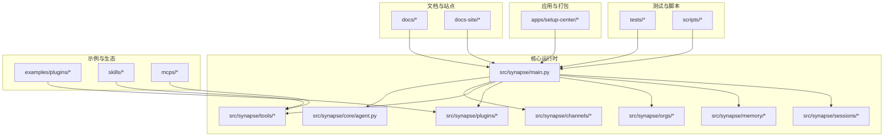
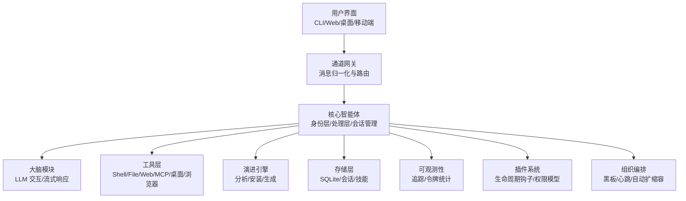
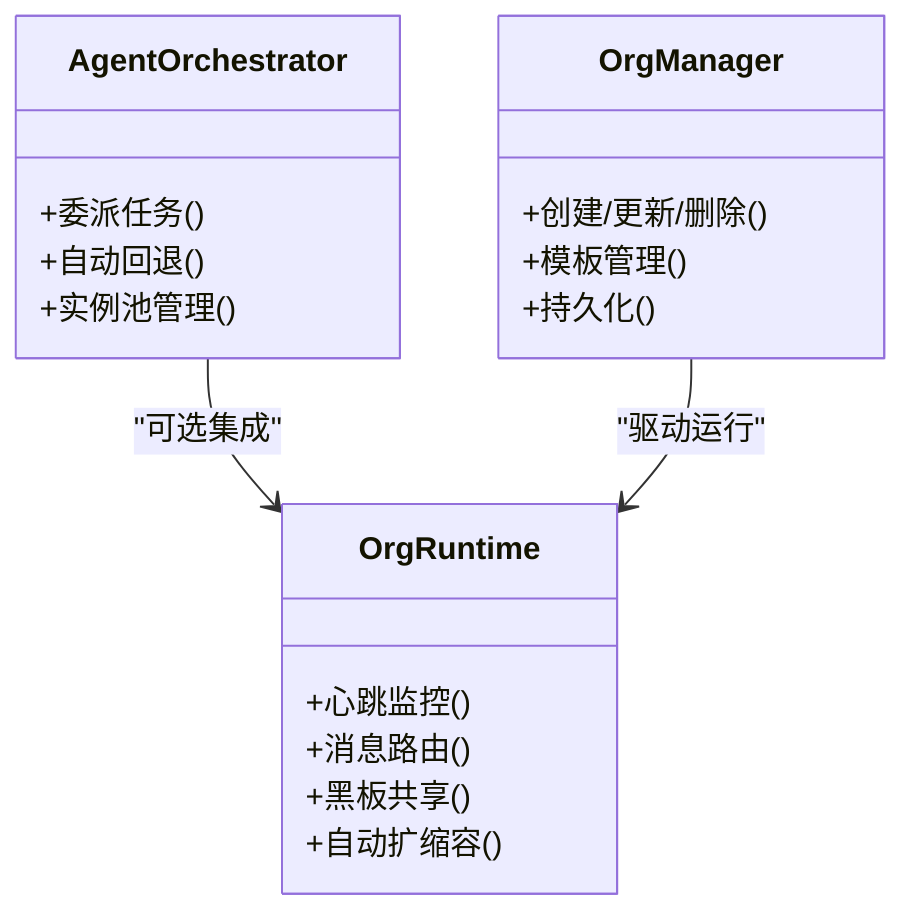
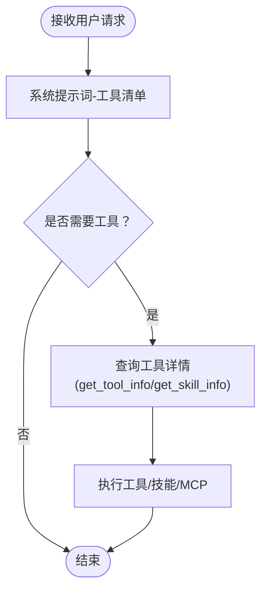
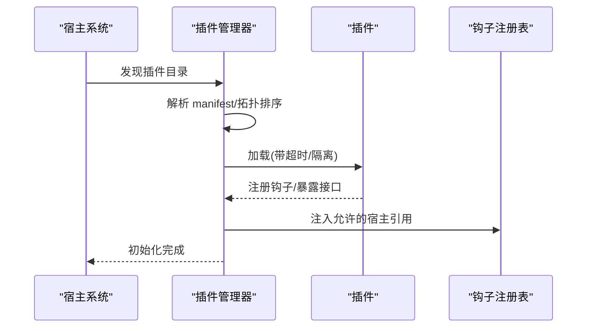
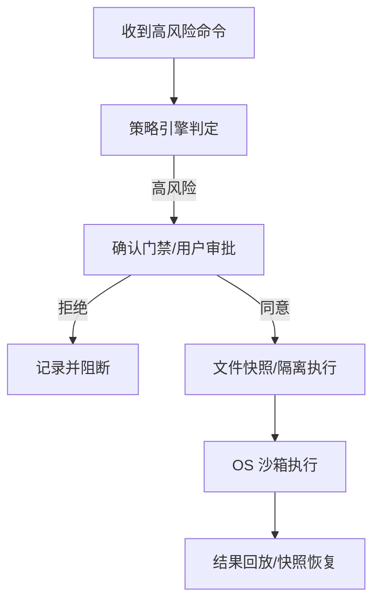
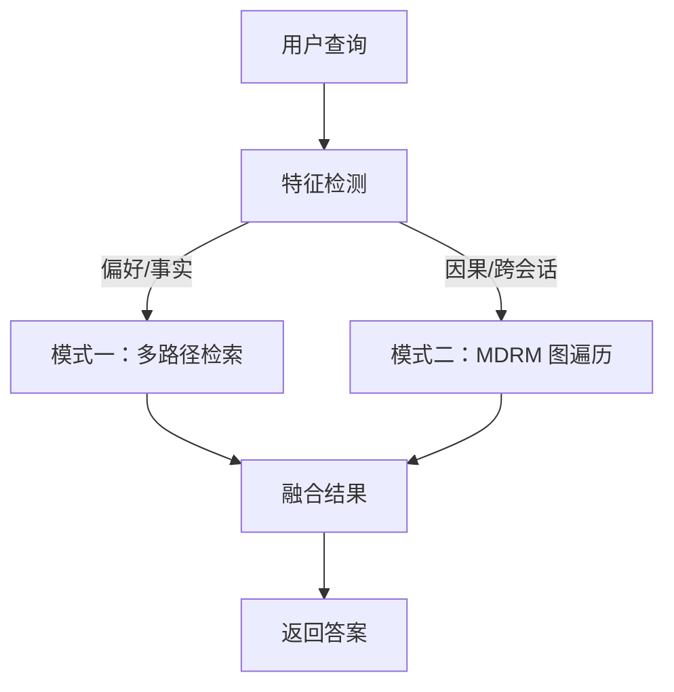
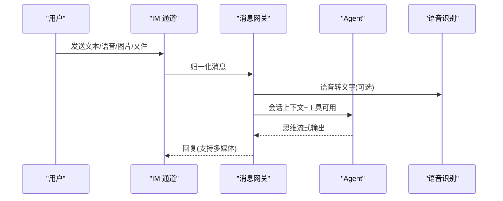
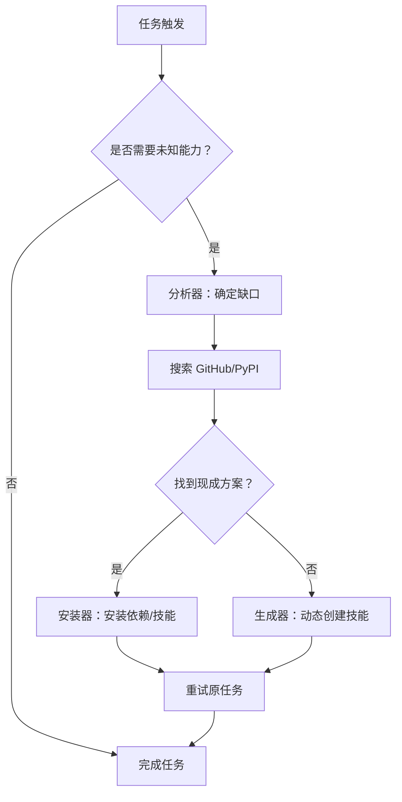
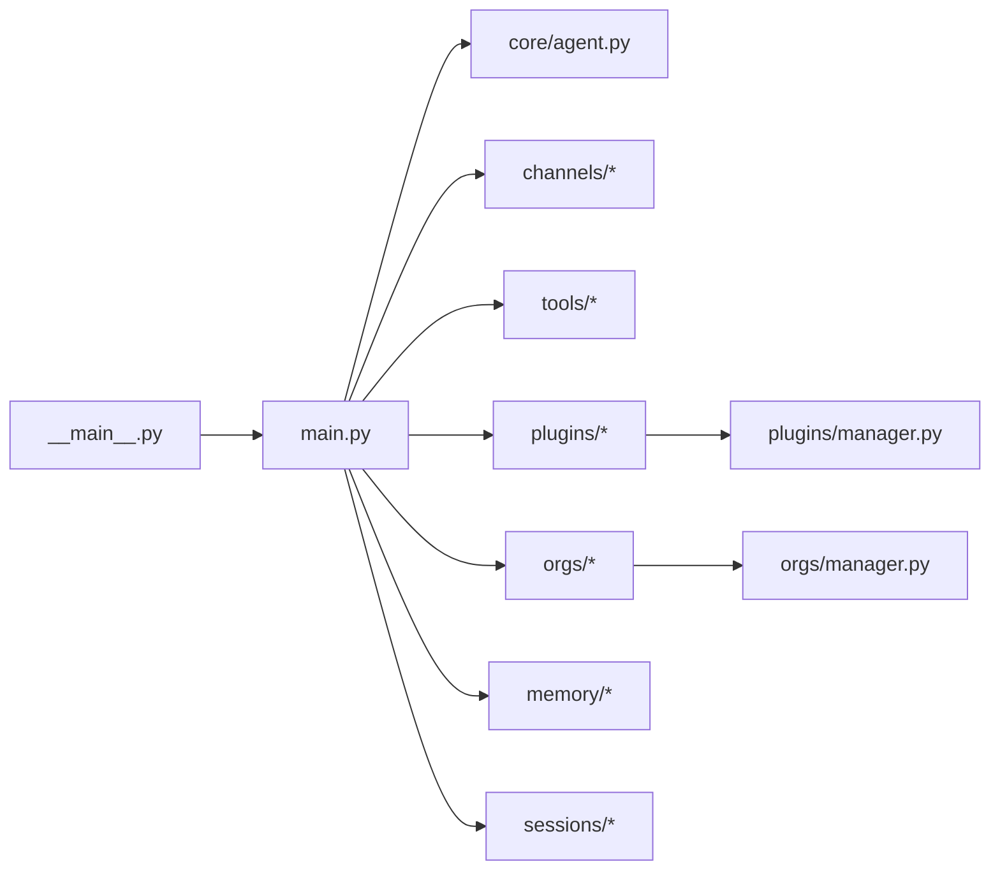

# 项目概述

<cite>
**本文引用的文件**
- [README.md](file://README.md)
- [getting-started.md](file://docs/getting-started.md)
- [architecture.md](file://docs/architecture.md)
- [configuration.md](file://docs/configuration.md)
- [deploy.md](file://docs/deploy.md)
- [tool-system-architecture.md](file://docs/tool-system-architecture.md)
- [index.md](file://docs-site/index.md)
- [__main__.py](file://src/synapse/__main__.py)
- [main.py](file://src/synapse/main.py)
- [agent.py](file://src/synapse/core/agent.py)
- [manager.py](file://src/synapse/orgs/manager.py)
- [manager.py](file://src/synapse/plugins/manager.py)
</cite>

## 目录
1. [引言](#引言)
2. [项目结构](#项目结构)
3. [核心组件](#核心组件)
4. [架构总览](#架构总览)
5. [详细组件分析](#详细组件分析)
6. [依赖关系分析](#依赖关系分析)
7. [性能考量](#性能考量)
8. [故障排查指南](#故障排查指南)
9. [结论](#结论)
10. [附录](#附录)

## 引言
Synapse 是一个开源的多智能体 AI 助手，其核心价值主张是“不只是聊天，而是真正完成任务的 AI 团队”。项目通过“自我进化”的理念，结合多智能体协作、组织编排、插件系统与沙箱安全等关键技术，构建了一个“AI 公司”式的自主执行系统：既能理解复杂任务，也能在多平台（桌面、Web、移动）与多 IM 渠道（Telegram、飞书、企业微信、钉钉、QQ、OneBot）之间无缝协同，持续学习并扩展能力。

- 面向初学者：零命令行、全 GUI 的“5 分钟上手”体验，扫码绑定 IM、一键安装、即刻执行任务。
- 面向开发者：模块化架构、清晰的生命周期钩子、可插拔的插件系统、双层内存与 ReAct 推理引擎，便于二次开发与深度定制。

## 项目结构
Synapse 采用分层与模块化并行的组织方式：
- 文档与站点：docs 与 docs-site 提供中文文档与 VitePress 站点内容，覆盖入门、架构、配置、部署与特性说明。
- 核心运行时：src/synapse 提供 CLI、核心 Agent、通道网关、工具系统、插件系统、组织编排、内存与安全等模块。
- 应用与打包：apps/setup-center 提供可视化安装与配置中心（跨平台），支持 Tauri + React/Vite。
- 示例与生态：examples/plugins、skills、mcps 等展示了插件、技能与 MCP 服务器的扩展形态。
- 测试与脚本：tests 与 scripts 覆盖单元/集成测试、回归测试、部署与运维脚本。

图示来源
- [index.md:1-51](file://docs-site/index.md#L1-L51)
- [main.py:1-120](file://src/synapse/main.py#L1-L120)
- [agent.py:1-120](file://src/synapse/core/agent.py#L1-L120)

章节来源
- [README.md:1-120](file://README.md#L1-L120)
- [index.md:1-51](file://docs-site/index.md#L1-L51)

## 核心组件
- 多智能体协作（AgentOrchestrator）：将复杂任务分解、委派、并行执行，并在失败时自动切换与回滚。
- 组织编排（AgentOrg）：以可视化“组织图”形式构建 AI 公司，节点间黑板共享、消息路由、心跳监控与自动扩缩容。
- 工具系统：统一的三类工具（系统工具、Skills、MCP）采用渐进式披露，降低初始 token 消耗并提升可用性。
- 插件系统：8 种插件类型、3 层权限模型与 10 个生命周期钩子，具备自动故障隔离与依赖注入。
- 沙箱安全：6 层纵深防御（路径分区、确认门禁、命令拦截、文件快照、自保护、操作系统级沙箱）。
- 记忆系统：双模式（片段记忆 + MDRM 关系图），支持自动模式切换与 3D 可视化。
- 通道网关：统一接入 Telegram、飞书、企业微信、钉钉、QQ、OneBot 等 IM 平台。
- 自我进化：每日自检、根因分析、缺失技能/依赖的自动搜索与安装、动态生成新技能。

章节来源
- [README.md:110-172](file://README.md#L110-L172)
- [architecture.md:1-120](file://docs/architecture.md#L1-L120)
- [tool-system-architecture.md:1-120](file://docs/tool-system-architecture.md#L1-L120)

## 架构总览
Synapse 的整体架构分为“用户界面层”、“通道网关层”、“核心智能体层”、“工具层”、“演进引擎层”、“存储层”和“可观测性层”。系统通过“两阶段提示词编译 + ReAct 推理引擎 + Ralph 循环”的组合，确保任务理解准确、执行稳健、失败可恢复。

图示来源
- [architecture.md:13-120](file://docs/architecture.md#L13-L120)

章节来源
- [architecture.md:1-310](file://docs/architecture.md#L1-L310)

## 详细组件分析

### 多智能体协作与组织编排
- 多智能体协作：通过 AgentOrchestrator 将任务分解、委派给不同专长 Agent，并行执行与自动回退；支持实例池与深度控制，防止递归失控。
- 组织编排：以 OrgManager 负责组织的 CRUD、模板与持久化；OrgRuntime 负责运行时的心跳、消息路由、黑板共享与自动扩缩容；支持项目/任务树形分解与跨部门协调。

图示来源
- [manager.py:29-200](file://src/synapse/orgs/manager.py#L29-L200)
- [README.md:282-320](file://README.md#L282-L320)

章节来源
- [README.md:282-320](file://README.md#L282-L320)
- [manager.py:1-200](file://src/synapse/orgs/manager.py#L1-L200)

### 工具系统与渐进式披露
- 系统工具：按“清单-详情-执行”三级披露，减少初始 token 消耗；支持 Shell、文件、Web、MCP 等常用能力。
- Skills：遵循 Agent Skills 规范，支持安装、查询、执行与参考文档获取。
- MCP：全量暴露外部服务工具，支持 stdio/HTTP/SSE 传输与动态管理。

图示来源
- [tool-system-architecture.md:15-80](file://docs/tool-system-architecture.md#L15-L80)

章节来源
- [tool-system-architecture.md:1-313](file://docs/tool-system-architecture.md#L1-L313)

### 插件系统与生命周期
- 插件类型：工具/通道/RAG/记忆/LLM/钩子/技能/MCP，覆盖系统扩展的全场景。
- 权限模型：Basic/Advanced/System 三层，安装时或按需授权。
- 生命周期：on_init → on_message_received → on_tool_result → on_prompt_build → on_retrieve → on_session_start → on_session_end → on_schedule → on_shutdown，支持自动故障隔离与依赖拓扑排序。

图示来源
- [manager.py:44-200](file://src/synapse/plugins/manager.py#L44-L200)

章节来源
- [README.md:407-440](file://README.md#L407-L440)
- [manager.py:1-200](file://src/synapse/plugins/manager.py#L1-L200)

### 安全与沙箱
- 6 层安全：路径分区、确认门禁、命令拦截、文件快照、自保护、操作系统级沙箱（Linux bubblewrap、macOS seatbelt、Windows MIC）。
- 策略引擎：基于 POLICIES.yaml 的工具权限、命令黑名单与路径限制；资源预算与运行时监督，防止异常循环与资源滥用。

图示来源
- [README.md:442-472](file://README.md#L442-L472)

章节来源
- [README.md:442-472](file://README.md#L442-L472)

### 记忆系统与双模式
- 模式一：片段记忆（工作/核心/动态检索）+ 多路径召回（语义/全文/时间/附件）。
- 模式二：MDRM 关系图（时间线/因果链/实体关系/动作依赖/上下文归属）+ 多跳遍历 + 3D 可视化。
- 智能切换：根据查询特征自动选择模式，AI 驱动抽取与双写增强。

图示来源
- [README.md:517-551](file://README.md#L517-L551)

章节来源
- [README.md:517-551](file://README.md#L517-L551)

### 通道网关与多 IM 平台
- 支持 Telegram、飞书、企业微信、钉钉、QQ、OneBot 等，统一消息归一化与路由。
- 语音识别（Whisper）、媒体预处理、消息中断与链式思维流式输出。

图示来源
- [architecture.md:187-226](file://docs/architecture.md#L187-L226)

章节来源
- [architecture.md:175-226](file://docs/architecture.md#L175-L226)

### 自我进化与能力扩展
- 分析器：定位缺失能力。
- 安装器：从 PyPI/GitHub 搜索并安装依赖/技能。
- 生成器：动态生成新技能，补齐缺口。
- 每日自检：根因分析、自动修复与报告。

图示来源
- [README.md:571-581](file://README.md#L571-L581)

章节来源
- [README.md:571-581](file://README.md#L571-L581)

## 依赖关系分析
- 运行入口：__main__.py 与 main.py 负责 CLI 启动、日志与追踪初始化、IM 通道依赖自动安装、核心服务初始化与消息网关启动。
- 核心 Agent：agent.py 协调大脑、工具、记忆、技能、MCP、桌面与浏览器等模块，执行两阶段提示词与 Ralph 循环。
- 插件系统：manager.py 负责插件发现、拓扑排序、版本兼容性检查、生命周期钩子注入与自动故障隔离。
- 组织编排：manager.py 负责组织的持久化、模板与状态管理，运行时由 OrgRuntime 驱动。

图示来源
- [__main__.py:1-19](file://src/synapse/__main__.py#L1-L19)
- [main.py:1-120](file://src/synapse/main.py#L1-L120)
- [agent.py:1-120](file://src/synapse/core/agent.py#L1-L120)
- [manager.py:1-120](file://src/synapse/plugins/manager.py#L1-L120)
- [manager.py:1-120](file://src/synapse/orgs/manager.py#L1-L120)

章节来源
- [__main__.py:1-19](file://src/synapse/__main__.py#L1-L19)
- [main.py:1-120](file://src/synapse/main.py#L1-L120)
- [agent.py:1-120](file://src/synapse/core/agent.py#L1-L120)
- [manager.py:1-120](file://src/synapse/plugins/manager.py#L1-L120)
- [manager.py:1-120](file://src/synapse/orgs/manager.py#L1-L120)

## 性能考量
- 异步优先：I/O 全面异步化，避免阻塞。
- 流式输出：响应边生成边输出，降低感知延迟。
- 缓存与批处理：热点数据缓存、可合并的多步操作。
- 资源预算：令牌/成本/时长/迭代/工具调用限额，防止资源滥用。
- 会话回填：崩溃恢复时从 SQLite 回填会话轮次，保障连续性。

章节来源
- [architecture.md:294-310](file://docs/architecture.md#L294-L310)
- [main.py:606-640](file://src/synapse/main.py#L606-L640)

## 故障排查指南
- API Key 未找到：检查 .env 是否存在并包含有效密钥。
- 连接超时：在中国大陆可配置代理或使用代理端点。
- Python 版本错误：确保使用 Python 3.11+。
- 依赖安装失败：查看镜像源与网络，必要时使用一键修复或离线 wheels。
- IM 通道无法启动：确认对应平台的 Token/AppID/Secret 配置正确，查看日志中的导入错误。

章节来源
- [getting-started.md:158-184](file://docs/getting-started.md#L158-L184)
- [configuration.md:291-312](file://docs/configuration.md#L291-L312)

## 结论
Synapse 以“多智能体 + 组织编排 + 插件系统 + 沙箱安全 + 自我进化”为核心技术支柱，构建了“不只是聊天，而是真正完成任务的 AI 团队”。对于初学者，项目提供零门槛的 GUI 安装与配置、扫码绑定 IM、即刻执行任务；对于开发者，项目提供了模块化、可扩展、可观测、可审计的架构与完善的生命周期与安全机制，便于二次开发与企业级落地。

## 附录
- 快速开始：安装、初始化、运行第一个任务与常用命令。
- 配置指南：环境变量、IM 通道、身份文件、记忆系统与高级选项。
- 部署指南：PyPI 安装、一键脚本、源码安装、Docker 与 systemd 部署。
- 文档索引：架构、工具系统、MCP 集成、技能系统、配置与部署文档。

章节来源
- [getting-started.md:1-184](file://docs/getting-started.md#L1-L184)
- [configuration.md:1-312](file://docs/configuration.md#L1-L312)
- [deploy.md:1-200](file://docs/deploy.md#L1-L200)
- [README.md:624-641](file://README.md#L624-L641)