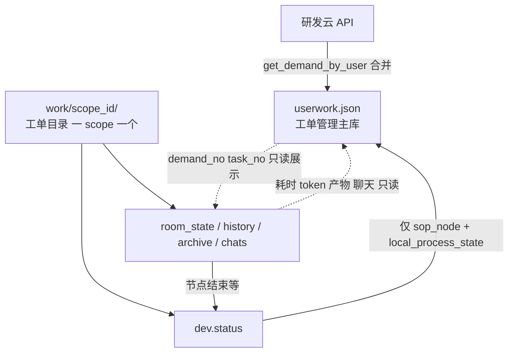

# 多智能体研发会议室实现方案

本文档定义 **研发会议室** 的产品模型、数据契约、配置分层、前后台落点与分阶段交付标准，并说明如何复用 Synapse **协调者模式 + AgentProfile** 作为执行引擎（不另起第二套编排运行时）。

> 多 Agent 总览：[多 Agent 架构](../multi-agent-architecture.md)  
> 全局配置：[配置说明](../configuration.md)  
> **重启 / 停止 / 重处理**：[会议室重启与停止方案](./会议室重启与停止方案.md)  
> 前端现状：`apps/setup-center/src/views/rd-manage/MeetingRoomView.tsx` → `MeetingRoomBoard`（已接入真实 API，含 Live 轮询、HITL 表单、节点评审、配置抽屉等完整功能）

---

## 1. 目标与边界

### 1.1 业务目标

| 角色 | 职责 |
|------|------|
| **智能小鲸（Host）** | 按 SOP 阶段与当前节点推进流程；拆解议程；委派 Worker；验收产物格式与完整性；不通过则纠偏或改派；汇总对用户可见的结论。 |
| **研发类智能体（Worker）** | 在系统给定的 Profile / SKILL / 工具边界内执行**当前议程**；输出可验收的结构化结果。 |
| **系统** | 固化 SOP 节点定义与依赖；按节点引用已配置的智能体与技能；持久化会议室状态、历史与归档产物；与工单管理共用同一 SOP 视图。 |

### 1.2 四条产品不变量

| ID | 规则 |
|----|------|
| **INV-1** | 研发会议室与 **SOP 阶段**强制绑定：`stage_id ∈ {1,2,3,4,5}` 才允许存在活跃会议室；`stage_id = 0`（待处理）仅出现在工单列表，不单独开会。 |
| **INV-2** | 会议室内部动作与 **SOP 节点**（`node_id`）强制绑定：任意时刻 `current_node_id` 必须属于当前 `stage_id` 的节点集合。 |
| **INV-3** | 不同节点依赖不同的智能体与技能，通过 **`meeting_room_config` 按 `node_id` 引用** `profile_id` / `skill_ids` / `llm_endpoint_key`；会议室运行时不得修改 Profile 本体定义。 |
| **INV-4** | 智能小鲸与所有 Worker 均在 **系统智能体管理**中配置；会议室与 SOP 配置层 **只引用** `profile_id`，不在会议室内重新定义 Agent。 |

### 1.3 设计边界（与 Synapse 核心的关系）

- **不另起**与 `AgentOrchestrator` / `AgentFactory` 并行的「第二套会议室 LLM 运行时」。
- **新增**薄编排模块 `meeting_room_service`（建议路径 `src/synapse/rd_meeting/`）：以 `work/<scope>/dev.status` 与会议室目录为运行时真相 → 驱动小鲸会话 → **仅**向 `userwork.json` 回写 `local_process_state` / `sop_node` 供工单列表轻量展示。
- **不复用** `src/synapse/orgs/` 下 `org_request_meeting`（组织站会），与研发会议室无关。
- **优先**协调者模式 + 提示词契约满足协作；节点级 JSON Schema 校验为可选增强（见 §8 阶段 B）。

---

## 2. 术语

| 术语 | 含义 |
|------|------|
| **工单 (WorkOrder)** | 需求单 `demand_no` 或研发子单 `task_no` |
| **Scope** | `demand`（需求会议室）或 `task`（研发会议室） |
| **会议室 (MeetingRoom)** | 某一 scope 在某一 SOP 阶段上的运行实例；同一 scope 同一阶段同时最多 **1** 个 `active` 实例 |
| **议程 (Agenda)** | SOP 节点 `node_id`，会议室内最小执行单元 |
| **五类会议室** | 对应 SOP 阶段 1～5：需求分析、需求设计、需求研发、开发中、代码走查 |
| **SOP Manifest** | 系统只读的节点定义、主旨、依赖图（SDD / Harness 核心，用户不可改结构） |
| **Meeting Room Config** | 可运营覆盖层：节点补充说明、引用的 Profile / Skill / LLM |
| **`userwork.json`** | 研发云工单**目录快照**（工单管理主数据源）；会议室对其**仅写**本地流水线摘要字段 |
| **工单目录** | `work/<scope_id>/`，**一个 scope 一个目录**；该目录内聚会议室全部本地状态 |
| **`dev.status`** | 位于工单目录根下的 `dev.status`，该目录流水线与会议室门禁的**主真相** |

---

## 3. 产品模型：SOP 绑定与五类会议室

### 3.1 阶段与会议室类型

| `stage_id` | 阶段名 | 会议室类型 | 默认 Scope | 启用条件（见 §4.2） |
|------------|--------|------------|------------|---------------------|
| 0 | 待处理 | （无会议室） | — | — |
| 1 | 需求分析 | 需求分析会议室 | `demand_no` | `work/<demand_no>/dev.status` 中 `local_process_state = 处理中` |
| 2 | 需求设计 | 需求设计会议室 | `demand_no` | 同上 |
| 3 | 需求研发 | 需求研发会议室 | `demand_no` 或 `task_no` | 有研发单时以 task 为主；仅需求时仍用 demand |
| 4 | 开发中 | 开发中会议室 | `task_no` | `work/<task_no>/dev.status` 中 `local_process_state = 处理中` |
| 5 | 代码走查 | 代码走查会议室 | `task_no` | 同上 |

**列表展示规则**：会议室看板按 **工单目录**（`scope_id`）展平，一张卡片对应 `work/<scope_id>/` 下的一场会；当需求下存在多个「处理中」研发单时，stage ≥ 3 会出现多个 **task 目录**（如 `work/11879580/`），与 `work/<demand_no>/` 并存，卡片标题须带 `task_no` 或 `demand_no` 以免混淆。

### 3.2 节点（议程）内容分层

每个 `node_id` 在 **SOP Manifest** 中包含（**不可由用户删除或改序**）：

| 字段 | 说明 |
|------|------|
| `id` / `name` / `type` | 节点标识、展示名、类型（`ai` / `human` / `human_start` / `ai_human` / `system` 等，与前端 `SOP_STAGES` 一致） |
| `intent` | 节点主旨与 SDD/Harness 约束（系统提示词核心，非用户随意编写） |
| `depends_on` | 依赖声明：`products`（代码库、工单、文档等产品级）、`flow`（流程级，如需求文档、方案文档） |
| `output_schema` | （可选）节点产物结构，供阶段 B 校验 |

在 **Meeting Room Config** 中可覆盖（**不得增删节点**）：

| 字段 | 说明 |
|------|------|
| `prompt_supplement` | 对该节点主提示词的补充说明 |
| `host_profile_id` | 默认智能小鲸；可省略则用全局默认 |
| `worker_profile_ids` | 本节点 Worker 列表 |
| `skill_ids` | 本节点允许的技能 id（与 Profile `skills` 取交集或显式覆盖，实现时二选一并写死规则） |
| `llm_endpoint_key` | 本节点 LLM 端点配置键 |

### 3.3 节点推进

- 推进仅允许沿 Manifest 定义的 `depends_on` 与阶段内顺序前进（具体顺序表与现有前端 `ALL_NODES` 扁平序一致，实施时迁入 Manifest）。
- **回退 / 重试** 须产生显式 `transition` 事件写入 `room_history.jsonl`，更新 `dev.status`，并**仅**将 `sop_node`（及必要时 `local_process_state`）同步到 `userwork.json`（见 §4.4）。
- `sop_node` 接口可能为 **中文节点名** 或 **node id**；全链路须复用前端 `resolveSopRawToNodeId` 同一套解析，禁止会议室单独维护映射表。

### 3.4 与工单管理、SOP 面板的关系

**关联键**：业务上仅用 `demand_no`、`task_no`（及需求下的 `owned_work_items[].task_no`）把两套数据对齐；**不**把会议室运行时字段并入 `userwork.json` 加载路径。

| 模块 | 主数据源 | 对另一套的访问 |
|------|----------|----------------|
| **工单管理**（`OrderManagement`） | `userwork.json`（研发云快照 + 本地摘要） | **只读** `work/<scope>/`：节点耗时、token、产物、会议室状态、历史聊天等（聚合 API 或按需读文件） |
| **研发会议室**（`MeetingRoomBoard`） | `work/<scope>/dev.status` + `room_state` / `history` / `archive` | **只写** `userwork.json` 的 `local_process_state`、`sop_node`；**可读** `userwork` 中的标题、描述、子单列表等展示字段 |
| **SOP 面板**（工单内） | 进度条：`userwork` 的 `sop_node`；节点详情：只读会议室目录 | 不写入会议室文件 |

三者共享 **同一份 SOP Manifest 常量**（建议 `apps/setup-center/src/rd-sop/constants.ts` 与后端 `src/synapse/rd_sop/manifest.json` 同源或代码生成），禁止在 `MeetingRoomBoard` 与 `OrderManagement` 中各维护一份。

---

## 4. 数据契约：双数据源与读写边界

### 4.1 总览



| 存储 | 路径 | 数据来源 | 主消费者 |
|------|------|----------|----------|
| 工单快照 | `work/userwork.json` | **研发云**为主；本地字段由会议室**少量回写** | 工单管理列表与刷新 |
| 工单目录（会议室容器） | `work/<demand_no\|task_no>/` | **一 scope 一目录**；目录内聚本地流水线与会议运行态 | 研发会议室；枚举列表时 **扫描此层子目录** |
| 流水线摘要文件 | 上目录内的 `dev.status` | **Synapse 本地**；研发云刷新**不覆盖** | 判断该目录是否出现在会议室看板 |
| 会议运行态 | 同目录下 `room_*`、`archive/`、`chats/` 等 | 会议室运行时 | 研发会议室；工单 SOP 面板**只读**引用 |

**设计意图**：工单管理保持「拉一次 `owner_order_snapshot` 即可渲染列表」的简单性；会议室的重数据全部落在 **各自工单目录** 内，不进入 `userwork.json`。

**与 `work/` 根目录的区分**：`work/userwork.json` 是**单文件**（研发云快照），不是子目录；枚举会议室时扫描 `work/` 下 **子目录**，跳过根级文件（`userwork.json`、锁文件等）。

### 4.2 `userwork.json`（工单管理）

路径：`{synapse_home}/work/userwork.json`（`get_demand_by_user` → `persist_owner_order_snapshot`；读接口 `owner_order_snapshot`）。

**内容分区**：

| 分区 | 字段示例 | 写入方 |
|------|----------|--------|
| 研发云镜像 | `demand_title`、`demand_status`、`owned_work_items`（除下表字段外）等 | 研发云同步 |
| 本地流水线摘要 | `local_process_state`、`sop_node` | **会议室**（及现有 `update_order_info` 迁移期双写） |

**会议室对 `userwork.json` 的写权限（仅此二项，需求单或研发单子单各一份）**：

| 字段 | 说明 |
|------|------|
| `local_process_state` | `预备中` / `待处理` / `处理中` / `全人工` 等；工单列表用于判断是否走智能流水线 |
| `sop_node` | 当前 SOP 节点（中文名或 `node_id`，与现网一致）；工单 SOP 条光标 |

**禁止**会议室向 `userwork.json` 写入：`meeting_room` 索引、`token`、日志、产物路径、`room_id` 等（避免工单加载解析复杂化）。

研发云合并时（`_merge_demand_record`）继续 **保留** 已有 `sop_node`、`local_process_state`；同步逻辑**不得**用云数据覆盖 `work/<scope>/dev.status`。

#### 需求单条目示例（工单视角）

```json
{
  "demand_no": "21878317",
  "demand_title": "...",
  "demand_status": "需求开发",
  "local_process_state": "处理中",
  "sop_node": "控熵生成",
  "owned_work_items": [
    {
      "task_no": "11879580",
      "task_title": "...",
      "sop_node": "差异分析"
    }
  ]
}
```

> 研发单子单的 `local_process_state` 若尚未在类型/API 中落地，Phase 0 可在 `dev.status` 维护 task 级状态，并仅把 `sop_node` 写回 `userwork.owned_work_items[]`；Phase 1 再补 task 级 `local_process_state` 双写。

### 4.3 工单目录 `work/<scope_id>/`（一 scope 一场所）

**容器规则**：不同会议室（不同 `demand_no` 或 `task_no`）的状态 **必须在不同目录下** 维护，禁止多个 scope 共用一个 `work/` 子目录。

| 项 | 约定 |
|----|------|
| 目录名 | `scope_id` = `demand_no`（需求阶段 1～2）或 `task_no`（研发阶段 3～5），与 `rdWorkOrderPaths`（`~/.synapse/work/<工单ID>`）一致 |
| 平级关系 | `work/21878317/`（需求）与 `work/11879580/`（研发子单）**平级**，不按需求嵌套子目录（除非后续单独立项） |
| 目录内容 | `dev.status`、`room_state.json`、`room_history.jsonl`、`archive/`、`chats/` 等 **仅属于该 scope** |

同一业务需求在「需求分析会议室」与「开发中会议室」若 scope 不同（demand vs task），则对应 **两个目录、两份 `dev.status`**；看板上是两条会议室条目。

#### `dev.status`（目录内流水线主文件）

路径：`work/<scope_id>/dev.status`。

**主真相**：该目录是否启用流水线/会议室、当前阶段/节点、`room_id` 等 **以本文件为准**；推进节点时先改本目录内文件，再按 §4.4 同步摘要到 `userwork`。

#### 会议室列表枚举（`GET /meeting-rooms`）

**不是**维护一份全局会议室注册表，而是：

```text
扫描 {synapse_home}/work/ 下的一级子目录（跳过 userwork.json 等根级文件）
  对每个子目录 <scope_id>/
    若存在 dev.status 且满足展示条件（如 meeting_room.active 或 local_process_state=处理中）
      → 产生一条会议室列表项（scope_id、stage_id、status 等读自该目录）
    可选 join 只读 userwork.json 中同 demand_no/task_no 的标题字段
```

即：**按 `dev.status` 枚举 = 扫描不同工单目录**；每个活跃目录即会议室看板上的一个「格子」。

```json
{
  "schema_version": 1,
  "scope": { "type": "task", "id": "11879580" },
  "local_process_state": "处理中",
  "stage_id": 4,
  "current_node_id": "diff_analysis",
  "sop_node_display": "差异分析",
  "pipeline_enabled": true,
  "meeting_room": {
    "active": true,
    "room_id": "mr_t_11879580_s4"
  },
  "updated_at": "2026-05-19T12:00:00+08:00"
}
```

#### `local_process_state` 与会议室启用

| `dev.status.local_process_state` | 会议室 |
|----------------------------------|--------|
| `预备中` / `待处理` / `全人工` / `已完成` | 不启用 |
| `处理中` | 可启用对应阶段会议室 |

- 仅需求单：`work/<demand_no>/dev.status` 管 stage 1～2。
- 存在研发单：stage 3～5 以 `work/<task_no>/dev.status` 为准。

### 4.4 跨边界读写规则（强制）

| 方向 | 允许 | 禁止 |
|------|------|------|
| 会议室 → `userwork.json` | 更新对应 `demand_no` / `task_no` 的 **`local_process_state`、`sop_node`** | 写入 token、日志、产物、`meeting_room` 大对象等 |
| 会议室 → `work/<scope>/` | 读写 **`dev.status`**、`room_state.json`、`room_history.jsonl`、`archive/`、聊天记录等 | — |
| 工单管理 → `userwork.json` | 读列表；用户操作经现有接口改 `local_process_state` / `sop_node`（迁移期） | 直接改 `archive`、聊天记录 |
| 工单管理 → `work/<scope>/` | **只读**：节点耗时、token、产物列表、节点/会议状态、历史聊天 | 任何写 |
| 会议室 → `userwork`（读） | `demand_title`、`task_title`、`demand_desc`、`owned_work_items` 等 **展示与编排上下文** | 把读到的字段写回 `userwork`（除 §4.2 二字段外） |

**节点推进时的写序**：

```text
1. 更新 dev.status（stage_id / current_node_id / local_process_state）
2. 更新 room_state.json、room_history.jsonl、archive/（如有产物）
3. 调用既有 userwork 更新能力，仅 PATCH sop_node（及需要的 local_process_state）
```

### 4.5 会议室目录内其它文件

| 路径 | 用途 | 工单管理 |
|------|------|----------|
| `dev.status` | 流水线光标与门禁 | 可读（可选展示）；不写 |
| `room_state.json` | 当前会议运行时：status、metrics、活跃 agents | **只读** |
| `room_history.jsonl` | 节点 enter/exit、人工介入等事件 | **只读** |
| `archive/<stage_id>/<node_id>/` | 节点产物 | **只读**（SOP 面板预览） |
| `chats/` 或 `room_history` 内 chat 事件 | 历史聊天记录 | **只读** |
| `room_config.local.json` | 节点 `prompt_supplement` 本地覆盖 | 会议室读写；工单一般不读 |

#### `room_state.json` 骨架

```json
{
  "room_id": "mr_t_11879580_s4",
  "scope": { "type": "task", "id": "11879580" },
  "stage_id": 4,
  "current_node_id": "diff_analysis",
  "status": "processing",
  "metrics": {
    "stage_started_at": "2026-05-19T09:00:00+08:00",
    "stage_seconds": 2712,
    "tokens": 125400,
    "token_budget": 150000
  },
  "agents_active": [
    { "profile_id": "smart-whale", "role": "host", "instance_key": "session:..." },
    { "profile_id": "rd-worker-sandbox", "role": "worker", "instance_key": "..." }
  ],
  "updated_at": "2026-05-19T10:45:15+08:00"
}
```

#### `status` 枚举（会议室级）

| 值 | 含义 |
|----|------|
| `processing` | 小鲸/Worker 执行中 |
| `human_intervention` | 等待人工（必审节点、超时、故障升级等） |
| `completed` | 本阶段会议室正常结束（工单可能仍在后续阶段） |
| `failed` | 不可自动恢复，待人工或重试 |
| `stopped` | 人为终止或服务重启后冻结；保留磁盘进度，不自动续跑 |

### 4.6 工单侧聚合读（可选 API）

为保持工单管理 **加载路径简单**，SOP 面板上的节点耗时、token、产物、聊天等 **不** 并入 `owner_order_snapshot`，而通过按需接口聚合（示例）：

| 方法 | 路径 | 说明 |
|------|------|------|
| GET | `/api/dev/work-orders/{scope_type}/{scope_id}/meeting-summary` | 只读：各节点 metrics、产物索引、最近聊天；内部读 `work/<scope>/` |
| GET | `/api/dev/work-orders/{scope_type}/{scope_id}/nodes/{node_id}/artifacts` | 只读：单节点 `archive/` |

工单列表页 **不调用** 上述接口；仅展开 SOP 面板或节点详情时调用。

### 4.7 与 `sop_trajectories` 的关系

现有库表轨迹（见 `src/synapse/api/routes/work_order_metrics.py`、`human-in-loop-flags`）继续服务 **工单详情指标** 与 **是否需人工介入** 查询。

| 数据 | 主存储 | 工单管理 |
|------|--------|----------|
| 流水线光标 | `dev.status` | 可读 `sop_node` 摘要（经 `userwork` 或 summary API） |
| 节点耗时、token、产物、聊天 | `work/<scope>/` | **只读** |
| 轨迹汇总、人工次数 | `sop_trajectories` | **只读**（现有 `human-in-loop-flags`） |

Phase 0 可不双写 DB；Phase 2 起可在节点结束时由会议室 **双写** `sop_trajectories`，工单仍只读。

---

## 5. 配置模型

### 5.1 文件布局（建议）

```
{synapse_home}/
  rd_sop/
    sop_manifest.json          # 只读，版本号 sop_manifest_version
  rd_meeting/
    meeting_room_config.json   # 组织/产品级，可 UI 编辑
  work/
    userwork.json              # 工单管理；会议室仅回写 sop_node / local_process_state
    <demand_no|task_no>/
      dev.status               # 会议室流水线真相
      room_state.json
      room_history.jsonl
      archive/...
      chats/...                # 可选：历史聊天记录
```

Manifest 亦可放在 `src/synapse/rd_sop/manifest.json` 随版本发布，由服务启动时同步到 `synapse_home`（实现时二选一，文档以「版本化 Manifest + 可热更新 Config」为目标）。

### 5.2 `sop_manifest.json` 节点片段示例

```json
{
  "version": "1.0.0",
  "stages": [
    {
      "id": 1,
      "name": "需求分析",
      "nodes": [
        {
          "id": "req_clarify",
          "name": "需求澄清",
          "type": "human",
          "intent": "识别需求模糊点，交互式完善需求说明。",
          "depends_on": {
            "products": ["demand_ticket"],
            "flow": []
          },
          "default_binding": {
            "host_profile_id": "smart-whale",
            "worker_profile_ids": ["req-clarify-worker"],
            "skill_ids": ["whalecloud-dev-tool-requirement-clarify"],
            "llm_endpoint_key": "default"
          }
        }
      ]
    }
  ]
}
```

### 5.3 `meeting_room_config.json` 覆盖示例

```json
{
  "version": "1",
  "node_overrides": {
    "req_clarify": {
      "prompt_supplement": "本产品为账务中心，优先引用存量限流方案。",
      "worker_profile_ids": ["req-clarify-worker-bss"]
    },
    "entropy_gen": {
      "skill_ids": ["whalecloud-dev-tool-arch-create"],
      "llm_endpoint_key": "reasoning-heavy"
    }
  }
}
```

### 5.4 与 AgentProfile 的关系

| 配置层 | 内容 |
|--------|------|
| `AgentProfile`（系统智能体管理） | `role`、`skills_mode`、`skills`、`custom_prompt` 等本体 |
| `default_binding` / `node_overrides` | 仅 **引用** `profile_id`、`skill_ids`、`llm_endpoint_key` |

实施时在 `meeting_room_service` 内解析绑定：加载 Profile → 与会话 binding 合并 → 调用现有 `AgentFactory` 创建/复用实例。

---

## 6. 后端：`meeting_room_service` 状态机

### 6.1 职责

1. 按 SOP 阶段与节点推进，驱动 **智能小鲸** 检查 Worker 产出并决定是否进入下一节点。
2. 人工必审、超时、故障 → `status = human_intervention`，并触发通知（IM/桌面；对齐 `human-in-loop-flags`）。
3. 校验（可选）与 **归档** Worker 产物到 `archive/<stage>/<node>/`。
4. 维护 `dev.status`、`room_state.json`、`room_history.jsonl`；向 `userwork.json` **仅**同步 `sop_node` / `local_process_state`（§4.4）。

### 6.2 核心流程（确定性）

```text
open_meeting(scope_type, scope_id, *, prod, sync_userwork=True, promote_to_processing=True):
  读 work/<scope>/dev.status；若无则按规则初始化
  可选读 userwork 同 scope 的标题/子单（只读）
  若已有 active room_state → 返回 room_id
  否则创建 room_state.json，dev.status.meeting_room.active = true
  启动 Host 会话，执行 current_node 议程

on_node_complete(room_id, node_id, artifacts):
  （可选）validate(artifacts, output_schema)
  写入 archive/<stage_id>/<node_id>/；append room_history
  更新 dev.status（stage_id / current_node_id）
  更新 room_state.metrics（耗时、token）
  仅 PATCH userwork：sop_node（+ 若变的 local_process_state）
  若人工门控 → room_state.status = human_intervention + 通知

on_human_intervene(room_id, payload):
  append room_history（含聊天）；注入 Host 会话
  不写 userwork 除 sop_node/local_process_state 外的字段
```

### 6.3 API（已实现）

| 方法 | 路径 | 说明 |
|------|------|------|
| GET | `/api/dev/meeting-rooms` | **扫描** `work/<scope_id>/` 子目录，读各目录内 `dev.status` 过滤；展示标题可 join 只读 `userwork` |
| GET | `/api/dev/meeting-rooms/pending/human-intervention` | 待人工介入的会议室列表 |
| GET | `/api/dev/meeting-rooms/{room_id}` | 读 `room_state` + `history` + `archive_index` |
| GET | `/api/dev/meeting-rooms/{room_id}/live` | live 快照：phase、委派进度、子 Agent、近期聊天事件（轮询） |
| GET | `/api/dev/meeting-rooms/{room_id}/chat` | 按 SOP 节点读取协作会议流 chat_logs |
| GET | `/api/dev/meeting-rooms/{room_id}/agent-contexts` | 探测各参会 Agent 的 system prompt / messages（调试用） |
| GET | `/api/dev/meeting-rooms/{room_id}/nodes/{node_id}/participants` | 按 SOP 节点 binding 返回参会智能体阵容 |
| GET | `/api/dev/meeting-rooms/{room_id}/node-review` | 读取节点确认总结 payload |
| GET | `/api/dev/meeting-rooms/{room_id}/agent-trace` | 读取智能体节点级 trace（conversation/tools/skills/usage/events） |
| GET | `/api/dev/meeting-rooms/{room_id}/artifact-file` | 读取归档文件原文（.md 内联展开用） |
| POST | `/api/dev/meeting-rooms/open` | `{ scope_type, scope_id, prod, sync_userwork, promote_to_processing }` |
| POST | `/api/dev/meeting-rooms/{room_id}/intervene` | 人工指令 / 聊天（`text`, `message_type`, `resume_run`） |
| POST | `/api/dev/meeting-rooms/{room_id}/reprocess` | 重新处理 SOP 节点（当前节点清理过程数据后从 node_init 重跑） |
| POST | `/api/dev/meeting-rooms/{room_id}/stop` | 终止当前节点后台运行，会议室标为 stopped |
| POST | `/api/dev/meeting-rooms/{room_id}/review-decision` | NodeReviewPanel 三按钮入口：approve / reject / escalate |
| GET | `/api/dev/work/{scope_type}/{scope_id}/dev.status` | 流水线状态读取 |
| PUT | `/api/dev/work/{scope_type}/{scope_id}/dev.status` | 流水线状态更新 |
| GET | `/api/dev/work-orders/{scope_type}/{scope_id}/meeting-summary` | 工单侧**只读**聚合：dev.status + room_state + 节点 metrics + archive 索引 |
| GET | `/api/dev/meeting-room-config` | 组织级会议室配置读取 |
| PUT | `/api/dev/meeting-room-config` | 组织级会议室配置更新 |
| GET | `/api/dev/meeting-room-config/bindings/{node_id}` | 节点 binding 解析 |

**存量复用**：

- 工单列表：`GET .../owner_order_snapshot` → `userwork.json`（会议室**不**替代此接口）
- 回写工单摘要：`POST .../update_order_info`（仅 `sop_node` / `local_process_state` / 子单 `sop_node`）；建议会议室服务内部调用同一锁
- 人工介入：`human-in-loop-flags`（工单只读）

建议新建路由模块 `src/synapse/api/routes/meeting_rooms.py`，业务逻辑置于 `src/synapse/rd_meeting/service.py`，避免膨胀 `dev_iwhalecloud.py`。

---

## 6.4 节点人机协作（补充落地）

四类人工介入、表单续跑、`user_context_pending`、Host 委派机制、需求澄清参考流程等，见专文：

**[研发会议室节点人机协作流程.md](./研发会议室节点人机协作流程.md)**

---

## 7. 前端

### 7.1 现状与差距

| 项 | 状态 | 说明 |
|----|------|------|
| `MeetingRoomView` → `MeetingRoomBoard` | ✅ 已实现 | 传入 `synapseApiBase` 并拉取真实列表 |
| 数据源 | ✅ 已实现 | `GET /api/dev/meeting-rooms`（`dev.status` + 只读 `userwork` 标题） |
| SOP 定义 | ✅ 已实现 | 共享 `rd-sop/constants` + 后端 `rd_sop/manifest.py` |
| 配置抽屉 | ✅ 已实现 | `MeetingRoomConfigDrawer.tsx`：双 LLM 端点、节点开关、补充说明 |
| 工单联动 | ✅ 已实现 | 工单行操作「进入会议室」→ `onViewChange('workbench_meeting')` |
| Live 轮询 | ✅ 已实现 | `fetchMeetingRoomLive` 3s 轮询 |
| HITL 表单 | ✅ 已实现 | `MeetingHitlForm.tsx`：四类人工介入场景 |
| 节点评审 | ✅ 已实现 | `NodeReviewPanel.tsx`：approve / reject / escalate |
| 方案评审 | ✅ 已实现 | `SolutionReviewPanel.tsx` |
| Agent 上下文 | ✅ 已实现 | `MeetingAgentContextDrawer.tsx`：探测参会 Agent prompt |
| 节点详情 | ✅ 已实现 | `panels/MeetingNodeDetailPanel.tsx` + `MeetingNodeReferenceTabs.tsx` |
| 归档文件预览 | ✅ 已实现 | `GET .../artifact-file` + `ReviewMarkdown.tsx` |
| Agent Trace | ✅ 已实现 | `GET .../agent-trace` |
| 工作台入口 | ✅ 已实现 | Sidebar「工作台」分组 → `workbench_meeting` → `MeetingRoomView` |

### 7.2 页面职责划分

| 页面/区域 | 主数据源 | 对另一数据源 |
|-----------|----------|----------------|
| 工单管理 | `userwork.json`（`owner_order_snapshot`） | 只读 `meeting-summary` / `archive` 展示节点耗时、token、产物 |
| SOP 面板（工单内） | 进度：`userwork.sop_node`；详情：**只读**会议室目录 | 不写 `dev.status` / `room_state` |
| 研发会议室看板 | `dev.status` + `room_state` / `history` / `chats` | 只读 `userwork` 标题；**只写** `userwork` 的 `sop_node`、`local_process_state` |
| 会议室配置抽屉 | `meeting_room_config` | — |

### 7.3 `MeetingRoom` 视图模型映射

| UI 字段 | 来源 |
|---------|------|
| `ticketId` | `demand_no` 或 `task_no` |
| `ticketTitle` | **只读** `userwork` 同 scope 的 `demand_title` / `task_title` |
| `stageIndex` / `stageName` | `dev.status.stage_id` 或 `room_state` |
| `currentNode` | `dev.status.current_node_id` |
| `status` | `room_state.status` |
| `tokenConsumed` / `stageDuration` | `room_state.metrics`（工单侧经 meeting-summary **只读**同字段） |
| `agents` / `logs` | `room_history` / `chats` + WS；工单**不**加载全量日志 |
| 节点产物 | `archive/<stage>/<node>/` |

---

## 8. 执行引擎：Synapse 协调者模式（存量复用）

会议室 **执行** 不新写 LLM 循环，沿用下列映射（原方案核心，实施会议室时仍需满足）。

| 会议室概念 | Synapse 机制 | 主要代码 / 配置 |
|------------|--------------|-----------------|
| 小鲸主导、规划与委派 | `role=coordinator` + `coordinator_mode_enabled` | `agents/profile.py`；`config.py`；`core/reasoning_engine.py`；`agents/coordinator_prompt.py` |
| 研发体分工 | `delegate_to_agent` / `delegate_parallel` | `tools/handlers/agent.py`；`agents/orchestrator.py` |
| 固定 SKILL | `skills_mode=inclusive` + `skills=[...]` | `agents/profile.py` |
| 子体不能再委派 | 子 Agent 提示词禁用委派工具 | `core/agent.py` |
| 实例池化 | session + profile | `agents/factory.py` |

### 8.1 阶段 A — 配置与提示词

1. `coordinator_mode_enabled = true`，`multi_agent_enabled = true`（见 [配置说明](../configuration.md)）。
2. 创建智能小鲸画像：`role=coordinator`，`custom_prompt` 写明委派、验收、对用户汇报规则。
3. 为各 Worker 创建画像：`skills_mode=inclusive`，`skills` 与 Manifest / Config 中 `skill_ids` 一致。
4. 会议室专规写在 **小鲸 `custom_prompt`**（推荐），避免污染全局 `coordinator_prompt.py`。

**验收**：小鲸可委派；Worker 仅白名单技能；子体不可再委派。

### 8.2 阶段 B — 输出契约与可选校验

1. 委派指令内嵌固定 Markdown 小节或 JSON 模板。
2. （可选）在 `orchestrator.py` 交回 `DelegationResult` 前做 Schema/标题检测，失败则仅反馈协调者重派。

**验收**：格式缺失时自动重派，不将残缺结果记为节点完成。

### 8.3 阶段 C — 产品化入口（与本方案 Phase 2/3 合并）

- 「会议室阵容」= `meeting_room_config` + Manifest `default_binding`，**不再**单独在 `presets.py` 维护第二套 id 列表（除非 presets 仅作 UI 快捷方式引用同一 `profile_id`）。
- 可观测性：`SubAgentStatus` + `room_history.jsonl` + 会议室看板。

---

## 9. 提示词与协作规范（小鲸 `custom_prompt` 附录提纲）

1. **委派前**：复述工单硬约束；每条 Worker 指令自包含（Worker 看不到主会话历史）。  
2. **并行策略**：只读可并行；同文件/同源写入互斥。  
3. **验收**：对照节点 `intent` 与 `output_schema`；不通过则明确缺项并要求重派。  
4. **对用户**：不暴露内部扯皮；进展与结论分层。  
5. **与 SOP 对齐**：不得跳过 `depends_on` 未满足的节点；人工门控节点必须等待 `on_human_intervene`。

---

## 10. 实施阶段（产品 + 工程）

| Phase | 交付 | 验收标准 |
|-------|------|----------|
| **0** | 定稿 `dev.status` schema；**按 scope 创建** `work/<scope_id>/` 并读写其内 `dev.status`；`GET /meeting-rooms` **扫描工单子目录** + 读 `dev.status`；推进时**仅** PATCH `userwork` 摘要；共享 SOP Manifest；可选 `meeting-summary` | 多目录各有一条列表项；工单管理仍只拉 `owner_order_snapshot` |
| **1** | `room_state` / `room_history` / `archive`；`open` / `intervene`；工单 SOP 面板只读拉 metrics/产物 | 工单页不改加载逻辑即可看到节点耗时与产物 |
| **2** | `meeting_room_service` 驱动小鲸+Worker；`meeting_room_config`；配置抽屉 | 单节点端到端；`dev.status` 与 `userwork` 摘要同步 |
| **3** | 工单「一键开会」；人工通知；阶段 B 校验（可选） | 双模块通过 `demand_no`/`task_no` 关联，读写边界无交叉污染 |

**依赖顺序**：Phase 0 可并行前端 `rd-sop` 抽常量；Phase 2 依赖 §8 阶段 A 画像就绪。

**Phase 0 明确不做**：向 `userwork.json` 写入 `meeting_room` 大对象、token、聊天记录；工单管理改为加载 `work/` 全量目录。

---

## 11. 配置项核对清单

| 项 | 说明 |
|----|------|
| `multi_agent_enabled` | 应为开启 |
| `coordinator_mode_enabled` | 小鲸走协调者工具集 |
| 小鲸 `role` | `coordinator` |
| Worker `skills_mode` | 建议 `inclusive` |
| `sop_manifest_version` | 前后端一致，发布时校验 |
| `meeting_room_config` | 仅覆盖允许字段 |
| `userwork.json` 锁 | 会议室回写 `sop_node` 时与现有 `FileLock` 共用 |
| `dev.status` 锁 | 建议 per-scope 文件锁，与 userwork 锁分离，避免列表 API 阻塞 |

---

## 12. 风险与缓解

| 风险 | 缓解 |
|------|------|
| `SOP_STAGES` 双份维护漂移 | 单源 Manifest + 前端 `rd-sop` 生成/导入 |
| `sop_node` 中文名与 id 混用 | 统一 `resolveSopRawToNodeId` |
| `userwork` 与 `dev.status` 摘要不一致 | 运行时以 `dev.status` 为准；`userwork` 仅承载列表所需的 `sop_node`/`local_process_state`，由会议室在推进时同步 |
| 工单加载变慢 | 禁止把 token/日志/产物写入 `userwork`；工单看 metrics 走 `meeting-summary` 只读 API |
| Coordinator 提示过长 | 专规在小鲸 `custom_prompt`；节点 `intent` 在委派时按节点注入 |
| 技能 id 不存在 | 启动/保存 Config 时校验 Profile 与 Skill 注册表 |
| 与 `org_request_meeting` 混淆 | 文档与代码命名空间区分 `rd_meeting` vs `orgs` |

---

## 13. 相关文档与代码索引

| 资源 | 路径 |
|------|------|
| 多 Agent 架构 | `docs/multi-agent-architecture.md` |
| 配置说明 | `docs/configuration.md` |
| 工单快照 API | `src/synapse/api/routes/dev_iwhalecloud.py`（`userwork.json`） |
| 工单指标 / 人工介入 | `src/synapse/api/routes/work_order_metrics.py` |
| 前端工单管理 | `apps/setup-center/src/components/rd-manage/OrderManagement.tsx` |
| 前端会议室 | `apps/setup-center/src/views/rd-manage/MeetingRoomView.tsx` |
| 前端工单 API | `apps/setup-center/src/api/rdManageService.ts` |
| 工单工作区路径约定 | `apps/setup-center/src/components/rd-center/rdWorkOrderPaths.ts` |
| 协调者提示 | `src/synapse/agents/coordinator_prompt.py` |
| 画像 / 编排 / 工厂 | `agents/profile.py`、`agents/orchestrator.py`、`agents/factory.py` |

**已实现**：

| 资源 | 路径 |
|------|------|
| SOP Manifest | `src/synapse/rd_sop/manifest.py`（代码内嵌，非 JSON 文件） |
| 会议室服务 | `src/synapse/rd_meeting/service.py` |
| 会议室 API | `src/synapse/api/routes/meeting_rooms.py` |
| 前端 SOP 常量 | `apps/setup-center/src/rd-sop/constants.ts` |

---

## 14.5 会议室专属 SKILL 与双 LLM 端点（2026-05-20 新增）

为把"研发会议室的协作宪法"从节点级提示词上提到 **会议室级**，本节定义两条
并行的改造：

### 14.5.1 会议室通用规范（内嵌）

| 项 | 说明 |
|----|------|
| 形态 | **代码内嵌常量** `_MEETING_ROOM_RULES`（位于 `src/synapse/rd_meeting/room_skill.py`），与 SKILL 加载机制无关 |
| 加载方 | **小鲸（Host）与所有协作智能体（Worker）** 进入会议室时统一注入 |
| 注入方式 | `rd_meeting.room_skill.build_room_skill_prompt` 渲染后写入 `agent._custom_prompt_suffix`，并触发 `agent._build_system_prompt()` 重建 |
| 角色裁剪 | `host` 视角隐藏 §4（Worker 规范），`worker` 视角隐藏 §3（Host 工作循环） |
| 能力呈现 | host 视角渲染「参会能力卡片」（不含自己）；worker 视角渲染「你的能力档案」（仅自己，子智能体不能委派故不暴露他人卡片） |

> 该规范**不**可由用户在前端配置抽屉中修改；如需调整须直接改 `_MEETING_ROOM_RULES` 字符串。`ask-user` 仍以独立 SKILL.md 形式存在（人机问卷格式与示例较多，单独维护）。

规范内核覆盖用户提出的 8 项要求：

1. **会议室主旨** — §1 直接陈述：归档可验收交付物 + 三项校验。
2. **能力边界（小鲸视角）** — §3 能力卡片 + §4.1 "目标拆分" 引导按能力分派。
3. **能力边界（Worker 视角）** — 能力卡片对所有 Worker 可见，§5.2 守住自己的边界、转派他人。
4. **小鲸拆解 → 分派** — §4.1。
5. **检查反馈（契合度 / 真实性 / 准确性）** — §4.2。
6. **多轮迭代** — §4.3。
7. **输出物与人机交互** — §6（归档位置、一级标题、验收字样、人工门控、用户可见性）。
8. **小鲸的产品上下文加载能力** — §4.4 显式列出 GitNexus / `get_doc.py` / 工单只读 API / 记忆。
9. **Worker ↔ Worker 协作** — §5.6 「请求帮忙 → 反馈结果」对等模型。

### 14.5.2 双 LLM 端点模型

| 端点 | 配置位置 | 适用对象 |
|------|----------|----------|
| **小鲸端点** | `meeting_room_config.host_llm_endpoint_key` | 主持人小鲸（独立配置；能力更强） |
| **Worker 统一端点** | `meeting_room_config.worker_llm_endpoint_key` | 所有协作智能体默认端点 |
| **节点级 Worker 覆盖** | `node_overrides[<id>].llm_endpoint_key` | 仅覆盖该节点的 Worker；**不影响小鲸** |

`meeting_room_config.json` 结构（v2）：

```json
{
  "version": "2",
  "host_llm_endpoint_key": "reasoning-heavy",
  "worker_llm_endpoint_key": "default",
  "node_overrides": {
    "entropy_gen": {
      "enabled": true,
      "llm_endpoint_key": "long-context",
      "node_intent": "",
      "prompt_supplement": "..."
    }
  }
}
```

> **历史字段** `meeting_skill_id`：会议室通用规范已内嵌于代码（`_MEETING_ROOM_RULES`），与 SKILL 加载机制无关。读取磁盘上历史 config 时该字段被静默忽略；写入时不再保存。

### 14.5.2.1 节点开关、会议目标与人工确认

| 配置项 | 对应 SKILL 变量 | 含义 | 默认 |
|--------|-----------------|------|------|
| `node_overrides[<id>].enabled` | — | 会议室 SOP 节点开关；`false` 时立即归档 `skipped.md` 并推进 | `true` |
| `node_overrides[].node_intent` | `NODE_INTENT` | **会议目标**（只读，来自 Manifest `NODE_INTENTS`，不可通过配置覆盖） | Manifest `NODE_INTENTS` |
| `node_overrides[].human_confirm` | HITL 表单说明注入 prompt | 完成后是否需人工确认再推进 | 按 `NODE_TYPES`（如 human / ai_human 为 true） |
| — | — | **节点产出**（`NODE_OUTPUTS`）只读展示 | 系统写死 |

统一人机表单：`rd_meeting/hitl_form.py` + 前端 `MeetingHitlForm.tsx`（配置预览 + 会议室介入弹窗嵌入）。

### 14.5.3 模块边界

| 模块 | 职责 |
|------|------|
| `src/synapse/rd_meeting/room_skill.py` | 内嵌的会议室通用规范（`_MEETING_ROOM_RULES`）/ 角色裁剪 / 能力卡片渲染 / 上下文装配 |
| `src/synapse/rd_meeting/config_store.py` | v2 配置读写（部分写、向后兼容；历史字段 `meeting_skill_id` 静默忽略） |
| `src/synapse/rd_meeting/binding.py` | `resolve_node_binding` 返回 `host_llm_endpoint_key` / `worker_llm_endpoint_key` |
| `src/synapse/rd_meeting/orchestrator.py` | `_prewarm_meeting_room` + `_configure_meeting_agent`：注入端点 + 规范 + cwd |
| `apps/setup-center/.../MeetingRoomConfigDrawer.tsx` | "会议室全局配置" 块：双端点选择（通用规范内嵌、无配置项） |

### 14.5.4 不引入新编排循环

- 节点入口：小鲸（host）作为 **入口 Agent** 被 `agent_pool.get_or_create` 实例化；
- Worker 预热：每个 `worker_profile_id` 在 `agent_pool` 内预先创建实例，注入
  Worker 视角 SKILL + Worker 端点；
- 小鲸通过现有 **coordinator 模式**（`delegate_to_agent` / `delegate_parallel` /
  `send_agent_message`）自主调度 Workers，**不写固定串行**；
- Worker 与 Worker 之间通过 `send_agent_message` / `delegate_to_agent`（若工具
  集允许）实现"请求帮忙 → 反馈结果"，互不依赖固定脚本。

> 这与 §8 "复用 Synapse 协调者模式" 一脉相承——本节只是在 SKILL 与配置层加
> 入"会议室主旨 / 协作循环 / 能力边界 / 双端点"的统一描述，不改动核心运行时。

---

## 14.6 测试约定

| 测试用例 | 关键点 |
|---------|--------|
| `tests/unit/test_rd_meeting_phase4_skill.py` | SKILL 文件存在、角色裁剪、能力卡片包含 worker / host、变量填充 |
| `tests/unit/test_rd_meeting_phase4_config.py` | v1 → v2 升级、部分写不覆盖、节点级覆盖仅影响 worker、binding 返回新字段 |
| `tests/unit/test_rd_meeting_phase5_node_enable.py` | `enabled` 默认/关闭、`resolve_intents` 优先级、service 持久化 |

---

## 15. 文档变更记录

| 日期 | 说明 |
|------|------|
| 2026-05-12 | 初版：Synapse 协调者模式与 AgentProfile 执行引擎说明。 |
| 2026-05-20 | **节点 enabled 开关 + NODE_INTENT**：§14.5.2.1；`rd_meeting/intents.py`、编排跳过链、配置抽屉开关与会议目标编辑。 |
| 2026-05-20 | **会议室专属 SKILL + 双 LLM 端点**：新增 §14.5 / §14.6；落地 `skills/whalecloud-dev-tool-meeting-room`、`rd_meeting/room_skill.py`、`config_store` v2、`MeetingRoomConfigDrawer` 全局块。 |
| 2026-05-22 | **通用规范内嵌化**：原 `skills/whalecloud-dev-tool-meeting-room/SKILL.md` 改为代码内嵌常量 `_MEETING_ROOM_RULES`；后端 `meeting_skill_id` 字段、API schema、`MeetingRoomConfigDrawer` 中 SKILL 卡片、配置存储中相关字段一并移除（历史 config 中该字段读取时静默忽略）；子智能体不再看到「参会能力卡片」，改为渲染「你的能力档案」。 |
| 2026-05-19 | 重构：补充 SOP 绑定、五类会议室、配置分层、API 与 Phase 0～3。 |
| 2026-05-19 | 数据契约修订：工单管理（`userwork.json` / 研发云）与研发会议室（`work/<scope>/dev.status` + 会议室文件）**双数据源**；跨边界读写规则：会议室**仅写** `userwork` 的 `local_process_state`/`sop_node`；工单**只读**会议室耗时/token/产物/聊天；关联键为 `demand_no`/`task_no`。 |
| 2026-05-19 | 明确 **一 scope 一目录**：会议室状态落在 `work/<scope_id>/`；列表 API 通过扫描工单子目录并读取各目录 `dev.status` 枚举，而非独立全局注册表。 |
| 2026-05-19 | **Phase 0 实现**：`src/synapse/rd_meeting/`、`api/routes/meeting_rooms.py`；前端 `rd-sop/constants.ts`、`meetingRoomService.ts`、会议室看板接 `GET /api/dev/meeting-rooms`。 |
| 2026-05-19 | **Phase 1 实现**：`room_state.json` / `room_history.jsonl` / `archive/`；`GET meeting-rooms/{id}`、`POST .../intervene`；`meeting-summary` 节点 metrics；会议室弹窗接历史与干预 API。 |
| 2026-05-19 | **Phase 2 实现**：`meeting_room_config.json` + `GET/PUT meeting-room-config`；`binding` / `manifest`；`POST .../reprocess` 编排（dry-run 或 Agent 池）；配置抽屉与「执行当前节点」入口。 |
| 2026-05-19 | **Phase 3 实现**：开会 `promote_to_processing`；`sessionStorage` 工单跳转会议室；`pending/human-intervention`；桌面通知 + `sop_trajectories` HITL；产物校验；干预 `resume_run` 与「一键通过」。 |
| 2026-06-04 | 文档同步：§7.1 前端现状从"Mock UI"更新为已实现状态（14 项功能）；§13 待新增路径标记为已实现；头部前端描述更新；`reprocess` 支持历史节点重处理（同 [会议室重启与停止方案](./会议室重启与停止方案.md) §4.4）。 |
